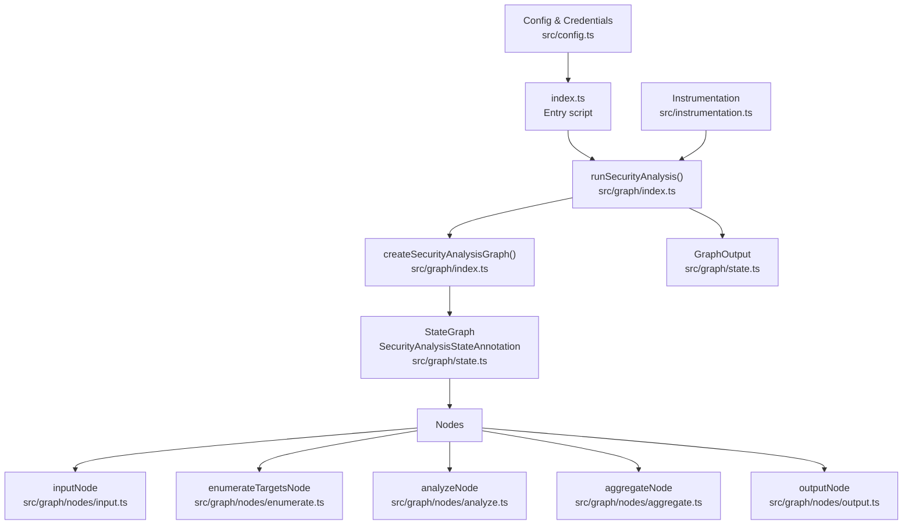
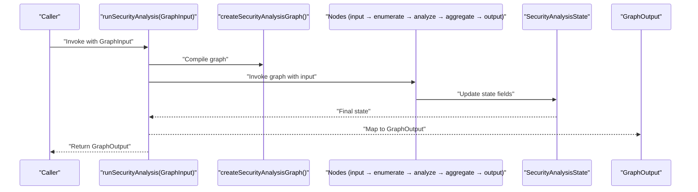
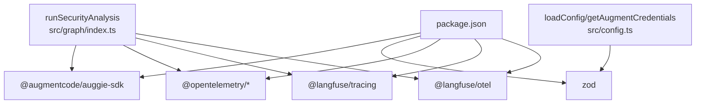

# API Reference

<cite>
**Referenced Files in This Document**
- [index.ts](file://index.ts)
- [src/graph/index.ts](file://src/graph/index.ts)
- [src/graph/state.ts](file://src/graph/state.ts)
- [src/graph/nodes/input.ts](file://src/graph/nodes/input.ts)
- [src/graph/nodes/enumerate.ts](file://src/graph/nodes/enumerate.ts)
- [src/graph/nodes/analyze.ts](file://src/graph/nodes/analyze.ts)
- [src/graph/nodes/aggregate.ts](file://src/graph/nodes/aggregate.ts)
- [src/graph/nodes/output.ts](file://src/graph/nodes/output.ts)
- [src/config.ts](file://src/config.ts)
- [src/instrumentation.ts](file://src/instrumentation.ts)
- [package.json](file://package.json)
</cite>

## Table of Contents
1. [Introduction](#introduction)
2. [Project Structure](#project-structure)
3. [Core Components](#core-components)
4. [Architecture Overview](#architecture-overview)
5. [Detailed Component Analysis](#detailed-component-analysis)
6. [Dependency Analysis](#dependency-analysis)
7. [Performance Considerations](#performance-considerations)
8. [Troubleshooting Guide](#troubleshooting-guide)
9. [Versioning and Backward Compatibility](#versioning-and-backward-compatibility)
10. [Conclusion](#conclusion)

## Introduction
This document provides a comprehensive API reference for the public interfaces of OWASP GraphGuard. It focuses on the primary programmatic entry point for running security analysis and the types that define inputs, state, and outputs. It also documents the SecurityAnalysisState interface and its annotations for OWASP Top 10 categories, and provides guidance for integrating the API from other TypeScript applications.

## Project Structure
The OWASP GraphGuard exposes a single public function to run a security analysis pipeline. Internally, the pipeline is modeled as a LangGraph with five nodes: input, enumerate, analyze, aggregate, and output. The state is managed via a LangGraph Annotation that defines the fields and reducers for each state key. Supporting types define the shape of inputs, outputs, findings, and categories.

**Diagram sources**
- [index.ts](file://index.ts#L1-L52)
- [src/graph/index.ts](file://src/graph/index.ts#L1-L153)
- [src/graph/state.ts](file://src/graph/state.ts#L1-L173)
- [src/graph/nodes/input.ts](file://src/graph/nodes/input.ts#L1-L54)
- [src/graph/nodes/enumerate.ts](file://src/graph/nodes/enumerate.ts#L1-L228)
- [src/graph/nodes/analyze.ts](file://src/graph/nodes/analyze.ts#L1-L156)
- [src/graph/nodes/aggregate.ts](file://src/graph/nodes/aggregate.ts#L1-L117)
- [src/graph/nodes/output.ts](file://src/graph/nodes/output.ts#L1-L59)
- [src/instrumentation.ts](file://src/instrumentation.ts#L1-L141)
- [src/config.ts](file://src/config.ts#L1-L153)

**Section sources**
- [index.ts](file://index.ts#L1-L52)
- [src/graph/index.ts](file://src/graph/index.ts#L1-L153)
- [src/graph/state.ts](file://src/graph/state.ts#L1-L173)

## Core Components
- Public API entry point: runSecurityAnalysis(GraphInput): Promise<GraphOutput>
- State definition: SecurityAnalysisStateAnnotation and SecurityAnalysisState
- Input and output types: GraphInput and GraphOutput
- OWASP categories: OWASP_CATEGORIES and OwaspCategory
- Supporting types: Severity, AnalysisTarget, SecurityFinding, GraphStatus

Key responsibilities:
- runSecurityAnalysis orchestrates the graph, sets up tracing, and returns a normalized GraphOutput.
- SecurityAnalysisStateAnnotation defines the state schema and reducers for each field.
- GraphInput and GraphOutput define the contract for invoking and receiving results.

**Section sources**
- [src/graph/index.ts](file://src/graph/index.ts#L56-L153)
- [src/graph/state.ts](file://src/graph/state.ts#L1-L173)

## Architecture Overview
The runSecurityAnalysis function compiles a LangGraph and invokes it with the provided GraphInput. The graph executes nodes in sequence: input, enumerate, analyze, aggregate, and output. Observability is integrated via OpenTelemetry and Langfuse, with dual packages providing both general tracing and LLM-centric observation types.

**Diagram sources**
- [src/graph/index.ts](file://src/graph/index.ts#L56-L153)
- [src/graph/state.ts](file://src/graph/state.ts#L71-L143)
- [src/graph/nodes/input.ts](file://src/graph/nodes/input.ts#L1-L54)
- [src/graph/nodes/enumerate.ts](file://src/graph/nodes/enumerate.ts#L138-L227)
- [src/graph/nodes/analyze.ts](file://src/graph/nodes/analyze.ts#L44-L155)
- [src/graph/nodes/aggregate.ts](file://src/graph/nodes/aggregate.ts#L1-L117)
- [src/graph/nodes/output.ts](file://src/graph/nodes/output.ts#L1-L59)

## Detailed Component Analysis

### runSecurityAnalysis(GraphInput): Promise<GraphOutput>
Purpose:
- Executes the OWASP security analysis pipeline.
- Initializes tracing and sets metadata for the top-level observation.
- Compiles the graph and invokes it with the provided input.
- Normalizes the final state into GraphOutput.

Parameters:
- GraphInput
  - repoPath?: string (defaults to "./nodejs-goof" if not provided)
  - userQuery: string
  - scopeFilter?: string
  - augmentCredentials: AugmentCredentials

Return type:
- GraphOutput
  - scanId: string
  - status: "pending" | "running" | "completed" | "failed"
  - findings: SecurityFinding[]
  - summary: string
  - analyzedCategories: OwaspCategory[]
  - errors: string[]
  - startedAt?: string
  - completedAt?: string

Behavior highlights:
- Defaults repoPath if omitted.
- Sets span attributes for repo path, user query, and scope filter.
- Updates agent observation with input and output metadata.
- Extracts final state and maps to GraphOutput.
- Propagates exceptions and records them on the span.

Error handling:
- Exceptions are recorded on the span and rethrown.
- The output’s status reflects completion or failure based on the final state.

Edge cases:
- Missing repository path leads to empty targets and logs a warning in the enumerate node.
- Absence of augmentCredentials is handled by the state default; however, downstream analysis requires valid credentials.

Integration example (programmatic usage):
- See the example in the entry script that constructs GraphInput and calls runSecurityAnalysis, then logs results.

**Section sources**
- [src/graph/index.ts](file://src/graph/index.ts#L56-L153)
- [src/graph/state.ts](file://src/graph/state.ts#L150-L173)
- [src/config.ts](file://src/config.ts#L123-L153)
- [index.ts](file://index.ts#L1-L52)

### SecurityAnalysisState and SecurityAnalysisStateAnnotation
SecurityAnalysisStateAnnotation defines the state schema and reducers for each field. The inferred SecurityAnalysisState type is used across nodes to pass and update state.

Fields and reducers:
- repoPath: string (reducer: last-writer wins, default: "./nodejs-goof")
- userQuery: string (reducer: last-writer wins, default: "")
- scopeFilter: string | undefined (reducer: last-writer wins, default: undefined)
- scanId: string (reducer: last-writer wins, default: generated)
- status: GraphStatus (reducer: last-writer wins, default: "pending")
- startedAt: string | undefined (reducer: last-writer wins, default: undefined)
- completedAt: string | undefined (reducer: last-writer wins, default: undefined)
- targets: AnalysisTarget[] (reducer: append, default: [])
- analyzedCategories: OwaspCategory[] (reducer: set union, default: [])
- currentCategory: OwaspCategory | undefined (reducer: last-writer wins, default: undefined)
- findings: SecurityFinding[] (reducer: append, default: [])
- errors: string[] (reducer: append, default: [])
- summary: string | undefined (reducer: last-writer wins, default: undefined)
- augmentCredentials: AugmentCredentials (reducer: last-writer wins, default: { apiKey: "", apiUrl: "" })

OWASP categories:
- OWASP_CATEGORIES: constant array of 10 OWASP Top 10 2021 categories.
- OwaspCategory: type derived from the constant array.

GraphStatus:
- "pending" | "running" | "completed" | "failed"

SecurityFinding:
- id: string
- category: OwaspCategory
- title: string
- severity: Severity
- evidence: FindingEvidence
- explanation: string
- recommendedFix: string

FindingEvidence:
- file: string
- lineRange: string
- codeSnippet?: string

AnalysisTarget:
- path: string
- type: "file" | "route" | "controller" | "dependency"
- metadata?: Record<string, string>

Severity:
- "critical" | "high" | "medium" | "low" | "info"

Notes:
- The state is managed by LangGraph’s Annotation pattern, enabling safe, typed state updates across nodes.
- The state defaults ensure robustness when fields are not explicitly set by nodes.

**Section sources**
- [src/graph/state.ts](file://src/graph/state.ts#L1-L173)

### GraphInput and GraphOutput
GraphInput:
- repoPath?: string
- userQuery: string
- scopeFilter?: string
- augmentCredentials: AugmentCredentials

GraphOutput:
- scanId: string
- status: GraphStatus
- findings: SecurityFinding[]
- summary: string
- analyzedCategories: OwaspCategory[]
- errors: string[]
- startedAt?: string
- completedAt?: string

Usage:
- Construct GraphInput with repoPath, userQuery, and augmentCredentials.
- Call runSecurityAnalysis(GraphInput) to receive GraphOutput.
- Inspect findings, summary, and status to drive downstream actions.

**Section sources**
- [src/graph/state.ts](file://src/graph/state.ts#L150-L173)
- [src/graph/index.ts](file://src/graph/index.ts#L56-L153)

### Example: Using the API from TypeScript
The repository’s entry script demonstrates a typical integration pattern:
- Import instrumentation first.
- Load configuration and derive AugmentCredentials.
- Call runSecurityAnalysis with GraphInput.
- Log results and handle errors.

See:
- [index.ts](file://index.ts#L1-L52)

**Section sources**
- [index.ts](file://index.ts#L1-L52)
- [src/instrumentation.ts](file://src/instrumentation.ts#L1-L141)
- [src/config.ts](file://src/config.ts#L89-L153)

### Error Handling and Edge Cases
- Repository path validation: The enumerate node checks if the repoPath exists and logs a warning if not; it returns an empty targets array and marks the observation with an error level.
- Exception propagation: runSecurityAnalysis records exceptions on the span and rethrows them.
- Final status determination: The output node sets status to "failed" if there are any errors; otherwise "completed".
- Missing augmentCredentials: The state default provides empty credentials; however, downstream analysis requires valid credentials.

Recommendations:
- Ensure repoPath points to an existing directory.
- Provide valid AugmentCredentials to enable analysis.
- Wrap runSecurityAnalysis in try/catch and inspect GraphOutput.errors for actionable diagnostics.

**Section sources**
- [src/graph/nodes/enumerate.ts](file://src/graph/nodes/enumerate.ts#L160-L172)
- [src/graph/nodes/output.ts](file://src/graph/nodes/output.ts#L32-L35)
- [src/graph/index.ts](file://src/graph/index.ts#L134-L141)
- [src/graph/state.ts](file://src/graph/state.ts#L138-L143)

## Dependency Analysis
External dependencies relevant to the API:
- LangGraph for state management and graph compilation.
- Langfuse tracing and OTel for observability.
- Zod for configuration validation.
- Augment SDK for analysis orchestration.

**Diagram sources**
- [package.json](file://package.json#L1-L30)
- [src/graph/index.ts](file://src/graph/index.ts#L1-L153)
- [src/config.ts](file://src/config.ts#L1-L153)

**Section sources**
- [package.json](file://package.json#L1-L30)
- [src/graph/index.ts](file://src/graph/index.ts#L1-L153)
- [src/config.ts](file://src/config.ts#L1-L153)

## Performance Considerations
- The analyze node iterates over a curated subset of OWASP categories and deduplicates findings by title and evidence location, reducing redundant reporting.
- The enumerate node filters files by extension and known patterns, limiting the analysis scope.
- Observability overhead is minimal compared to analysis cost; ensure environment variables are configured to avoid startup-time failures.

[No sources needed since this section provides general guidance]

## Troubleshooting Guide
Common issues and resolutions:
- Missing Langfuse keys: Instrumentation validates required keys and exits early if missing. Ensure LANGFUSE_PUBLIC_KEY and LANGFUSE_SECRET_KEY are set.
- Missing Augment credentials: The state default is empty; provide valid credentials via getAugmentCredentials to enable analysis.
- Nonexistent repository path: The enumerate node logs a warning and returns no targets; verify repoPath.
- Exceptions during analysis: runSecurityAnalysis records exceptions on the span and rethrows them; inspect the error and GraphOutput.errors.

**Section sources**
- [src/instrumentation.ts](file://src/instrumentation.ts#L94-L101)
- [src/config.ts](file://src/config.ts#L123-L153)
- [src/graph/nodes/enumerate.ts](file://src/graph/nodes/enumerate.ts#L160-L172)
- [src/graph/index.ts](file://src/graph/index.ts#L134-L141)

## Versioning and Backward Compatibility
- The tracer exports a version string; while not directly tied to API changes, it signals the instrumentation version used.
- The public API surface includes runSecurityAnalysis and exported types from state.ts. The state schema and types are defined in state.ts and used across nodes.
- Backward compatibility considerations:
  - Adding new fields to SecurityAnalysisStateAnnotation should be done carefully to preserve reducer semantics and defaults.
  - Exported types (GraphInput, GraphOutput, SecurityAnalysisState) should remain stable; consumers rely on these shapes.
  - The OWASP_CATEGORIES constant defines the supported categories; extending it requires updating analysis logic accordingly.

**Section sources**
- [src/instrumentation.ts](file://src/instrumentation.ts#L136-L141)
- [src/graph/state.ts](file://src/graph/state.ts#L1-L173)
- [src/graph/index.ts](file://src/graph/index.ts#L148-L153)

## Conclusion
The OWASP GraphGuard API centers on runSecurityAnalysis(GraphInput): Promise<GraphOutput>, backed by a LangGraph pipeline and a strongly-typed state schema. The GraphInput and GraphOutput contracts define the integration surface, while SecurityAnalysisStateAnnotation governs internal state transitions. Proper configuration, especially for Langfuse and Augment credentials, is essential for successful execution. The provided examples and troubleshooting guidance help integrate the API reliably in TypeScript applications.