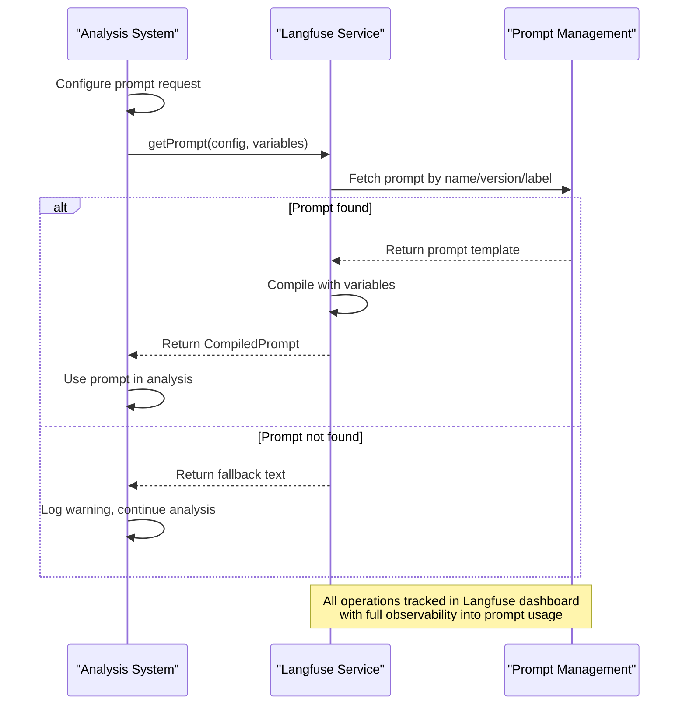
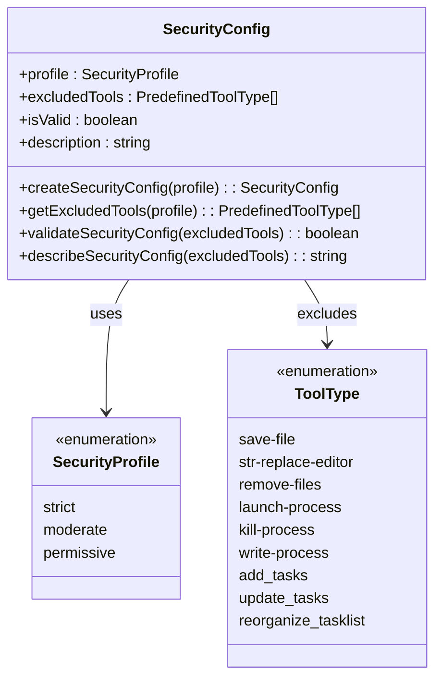
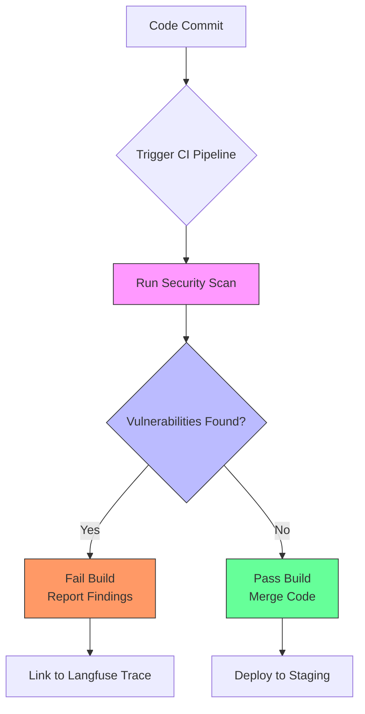
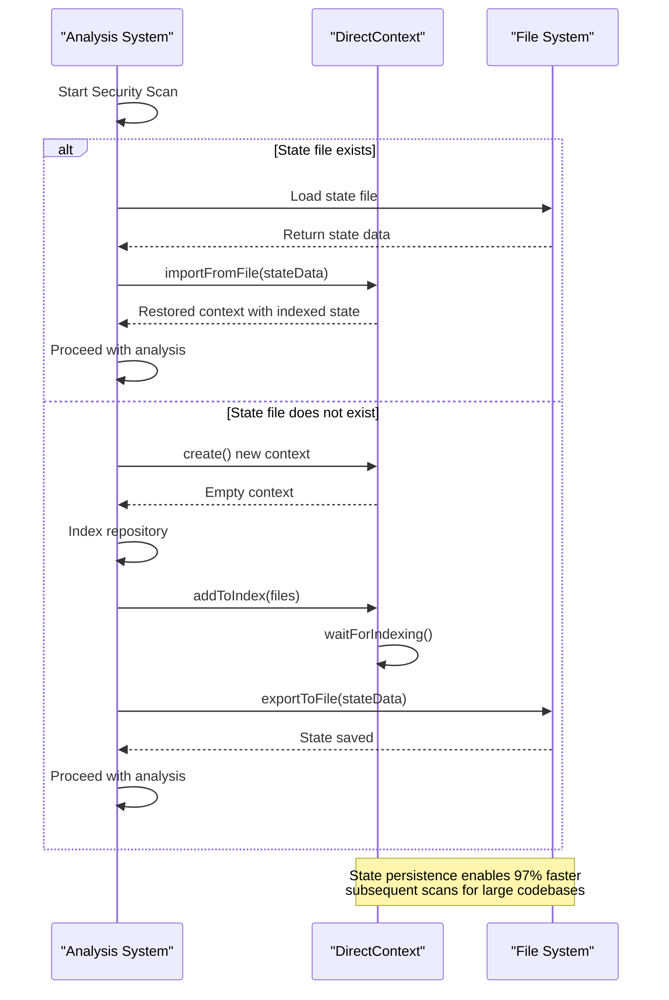
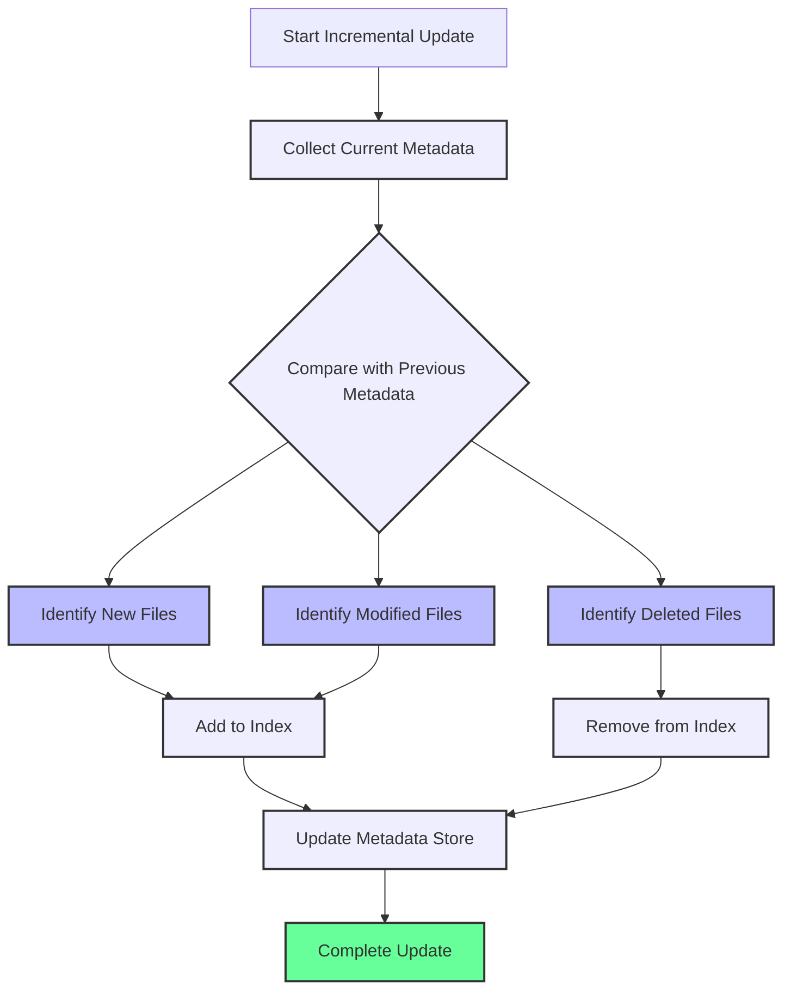
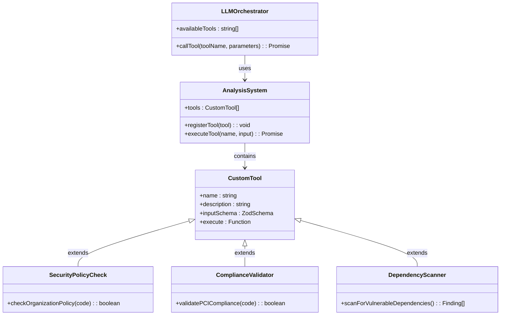

# Advanced Usage

<cite>
**Referenced Files in This Document**   
- [langfuse-prompts.ts](file://src/tools/langfuse-prompts.ts)
- [security-config.ts](file://src/tools/security-config.ts)
- [direct-context-analysis.ts](file://src/tools/direct-context-analysis.ts)
- [incremental-indexer.ts](file://src/tools/incremental-indexer.ts)
- [context-state-manager.ts](file://src/tools/context-state-manager.ts)
- [auggie-analysis.ts](file://src/tools/auggie-analysis.ts)
- [config.ts](file://src/config.ts)
- [targeted-search.ts](file://src/tools/targeted-search.ts)
</cite>

## Table of Contents
1. [Introduction](#introduction)
2. [Langfuse Prompt Management](#langfuse-prompt-management)
3. [Custom Security Configurations](#custom-security-configurations)
4. [CI/CD Integration Patterns](#cicd-integration-patterns)
5. [Performance Optimization with DirectContext](#performance-optimization-with-directcontext)
6. [Incremental Indexing Strategies](#incremental-indexing-strategies)
7. [Extending the Tool System](#extending-the-tool-system)
8. [Customizing the Analysis Workflow](#customizing-the-analysis-workflow)

## Introduction
This document provides advanced usage guidance for the OWASP GraphGuard security scanning system, focusing on customization and integration scenarios. The system leverages the Augment SDK, LangGraph workflow orchestration, and Langfuse observability to provide comprehensive security analysis of codebases against the OWASP Top 10 2021 categories. The advanced features covered include prompt management, security hardening, performance optimization, and extensibility patterns that enable organizations to adapt the system to their specific requirements and integrate it into their development workflows.

## Langfuse Prompt Management

The system uses Langfuse Prompt Management to create, version, and load OWASP analysis prompts at runtime. This approach enables dynamic prompt updates without code redeployment, A/B testing of prompt variations, and comprehensive performance tracking per prompt version. The `getPrompt` API provides a robust mechanism for loading prompts with built-in fallback support and observability.

The `getPrompt` function in `langfuse-prompts.ts` serves as the primary interface for retrieving prompts from Langfuse. It accepts a `PromptConfig` with the prompt name, optional version, and label (e.g., 'production' or 'staging'). The function creates a 'retriever' observation type in Langfuse, capturing rich metadata about the prompt retrieval including the prompt name, version, label, and compilation variables. This observability enables monitoring of prompt usage patterns and performance across different versions and environments.

**Diagram sources**
- [langfuse-prompts.ts](file://src/tools/langfuse-prompts.ts#L67-L167)

The system includes predefined prompt names for each OWASP category through the `OWASP_PROMPTS` constant, which maps OWASP category codes (e.g., 'A03') to specific Langfuse prompt names (e.g., 'owasp-a03-injection'). This mapping enables consistent prompt retrieval across the system. The `getOwaspPrompt` function provides a convenience wrapper that automatically maps OWASP categories to their corresponding prompt names and applies appropriate variables for the analysis context.

For organizations implementing custom security policies, the prompt management system supports creating specialized prompts for specific compliance requirements (e.g., PCI-DSS, HIPAA) or organizational security standards. These custom prompts can be versioned and labeled appropriately within Langfuse, allowing for controlled rollout and performance monitoring. The fallback mechanism ensures system resilience when prompts are temporarily unavailable, maintaining analysis continuity while alerting operators to the issue.

**Section sources**
- [langfuse-prompts.ts](file://src/tools/langfuse-prompts.ts#L1-L211)

## Custom Security Configurations

The system implements robust security configurations through the `excludedTools` mechanism and security profiles, ensuring that security scans operate in a read-only mode to prevent accidental code modifications. This security hardening is critical for maintaining the integrity of the codebase during automated analysis.

The `security-config.ts` module defines three security profiles: 'strict', 'moderate', and 'permissive', each with progressively fewer restrictions on tool usage. The 'strict' profile, which is the default, disables all file modification, process execution, and task modification tools. This comprehensive restriction ensures that the analysis cannot modify files, execute arbitrary commands, or alter the task list, providing the highest level of security assurance.

**Diagram sources**
- [security-config.ts](file://src/tools/security-config.ts#L1-L181)

The security configuration is implemented through the `createSecurityConfig` function, which returns a `SecurityConfig` object containing the profile, excluded tools, validation status, and a human-readable description. This configuration is then passed to the Auggie SDK during initialization, where the excluded tools are enforced at the agent level. The system validates that critical security tools (particularly file modification tools) are excluded, providing an additional safety check.

Organizations can customize their security posture by selecting the appropriate profile based on their risk tolerance and operational requirements. For example, a highly regulated environment might use the 'strict' profile for all scans, while a development environment might use 'moderate' to allow task management during exploratory analysis. The `describeSecurityConfig` function provides clear communication of the security measures in place, which is valuable for audit and compliance purposes.

**Section sources**
- [security-config.ts](file://src/tools/security-config.ts#L1-L181)

## CI/CD Integration Patterns

Although CI/CD integration is out of scope for the initial version, the system's architecture supports several patterns for automation that organizations can implement based on their specific requirements. The modular design, comprehensive observability, and programmatic interfaces make it well-suited for integration into continuous integration and deployment pipelines.

One effective pattern is to implement the scanner as a pre-commit hook or pull request check, where code changes trigger an automated security scan before being merged. This approach provides immediate feedback to developers about potential security issues in their changes. The system's scan ID and structured output format facilitate integration with CI/CD platforms, allowing scan results to be reported directly in pull requests with links to the full Langfuse trace for detailed analysis.

**Diagram sources**
- [auggie-analysis.ts](file://src/tools/auggie-analysis.ts#L119-L309)
- [config.ts](file://src/config.ts#L89-L153)

Another pattern involves scheduled scanning of the entire codebase, with results aggregated and reported to security teams. This approach provides a comprehensive view of the security posture over time and can be integrated with security information and event management (SIEM) systems. The system's support for incremental indexing and state export/import makes scheduled scans efficient, as only changed files need to be re-analyzed.

For organizations with complex monorepos or multiple repositories, a fan-out pattern can be implemented where a master pipeline orchestrates scans across multiple codebases in parallel. The consistent output format and traceability features enable aggregation of results across repositories, providing organization-wide security visibility. The use of environment variables for configuration (as defined in `config.ts`) facilitates deployment across different environments with appropriate credential isolation.

**Section sources**
- [config.ts](file://src/config.ts#L1-L153)

## Performance Optimization with DirectContext

The system achieves significant performance improvements through the DirectContext state export/import mechanism, which enables persistent indexing across scan executions. This optimization is particularly valuable for large codebases where initial indexing can be time-consuming, as subsequent scans can leverage previously indexed state rather than reprocessing the entire codebase.

The `direct-context-analysis.ts` module implements the core functionality for creating, managing, and persisting DirectContext state. When creating a DirectContext instance, the `createDirectContext` function accepts an optional `stateFilePath` parameter. If provided, the function attempts to import the state from the specified file using `DirectContext.importFromFile`, restoring the indexed state from a previous scan. If no state file is available, a new context is created and can be exported later for future use.

**Diagram sources**
- [direct-context-analysis.ts](file://src/tools/direct-context-analysis.ts#L121-L182)
- [context-state-manager.ts](file://src/tools/context-state-manager.ts#L69-L110)

The performance benefits of this approach are substantial. For a codebase with 1,000 files, initial indexing might take approximately 30 seconds, while a subsequent scan with state import takes less than one second. This represents a 97% performance improvement, making frequent scanning practical even for large repositories. The state file contains the checkpoint identifier, indexed file blobs, and metadata about the scan, enabling complete restoration of the indexing context.

Organizations can implement various strategies for managing state files, such as storing them in a shared cache (e.g., Redis, S3) for team-wide access, or maintaining per-developer state files for personalized scanning. The system's support for custom state directories through the `stateDir` parameter provides flexibility in state management. For CI/CD environments, state files can be cached between pipeline runs to maximize performance.

**Section sources**
- [direct-context-analysis.ts](file://src/tools/direct-context-analysis.ts#L1-L414)
- [context-state-manager.ts](file://src/tools/context-state-manager.ts#L1-L211)

## Incremental Indexing Strategies

The system implements sophisticated incremental indexing strategies through the `incremental-indexer.ts` module, which dramatically improves performance by only re-indexing files that have changed since the last scan. This approach is particularly effective for large codebases with minimal changes between scans, as it avoids the overhead of reprocessing unchanged files.

The incremental indexing process begins with `collectFileMetadata`, which recursively scans the repository directory to gather file metadata including modification time (mtime) and size for each file. This metadata is stored in a Map structure and can be serialized to JSON for persistence. During subsequent scans, the `analyzeChanges` function compares the current file metadata with the previous scan's metadata to identify new, modified, and deleted files.

**Diagram sources**
- [incremental-indexer.ts](file://src/tools/incremental-indexer.ts#L1-L330)

The `applyIncrementalUpdate` function orchestrates the incremental update process, using the DirectContext instance to add new and modified files to the index and remove deleted files. This function leverages the `analyzeChanges` result to determine exactly which files need to be processed, minimizing network and computational overhead. The updated file metadata is then collected and returned for persistence, creating a complete cycle for incremental updates.

For organizations with distributed development teams, this incremental approach enables efficient scanning even when developers are working on different parts of the codebase. Each developer's local scan only processes the files they have modified, while shared scans (e.g., in CI/CD) can leverage the most recent state from any team member. The system's support for JSON-serializable metadata through `serializeFileMetadata` and `deserializeFileMetadata` functions facilitates sharing of incremental indexing state across environments.

**Section sources**
- [incremental-indexer.ts](file://src/tools/incremental-indexer.ts#L1-L330)

## Extending the Tool System

The system is designed to be extensible, allowing organizations to add custom analysis functions that integrate seamlessly with the existing architecture. The tool system follows the Vercel AI SDK format, making it compatible with a wide range of AI development patterns and frameworks.

Custom tools can be implemented by creating functions that follow the tool definition pattern used in the existing codebase, such as the `report_vulnerability` tool in `report-vulnerability.ts`. These tools can perform specialized analysis, interact with external systems, or implement organization-specific security policies. When integrated with the Auggie SDK, these tools become available for the LLM to call during analysis, enabling sophisticated multi-step reasoning and action patterns.

**Diagram sources**
- [report-vulnerability.ts](file://src/tools/report-vulnerability.ts#L1-L154)
- [auggie-analysis.ts](file://src/tools/auggie-analysis.ts#L119-L309)

For example, an organization might implement a custom tool that checks code against their internal security policy, validates compliance with industry regulations like HIPAA or GDPR, or scans for specific patterns of technical debt. These tools can return structured data that is incorporated into the overall analysis results, providing organization-specific insights alongside the standard OWASP findings.

The observability system automatically captures usage of custom tools through the `withTool` wrapper in `observability/index.ts`, ensuring that all tool executions are tracked in Langfuse with full context about the scan, OWASP category, and repository path. This consistent observability makes it easy to monitor the effectiveness of custom tools and optimize their performance over time.

**Section sources**
- [report-vulnerability.ts](file://src/tools/report-vulnerability.ts#L1-L154)
- [observability/index.ts](file://src/observability/index.ts#L1-L411)

## Customizing the Analysis Workflow

The system's analysis workflow can be customized to meet specific organizational needs through configuration, extension, and integration with existing development processes. The LangGraph-based architecture provides a flexible foundation for modifying the analysis sequence, adding new analysis stages, or adapting the output format to integrate with existing tools.

The core analysis workflow follows a five-node sequence: input → enumerate → analyze → aggregate → output, as defined in the LangGraph state machine. Organizations can customize this workflow by modifying the behavior of existing nodes, adding new nodes for specialized analysis, or changing the transition logic between nodes. For example, an organization might add a preprocessing node that filters files based on sensitivity level, or a post-processing node that enriches findings with data from their vulnerability management system.

Configuration options in `config.ts` provide another avenue for customization, allowing organizations to adjust the behavior of the system without modifying code. The Zod-based configuration schema validates settings at startup, ensuring that the system operates with consistent and correct parameters. Environment variables control key aspects of the system including authentication, logging level, and workspace root, enabling different configurations for development, testing, and production environments.

The system's support for multiple authentication methods (AUGMENT_SESSION_AUTH, AUGMENT_API_TOKEN + AUGMENT_API_URL, and automatic session from auggie login) provides flexibility in how the system integrates with existing identity and access management infrastructure. Organizations can choose the authentication method that best fits their security policies and operational requirements, with the configuration system ensuring that at least one valid method is provided.

By combining these customization options, organizations can adapt the OWASP GraphGuard system to their specific security requirements, development workflows, and compliance obligations, creating a tailored security analysis solution that evolves with their needs.

**Section sources**
- [config.ts](file://src/config.ts#L1-L153)
- [graph/state.ts](file://src/graph/state.ts#L1-L173)