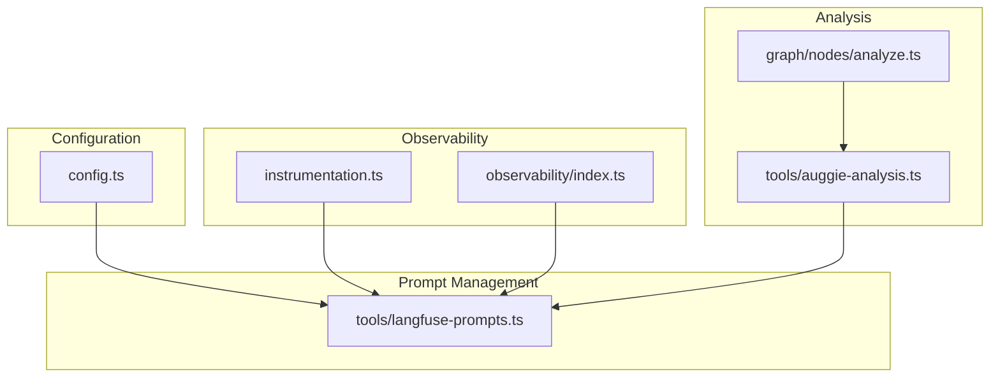
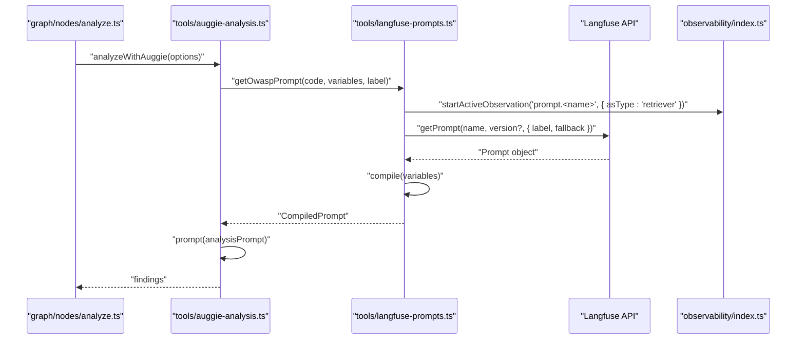
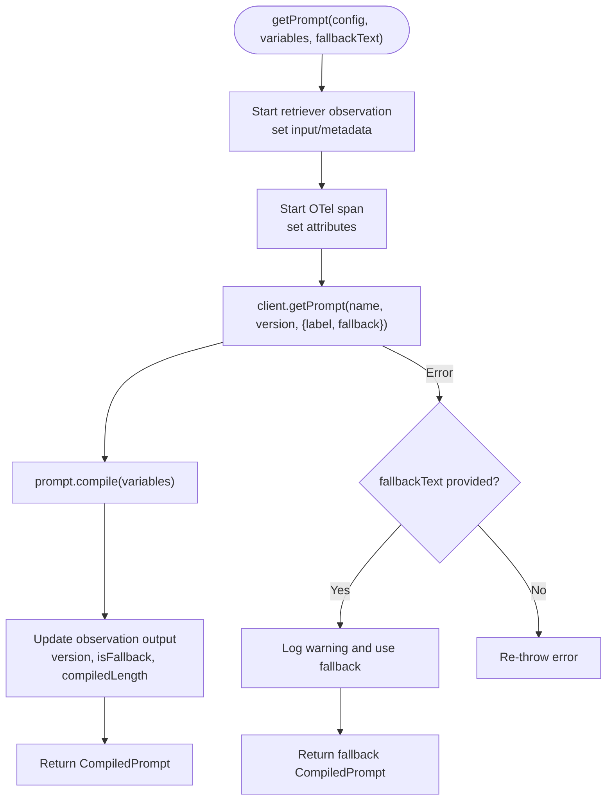
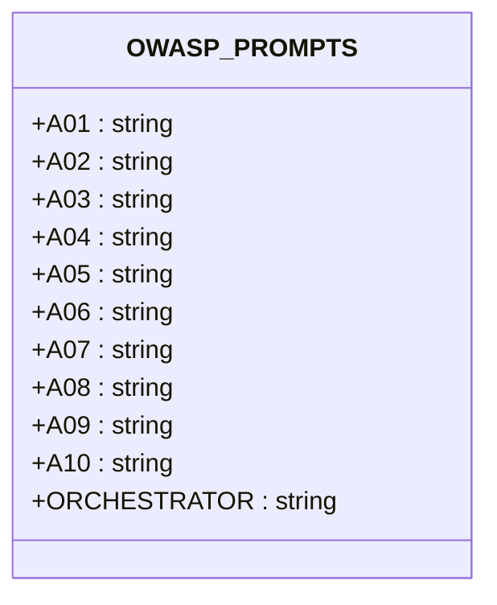
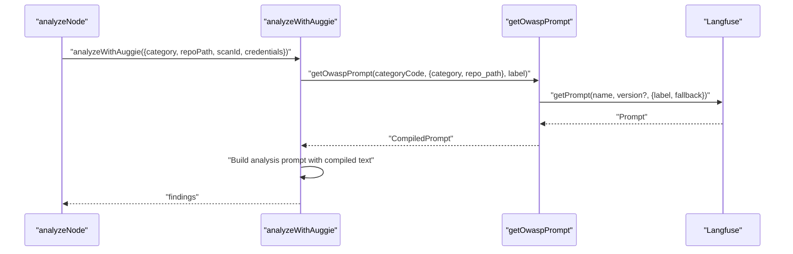
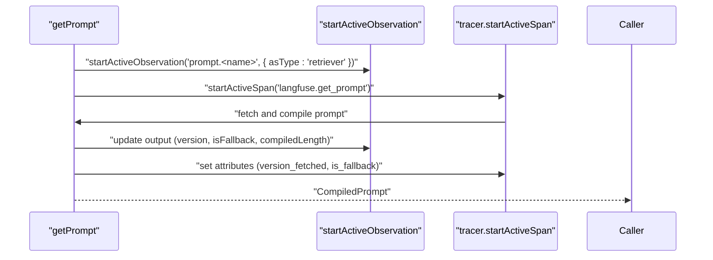
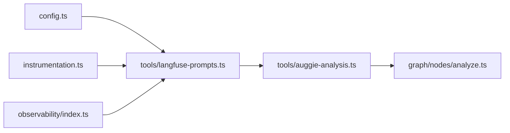

# Custom Prompts

<cite>
**Referenced Files in This Document**
- [README.md](file://README.md)
- [PRD.md](file://docs/PRD.md)
- [instrumentation.ts](file://src/instrumentation.ts)
- [observability/index.ts](file://src/observability/index.ts)
- [config.ts](file://src/config.ts)
- [tools/langfuse-prompts.ts](file://src/tools/langfuse-prompts.ts)
- [tools/auggie-analysis.ts](file://src/tools/auggie-analysis.ts)
- [graph/nodes/analyze.ts](file://src/graph/nodes/analyze.ts)
</cite>

## Table of Contents
1. [Introduction](#introduction)
2. [Project Structure](#project-structure)
3. [Core Components](#core-components)
4. [Architecture Overview](#architecture-overview)
5. [Detailed Component Analysis](#detailed-component-analysis)
6. [Dependency Analysis](#dependency-analysis)
7. [Performance Considerations](#performance-considerations)
8. [Troubleshooting Guide](#troubleshooting-guide)
9. [Conclusion](#conclusion)

## Introduction
This document explains how to create and version OWASP analysis prompts in Langfuse Prompt Management and integrate them into the application. It covers:
- Creating and labeling prompts for production and development
- Loading prompts at runtime using the getPrompt API with variable compilation
- Fallback behavior to keep scans running even if prompts are unavailable
- Mapping custom prompt templates to OWASP categories via the OWASP_PROMPTS constant
- Observability benefits using the 'retriever' observation type to track prompt retrieval in the Langfuse dashboard
- Troubleshooting common prompt-related issues

## Project Structure
The prompt management and runtime loading are implemented in a dedicated module that integrates with the broader observability and configuration systems.

**Diagram sources**
- [config.ts](file://src/config.ts#L1-L153)
- [instrumentation.ts](file://src/instrumentation.ts#L1-L141)
- [observability/index.ts](file://src/observability/index.ts#L1-L411)
- [tools/langfuse-prompts.ts](file://src/tools/langfuse-prompts.ts#L1-L211)
- [tools/auggie-analysis.ts](file://src/tools/auggie-analysis.ts#L1-L310)
- [graph/nodes/analyze.ts](file://src/graph/nodes/analyze.ts#L1-L156)

**Section sources**
- [README.md](file://README.md#L1-L171)
- [PRD.md](file://docs/PRD.md#L120-L171)

## Core Components
- Langfuse prompt loading utilities: provides getPrompt and getOwaspPrompt, with fallback support and observability
- OWASP_PROMPTS constant: maps OWASP category codes to Langfuse prompt names
- Auggie analysis integration: loads category-specific prompts and orchestrates LLM analysis
- Instrumentation and observability: initializes OpenTelemetry and Langfuse, and exposes typed observation helpers

Key responsibilities:
- Prompt retrieval and compilation with robust fallback
- Production vs development labeling for stable and testing prompts
- Rich observability metadata for prompt retrieval and compilation
- Seamless integration with the analysis workflow

**Section sources**
- [tools/langfuse-prompts.ts](file://src/tools/langfuse-prompts.ts#L1-L211)
- [tools/auggie-analysis.ts](file://src/tools/auggie-analysis.ts#L119-L253)
- [instrumentation.ts](file://src/instrumentation.ts#L1-L141)
- [observability/index.ts](file://src/observability/index.ts#L1-L120)

## Architecture Overview
The prompt lifecycle integrates with the analysis workflow and observability stack.

**Diagram sources**
- [graph/nodes/analyze.ts](file://src/graph/nodes/analyze.ts#L44-L155)
- [tools/auggie-analysis.ts](file://src/tools/auggie-analysis.ts#L119-L253)
- [tools/langfuse-prompts.ts](file://src/tools/langfuse-prompts.ts#L67-L168)
- [observability/index.ts](file://src/observability/index.ts#L214-L233)

## Detailed Component Analysis

### Langfuse Prompt Loading Utilities
This module centralizes prompt retrieval and compilation with:
- getPrompt: fetches a prompt by name and optional label/version, compiles variables, and supports a fallback text
- getOwaspPrompt: resolves a category code to a Langfuse prompt name and calls getPrompt with a default fallback
- OWASP_PROMPTS: predefined mapping from category codes to Langfuse prompt names
- Observability: uses startActiveObservation with asType 'retriever' to track prompt retrieval in the Langfuse dashboard

**Diagram sources**
- [tools/langfuse-prompts.ts](file://src/tools/langfuse-prompts.ts#L67-L168)

**Section sources**
- [tools/langfuse-prompts.ts](file://src/tools/langfuse-prompts.ts#L1-L211)

### OWASP_PROMPTS Mapping
The OWASP_PROMPTS constant defines the canonical mapping between OWASP category codes and Langfuse prompt names. This enables consistent prompt selection across the application.

**Diagram sources**
- [tools/langfuse-prompts.ts](file://src/tools/langfuse-prompts.ts#L170-L189)

**Section sources**
- [tools/langfuse-prompts.ts](file://src/tools/langfuse-prompts.ts#L170-L189)

### Auggie Analysis Integration
The analysis workflow loads category-specific prompts and orchestrates LLM calls. It sets attributes for prompt metadata and handles parsing of findings.

**Diagram sources**
- [graph/nodes/analyze.ts](file://src/graph/nodes/analyze.ts#L44-L155)
- [tools/auggie-analysis.ts](file://src/tools/auggie-analysis.ts#L119-L253)
- [tools/langfuse-prompts.ts](file://src/tools/langfuse-prompts.ts#L190-L211)

**Section sources**
- [tools/auggie-analysis.ts](file://src/tools/auggie-analysis.ts#L119-L253)
- [graph/nodes/analyze.ts](file://src/graph/nodes/analyze.ts#L44-L155)

### Observability and Retrieval Tracking
The retriever observation type captures prompt retrieval metadata, including prompt name, label, version, variable keys, and whether a fallback was used. This enables rich dashboards and debugging in Langfuse.

**Diagram sources**
- [tools/langfuse-prompts.ts](file://src/tools/langfuse-prompts.ts#L67-L168)
- [observability/index.ts](file://src/observability/index.ts#L214-L233)

**Section sources**
- [tools/langfuse-prompts.ts](file://src/tools/langfuse-prompts.ts#L67-L168)
- [observability/index.ts](file://src/observability/index.ts#L214-L233)

## Dependency Analysis
- tools/langfuse-prompts.ts depends on:
  - instrumentation.ts for tracer initialization
  - observability/index.ts for startActiveObservation
  - config.ts for Langfuse base URL resolution
- tools/auggie-analysis.ts depends on:
  - tools/langfuse-prompts.ts for prompt retrieval
  - observability/index.ts for agent and tool observations
- graph/nodes/analyze.ts orchestrates the analysis node and relies on Auggie analysis

**Diagram sources**
- [config.ts](file://src/config.ts#L1-L153)
- [instrumentation.ts](file://src/instrumentation.ts#L1-L141)
- [observability/index.ts](file://src/observability/index.ts#L1-L120)
- [tools/langfuse-prompts.ts](file://src/tools/langfuse-prompts.ts#L1-L211)
- [tools/auggie-analysis.ts](file://src/tools/auggie-analysis.ts#L1-L310)
- [graph/nodes/analyze.ts](file://src/graph/nodes/analyze.ts#L1-L156)

**Section sources**
- [tools/langfuse-prompts.ts](file://src/tools/langfuse-prompts.ts#L1-L211)
- [tools/auggie-analysis.ts](file://src/tools/auggie-analysis.ts#L1-L310)
- [graph/nodes/analyze.ts](file://src/graph/nodes/analyze.ts#L1-L156)

## Performance Considerations
- Prompt caching: The Langfuse client caches prompts internally; repeated calls within a process reuse cached versions.
- Fallback minimizes downtime: When prompts are unavailable, scans continue with fallback text, preventing interruptions.
- Observability overhead: Retrieval tracking adds minimal overhead while providing valuable insights.

[No sources needed since this section provides general guidance]

## Troubleshooting Guide
Common prompt-related issues and resolutions:

- Version mismatches
  - Symptom: Unexpected prompt version or missing label
  - Resolution: Specify label and version explicitly in getPrompt or getOwaspPrompt; ensure the desired version is published in Langfuse Prompt Management
  - Section sources
    - [tools/langfuse-prompts.ts](file://src/tools/langfuse-prompts.ts#L67-L168)

- Missing labels
  - Symptom: Prompt retrieval fails due to label mismatch
  - Resolution: Use 'production' or 'staging' labels consistently; default label is 'production' when not provided
  - Section sources
    - [tools/langfuse-prompts.ts](file://src/tools/langfuse-prompts.ts#L67-L168)

- Compilation errors
  - Symptom: Prompt compile fails due to missing variables
  - Resolution: Ensure all variables required by the prompt template are provided in the variables argument; verify variable keys match the template
  - Section sources
    - [tools/langfuse-prompts.ts](file://src/tools/langfuse-prompts.ts#L67-L168)

- Prompt unavailable
  - Symptom: getPrompt throws an error and scan stops
  - Resolution: Provide fallbackText to getPrompt/getOwaspPrompt; scans will continue with fallback text
  - Section sources
    - [tools/langfuse-prompts.ts](file://src/tools/langfuse-prompts.ts#L67-L168)

- Dashboard visibility
  - Symptom: Cannot find prompt retrieval in Langfuse
  - Resolution: Confirm retriever observation type is used; verify prompt name, label, and version appear in the observation metadata
  - Section sources
    - [tools/langfuse-prompts.ts](file://src/tools/langfuse-prompts.ts#L67-L168)
    - [observability/index.ts](file://src/observability/index.ts#L214-L233)

- Configuration issues
  - Symptom: Missing Langfuse credentials or base URL
  - Resolution: Set LANGFUSE_PUBLIC_KEY, LANGFUSE_SECRET_KEY, and optionally LANGFUSE_HOST or LANGFUSE_BASE_URL; validate with loadConfig
  - Section sources
    - [config.ts](file://src/config.ts#L1-L153)
    - [instrumentation.ts](file://src/instrumentation.ts#L94-L120)

## Conclusion
By leveraging Langfuse Prompt Management with explicit production and development labels, robust fallback mechanisms, and retriever-type observability, the system ensures reliable, observable, and maintainable OWASP analysis prompts. The OWASP_PROMPTS mapping simplifies prompt selection, while the getPrompt API provides flexible runtime loading with comprehensive metadata for diagnostics and performance tracking.