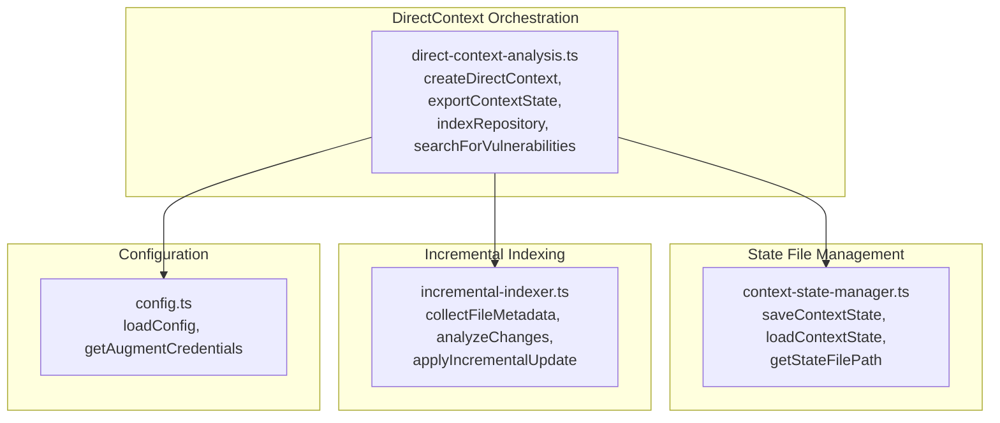
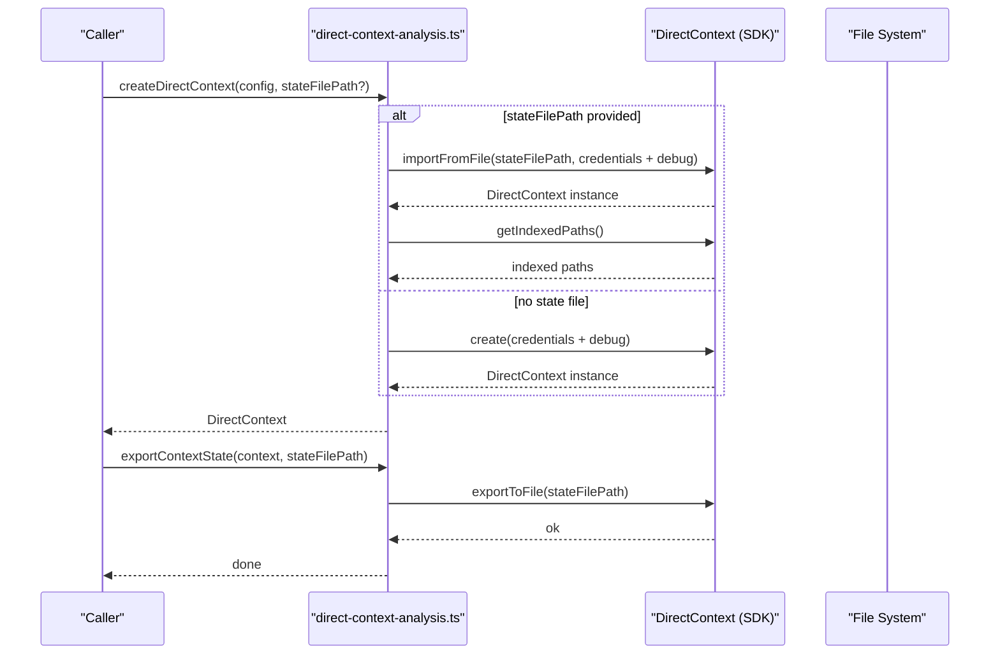
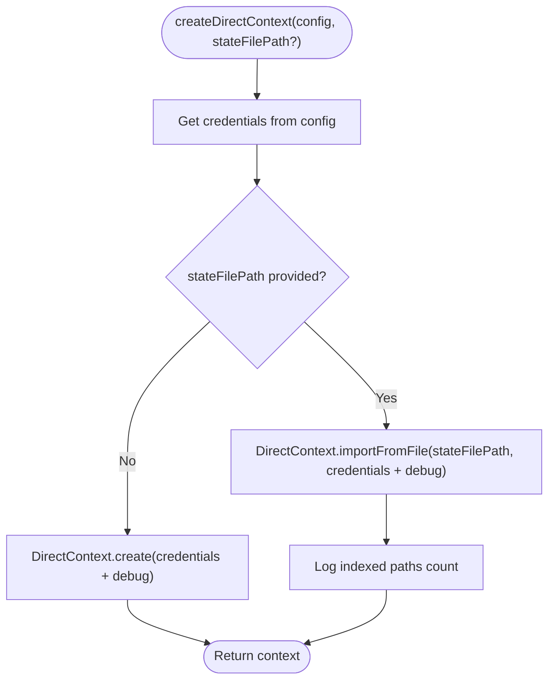
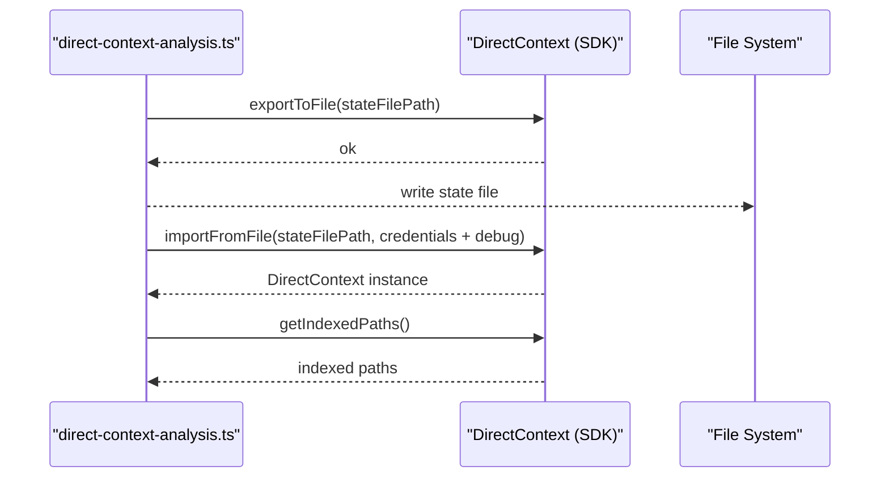
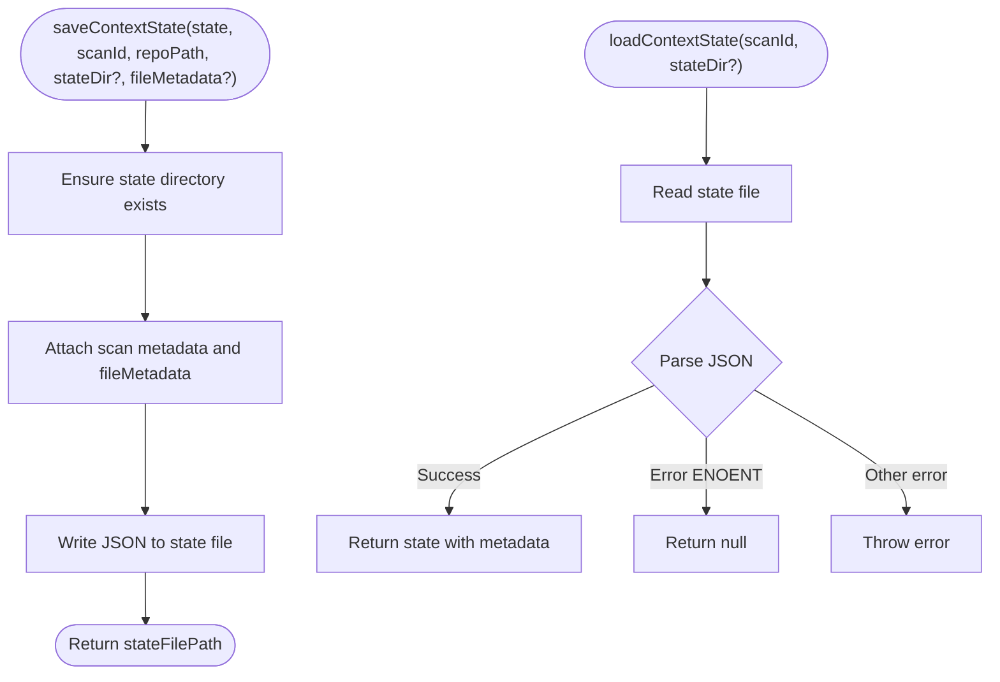
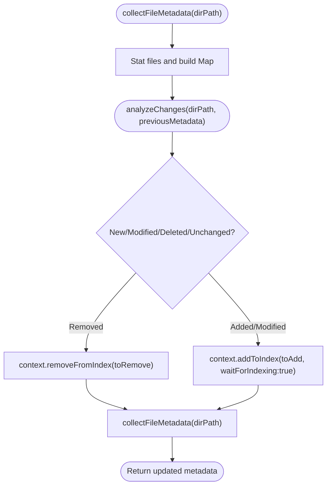
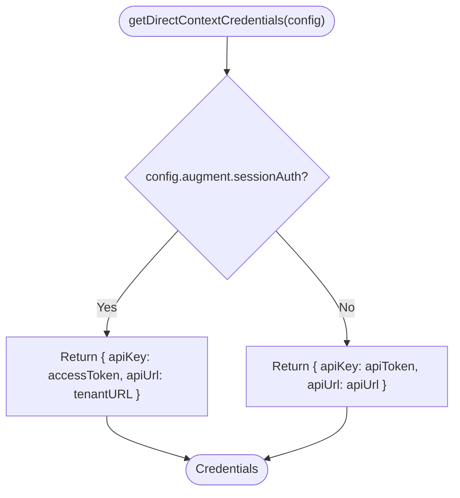
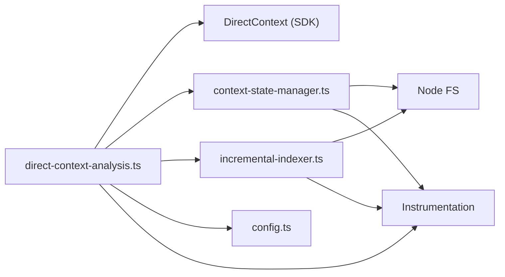

# DirectContext State Management

<cite>
**Referenced Files in This Document**
- [direct-context-analysis.ts](file://src/tools/direct-context-analysis.ts)
- [context-state-manager.ts](file://src/tools/context-state-manager.ts)
- [incremental-indexer.ts](file://src/tools/incremental-indexer.ts)
- [config.ts](file://src/config.ts)
- [direct-context-analysis.test.ts](file://src/tools/direct-context-analysis.test.ts)
- [context-state-manager.test.ts](file://src/tools/context-state-manager.test.ts)
- [incremental-indexer.test.ts](file://src/tools/incremental-indexer.test.ts)
- [README.md](file://README.md)
</cite>

## Table of Contents
1. [Introduction](#introduction)
2. [Project Structure](#project-structure)
3. [Core Components](#core-components)
4. [Architecture Overview](#architecture-overview)
5. [Detailed Component Analysis](#detailed-component-analysis)
6. [Dependency Analysis](#dependency-analysis)
7. [Performance Considerations](#performance-considerations)
8. [Troubleshooting Guide](#troubleshooting-guide)
9. [Conclusion](#conclusion)
10. [Appendices](#appendices)

## Introduction
This document explains how DirectContext state is managed for persistent indexing and state export/import in the agent. It focuses on:
- Maintaining indexed state across scans using exportToFile and importFromFile
- The createDirectContext function that conditionally imports state from a file path or creates a new context
- The getDirectContextCredentials function for authentication credentials derived from configuration
- Practical initialization examples with error handling for state import failures
- Performance benefits of state reuse and best practices for state file storage
- Common issues such as state file corruption, version incompatibility, and credential management during state import

## Project Structure
The state management and persistence logic is implemented across several modules:
- DirectContext orchestration and state export/import
- State file management (save/load with metadata)
- Incremental indexing to minimize re-indexing overhead
- Configuration and credential extraction

**Diagram sources**
- [direct-context-analysis.ts](file://src/tools/direct-context-analysis.ts#L114-L413)
- [context-state-manager.ts](file://src/tools/context-state-manager.ts#L43-L210)
- [incremental-indexer.ts](file://src/tools/incremental-indexer.ts#L1-L330)
- [config.ts](file://src/config.ts#L1-L153)

**Section sources**
- [direct-context-analysis.ts](file://src/tools/direct-context-analysis.ts#L1-L413)
- [context-state-manager.ts](file://src/tools/context-state-manager.ts#L1-L210)
- [incremental-indexer.ts](file://src/tools/incremental-indexer.ts#L1-L330)
- [config.ts](file://src/config.ts#L1-L153)

## Core Components
- DirectContext orchestration: Creates contexts, restores from state files, exports state, indexes repositories, and performs targeted searches.
- State manager: Persists and loads DirectContext state with scan metadata and file metadata for incremental indexing.
- Incremental indexer: Computes file metadata, detects changes, and applies incremental updates to the DirectContext.
- Configuration: Provides validated credentials for the Augment SDK and supports multiple authentication methods.

**Section sources**
- [direct-context-analysis.ts](file://src/tools/direct-context-analysis.ts#L114-L413)
- [context-state-manager.ts](file://src/tools/context-state-manager.ts#L1-L210)
- [incremental-indexer.ts](file://src/tools/incremental-indexer.ts#L1-L330)
- [config.ts](file://src/config.ts#L1-L153)

## Architecture Overview
The system orchestrates persistent indexing by:
- Optionally restoring a DirectContext from a saved state file
- Indexing only changed files incrementally
- Exporting the updated state to disk for future reuse

**Diagram sources**
- [direct-context-analysis.ts](file://src/tools/direct-context-analysis.ts#L114-L183)
- [direct-context-analysis.ts](file://src/tools/direct-context-analysis.ts#L363-L413)

## Detailed Component Analysis

### DirectContext Creation and State Import
- Conditional import vs. creation:
  - If a state file path is provided, the function imports the context from the file and logs the number of restored indexed files.
  - Otherwise, it creates a new context with credentials and debug flag derived from configuration.
- Credentials:
  - getDirectContextCredentials extracts apiKey and apiUrl from validated config, preferring sessionAuth when present.
  - Debug flag is set based on nodeEnv.
- Tracing and observability:
  - Spans capture state import/export, indexed file counts, and error attributes.

**Diagram sources**
- [direct-context-analysis.ts](file://src/tools/direct-context-analysis.ts#L114-L183)

**Section sources**
- [direct-context-analysis.ts](file://src/tools/direct-context-analysis.ts#L114-L183)
- [direct-context-analysis.test.ts](file://src/tools/direct-context-analysis.test.ts#L78-L119)

### State Export and Import
- Export:
  - exportContextState writes the current DirectContext state to a file path and records span attributes for observability.
- Import:
  - createDirectContext delegates to DirectContext.importFromFile when a state file path is provided.

**Diagram sources**
- [direct-context-analysis.ts](file://src/tools/direct-context-analysis.ts#L363-L413)
- [direct-context-analysis.ts](file://src/tools/direct-context-analysis.ts#L114-L183)

**Section sources**
- [direct-context-analysis.ts](file://src/tools/direct-context-analysis.ts#L363-L413)
- [direct-context-analysis.test.ts](file://src/tools/direct-context-analysis.test.ts#L208-L217)

### State File Management (Save/Load)
- saveContextState:
  - Ensures the state directory exists, attaches scan metadata (scanId, timestamp, repoPath, indexedFileCount), serializes fileMetadata if present, and writes JSON to disk.
- loadContextState:
  - Reads and parses the state file; returns null if the file does not exist; otherwise returns the state with metadata.

**Diagram sources**
- [context-state-manager.ts](file://src/tools/context-state-manager.ts#L69-L110)
- [context-state-manager.ts](file://src/tools/context-state-manager.ts#L149-L210)

**Section sources**
- [context-state-manager.ts](file://src/tools/context-state-manager.ts#L43-L210)
- [context-state-manager.test.ts](file://src/tools/context-state-manager.test.ts#L49-L144)

### Incremental Indexing
- collectFileMetadata:
  - Walks the repository directory, excludes common non-source directories and binary extensions, and collects file metadata (path, mtime, size).
- analyzeChanges:
  - Compares current metadata with previous metadata to determine new/modified, deleted, and unchanged files.
- applyIncrementalUpdate:
  - Removes deleted files, adds new/modified files, and returns updated metadata.

**Diagram sources**
- [incremental-indexer.ts](file://src/tools/incremental-indexer.ts#L59-L116)
- [incremental-indexer.ts](file://src/tools/incremental-indexer.ts#L150-L217)
- [incremental-indexer.ts](file://src/tools/incremental-indexer.ts#L234-L311)

**Section sources**
- [incremental-indexer.ts](file://src/tools/incremental-indexer.ts#L1-L330)
- [incremental-indexer.test.ts](file://src/tools/incremental-indexer.test.ts#L1-L175)

### Authentication Credentials Extraction
- getDirectContextCredentials:
  - Returns apiKey and apiUrl from validated config, preferring sessionAuth when present; otherwise falls back to apiToken and apiUrl.
- getAugmentCredentials:
  - A separate helper for the broader Augment SDK integration, also preferring sessionAuth and validating configuration.

**Diagram sources**
- [direct-context-analysis.ts](file://src/tools/direct-context-analysis.ts#L40-L66)
- [config.ts](file://src/config.ts#L123-L153)

**Section sources**
- [direct-context-analysis.ts](file://src/tools/direct-context-analysis.ts#L40-L66)
- [config.ts](file://src/config.ts#L1-L153)

## Dependency Analysis
- DirectContext orchestration depends on:
  - SDK’s DirectContext.create and DirectContext.importFromFile
  - Configuration for credentials and debug flag
  - State manager for file-based persistence
  - Incremental indexer for change detection and updates
- State manager depends on:
  - Node fs/promises for file I/O
  - Instrumentation for tracing and observability
- Incremental indexer depends on:
  - Node fs/promises for file stats and reads
  - Instrumentation for tracing and observability

**Diagram sources**
- [direct-context-analysis.ts](file://src/tools/direct-context-analysis.ts#L1-L413)
- [context-state-manager.ts](file://src/tools/context-state-manager.ts#L1-L210)
- [incremental-indexer.ts](file://src/tools/incremental-indexer.ts#L1-L330)
- [config.ts](file://src/config.ts#L1-L153)

**Section sources**
- [direct-context-analysis.ts](file://src/tools/direct-context-analysis.ts#L1-L413)
- [context-state-manager.ts](file://src/tools/context-state-manager.ts#L1-L210)
- [incremental-indexer.ts](file://src/tools/incremental-indexer.ts#L1-L330)
- [config.ts](file://src/config.ts#L1-L153)

## Performance Considerations
- State reuse:
  - Reusing a persisted index avoids re-uploading unchanged files, significantly reducing indexing time for repeated scans.
- Incremental indexing:
  - Only re-indexes changed files by comparing metadata (mtime and size), minimizing network and compute costs.
- Best practices:
  - Store state files in a dedicated directory (default: .auggie-state) to keep them organized and discoverable.
  - Keep state files close to the repository to reduce latency and improve reliability.
  - Use a stable, versioned state file format and guard against version mismatches by validating metadata when loading.

[No sources needed since this section provides general guidance]

## Troubleshooting Guide
Common issues and resolutions:
- State file not found:
  - loadContextState returns null when the file does not exist; handle this by falling back to creating a new context.
- State file corruption:
  - If parsing fails, loadContextState throws an error; verify the file integrity and regenerate state if necessary.
- Version incompatibility:
  - If the state file format changes across SDK versions, consider migrating or regenerating state; validate metadata on load.
- Credential mismatch during import:
  - Ensure the credentials used for import match the original context. If tenant URL or token changed, recreate the context instead of importing state.
- Large files:
  - indexRepository handles APIError and BlobTooLargeError; adjust file filtering or split the repository to avoid oversized uploads.

**Section sources**
- [context-state-manager.ts](file://src/tools/context-state-manager.ts#L149-L210)
- [direct-context-analysis.ts](file://src/tools/direct-context-analysis.ts#L185-L273)

## Conclusion
DirectContext state management enables persistent indexing and efficient reuse across scans. By combining export/import capabilities with incremental indexing and robust credential handling, the system achieves significant performance improvements while maintaining reliability and observability. Proper state file storage, error handling, and credential management are essential for smooth operation.

[No sources needed since this section summarizes without analyzing specific files]

## Appendices

### Example Initialization Scenarios
- Initialize a DirectContext with state persistence:
  - Provide a state file path to createDirectContext to import state; otherwise, a new context is created.
  - After scanning, export the state using exportContextState to a file path for later reuse.
- Error handling for state import failures:
  - Catch exceptions during importFromFile and fall back to creating a new context.
  - On loadContextState, treat null as “no prior state” and proceed with a fresh index.

**Section sources**
- [direct-context-analysis.ts](file://src/tools/direct-context-analysis.ts#L114-L183)
- [direct-context-analysis.ts](file://src/tools/direct-context-analysis.ts#L363-L413)
- [context-state-manager.ts](file://src/tools/context-state-manager.ts#L149-L210)
- [README.md](file://README.md#L120-L130)

### Best Practices for State File Storage
- Use a dedicated directory (e.g., .auggie-state) to store state files.
- Keep state files alongside the repository or in a CI cache to speed up subsequent runs.
- Back up state files periodically to avoid data loss.
- Avoid sharing state files across incompatible SDK versions; regenerate state when upgrading.

**Section sources**
- [context-state-manager.ts](file://src/tools/context-state-manager.ts#L43-L59)
- [README.md](file://README.md#L120-L130)