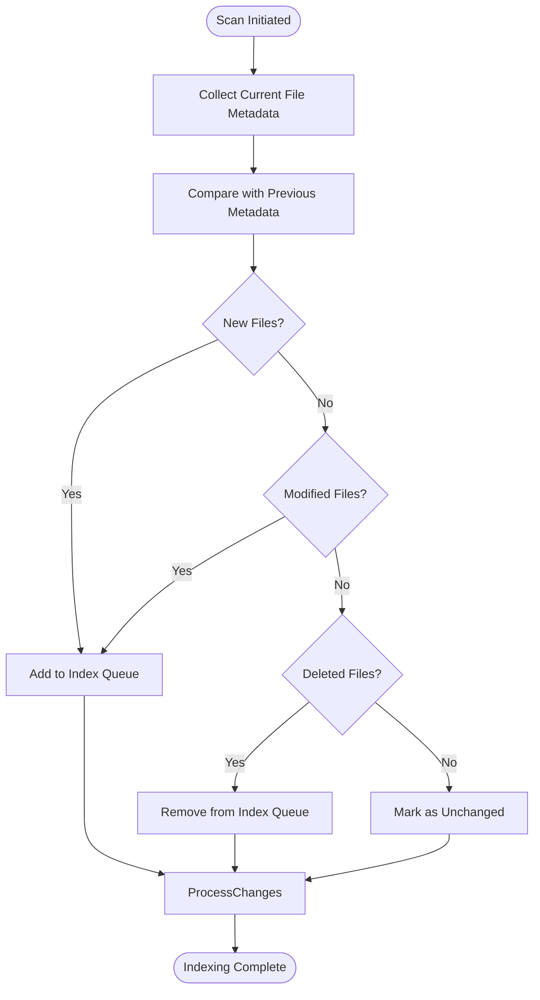
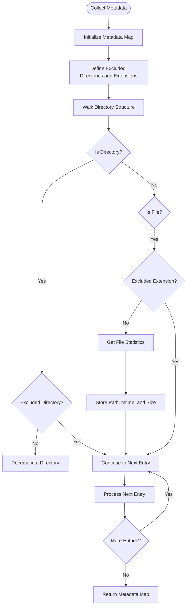
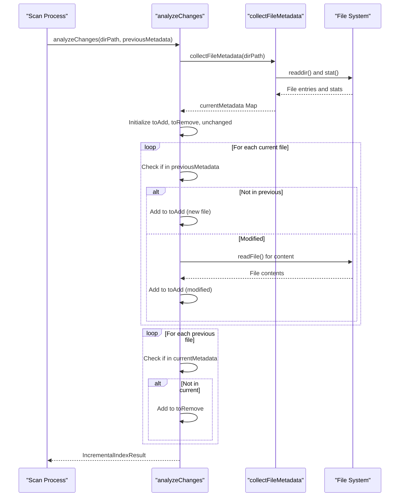
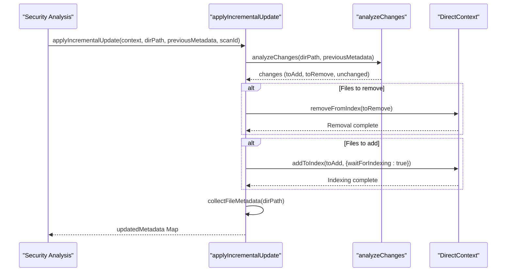
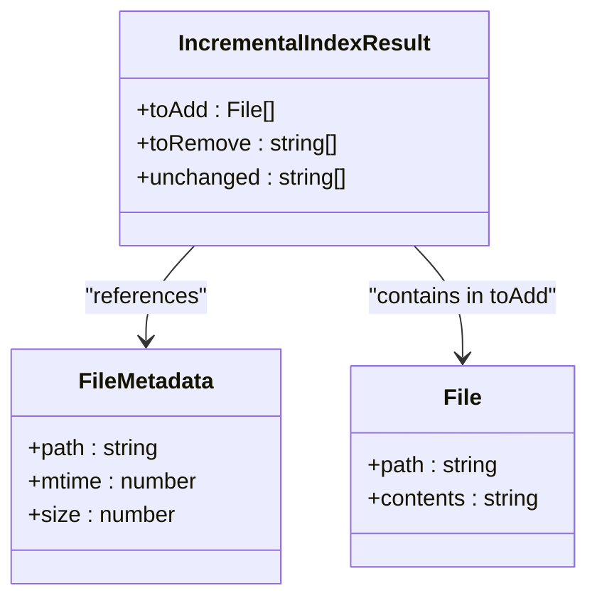
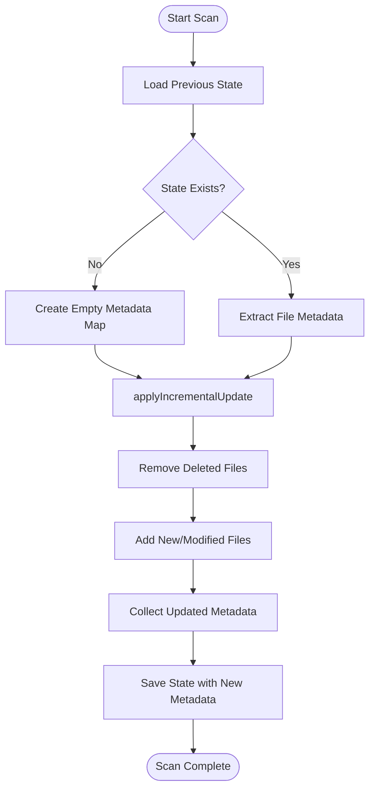
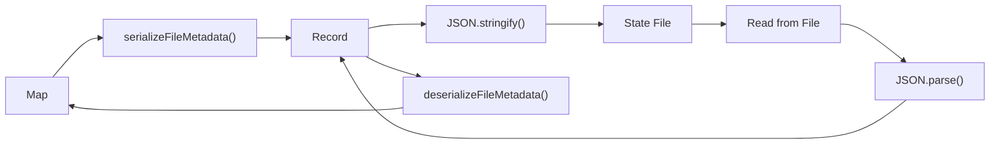

# Incremental Indexing Strategy

<cite>
**Referenced Files in This Document**   
- [incremental-indexer.ts](file://src/tools/incremental-indexer.ts)
- [context-state-manager.ts](file://src/tools/context-state-manager.ts)
- [direct-context-analysis.ts](file://src/tools/direct-context-analysis.ts)
- [config.ts](file://src/config.ts)
</cite>

## Table of Contents
1. [Introduction](#introduction)
2. [Change Detection Strategy](#change-detection-strategy)
3. [File Metadata Collection](#file-metadata-collection)
4. [Change Analysis Process](#change-analysis-process)
5. [Incremental Update Application](#incremental-update-application)
6. [Change Categories](#change-categories)
7. [Full Workflow Implementation](#full-workflow-implementation)
8. [Performance Benchmarks](#performance-benchmarks)
9. [Common Issues and Solutions](#common-issues-and-solutions)
10. [Metadata Serialization](#metadata-serialization)

## Introduction
The incremental indexing strategy implemented in the Auggie security agent dramatically improves performance by tracking file changes between scans and only re-indexing modified files. This approach leverages file metadata (modification time and size) to detect changes, enabling the system to process only what has changed rather than performing full re-indexing. The strategy is particularly effective for large codebases with minimal changes between scans, providing significant performance improvements while maintaining accurate indexing.

**Section sources**
- [incremental-indexer.ts](file://src/tools/incremental-indexer.ts#L1-L20)

## Change Detection Strategy
The system uses file modification time (mtime) and size to detect changes between scans. This dual-factor approach ensures reliable change detection while minimizing false positives. The change detection process compares current file statistics with metadata from the previous scan to identify three categories of changes: new files (not present in the previous index), modified files (different mtime or size), and deleted files (present in the previous index but not on disk). This strategy provides a balance between accuracy and performance, avoiding the need for content hashing while still reliably detecting meaningful changes.

**Diagram sources**
- [incremental-indexer.ts](file://src/tools/incremental-indexer.ts#L9-L13)

## File Metadata Collection
The `collectFileMetadata` function gathers file statistics from a directory, creating a comprehensive map of relative paths to file metadata. This function recursively traverses the directory structure while excluding common non-source directories (node_modules, .git, dist, build, coverage, .next, .cache, .auggie-state) and binary file extensions (.jpg, .png, .gif, .pdf, .zip). For each file, it collects the relative path, modification time in milliseconds, and file size in bytes. The collected metadata serves as the foundation for change detection in subsequent scans.

**Diagram sources**
- [incremental-indexer.ts](file://src/tools/incremental-indexer.ts#L59-L116)

## Change Analysis Process
The `analyzeChanges` function determines which files need to be re-indexed by comparing current file metadata with previous scan metadata. It first collects current metadata using `collectFileMetadata`, then iterates through the current files to identify new and modified files. A file is considered modified if either its modification time or size differs from the previous scan. The function also identifies deleted files by checking which files in the previous metadata are no longer present on disk. The result is a comprehensive analysis of changes that enables efficient incremental updates.

**Diagram sources**
- [incremental-indexer.ts](file://src/tools/incremental-indexer.ts#L150-L207)

## Incremental Update Application
The `applyIncrementalUpdate` function synchronizes changes with the DirectContext by applying the results of change analysis. It first calls `analyzeChanges` to determine which files need to be added or removed from the index. It then removes deleted files using `context.removeFromIndex()` and adds new or modified files using `context.addToIndex()` with `waitForIndexing: true` to ensure completion. Finally, it collects updated metadata to return as the new baseline for future comparisons. This function orchestrates the entire incremental update process, ensuring the index remains consistent with the current state of the codebase.

**Diagram sources**
- [incremental-indexer.ts](file://src/tools/incremental-indexer.ts#L243-L283)

## Change Categories
The incremental indexing system categorizes file changes into three distinct categories: toAdd (new or modified files), toRemove (deleted files), and unchanged files. The toAdd category includes both new files not present in the previous scan and modified files whose mtime or size has changed. The toRemove category contains files that were in the previous index but are no longer present on disk. The unchanged category includes files that remain identical between scans, allowing the system to skip re-indexing for these files. This categorization enables targeted updates that minimize processing overhead.

**Diagram sources**
- [incremental-indexer.ts](file://src/tools/incremental-indexer.ts#L43-L50)

## Full Workflow Implementation
The complete incremental update workflow integrates metadata collection, change analysis, and update application. The process begins by loading previous metadata from a saved state file using `loadContextState`. It then calls `applyIncrementalUpdate` to perform change detection and synchronize with DirectContext. After the update completes, the new metadata is saved to the state file using `saveContextState` for use in the next scan. This workflow ensures that each scan builds upon the previous one, maintaining an up-to-date index while minimizing redundant processing.

**Diagram sources**
- [incremental-indexer.ts](file://src/tools/incremental-indexer.ts#L243-L283)
- [context-state-manager.ts](file://src/tools/context-state-manager.ts#L69-L111)

## Performance Benchmarks
The incremental indexing strategy provides dramatic performance improvements compared to full re-indexing. For a 1000-file codebase with only 10 changed files, the system reduces processing time from approximately 30 seconds for a full re-index to about 1 second for an incremental update, representing a 97% improvement. This performance gain is achieved by eliminating redundant processing of unchanged files and focusing resources only on files that have been created, modified, or deleted. The efficiency scales with codebase size, making the approach particularly valuable for large repositories where full indexing would be prohibitively time-consuming.

**Section sources**
- [incremental-indexer.ts](file://src/tools/incremental-indexer.ts#L17-L19)

## Common Issues and Solutions
The incremental indexing system addresses several common challenges in change detection. Clock skew affecting mtime comparison is mitigated by using both mtime and size as change indicators, reducing false negatives when system clocks are slightly out of sync. Large binary files are handled by excluding common binary extensions (.jpg, .png, .gif, .pdf, .zip) from indexing, preventing performance degradation and unnecessary processing. The system also handles edge cases such as file permission changes and temporary files through robust error handling in the metadata collection process.

**Section sources**
- [incremental-indexer.ts](file://src/tools/incremental-indexer.ts#L70-L80)
- [incremental-indexer.ts](file://src/tools/incremental-indexer.ts#L95-L105)

## Metadata Serialization
File metadata is serialized for storage using the `serializeFileMetadata` and `deserializeFileMetadata` functions. The `serializeFileMetadata` function converts a Map of file metadata to a JSON-serializable Record object using Object.fromEntries, enabling the metadata to be saved to disk in the state file. The `deserializeFileMetadata` function performs the reverse operation, converting the Record back to a Map for use in change detection. This serialization process preserves all necessary metadata while ensuring compatibility with JSON storage formats.

**Diagram sources**
- [incremental-indexer.ts](file://src/tools/incremental-indexer.ts#L316-L329)
- [context-state-manager.ts](file://src/tools/context-state-manager.ts#L96-L97)