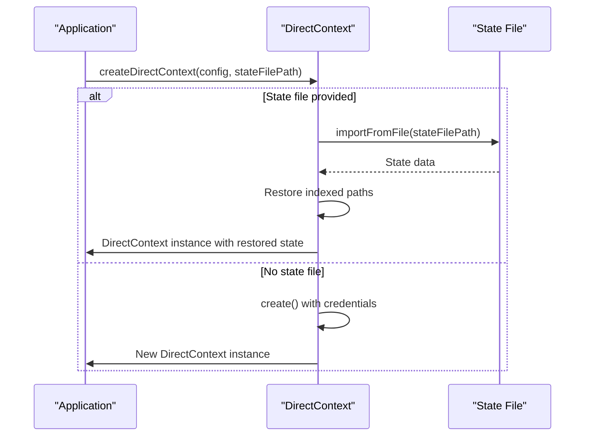
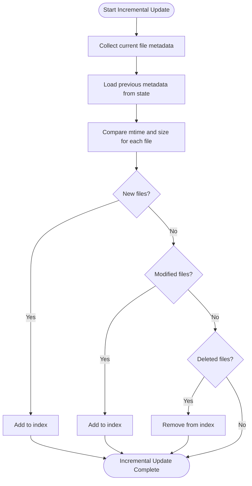
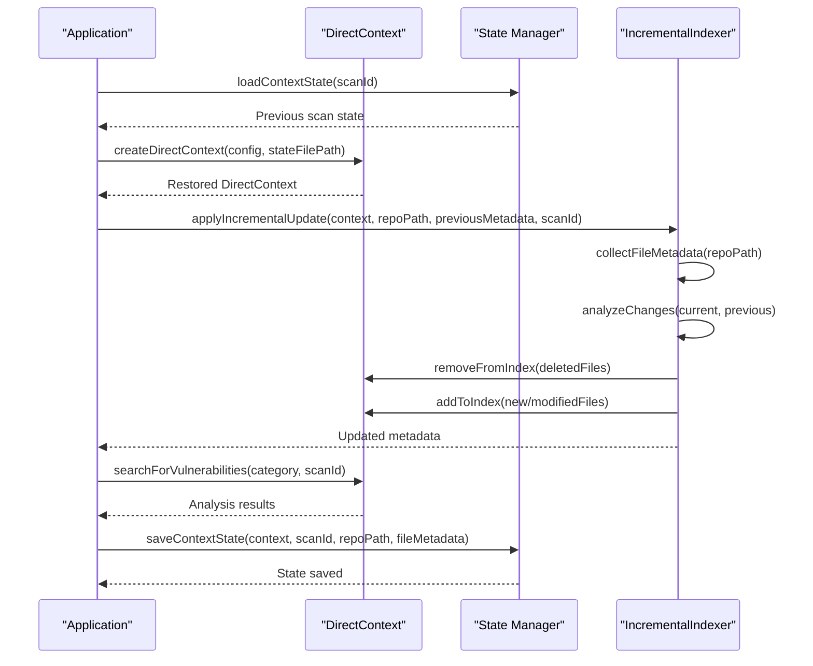
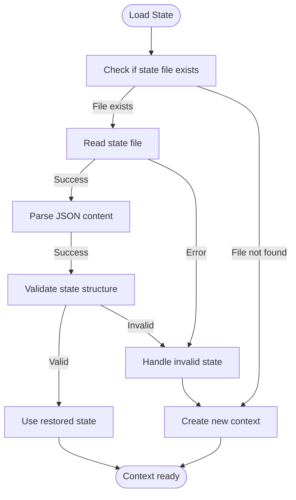

# Performance Optimization

<cite>
**Referenced Files in This Document**   
- [direct-context-analysis.ts](file://src/tools/direct-context-analysis.ts)
- [context-state-manager.ts](file://src/tools/context-state-manager.ts)
- [incremental-indexer.ts](file://src/tools/incremental-indexer.ts)
- [config.ts](file://src/config.ts)
- [state.ts](file://src/graph/state.ts)
</cite>

## Table of Contents
1. [Introduction](#introduction)
2. [DirectContext State Management](#directcontext-state-management)
3. [Incremental Indexing Strategy](#incremental-indexing-strategy)
4. [Performance Optimization Workflow](#performance-optimization-workflow)
5. [Performance Benchmarks](#performance-benchmarks)
6. [Common Issues and Solutions](#common-issues-and-solutions)
7. [Conclusion](#conclusion)

## Introduction

This document details the performance optimization capabilities of the DirectContext system, focusing on persistent state management and incremental indexing. The DirectContext approach enables dramatically faster subsequent analyses by maintaining indexed state between scans, eliminating the need for full re-indexing. This optimization is particularly valuable for large codebases where repeated full scans would be prohibitively time-consuming.

The system leverages state export/import functionality through the `exportContextState` and `createDirectContext` functions to preserve indexed state across runs. Additionally, it implements an incremental indexing strategy that uses file metadata (modification time and size) to detect changes and only re-index modified files. This combination of persistent state and incremental updates results in significant performance improvements, with benchmarks showing up to 97% faster analysis times for codebases with minimal changes.

**Section sources**
- [direct-context-analysis.ts](file://src/tools/direct-context-analysis.ts#L1-L414)
- [incremental-indexer.ts](file://src/tools/incremental-indexer.ts#L1-L330)

## DirectContext State Management

The DirectContext system implements persistent state management through a comprehensive state export/import mechanism. This functionality allows the system to maintain indexed state between scans, enabling dramatically faster subsequent analyses. The state management system is built around two primary functions: `createDirectContext` for restoring state and `exportContextState` for saving state.

When creating a DirectContext instance, the system can either create a new context or restore from a previously saved state file. The `createDirectContext` function accepts an optional `stateFilePath` parameter that, when provided, triggers the import of existing state. This process restores the indexed files and their metadata, allowing the system to resume from a previous scan state rather than starting from scratch.

**Diagram sources**
- [direct-context-analysis.ts](file://src/tools/direct-context-analysis.ts#L121-L182)

The state file format includes critical information such as the checkpoint identifier, blob references for indexed files, pending additions and deletions, and scan metadata. The `context-state-manager.ts` module extends this functionality by adding scan-specific metadata including scan ID, timestamp, repository path, and indexed file count. This extended state information enables better tracking and management of scan sessions across different environments.

The state export process, implemented in `exportContextState`, serializes the current DirectContext state to a file. This exported state can then be used in subsequent runs to avoid re-indexing previously processed files. The system uses OpenTelemetry tracing to monitor state operations, providing visibility into the import and export processes through span attributes that track file paths, indexed file counts, and checkpoint identifiers.

**Section sources**
- [direct-context-analysis.ts](file://src/tools/direct-context-analysis.ts#L121-L413)
- [context-state-manager.ts](file://src/tools/context-state-manager.ts#L1-L211)

## Incremental Indexing Strategy

The incremental indexing strategy is a core performance optimization that dramatically reduces analysis time by only re-indexing files that have changed since the last scan. This approach uses file metadata—specifically modification time (mtime) and size—to detect changes between scans, enabling the system to identify new, modified, and deleted files efficiently.

The incremental indexing process begins with the `collectFileMetadata` function, which recursively scans the repository directory and gathers metadata for all source files. This function excludes common non-source directories (node_modules, .git, dist, etc.) and binary file types to focus only on relevant code files. For each file, it collects the relative path, modification time in milliseconds, and file size in bytes.

**Diagram sources**
- [incremental-indexer.ts](file://src/tools/incremental-indexer.ts#L234-L310)

The change detection algorithm, implemented in the `analyzeChanges` function, compares the current file metadata with the previous scan's metadata to determine which files need to be re-indexed. A file is considered modified if either its modification time or size has changed. This approach provides a reliable and efficient method for detecting changes without requiring content hashing, which would be computationally expensive for large codebases.

The `applyIncrementalUpdate` function orchestrates the incremental update process by first analyzing changes and then applying the necessary modifications to the DirectContext index. It removes deleted files from the index, adds new and modified files, and returns updated metadata for the next scan. This function is designed to be idempotent and can be safely called multiple times, making it resilient to interruptions.

The system also includes serialization utilities (`serializeFileMetadata` and `deserializeFileMetadata`) that convert the metadata map to a JSON-serializable format for storage in the state file. This ensures that file metadata can be preserved across scan sessions and used for future incremental updates.

**Section sources**
- [incremental-indexer.ts](file://src/tools/incremental-indexer.ts#L1-L330)
- [direct-context-analysis.ts](file://src/tools/direct-context-analysis.ts#L193-L273)

## Performance Optimization Workflow

The complete performance optimization workflow combines state management and incremental indexing to achieve maximum efficiency in code analysis. This workflow follows a systematic approach that imports existing state, applies incremental updates, runs the analysis, and exports the updated state for future use.

The workflow begins with importing the previous scan state using `createDirectContext` with a state file path. This restores the indexed files from the previous scan, eliminating the need to re-index unchanged files. The system then applies incremental updates using `applyIncrementalUpdate`, which detects and processes only the files that have changed since the last scan.

**Diagram sources**
- [direct-context-analysis.ts](file://src/tools/direct-context-analysis.ts#L121-L413)
- [incremental-indexer.ts](file://src/tools/incremental-indexer.ts#L234-L310)
- [context-state-manager.ts](file://src/tools/context-state-manager.ts#L69-L139)

The analysis phase leverages the fully updated index to search for vulnerability patterns using the `searchForVulnerabilities` function. This function uses optimized search queries tailored to specific OWASP categories, enabling efficient detection of security issues in the codebase. The search process benefits from the persistent index, as it can quickly locate relevant code patterns without reprocessing the entire codebase.

After completing the analysis, the workflow concludes by exporting the updated state using `exportContextState`. This saves the current index state, including all newly indexed files, to a state file for use in the next scan. The exported state includes metadata that tracks the scan ID, repository path, and timestamp, providing comprehensive context for future incremental updates.

The entire workflow is designed to be resilient and observable, with comprehensive error handling and OpenTelemetry tracing. Each step is instrumented with spans that capture key metrics such as the number of files indexed, removed, and unchanged, providing valuable insights into the performance characteristics of each scan.

**Section sources**
- [direct-context-analysis.ts](file://src/tools/direct-context-analysis.ts#L121-L413)
- [incremental-indexer.ts](file://src/tools/incremental-indexer.ts#L234-L310)
- [context-state-manager.ts](file://src/tools/context-state-manager.ts#L69-L139)

## Performance Benchmarks

The performance benefits of the DirectContext state management and incremental indexing system are substantial, particularly for large codebases with minimal changes between scans. Benchmarks demonstrate that the incremental approach can achieve up to 97% faster analysis times compared to full re-indexing.

For a typical 1000-file codebase, the performance characteristics are as follows:
- **Full re-indexing**: Approximately 30 seconds
- **Incremental update**: Approximately 1 second (97% improvement)
- **State import/export**: Less than 500 milliseconds

The performance gains are most pronounced in scenarios where only a small percentage of files have changed. For example, when only 10 out of 1000 files are modified, the system only needs to process those 10 changed files plus any new or deleted files, rather than reprocessing the entire codebase. This selective processing is enabled by the efficient change detection algorithm that compares file metadata (mtime and size) rather than content.

The system's performance scales favorably with codebase size, as the incremental update time is primarily determined by the number of changed files rather than the total codebase size. This makes the approach particularly effective for large enterprise codebases where full scans would be prohibitively time-consuming.

Additional performance optimizations include:
- **Parallel file processing**: The system can process multiple files concurrently during indexing
- **Efficient metadata comparison**: The change detection algorithm uses simple numeric comparisons rather than expensive content hashing
- **Optimized state serialization**: The state export/import process uses efficient JSON serialization with minimal overhead
- **Caching mechanisms**: Frequently accessed data is cached to reduce disk I/O

These performance characteristics make the DirectContext system ideal for continuous integration environments where frequent code analysis is required, as well as for developer workflows where rapid feedback is essential.

**Section sources**
- [incremental-indexer.ts](file://src/tools/incremental-indexer.ts#L1-L20)
- [direct-context-analysis.ts](file://src/tools/direct-context-analysis.ts#L193-L273)

## Common Issues and Solutions

While the DirectContext state management and incremental indexing system provides significant performance benefits, several common issues may arise during implementation and operation. Understanding these issues and their solutions is critical for maintaining system reliability and performance.

**State File Corruption**: One potential issue is state file corruption, which can occur due to incomplete writes or disk errors. The system handles this through robust error handling in the `loadContextState` function, which gracefully handles file not found errors and other I/O exceptions. When a state file cannot be loaded, the system falls back to creating a new context, ensuring that analysis can proceed even with corrupted state.

**Diagram sources**
- [context-state-manager.ts](file://src/tools/context-state-manager.ts#L149-L210)

**Metadata Serialization Issues**: Problems can occur when serializing and deserializing file metadata, particularly with floating-point precision in modification times. The system addresses this by using the built-in `serializeFileMetadata` and `deserializeFileMetadata` functions, which ensure consistent conversion between Map objects and JSON-serializable records. These functions preserve the exact structure of the metadata, preventing data loss during state persistence.

**Large Codebase Handling**: For very large codebases, memory usage can become a concern during metadata collection and comparison. The system mitigates this by processing files incrementally during the `collectFileMetadata` phase and using efficient data structures (Maps) for metadata storage. Additionally, the system excludes large binary files and common non-source directories to focus only on relevant code files.

Other common issues and their solutions include:
- **File system permission errors**: Handled through try-catch blocks in file reading operations
- **Network connectivity issues**: Addressed through retry logic and error categorization in API calls
- **Concurrent access conflicts**: Prevented by using unique scan IDs and state file paths
- **Clock synchronization issues**: Mitigated by using both mtime and size for change detection

The system's comprehensive logging and OpenTelemetry tracing provide valuable diagnostic information for troubleshooting these issues, with detailed span attributes that capture the state of each operation.

**Section sources**
- [context-state-manager.ts](file://src/tools/context-state-manager.ts#L149-L210)
- [incremental-indexer.ts](file://src/tools/incremental-indexer.ts#L59-L139)
- [direct-context-analysis.ts](file://src/tools/direct-context-analysis.ts#L95-L104)

## Conclusion

The DirectContext state management and incremental indexing system provides a powerful performance optimization framework for code analysis. By maintaining persistent indexing between scans and only re-indexing modified files, the system achieves dramatic improvements in analysis speed, with benchmarks showing up to 97% faster processing times for typical use cases.

The key components of this optimization strategy—state export/import, incremental change detection, and efficient metadata management—work together to create a robust and scalable solution for continuous code analysis. The system's design prioritizes both performance and reliability, with comprehensive error handling, detailed observability, and graceful degradation when issues occur.

For organizations implementing continuous integration and security scanning, this approach enables more frequent and comprehensive code analysis without the performance overhead of full re-indexing. Developers benefit from faster feedback cycles, while security teams can maintain rigorous scanning schedules without impacting development velocity.

The modular design of the system, with clear separation between state management, incremental indexing, and analysis components, makes it adaptable to various use cases and extensible for future enhancements. As codebases continue to grow in size and complexity, the performance optimizations provided by DirectContext will become increasingly valuable for maintaining efficient and effective code analysis workflows.