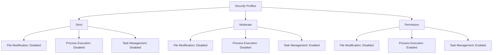
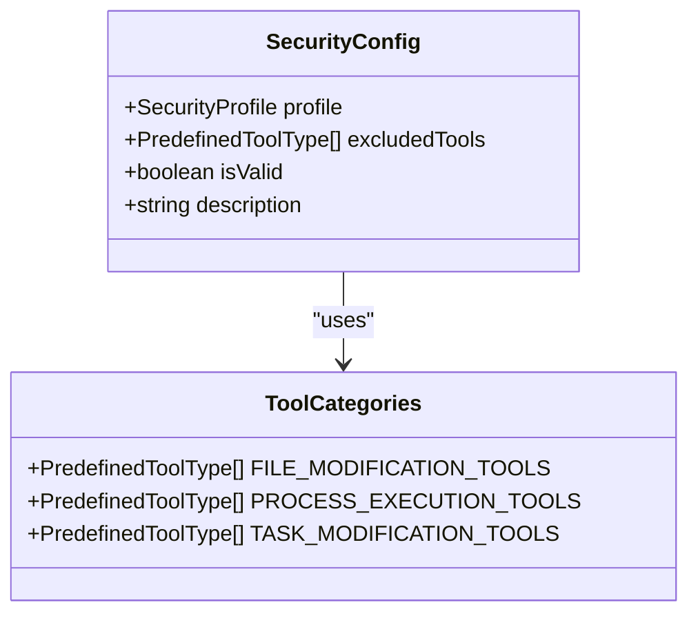
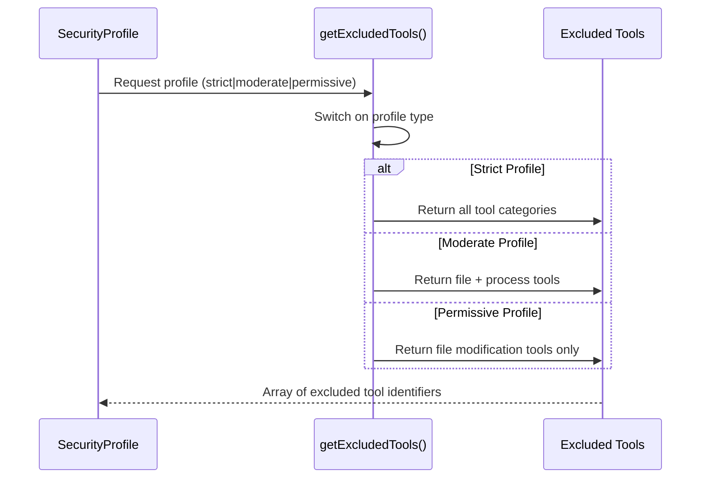

# Security Configuration

<cite>
**Referenced Files in This Document**   
- [security-config.ts](file://src/tools/security-config.ts)
- [security-config.test.ts](file://src/tools/security-config.test.ts)
- [auggie-analysis.ts](file://src/tools/auggie-analysis.ts)
- [config.ts](file://src/config.ts)
- [AUGMENT_SDK_INTEGRATION.md](file://docs/AUGMENT_SDK_INTEGRATION.md)
</cite>

## Table of Contents
1. [Introduction](#introduction)
2. [Security Profiles](#security-profiles)
3. [Tool Exclusion Mechanism](#tool-exclusion-mechanism)
4. [Principle of Least Privilege Implementation](#principle-of-least-privilege-implementation)
5. [Validation Mechanism](#validation-mechanism)
6. [Configuration Examples by Environment](#configuration-examples-by-environment)
7. [Security Configuration Description](#security-configuration-description)
8. [Extending Security Configuration](#extending-security-configuration)
9. [Integration with Auggie SDK](#integration-with-auggie-sdk)
10. [Conclusion](#conclusion)

## Introduction

The security configuration system in the Auggie security agent provides comprehensive scan hardening through a structured approach to tool exclusion and privilege management. This system ensures vulnerability scans operate in a secure, read-only mode by disabling potentially dangerous operations that could modify the codebase or execute arbitrary processes. The implementation follows three core security principles: read-only scans, process isolation, and least privilege access.

The security configuration is implemented in the `security-config.ts` module and integrates with the Auggie SDK's tool exclusion system to prevent accidental code modifications during security analysis. This documentation details the three security profiles (strict, moderate, permissive), their respective tool exclusions, and how the system validates that critical security measures are always enforced.

**Section sources**
- [security-config.ts](file://src/tools/security-config.ts#L1-L25)

## Security Profiles

The security configuration system provides three distinct security profiles that allow organizations to balance security requirements with operational needs. These profiles define different levels of tool exclusions based on the principle of least privilege, enabling appropriate security hardening for various environments.

### Strict Profile

The strict profile represents the highest security level and is the default configuration for the system. This profile disables all tools that could potentially modify files, execute processes, or alter task management. It is designed for production environments where absolute protection against any code modification is required. The strict profile ensures complete read-only operation of the security scanner, preventing any possibility of accidental or malicious changes to the codebase during analysis.

### Moderate Profile

The moderate profile provides a balanced approach to security, disabling file modification and process execution tools while allowing task management operations. This profile is suitable for staging environments where some level of task manipulation may be necessary for the analysis workflow, but file integrity and process isolation remain critical. It offers strong protection against code modifications while maintaining flexibility for task-related operations.

### Permissive Profile

The permissive profile represents the lowest security level, disabling only file modification tools while allowing process execution and task management operations. This profile is intended for development environments where developers may need greater flexibility during security analysis. While it still prevents direct code modifications, it allows the execution of processes and management of tasks, which can be useful for debugging and development purposes.



**Diagram sources**
- [security-config.ts](file://src/tools/security-config.ts#L32-L33)
- [AUGMENT_SDK_INTEGRATION.md](file://docs/AUGMENT_SDK_INTEGRATION.md#L277-L284)

**Section sources**
- [security-config.ts](file://src/tools/security-config.ts#L32-L33)
- [AUGMENT_SDK_INTEGRATION.md](file://docs/AUGMENT_SDK_INTEGRATION.md#L277-L284)

## Tool Exclusion Mechanism

The security configuration system implements a comprehensive tool exclusion mechanism that categorizes potentially dangerous operations into three distinct groups. This categorization enables granular control over which types of operations are permitted during security scans, allowing for flexible security policies based on the selected profile.

### File Modification Tools

The system identifies and excludes tools that can modify files in the codebase, ensuring read-only operation during scans. These tools include `save-file` (preventing creation of new files), `str-replace-editor` (preventing modification of existing files), and `remove-files` (preventing deletion of files). By disabling these tools, the system guarantees that security scans cannot accidentally or maliciously alter the codebase, maintaining the integrity of the repository throughout the analysis process.

### Process Execution Tools

Tools that can execute processes or commands are excluded to maintain process isolation and prevent potential security breaches. This category includes `launch-process` (preventing execution of arbitrary commands), `kill-process` (preventing termination of processes), and `write-process` (preventing writing to process stdin). Disabling these tools ensures that the security scanner operates in a sandboxed environment, unable to interact with or affect other processes on the system.

### Task Modification Tools

The system also manages tools that can modify task lists, providing control over workflow manipulation capabilities. This category includes `add_tasks`, `update_tasks`, and `reorganize_tasklist`. Depending on the security profile, these tools may be excluded to prevent unauthorized changes to the analysis workflow. This layer of control ensures that the scan process follows the intended sequence and prevents potential manipulation of the analysis tasks.



**Diagram sources**
- [security-config.ts](file://src/tools/security-config.ts#L38-L62)

**Section sources**
- [security-config.ts](file://src/tools/security-config.ts#L38-L62)
- [AUGMENT_SDK_INTEGRATION.md](file://docs/AUGMENT_SDK_INTEGRATION.md#L285-L288)

## Principle of Least Privilege Implementation

The security configuration system implements the principle of least privilege through the `getExcludedTools` function, which dynamically determines the appropriate set of excluded tools based on the selected security profile. This approach ensures that only the minimum necessary privileges are granted for the specific analysis context, reducing the attack surface and potential for unintended consequences.

### Strict Profile Implementation

In the strict profile, the system applies the most restrictive configuration by excluding all tools across all three categories: file modification, process execution, and task modification. This comprehensive exclusion ensures that the security scanner operates with the absolute minimum privileges required, effectively creating a read-only, isolated environment for vulnerability analysis. The implementation combines all predefined tool arrays using the spread operator to create a complete list of excluded tools.

### Moderate Profile Implementation

The moderate profile implements a balanced approach by excluding tools from the file modification and process execution categories while allowing task modification tools to remain active. This configuration follows the principle of least privilege by removing privileges that could compromise file integrity or system security, while retaining privileges that support workflow management. The implementation specifically includes only the file modification and process execution tool arrays, deliberately omitting the task modification tools.

### Permissive Profile Implementation

The permissive profile applies the principle of least privilege by excluding only the file modification tools, which are considered the most critical to protect codebase integrity. This minimal exclusion ensures that the primary security concern—unauthorized code changes—is addressed, while allowing other operations that may be necessary in development environments. The implementation returns only the `FILE_MODIFICATION_TOOLS` array, providing the least restrictive configuration while still maintaining essential protection.



**Diagram sources**
- [security-config.ts](file://src/tools/security-config.ts#L70-L97)

**Section sources**
- [security-config.ts](file://src/tools/security-config.ts#L70-L97)

## Validation Mechanism

The security configuration system includes a robust validation mechanism that ensures critical security tools are always excluded, regardless of the selected profile. This validation is implemented through the `validateSecurityConfig` function, which performs a critical check to confirm that all file modification tools are properly excluded from the security configuration.

### Critical Tool Validation

The validation mechanism focuses on the `FILE_MODIFICATION_TOOLS` category as the most critical security concern, as these tools directly affect codebase integrity. The `validateSecurityConfig` function checks that every tool in the `FILE_MODIFICATION_TOOLS` array is included in the excluded tools list. This ensures that even if a custom configuration is provided or the security profile is modified, the fundamental protection against code modifications remains intact.

### Validation Implementation

The validation function uses the `every` method to verify that all critical tools are present in the excluded tools array. This approach returns `true` only when every file modification tool is properly excluded, providing a comprehensive check of the security configuration. The function returns `false` if any critical tool is missing from the exclusion list, indicating an invalid security configuration that should not be used for scanning.

### Fail-Safe Design

The validation mechanism is designed with safety as the primary concern, following a fail-safe approach. If the validation fails, the system will reject the security configuration, preventing potentially dangerous scans from proceeding. This design ensures that the most critical security measures—preventing code modifications—are always enforced, even if other aspects of the configuration are customized or modified.

**Section sources**
- [security-config.ts](file://src/tools/security-config.ts#L107-L110)
- [security-config.test.ts](file://src/tools/security-config.test.ts#L92-L111)

## Configuration Examples by Environment

The security configuration system supports different environments through its three security profiles, allowing organizations to apply appropriate security levels based on the context of the analysis. This section provides examples of how to configure the security profiles for development, staging, and production environments.

### Development Environment Configuration

In development environments, the permissive profile is typically used to provide developers with maximum flexibility during security analysis. This configuration allows process execution and task management while still protecting against direct code modifications:

```typescript
import { createSecurityConfig } from './tools/security-config';

// Permissive configuration for development
const devConfig = createSecurityConfig('permissive');

const client = await Auggie.create({
  workspaceRoot: repoPath,
  excludedTools: devConfig.excludedTools,
});
```

This setup enables developers to execute processes and manage tasks during analysis, which can be valuable for debugging and understanding vulnerabilities, while still preventing accidental changes to the codebase.

### Staging Environment Configuration

For staging environments, the moderate profile provides an appropriate balance between security and functionality. This configuration disables file modification and process execution tools while allowing task management operations:

```typescript
import { createSecurityConfig } from './tools/security-config';

// Moderate configuration for staging
const stagingConfig = createSecurityConfig('moderate');

const client = await Auggie.create({
  workspaceRoot: repoPath,
  excludedTools: stagingConfig.excludedTools,
});
```

This configuration ensures that the staging environment maintains high security standards by preventing code modifications and process execution, while still allowing necessary task management for the analysis workflow.

### Production Environment Configuration

In production environments, the strict profile is recommended to provide the highest level of security. This configuration disables all modification and execution tools, ensuring complete read-only operation:

```typescript
import { createSecurityConfig } from './tools/security-config';

// Strict configuration for production (default)
const prodConfig = createSecurityConfig('strict');

const client = await Auggie.create({
  workspaceRoot: repoPath,
  excludedTools: prodConfig.excludedTools,
});
```

This setup provides maximum protection for production codebases, preventing any possibility of code modifications, process execution, or task manipulation during security scans.

**Section sources**
- [security-config.ts](file://src/tools/security-config.ts#L168-L179)
- [AUGMENT_SDK_INTEGRATION.md](file://docs/AUGMENT_SDK_INTEGRATION.md#L265-L275)

## Security Configuration Description

The system provides a human-readable description of applied security measures through the `describeSecurityConfig` function. This function analyzes the excluded tools and generates a clear, understandable description of the security configuration, making it easier for users to understand the protection level being applied.

### Description Generation

The `describeSecurityConfig` function evaluates the excluded tools array and identifies which categories of tools are disabled. It checks for the presence of file modification tools, process execution tools, and task modification tools in the excluded list, then creates a description that reflects the security measures in place. The function returns a string that clearly communicates the security posture, such as "Security: file modification disabled, process execution disabled" for a moderate profile.

### Category Detection

The description generation process uses the `some` method to check if any tools from each category are excluded. This approach efficiently determines whether file modification, process execution, or task modification capabilities are disabled. The function then constructs a description by combining the relevant categories, providing a comprehensive overview of the security configuration.

### Default and Edge Cases

The function handles edge cases appropriately, returning "No security restrictions" when no tools are excluded. This clear messaging helps users immediately understand when a configuration provides minimal protection. For the default strict profile, the description will include all three categories, clearly communicating the comprehensive nature of the security measures.

**Section sources**
- [security-config.ts](file://src/tools/security-config.ts#L118-L146)

## Extending Security Configuration

The security configuration system is designed to be extensible, allowing organizations to customize the security measures based on their specific requirements. This extensibility enables integration with organizational policies, additional security controls, and specialized analysis needs.

### Custom Tool Exclusions

Organizations can extend the security configuration by defining additional tool exclusions beyond the predefined categories. This can be achieved by creating custom security profiles or modifying the existing tool arrays. For example, an organization might want to exclude additional tools related to network operations or database access based on their specific security policies.

### Profile Customization

While the system provides three standard profiles, organizations can create custom profiles by implementing their own logic for tool exclusion. This can be done by creating a new function that returns a custom array of excluded tools based on specific criteria. The custom profiles can then be integrated with the existing configuration system to provide tailored security measures for different use cases.

### Integration with Organizational Policies

The security configuration can be extended to integrate with organizational security policies and compliance requirements. This might include adding validation checks for specific regulatory requirements, implementing audit logging for security configuration changes, or integrating with centralized policy management systems. The modular design of the security configuration system facilitates these extensions while maintaining the core security principles.

**Section sources**
- [security-config.ts](file://src/tools/security-config.ts#L168-L179)

## Integration with Auggie SDK

The security configuration system integrates directly with the Auggie SDK's tool exclusion mechanism to enforce security policies during vulnerability scanning. This integration ensures that the configured security measures are applied at the SDK level, providing a robust defense against unauthorized operations.

### Exclusion Parameter Usage

The security configuration is applied by passing the excluded tools array to the Auggie SDK during client creation. The `excludedTools` parameter in the Auggie configuration accepts the array of tool identifiers returned by the security configuration functions. This direct integration ensures that the SDK itself prevents the execution of excluded tools, providing a reliable enforcement mechanism.

### Configuration Workflow

The integration follows a clear workflow: first, the security configuration is created using the `createSecurityConfig` function with the desired profile; then, the excluded tools from this configuration are passed to the Auggie SDK. This workflow ensures that security policies are consistently applied across all scans and that the principle of least privilege is maintained throughout the analysis process.

### Observability Integration

The security configuration integrates with the system's observability framework, ensuring that security-related operations are properly tracked and logged. Tool exclusions and security configuration applications are recorded in the tracing system, providing visibility into security enforcement and enabling audit capabilities. This integration supports both security and operational requirements by maintaining comprehensive logs of security-related activities.

**Section sources**
- [auggie-analysis.ts](file://src/tools/auggie-analysis.ts#L164-L193)
- [AUGMENT_SDK_INTEGRATION.md](file://docs/AUGMENT_SDK_INTEGRATION.md#L265-L275)

## Conclusion

The security configuration system in the Auggie security agent provides a comprehensive framework for scan hardening through its three security profiles (strict, moderate, permissive) and sophisticated tool exclusion mechanism. By implementing the principle of least privilege, the system ensures that vulnerability scans operate with the minimum necessary privileges, reducing the risk of accidental or malicious code modifications.

The system's design emphasizes both security and flexibility, allowing organizations to apply appropriate security levels based on their environment and requirements. The strict profile provides maximum protection for production environments, while the moderate and permissive profiles offer balanced approaches for staging and development contexts. The validation mechanism ensures that critical security measures are always enforced, providing a fail-safe approach to configuration integrity.

The integration with the Auggie SDK's tool exclusion system creates a robust enforcement mechanism, while the human-readable description function enhances usability and transparency. The extensible design allows organizations to customize the security configuration to meet their specific needs, making it a versatile solution for various security requirements.

By following the documented configuration examples and best practices, organizations can effectively implement security hardening for their vulnerability scanning processes, ensuring both the integrity of their codebases and the reliability of their security analyses.