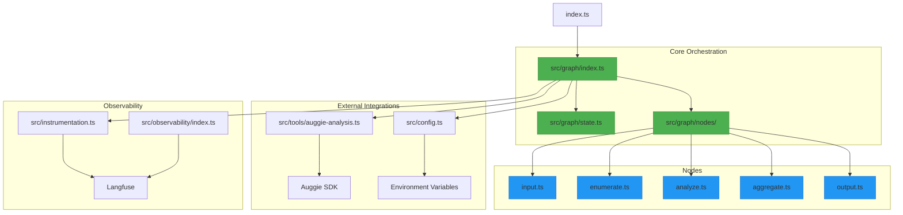
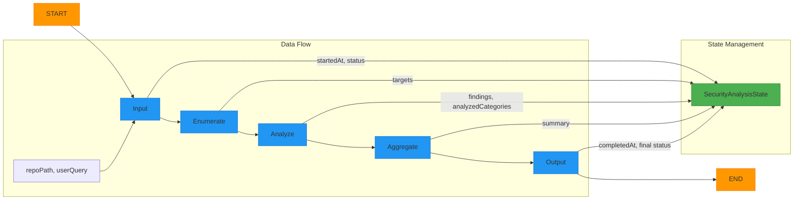
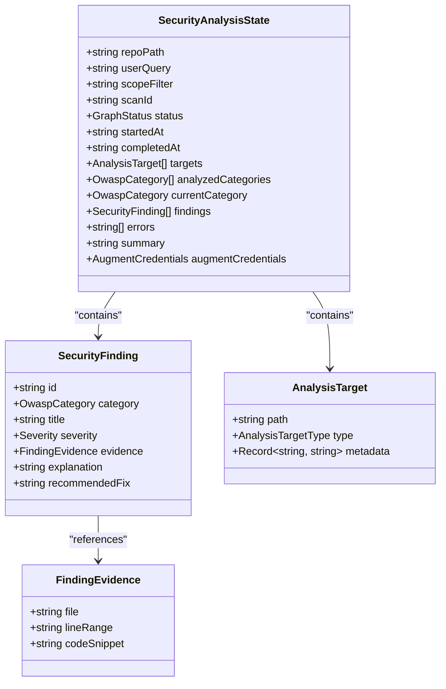
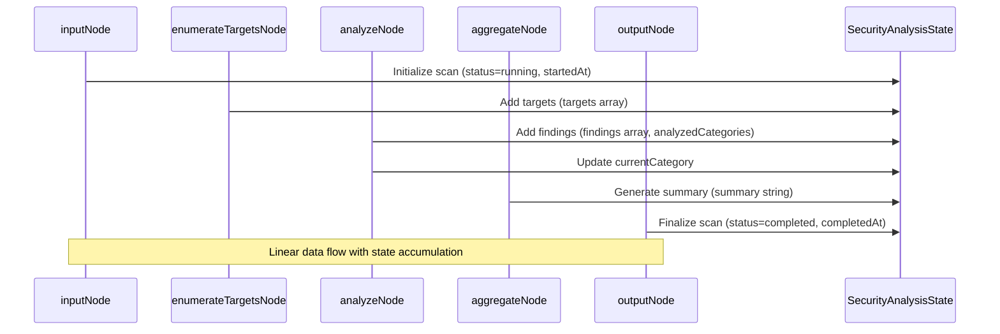
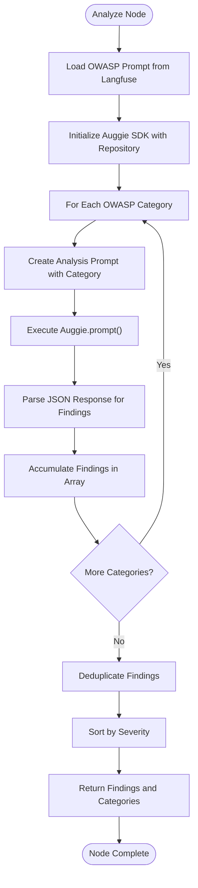

# Architecture and Design

<cite>
**Referenced Files in This Document**   
- [index.ts](file://src/graph/index.ts)
- [state.ts](file://src/graph/state.ts)
- [input.ts](file://src/graph/nodes/input.ts)
- [enumerate.ts](file://src/graph/nodes/enumerate.ts)
- [analyze.ts](file://src/graph/nodes/analyze.ts)
- [aggregate.ts](file://src/graph/nodes/aggregate.ts)
- [output.ts](file://src/graph/nodes/output.ts)
- [auggie-analysis.ts](file://src/tools/auggie-analysis.ts)
- [config.ts](file://src/config.ts)
- [instrumentation.ts](file://src/instrumentation.ts)
- [index.ts](file://index.ts)
</cite>

## Table of Contents
1. [Introduction](#introduction)
2. [Project Structure](#project-structure)
3. [Core Components](#core-components)
4. [Architecture Overview](#architecture-overview)
5. [Detailed Component Analysis](#detailed-component-analysis)
6. [Dependency Analysis](#dependency-analysis)
7. [Performance Considerations](#performance-considerations)
8. [Troubleshooting Guide](#troubleshooting-guide)
9. [Conclusion](#conclusion)

## Introduction
This document provides comprehensive architectural documentation for the security analysis workflow and state machine orchestration in the GraphGuard system. The system implements a five-node security analysis pipeline using LangGraph's StateGraph to manage the workflow: input → enumerate → analyze → aggregate → output. This architecture enables systematic OWASP Top 10 vulnerability detection in codebases through a stateful, observable, and extensible design pattern. The documentation explains the StateGraph implementation, state management schema, data flow between nodes, failure handling mechanisms, and integration with external services like the Auggie SDK.

## Project Structure
The project follows a modular structure with clear separation of concerns. The core security analysis workflow is implemented in the `src/graph` directory, which contains nodes, state management, and graph orchestration. External tool integrations are located in `src/tools`, while observability and configuration are handled in dedicated modules. The system uses LangGraph for stateful workflow orchestration, Langfuse for comprehensive observability, and the Auggie SDK for AI-powered security analysis.



**Diagram sources**
- [index.ts](file://src/graph/index.ts)
- [state.ts](file://src/graph/state.ts)
- [input.ts](file://src/graph/nodes/input.ts)
- [enumerate.ts](file://src/graph/nodes/enumerate.ts)
- [analyze.ts](file://src/graph/nodes/analyze.ts)
- [aggregate.ts](file://src/graph/nodes/aggregate.ts)
- [output.ts](file://src/graph/nodes/output.ts)
- [auggie-analysis.ts](file://src/tools/auggie-analysis.ts)
- [config.ts](file://src/config.ts)
- [instrumentation.ts](file://src/instrumentation.ts)

**Section sources**
- [index.ts](file://src/graph/index.ts)
- [state.ts](file://src/graph/state.ts)

## Core Components
The security analysis system is built around five core nodes orchestrated by LangGraph's StateGraph. Each node represents a distinct phase in the security analysis workflow, with state passed between nodes through a shared state object. The input node initializes the scan, enumerate identifies target files for analysis, analyze performs vulnerability detection using the Auggie SDK, aggregate compiles findings into a structured report, and output finalizes the scan. The state schema defines all data that persists throughout the workflow, including scan metadata, analysis targets, findings, and execution status.

**Section sources**
- [index.ts](file://src/graph/index.ts)
- [state.ts](file://src/graph/state.ts)
- [input.ts](file://src/graph/nodes/input.ts)
- [enumerate.ts](file://src/graph/nodes/enumerate.ts)
- [analyze.ts](file://src/graph/nodes/analyze.ts)
- [aggregate.ts](file://src/graph/nodes/aggregate.ts)
- [output.ts](file://src/graph/nodes/output.ts)

## Architecture Overview
The security analysis workflow is implemented as a linear state machine using LangGraph's StateGraph. The architecture follows a pipeline pattern where each node processes the shared state and passes it to the next node. The StateGraph manages state transitions, error handling, and execution flow. The system uses a rich state schema that accumulates data throughout the workflow, from initial scan parameters to final findings and reports. Comprehensive observability is integrated at every level using Langfuse, providing detailed tracing of the entire analysis process.



**Diagram sources**
- [index.ts](file://src/graph/index.ts)
- [state.ts](file://src/graph/state.ts)

## Detailed Component Analysis

### State Management and Schema Design
The SecurityAnalysisState schema is the backbone of the workflow, defining all data that persists throughout the analysis process. The schema uses LangGraph's Annotation system to define state variables with specific reducers that determine how values are updated when multiple nodes modify the same field. For example, the 'findings' field uses a concatenation reducer to accumulate findings from multiple analysis phases, while the 'status' field uses a simple overwrite reducer since only one node should update it at a time.



**Diagram sources**
- [state.ts](file://src/graph/state.ts)

**Section sources**
- [state.ts](file://src/graph/state.ts)

### Node Implementation and Data Flow
Each node in the workflow follows a consistent pattern: it receives the current state, performs its specific function, and returns a partial state update. The nodes are designed to be stateless functions that only modify the shared state object. This functional approach makes the workflow predictable and easier to test. The data flow between nodes is linear and deterministic, with each node building upon the work of the previous node.



**Diagram sources**
- [index.ts](file://src/graph/index.ts)
- [input.ts](file://src/graph/nodes/input.ts)
- [enumerate.ts](file://src/graph/nodes/enumerate.ts)
- [analyze.ts](file://src/graph/nodes/analyze.ts)
- [aggregate.ts](file://src/graph/nodes/aggregate.ts)
- [output.ts](file://src/graph/nodes/output.ts)

### Input Node Analysis
The input node serves as the entry point for the security analysis workflow. It initializes the scan by setting the status to 'running' and recording the start time. This node also captures the initial input parameters for observability purposes, creating a trace that will contain all subsequent operations in the workflow. The input node does not modify the core analysis data but establishes the execution context.

**Section sources**
- [input.ts](file://src/graph/nodes/input.ts)

### Enumerate Node Analysis
The enumerate node discovers and categorizes files within the target repository that should be analyzed for security vulnerabilities. It recursively scans the repository, filtering out directories like 'node_modules' and identifying files based on extensions and path patterns. The node classifies targets as routes, controllers, files, or dependencies, and applies metadata tags based on security-relevant patterns in the file paths. This prioritized list of targets guides the subsequent analysis phase.

**Section sources**
- [enumerate.ts](file://src/graph/nodes/enumerate.ts)

### Analyze Node Analysis
The analyze node performs the core security analysis using the Auggie SDK. It iterates through predefined OWASP categories, using the Auggie SDK to search the codebase and identify vulnerabilities. The node uses Langfuse prompt management to retrieve category-specific analysis prompts, which guide the AI in detecting specific types of vulnerabilities. Findings are collected through a structured reporting mechanism and deduplicated before being added to the shared state.



**Diagram sources**
- [analyze.ts](file://src/graph/nodes/analyze.ts)
- [auggie-analysis.ts](file://src/tools/auggie-analysis.ts)

**Section sources**
- [analyze.ts](file://src/graph/nodes/analyze.ts)
- [auggie-analysis.ts](file://src/tools/auggie-analysis.ts)

### Aggregate Node Analysis
The aggregate node compiles the findings from the analysis phase into a human-readable security report. It groups findings by severity and OWASP category, generating a structured summary that includes detailed information about each vulnerability. The summary follows a markdown format with sections for overall statistics, severity breakdown, category distribution, and individual finding details. This comprehensive report provides both high-level insights and specific remediation guidance.

**Section sources**
- [aggregate.ts](file://src/graph/nodes/aggregate.ts)

### Output Node Analysis
The output node finalizes the security analysis scan by recording the completion time and determining the final status. If any errors were encountered during the workflow, the status is set to 'failed'; otherwise, it is set to 'completed'. This node serves as the exit point for the workflow, ensuring that all scan metadata is properly recorded before the process ends.

**Section sources**
- [output.ts](file://src/graph/nodes/output.ts)

## Dependency Analysis
The security analysis system has a well-defined dependency structure that separates concerns and enables extensibility. The core workflow depends on LangGraph for orchestration, Langfuse for observability, and the Auggie SDK for AI-powered analysis. Configuration is managed through environment variables with validation, ensuring that required credentials are available before execution. The modular design allows for easy extension of the analysis capabilities by adding new nodes or modifying existing ones.

```mermaid
graph TD
A[Security Analysis Graph] --> B[LangGraph]
A --> C[Langfuse]
A --> D[Auggie SDK]
A --> E[Node.js FS Module]
B --> F[@langchain/langgraph]
C --> G[@langfuse/tracing]
C --> H[@langfuse/otel]
D --> I[@augmentcode/auggie-sdk]
E --> J[fs, path]
K[Configuration] --> L[Environment Variables]
K --> M[Zod Validation]
A --> K
style A fill:#4CAF50,stroke:#388E3C
style B fill:#FFC107,stroke:#FFA000
style C fill:#FFC107,stroke:#FFA000
style D fill:#FFC107,stroke:#FFA000
style E fill:#FFC107,stroke:#FFA000
style K fill:#9C27B0,stroke:#7B1FA2
```

**Diagram sources**
- [index.ts](file://src/graph/index.ts)
- [state.ts](file://src/graph/state.ts)
- [auggie-analysis.ts](file://src/tools/auggie-analysis.ts)
- [config.ts](file://src/config.ts)
- [instrumentation.ts](file://src/instrumentation.ts)

**Section sources**
- [index.ts](file://src/graph/index.ts)
- [state.ts](file://src/graph/state.ts)
- [auggie-analysis.ts](file://src/tools/auggie-analysis.ts)
- [config.ts](file://src/config.ts)
- [instrumentation.ts](file://src/instrumentation.ts)

## Performance Considerations
The security analysis workflow is designed with performance and scalability in mind. The enumerate phase efficiently scans large codebases by skipping common exclusion directories and focusing on relevant file types. The analyze phase processes OWASP categories sequentially to manage API rate limits and resource usage, though this could be parallelized for improved performance on large repositories. The state management system uses efficient data structures and reducers to minimize memory overhead during state updates. For very large codebases, the system could be extended with incremental analysis capabilities to avoid reprocessing unchanged files.

## Troubleshooting Guide
When troubleshooting issues with the security analysis workflow, start by checking the configuration and credentials. The system validates environment variables at startup, so missing or invalid credentials will prevent execution. For analysis issues, examine the Langfuse traces to identify which node encountered problems. Common issues include repository path errors in the enumerate phase, API connectivity problems in the analyze phase, and rate limiting with the Auggie SDK. The system's comprehensive observability makes it possible to pinpoint failures and understand the context in which they occurred.

**Section sources**
- [config.ts](file://src/config.ts)
- [instrumentation.ts](file://src/instrumentation.ts)
- [enumerate.ts](file://src/graph/nodes/enumerate.ts)
- [auggie-analysis.ts](file://src/tools/auggie-analysis.ts)

## Conclusion
The GraphGuard security analysis system implements a robust, observable, and extensible workflow for detecting OWASP Top 10 vulnerabilities in codebases. By leveraging LangGraph's StateGraph, the system maintains a consistent state throughout the analysis process, enabling complex data accumulation and transformation across multiple phases. The integration with the Auggie SDK provides powerful AI-driven analysis capabilities, while Langfuse ensures comprehensive observability for debugging and optimization. The modular design allows for easy extension and customization, making it adaptable to various security analysis requirements. This architecture represents a significant advancement over simpler orchestration patterns by providing state persistence, rich observability, and seamless integration of AI-powered analysis tools.