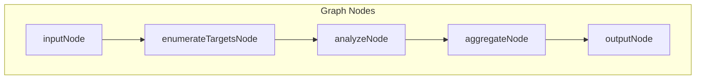
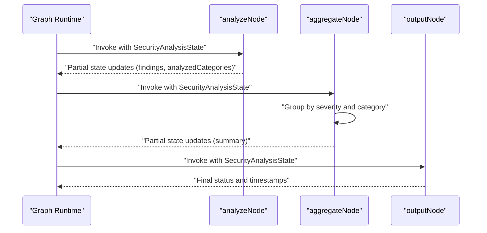
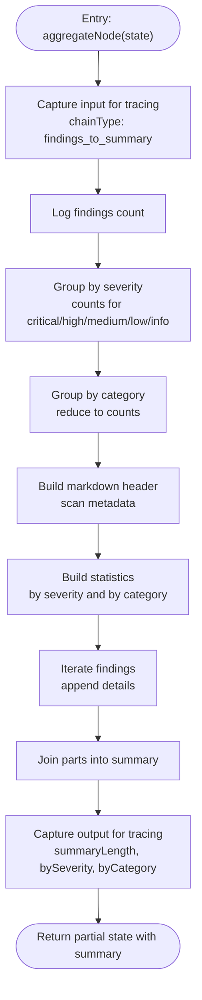
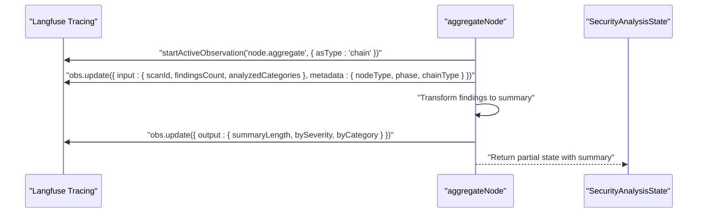
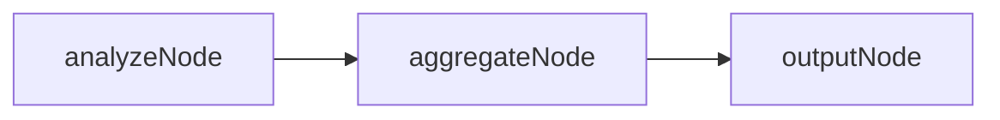
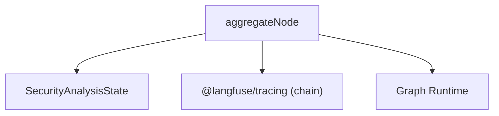

# Aggregate Findings Node Implementation

<cite>
**Referenced Files in This Document**
- [aggregate.ts](file://src/graph/nodes/aggregate.ts)
- [index.ts](file://src/graph/nodes/index.ts)
- [state.ts](file://src/graph/state.ts)
- [index.ts](file://src/graph/index.ts)
- [observability/index.ts](file://src/observability/index.ts)
- [instrumentation.ts](file://src/instrumentation.ts)
- [analyze.ts](file://src/graph/nodes/analyze.ts)
- [output.ts](file://src/graph/nodes/output.ts)
</cite>

## Table of Contents
1. [Introduction](#introduction)
2. [Project Structure](#project-structure)
3. [Core Components](#core-components)
4. [Architecture Overview](#architecture-overview)
5. [Detailed Component Analysis](#detailed-component-analysis)
6. [Dependency Analysis](#dependency-analysis)
7. [Performance Considerations](#performance-considerations)
8. [Troubleshooting Guide](#troubleshooting-guide)
9. [Conclusion](#conclusion)
10. [Appendices](#appendices)

## Introduction
This document explains the aggregateNode function that compiles individual security findings into a comprehensive markdown report. It covers how findings are grouped by severity and OWASP category using reduce operations, how the structured report is generated with summary sections and remediation guidance, and how the node uses chain-type observability to link findings to summary generation. It also describes the markdown construction for scan metadata, statistics, and individual finding details, memory considerations for large finding sets, and how summary length is tracked in tracing. Finally, it outlines extensibility options for custom report formats and integration with external reporting systems.

## Project Structure
The aggregateNode resides in the graph nodes layer and participates in a linear LangGraph pipeline. The nodes are exported via a barrel export and orchestrated by the graph runtime.

**Diagram sources**
- [index.ts](file://src/graph/nodes/index.ts#L1-L14)
- [index.ts](file://src/graph/index.ts#L18-L48)

**Section sources**
- [index.ts](file://src/graph/nodes/index.ts#L1-L14)
- [index.ts](file://src/graph/index.ts#L18-L48)

## Core Components
- aggregateNode: Transforms findings into a markdown summary, groups by severity and category, and returns a summary string.
- SecurityAnalysisState: Defines the shared state schema, including findings and summary fields.
- Observability wrappers: Provide typed observation types and chain-type tracing for linking data transformations.

Key responsibilities:
- Group findings by severity and by OWASP category.
- Construct a markdown report with scan metadata, statistics, and finding details.
- Track summary length for observability.
- Use chain-type tracing to link the transformation from findings to summary.

**Section sources**
- [aggregate.ts](file://src/graph/nodes/aggregate.ts#L12-L117)
- [state.ts](file://src/graph/state.ts#L120-L137)
- [observability/index.ts](file://src/observability/index.ts#L235-L252)

## Architecture Overview
The aggregateNode sits at the end of the linear graph pipeline. It receives the accumulated findings from previous nodes, performs grouping and report generation, and prepares the final summary for downstream output.

**Diagram sources**
- [index.ts](file://src/graph/index.ts#L18-L48)
- [analyze.ts](file://src/graph/nodes/analyze.ts#L44-L156)
- [aggregate.ts](file://src/graph/nodes/aggregate.ts#L12-L117)
- [output.ts](file://src/graph/nodes/output.ts#L12-L59)

## Detailed Component Analysis

### aggregateNode: Data Transformation and Report Generation
aggregateNode performs:
- Input capture for tracing with chain type and metadata indicating the transformation from findings to summary.
- Severity grouping using filter counts for critical, high, medium, low, and info.
- Category grouping using reduce to count occurrences per OWASP category.
- Markdown report construction with:
  - Scan metadata (scan ID, repository, query).
  - Summary statistics (total findings, severity breakdown, category breakdown).
  - Finding details (title, ID, category, severity, location, explanation, recommended fix).
- Output capture for tracing with summary length and breakdown metrics.
- Returns a partial state containing the generated summary.

**Diagram sources**
- [aggregate.ts](file://src/graph/nodes/aggregate.ts#L12-L117)

**Section sources**
- [aggregate.ts](file://src/graph/nodes/aggregate.ts#L12-L117)

### Data Transformation Details
- Severity grouping: Counts are derived by filtering findings by severity.
- Category grouping: A reduce operation aggregates counts per category.
- Markdown construction: Uses string arrays and join to produce a readable report with headers, lists, and horizontal rules between entries.

Complexity:
- Severity grouping: O(n) with five filter passes.
- Category grouping: O(n) with a single reduce pass.
- Report assembly: O(n) for iterating findings plus O(k) for category entries, where k is the number of distinct categories.

Memory considerations:
- The current implementation constructs the entire summary string in memory. For very large finding sets, consider streaming or chunked generation to limit peak memory usage.

**Section sources**
- [aggregate.ts](file://src/graph/nodes/aggregate.ts#L34-L50)
- [aggregate.ts](file://src/graph/nodes/aggregate.ts#L52-L96)

### Markdown Report Construction
The report includes:
- Header with scan metadata (scan ID, repository path, user query).
- Summary section with totals and breakdowns by severity and category.
- Findings section with detailed entries for each finding, including explanation and recommended fix.

Formatting:
- Uses markdown headers, bullet lists, and thematic breaks for readability.

**Section sources**
- [aggregate.ts](file://src/graph/nodes/aggregate.ts#L52-L96)

### Observability and Tracing
- The node uses chain-type tracing to indicate that it transforms findings into a summary.
- Input metadata captures scan ID, findings count, and analyzed categories.
- Output metadata captures summary length and breakdown metrics for downstream analysis.

**Diagram sources**
- [aggregate.ts](file://src/graph/nodes/aggregate.ts#L15-L30)
- [aggregate.ts](file://src/graph/nodes/aggregate.ts#L101-L109)
- [observability/index.ts](file://src/observability/index.ts#L235-L252)

**Section sources**
- [aggregate.ts](file://src/graph/nodes/aggregate.ts#L15-L30)
- [aggregate.ts](file://src/graph/nodes/aggregate.ts#L101-L109)
- [observability/index.ts](file://src/observability/index.ts#L235-L252)

### Relationship to Other Nodes
- analyzeNode produces findings and analyzed categories, which aggregateNode consumes.
- outputNode finalizes the scan and sets status and timestamps.

**Diagram sources**
- [analyze.ts](file://src/graph/nodes/analyze.ts#L44-L156)
- [aggregate.ts](file://src/graph/nodes/aggregate.ts#L12-L117)
- [output.ts](file://src/graph/nodes/output.ts#L12-L59)

**Section sources**
- [analyze.ts](file://src/graph/nodes/analyze.ts#L44-L156)
- [aggregate.ts](file://src/graph/nodes/aggregate.ts#L12-L117)
- [output.ts](file://src/graph/nodes/output.ts#L12-L59)

## Dependency Analysis
aggregateNode depends on:
- SecurityAnalysisState for input and output typing.
- Langfuse tracing for chain-type observations.
- The graph runtime for orchestrating node execution.

**Diagram sources**
- [aggregate.ts](file://src/graph/nodes/aggregate.ts#L12-L117)
- [state.ts](file://src/graph/state.ts#L120-L137)
- [index.ts](file://src/graph/index.ts#L18-L48)

**Section sources**
- [aggregate.ts](file://src/graph/nodes/aggregate.ts#L12-L117)
- [state.ts](file://src/graph/state.ts#L120-L137)
- [index.ts](file://src/graph/index.ts#L18-L48)

## Performance Considerations
- Current implementation builds the entire summary string in memory. For very large finding sets, consider:
  - Streaming the markdown output to a writer or buffer to reduce peak memory.
  - Chunking the findings iteration to periodically flush or emit segments.
  - Limiting the number of included findings in the summary to a configurable cap while retaining counts.
- Severity and category grouping are O(n). For extremely large datasets, consider precomputing counts in analyzeNode and passing them to aggregateNode to minimize recomputation.

[No sources needed since this section provides general guidance]

## Troubleshooting Guide
Common issues and resolutions:
- Missing summary in output: Ensure aggregateNode returns a summary field in the partial state. Verify that the summary is non-empty and that the graph runtime extracts it into the final output.
- Incorrect severity/category counts: Validate that findings have correct severity and category values. Confirm that grouping filters and reduce accumulator are functioning as expected.
- Tracing anomalies: Confirm that chain-type observations are configured and that input/output metadata is captured. Check that summary length is recorded for observability.

**Section sources**
- [aggregate.ts](file://src/graph/nodes/aggregate.ts#L101-L109)
- [state.ts](file://src/graph/state.ts#L120-L137)

## Conclusion
The aggregateNode function is responsible for transforming raw findings into a human-readable markdown report. It groups findings by severity and OWASP category, constructs a structured summary with scan metadata and remediation guidance, and records summary length for observability. The node leverages chain-type tracing to link the transformation from findings to summary, enabling clear visibility into the aggregation process. For large-scale scans, consider streaming or chunked generation to manage memory usage effectively.

[No sources needed since this section summarizes without analyzing specific files]

## Appendices

### Extensibility Options
- Custom report formats: The markdown construction can be adapted to support alternative formats (e.g., JSON, HTML) by introducing a formatter abstraction and pluggable renderers.
- External reporting systems: Integrate with external systems by emitting a normalized structure alongside the markdown summary, enabling downstream processors to export to platforms such as JIRA, GitHub Issues, or security dashboards.
- Metrics and analytics: Use the recorded summary length and breakdown metrics for analytics dashboards and trend analysis.

[No sources needed since this section provides general guidance]