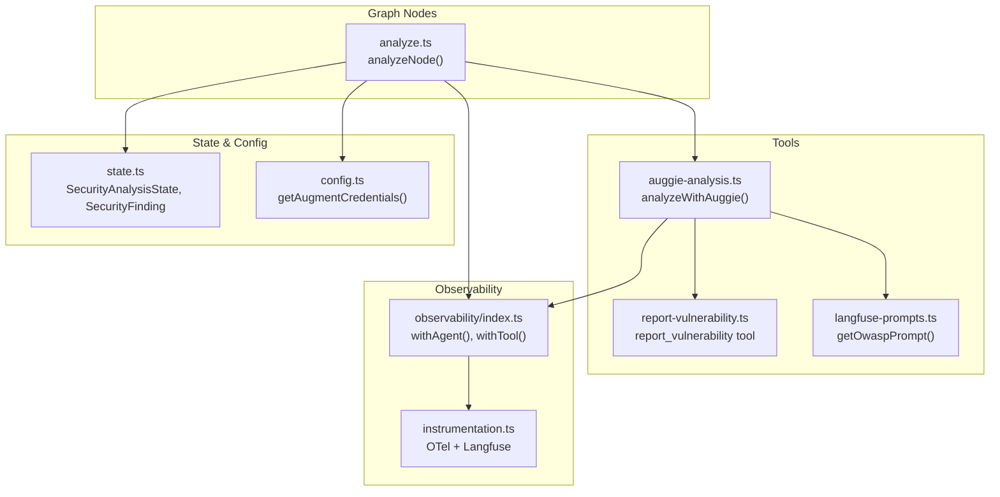
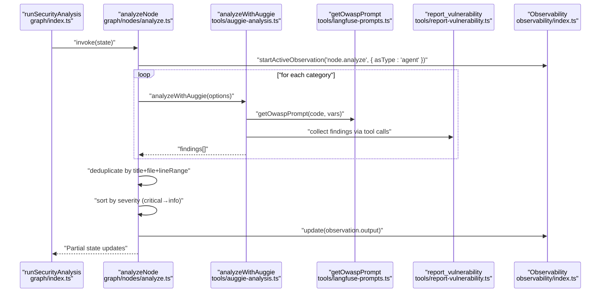
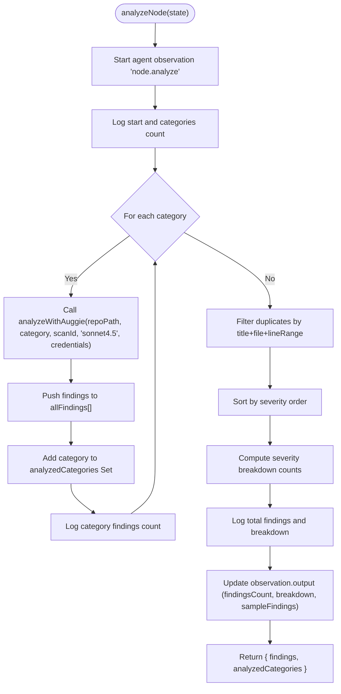
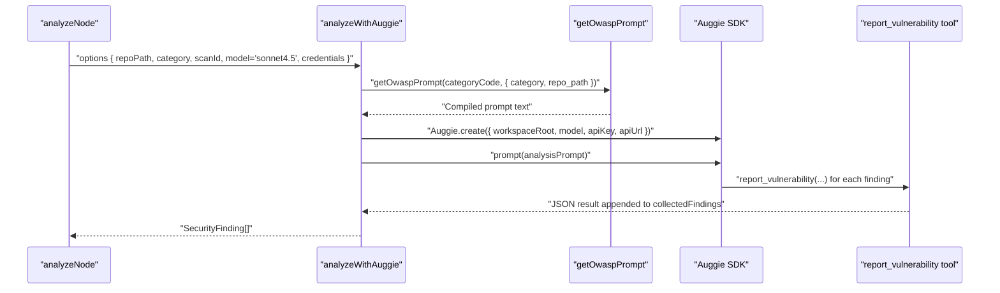
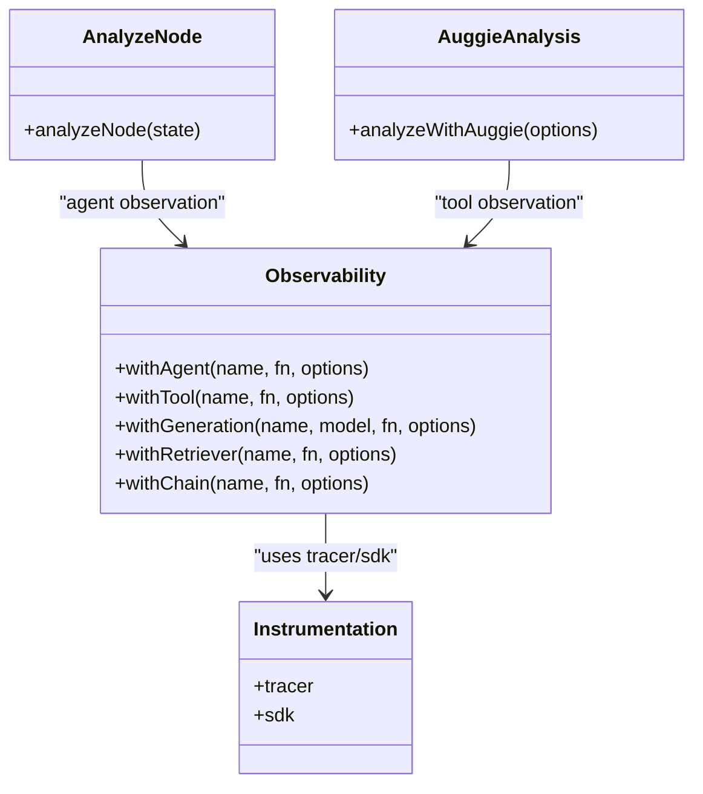
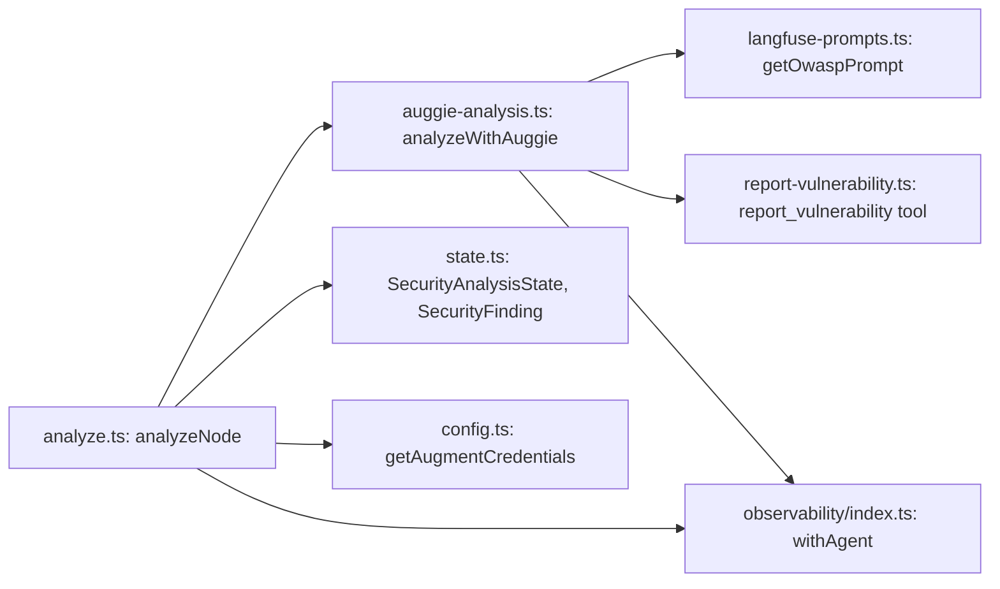

# Analyze Node Implementation

<cite>
**Referenced Files in This Document**
- [analyze.ts](file://src/graph/nodes/analyze.ts)
- [auggie-analysis.ts](file://src/tools/auggie-analysis.ts)
- [observability/index.ts](file://src/observability/index.ts)
- [state.ts](file://src/graph/state.ts)
- [config.ts](file://src/config.ts)
- [langfuse-prompts.ts](file://src/tools/langfuse-prompts.ts)
- [report-vulnerability.ts](file://src/tools/report-vulnerability.ts)
- [instrumentation.ts](file://src/instrumentation.ts)
- [index.ts](file://src/graph/index.ts)
- [test-observability.ts](file://scripts/test-observability.ts)
</cite>

## Table of Contents
1. [Introduction](#introduction)
2. [Project Structure](#project-structure)
3. [Core Components](#core-components)
4. [Architecture Overview](#architecture-overview)
5. [Detailed Component Analysis](#detailed-component-analysis)
6. [Dependency Analysis](#dependency-analysis)
7. [Performance Considerations](#performance-considerations)
8. [Troubleshooting Guide](#troubleshooting-guide)
9. [Conclusion](#conclusion)

## Introduction
This document explains the analyzeNode function that performs AI-powered security analysis across OWASP Top 10 categories using the Auggie SDK. It describes the iterative process where each category is analyzed separately via analyzeWithAuggie with the 'sonnet4.5' model, how findings are aggregated, deduplicated, and sorted by severity, and how observability is implemented using agent-type observations and Langfuse. It also covers severity breakdown calculation, category tracking with a Set, integration with augmentCredentials for authentication, and how console logging provides visibility into per-category analysis progress.

## Project Structure
The analyzeNode function resides in the graph nodes layer and orchestrates Auggie-based analysis across multiple OWASP categories. It integrates with:
- Auggie SDK for orchestration and tool execution
- Langfuse for prompt retrieval and observability
- Security state types and credentials extraction
- Tooling for reporting structured findings

**Diagram sources**
- [analyze.ts](file://src/graph/nodes/analyze.ts#L1-L156)
- [auggie-analysis.ts](file://src/tools/auggie-analysis.ts#L1-L310)
- [report-vulnerability.ts](file://src/tools/report-vulnerability.ts#L1-L154)
- [langfuse-prompts.ts](file://src/tools/langfuse-prompts.ts#L1-L211)
- [observability/index.ts](file://src/observability/index.ts#L1-L411)
- [instrumentation.ts](file://src/instrumentation.ts#L1-L141)
- [state.ts](file://src/graph/state.ts#L1-L173)
- [config.ts](file://src/config.ts#L1-L153)

**Section sources**
- [analyze.ts](file://src/graph/nodes/analyze.ts#L1-L156)
- [index.ts](file://src/graph/index.ts#L1-L153)

## Core Components
- analyzeNode: Orchestrates iterative analysis across OWASP categories, aggregates findings, deduplicates, sorts by severity, and captures observability.
- analyzeWithAuggie: Executes Auggie SDK analysis for a single category, retrieves prompts, initializes Auggie, and parses structured findings.
- Observability wrappers: withAgent and withTool provide agent-type orchestration and tool-type tracing for Auggie operations.
- State and types: SecurityAnalysisState defines the shared state, SecurityFinding defines the structured output, and OwaspCategory enumerates categories.
- Credentials: getAugmentCredentials extracts validated Augment credentials for Auggie SDK authentication.
- Prompt management: getOwaspPrompt fetches and compiles Langfuse prompts for each category.

**Section sources**
- [analyze.ts](file://src/graph/nodes/analyze.ts#L1-L156)
- [auggie-analysis.ts](file://src/tools/auggie-analysis.ts#L1-L310)
- [observability/index.ts](file://src/observability/index.ts#L1-L411)
- [state.ts](file://src/graph/state.ts#L1-L173)
- [config.ts](file://src/config.ts#L1-L153)
- [langfuse-prompts.ts](file://src/tools/langfuse-prompts.ts#L1-L211)
- [report-vulnerability.ts](file://src/tools/report-vulnerability.ts#L1-L154)

## Architecture Overview
The analyzeNode function is part of a linear graph pipeline that moves from input to enumeration, analysis, aggregation, and output. The analyze node specifically:
- Starts an agent-type observation to track orchestration
- Iterates over a fixed set of OWASP categories
- Calls analyzeWithAuggie for each category using the 'sonnet4.5' model
- Aggregates, deduplicates, and sorts findings
- Updates the agent observation with output and sample findings

**Diagram sources**
- [index.ts](file://src/graph/index.ts#L56-L145)
- [analyze.ts](file://src/graph/nodes/analyze.ts#L44-L155)
- [auggie-analysis.ts](file://src/tools/auggie-analysis.ts#L119-L310)
- [langfuse-prompts.ts](file://src/tools/langfuse-prompts.ts#L197-L211)
- [report-vulnerability.ts](file://src/tools/report-vulnerability.ts#L63-L154)
- [observability/index.ts](file://src/observability/index.ts#L257-L272)

## Detailed Component Analysis

### analyzeNode: AI-powered OWASP analysis orchestration
- Purpose: Perform iterative security analysis across selected OWASP categories using Auggie SDK with 'sonnet4.5'.
- Input: SecurityAnalysisState containing repoPath, scanId, targets, and augmentCredentials.
- Iterative analysis:
  - Defines a prioritized list of categories to analyze.
  - For each category, calls analyzeWithAuggie with model 'sonnet4.5' and credentials from state.
  - Accumulates findings and tracks analyzed categories using a Set.
- Aggregation and deduplication:
  - Merges findings from all categories.
  - Deduplicates by title + file + lineRange to avoid repeated entries.
- Sorting:
  - Sorts findings by severity using a predefined order: critical, high, medium, low, info.
- Severity breakdown:
  - Counts occurrences per severity level for reporting.
- Observability:
  - Starts an agent-type observation named 'node.analyze'.
  - Captures input metadata (scanId, repoPath, categories, targetsCount).
  - Updates output with findingsCount, severityBreakdown, analyzedCategories, and sampleFindings.
- Console logging:
  - Logs start, category progress, and final counts/breakdown for visibility.

**Diagram sources**
- [analyze.ts](file://src/graph/nodes/analyze.ts#L44-L155)

**Section sources**
- [analyze.ts](file://src/graph/nodes/analyze.ts#L23-L155)

### analyzeWithAuggie: Auggie SDK orchestration per category
- Purpose: Execute Auggie-based analysis for a single OWASP category.
- Credential handling:
  - Uses validated Augment credentials extracted from config.
  - Initializes Auggie with apiKey and apiUrl.
- Prompt retrieval:
  - Fetches the appropriate OWASP prompt from Langfuse using getOwaspPrompt(categoryCode, variables).
- Execution:
  - Builds a structured prompt requesting JSON findings.
  - Invokes Auggie.client.prompt() and parses the response into SecurityFinding[].
- Tool collection:
  - Uses the report_vulnerability tool to collect structured findings.
  - Clears previous findings before analysis to avoid cross-category contamination.
- Observability:
  - Wraps creation and prompting with tool observations.
  - Sets attributes for scanId, category, repoPath, model, prompt metadata.
- Error handling:
  - Categorizes APIError and BlobTooLargeError.
  - Records exceptions and sets span status accordingly.
- Console logging:
  - Logs credential usage, API URL, and response length for visibility.

**Diagram sources**
- [auggie-analysis.ts](file://src/tools/auggie-analysis.ts#L119-L310)
- [langfuse-prompts.ts](file://src/tools/langfuse-prompts.ts#L197-L211)
- [report-vulnerability.ts](file://src/tools/report-vulnerability.ts#L63-L154)

**Section sources**
- [auggie-analysis.ts](file://src/tools/auggie-analysis.ts#L119-L310)
- [report-vulnerability.ts](file://src/tools/report-vulnerability.ts#L63-L154)
- [langfuse-prompts.ts](file://src/tools/langfuse-prompts.ts#L197-L211)

### Observability and agent-type tracking
- Agent observation:
  - analyzeNode starts an agent observation to track orchestration end-to-end.
  - The graph-level runSecurityAnalysis also uses agent observation for top-level orchestration.
- Tool observation:
  - analyzeWithAuggie wraps Auggie SDK operations with tool observations for detailed tracing.
- Langfuse integration:
  - Instrumentation initializes OpenTelemetry with LangfuseSpanProcessor.
  - Observability wrappers provide typed observation helpers for generation, tool, retriever, chain, agent, and span.
- Sample findings capture:
  - analyzeNode includes a sample of findings in observation.output to avoid excessive payload while still surfacing representative results.

**Diagram sources**
- [observability/index.ts](file://src/observability/index.ts#L257-L272)
- [instrumentation.ts](file://src/instrumentation.ts#L1-L141)
- [analyze.ts](file://src/graph/nodes/analyze.ts#L44-L155)
- [auggie-analysis.ts](file://src/tools/auggie-analysis.ts#L119-L310)

**Section sources**
- [observability/index.ts](file://src/observability/index.ts#L1-L411)
- [instrumentation.ts](file://src/instrumentation.ts#L1-L141)
- [index.ts](file://src/graph/index.ts#L56-L145)

### Severity sorting and breakdown
- Deduplication:
  - Removes duplicate findings by matching title, evidence.file, and evidence.lineRange.
- Sorting:
  - Uses a severityOrder mapping to sort findings from critical to info.
- Breakdown:
  - Computes counts for critical, high, medium, low, and info severity levels.

**Section sources**
- [analyze.ts](file://src/graph/nodes/analyze.ts#L89-L121)

### Category tracking with Set
- analyzedCategories is a Set that stores each category analyzed during the run.
- This ensures uniqueness and simplifies conversion to an array for output.

**Section sources**
- [analyze.ts](file://src/graph/nodes/analyze.ts#L68-L87)

### Integration with augmentCredentials
- Credentials are extracted from validated configuration using getAugmentCredentials.
- analyzeNode passes credentials to analyzeWithAuggie, which uses them to initialize Auggie SDK.
- The config module validates authentication methods and provides either sessionAuth or apiToken/apiUrl.

**Section sources**
- [config.ts](file://src/config.ts#L123-L153)
- [analyze.ts](file://src/graph/nodes/analyze.ts#L75-L81)
- [auggie-analysis.ts](file://src/tools/auggie-analysis.ts#L164-L178)

### Console logging visibility
- analyzeNode logs:
  - Start of analysis and number of categories.
  - Progress per category (category name and findings count).
  - Final findings count and severity breakdown.
- analyzeWithAuggie logs:
  - Credential usage and API URL.
  - Prompt retrieval and response length.
  - Tool execution and parsing outcomes.

**Section sources**
- [analyze.ts](file://src/graph/nodes/analyze.ts#L65-L87)
- [auggie-analysis.ts](file://src/tools/auggie-analysis.ts#L156-L163)

## Dependency Analysis
- analyzeNode depends on:
  - analyzeWithAuggie for per-category analysis
  - Langfuse prompts for category-specific prompts
  - report_vulnerability tool for collecting findings
  - Security state types for structured output
  - Observability wrappers for agent observation
  - Config for credentials extraction
- analyzeWithAuggie depends on:
  - Langfuse prompt retrieval
  - Auggie SDK initialization and prompting
  - Tool observation wrappers
  - Error handling for API and file size limits

**Diagram sources**
- [analyze.ts](file://src/graph/nodes/analyze.ts#L44-L155)
- [auggie-analysis.ts](file://src/tools/auggie-analysis.ts#L119-L310)
- [langfuse-prompts.ts](file://src/tools/langfuse-prompts.ts#L197-L211)
- [report-vulnerability.ts](file://src/tools/report-vulnerability.ts#L63-L154)
- [state.ts](file://src/graph/state.ts#L1-L173)
- [config.ts](file://src/config.ts#L123-L153)
- [observability/index.ts](file://src/observability/index.ts#L257-L272)

**Section sources**
- [analyze.ts](file://src/graph/nodes/analyze.ts#L44-L155)
- [auggie-analysis.ts](file://src/tools/auggie-analysis.ts#L119-L310)

## Performance Considerations
- Iterative category analysis:
  - Each category incurs prompt retrieval, Auggie initialization, and tool execution overhead. Consider batching categories or parallelizing independent categories if safe and supported by the underlying SDK.
- Deduplication cost:
  - Filtering by title + file + lineRange is O(n^2) in the worst case; consider hashing by these fields for improved performance.
- Observability payload:
  - Limit sampleFindings to a small subset to reduce payload size in observation.output.
- Rate limiting:
  - The code does not implement explicit retries or backoff. For transient API errors, consider adding retry logic with exponential backoff and jitter.

[No sources needed since this section provides general guidance]

## Troubleshooting Guide
- Missing Langfuse credentials:
  - Instrumentation requires LANGFUSE_PUBLIC_KEY and LANGFUSE_SECRET_KEY. Ensure they are present before importing instrumentation.
- Missing Augment credentials:
  - The config module validates either sessionAuth or apiToken/apiUrl. Ensure at least one is configured.
- API errors:
  - analyzeWithAuggie catches APIError and records span status with error attributes. Inspect the span for error.status and error.statusText.
- Large files:
  - BlobTooLargeError indicates files too large for indexing. Consider excluding large binaries or increasing limits if supported.
- Observability verification:
  - Use the test script to run a full analysis and verify traces in the Langfuse dashboard. Confirm agent, tool, retriever, and generation observations appear as expected.

**Section sources**
- [instrumentation.ts](file://src/instrumentation.ts#L94-L120)
- [config.ts](file://src/config.ts#L1-L153)
- [auggie-analysis.ts](file://src/tools/auggie-analysis.ts#L253-L291)
- [test-observability.ts](file://scripts/test-observability.ts#L1-L73)

## Conclusion
The analyzeNode function provides a robust, observable, and structured approach to OWASP-based security analysis using the Auggie SDK. It iterates through prioritized categories, aggregates findings, deduplicates, sorts by severity, and captures rich observability via agent and tool observations. With validated credentials and prompt-driven analysis, it delivers actionable insights while maintaining transparency through console logs and Langfuse traces.