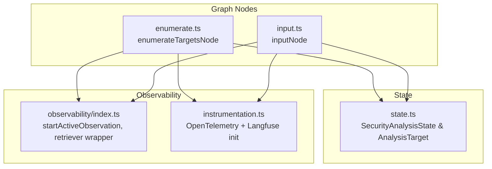
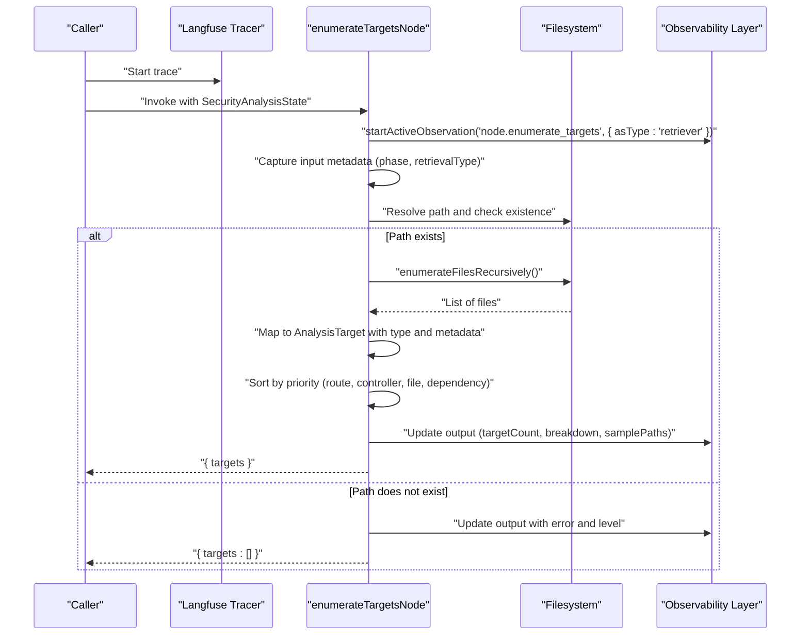
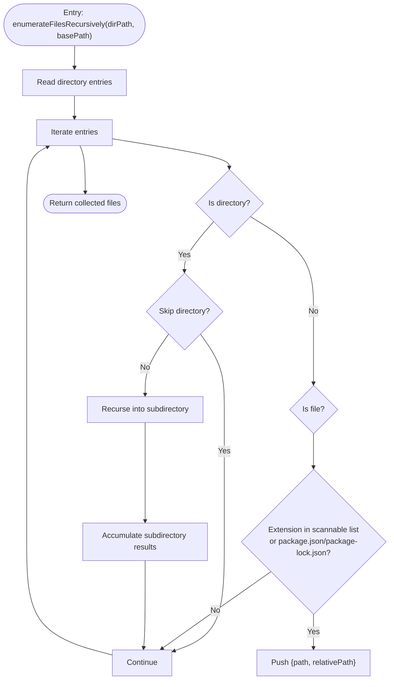
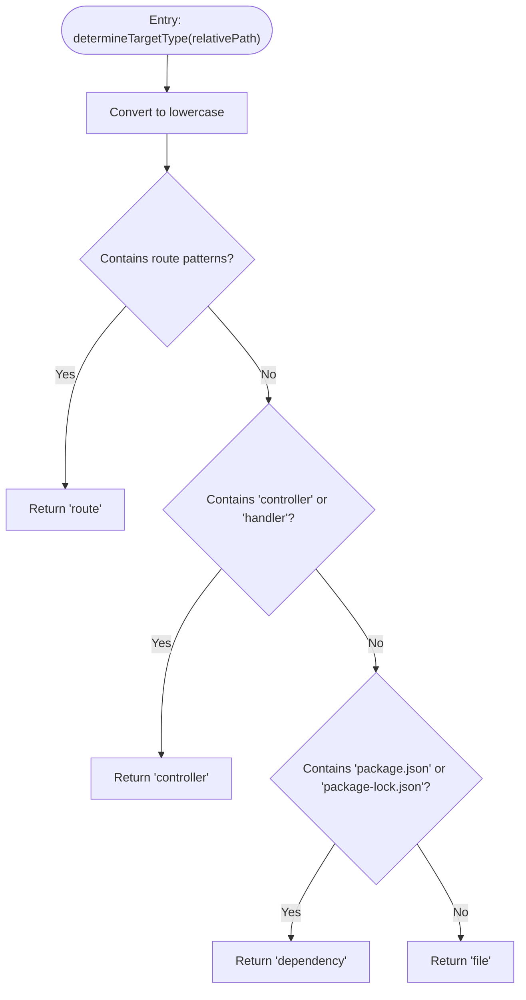
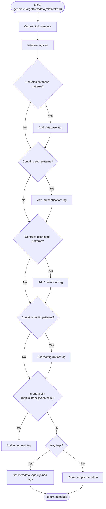
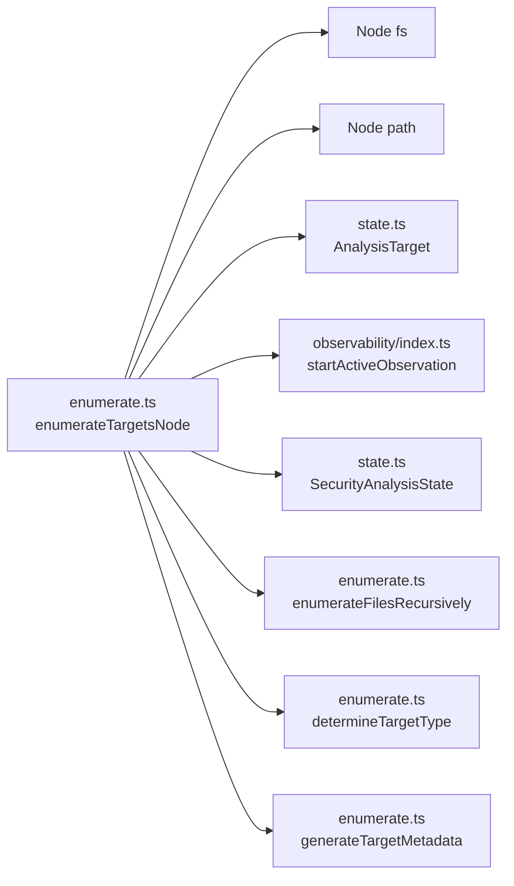

# Enumerate Targets Node Implementation

<cite>
**Referenced Files in This Document**
- [enumerate.ts](file://src/graph/nodes/enumerate.ts)
- [state.ts](file://src/graph/state.ts)
- [index.ts](file://src/graph/nodes/index.ts)
- [observability/index.ts](file://src/observability/index.ts)
- [instrumentation.ts](file://src/instrumentation.ts)
- [input.ts](file://src/graph/nodes/input.ts)
</cite>

## Table of Contents
1. [Introduction](#introduction)
2. [Project Structure](#project-structure)
3. [Core Components](#core-components)
4. [Architecture Overview](#architecture-overview)
5. [Detailed Component Analysis](#detailed-component-analysis)
6. [Dependency Analysis](#dependency-analysis)
7. [Performance Considerations](#performance-considerations)
8. [Troubleshooting Guide](#troubleshooting-guide)
9. [Conclusion](#conclusion)

## Introduction
This document explains the enumerateTargetsNode function that discovers security-relevant files, routes, controllers, and dependencies within a specified repository path. It covers:
- Recursive file enumeration using enumerateFilesRecursively
- Target classification via determineTargetType
- Priority-based sorting to prioritize routes and controllers
- Langfuse tracing integration with retriever type and metadata for phase and retrieval type
- Error handling for missing repository paths and returning empty targets
- Performance considerations for large repositories and sampling of paths in tracing

## Project Structure
The enumerateTargetsNode resides in the graph nodes module and integrates with the global state and observability layers.

**Diagram sources**
- [enumerate.ts](file://src/graph/nodes/enumerate.ts#L137-L226)
- [state.ts](file://src/graph/state.ts#L52-L58)
- [observability/index.ts](file://src/observability/index.ts#L214-L232)
- [instrumentation.ts](file://src/instrumentation.ts#L1-L140)
- [input.ts](file://src/graph/nodes/input.ts#L1-L54)

**Section sources**
- [enumerate.ts](file://src/graph/nodes/enumerate.ts#L1-L228)
- [state.ts](file://src/graph/state.ts#L52-L58)
- [index.ts](file://src/graph/nodes/index.ts#L1-L13)

## Core Components
- enumerateTargetsNode: Orchestrates filesystem enumeration, target classification, sorting, and tracing.
- enumerateFilesRecursively: Recursively enumerates files while skipping excluded directories and selecting scannable extensions.
- determineTargetType: Classifies each file as route, controller, dependency, or file based on path patterns.
- generateTargetMetadata: Adds tags and entrypoint detection metadata for security-relevant categories.
- SecurityAnalysisState and AnalysisTarget: Define the state shape and target structure used by the node.

**Section sources**
- [enumerate.ts](file://src/graph/nodes/enumerate.ts#L29-L67)
- [enumerate.ts](file://src/graph/nodes/enumerate.ts#L72-L91)
- [enumerate.ts](file://src/graph/nodes/enumerate.ts#L96-L126)
- [state.ts](file://src/graph/state.ts#L52-L58)

## Architecture Overview
The node participates in the security analysis graph, capturing input and output via Langfuse with retriever semantics for filesystem discovery.

**Diagram sources**
- [enumerate.ts](file://src/graph/nodes/enumerate.ts#L137-L226)
- [observability/index.ts](file://src/observability/index.ts#L214-L232)
- [instrumentation.ts](file://src/instrumentation.ts#L1-L140)

## Detailed Component Analysis

### enumerateTargetsNode
Purpose:
- Discover security-relevant files by scanning the repository path.
- Classify targets as route, controller, dependency, or file.
- Prioritize routes and controllers for later analysis.
- Emit tracing data with retriever semantics and structured metadata.

Key behaviors:
- Tracing: Uses startActiveObservation with asType 'retriever' and metadata including nodeType, phase, and retrievalType.
- Input capture: Records query, scanId, and repoPath in the observation input.
- Path resolution and validation: Resolves absolute path and checks existence; logs warning and returns empty targets if invalid.
- Enumeration: Calls enumerateFilesRecursively to collect scannable files.
- Classification: Applies determineTargetType and generateTargetMetadata to each file.
- Sorting: Sorts targets by priority order to favor routes and controllers.
- Output capture: Emits targetCount, breakdown counts, and a small sample of paths to avoid payload bloat.

Langfuse tracing specifics:
- Observation name: "node.enumerate_targets"
- Type: retriever
- Metadata keys: nodeType, phase, retrievalType
- Input keys: query, scanId, repoPath
- Output keys: targetCount, breakdown, samplePaths

Error handling:
- On invalid path, sets level to ERROR, statusMessage, and returns empty targets.

Priority sorting:
- route: 1
- controller: 2
- file: 3
- dependency: 4

**Section sources**
- [enumerate.ts](file://src/graph/nodes/enumerate.ts#L137-L226)

#### Recursive Enumeration Flow

**Diagram sources**
- [enumerate.ts](file://src/graph/nodes/enumerate.ts#L29-L67)

#### Target Classification Flow

**Diagram sources**
- [enumerate.ts](file://src/graph/nodes/enumerate.ts#L72-L91)

#### Metadata Generation Flow

**Diagram sources**
- [enumerate.ts](file://src/graph/nodes/enumerate.ts#L96-L126)

### Related State and Graph Integration
- AnalysisTarget defines the structure for discovered targets, including path, type, and optional metadata.
- SecurityAnalysisState exposes a targets field that accumulates results from nodes.
- The nodes barrel export ensures enumerateTargetsNode is available to the graph.

**Section sources**
- [state.ts](file://src/graph/state.ts#L52-L58)
- [state.ts](file://src/graph/state.ts#L104-L108)
- [index.ts](file://src/graph/nodes/index.ts#L1-L13)

## Dependency Analysis
- enumerateTargetsNode depends on:
  - Filesystem APIs for directory traversal and existence checks
  - Langfuse tracing via startActiveObservation with retriever semantics
  - SecurityAnalysisState and AnalysisTarget types
  - Utility functions determineTargetType and generateTargetMetadata

**Diagram sources**
- [enumerate.ts](file://src/graph/nodes/enumerate.ts#L137-L226)
- [state.ts](file://src/graph/state.ts#L52-L58)

**Section sources**
- [enumerate.ts](file://src/graph/nodes/enumerate.ts#L137-L226)
- [state.ts](file://src/graph/state.ts#L52-L58)

## Performance Considerations
- Exclusions: Skips common large or irrelevant directories to reduce IO overhead.
- Scannable extensions: Limits enumeration to JavaScript/TypeScript and selected config files to minimize unnecessary reads.
- Sampling in tracing: Outputs only a small sample of target paths to avoid large payloads in the observation output.
- Sorting cost: Sorting by a constant-size priority map is O(n log n); acceptable for typical repository sizes.
- Recommendations for very large repositories:
  - Consider pre-filtering by file extension or path prefix before enumeration.
  - Introduce concurrency limits for directory traversal if needed.
  - Use incremental indexing elsewhere in the pipeline to avoid re-scanning unchanged subtrees.

**Section sources**
- [enumerate.ts](file://src/graph/nodes/enumerate.ts#L23-L26)
- [enumerate.ts](file://src/graph/nodes/enumerate.ts#L52-L61)
- [enumerate.ts](file://src/graph/nodes/enumerate.ts#L213-L221)

## Troubleshooting Guide
Common issues and resolutions:
- Invalid repository path:
  - Symptom: Warning logged and empty targets returned.
  - Resolution: Ensure repoPath is correct and accessible. Verify permissions and existence.
- Missing Langfuse credentials:
  - Symptom: Initialization failure or missing traces.
  - Resolution: Set required environment variables before importing instrumentation.
- Large observation payloads:
  - Symptom: Tracing UI slow or truncated outputs.
  - Resolution: Rely on the built-in samplePaths to limit output size.

Operational checks:
- Confirm instrumentation is imported before other modules to capture all spans.
- Validate that the node is invoked with a populated SecurityAnalysisState containing repoPath and scanId.

**Section sources**
- [enumerate.ts](file://src/graph/nodes/enumerate.ts#L160-L171)
- [instrumentation.ts](file://src/instrumentation.ts#L94-L118)
- [enumerate.ts](file://src/graph/nodes/enumerate.ts#L213-L221)

## Conclusion
The enumerateTargetsNode provides a robust, observable foundation for discovering security-relevant targets in a repository. It leverages pattern-based classification, priority sorting, and structured tracing to feed downstream analysis efficiently. Its design balances correctness, performance, and observability, with clear error handling and sampling strategies for scalability.