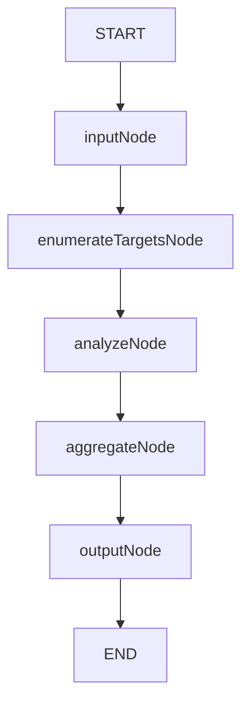
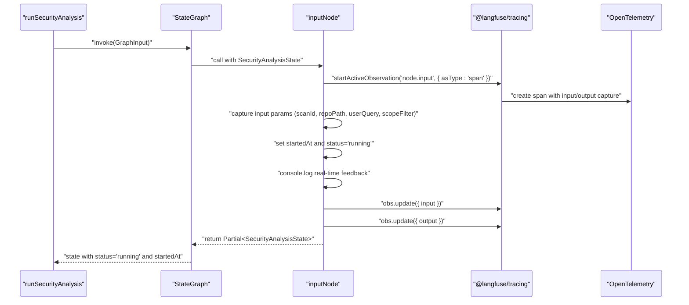
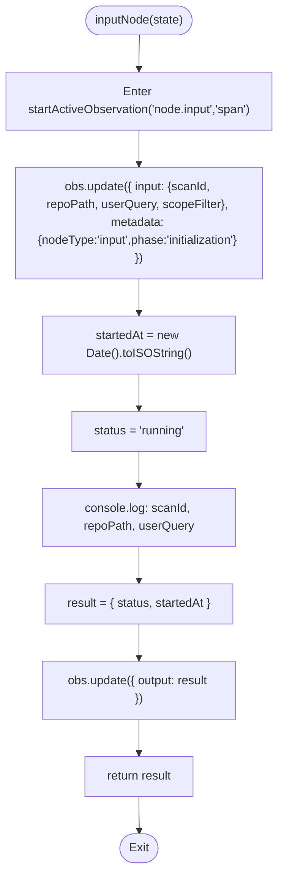
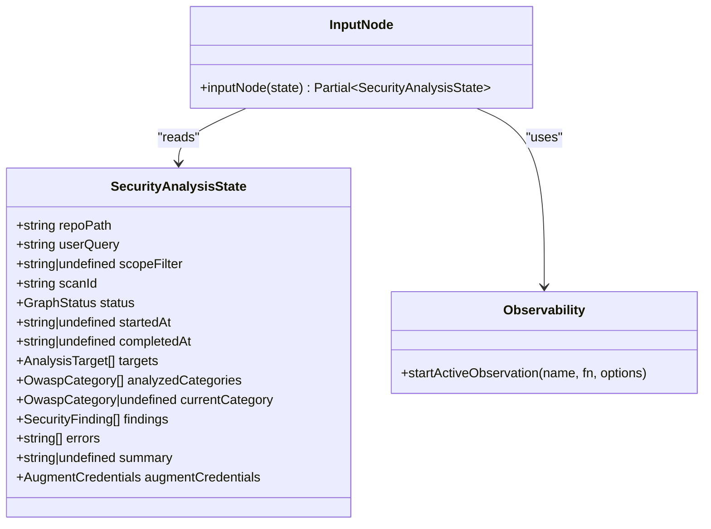
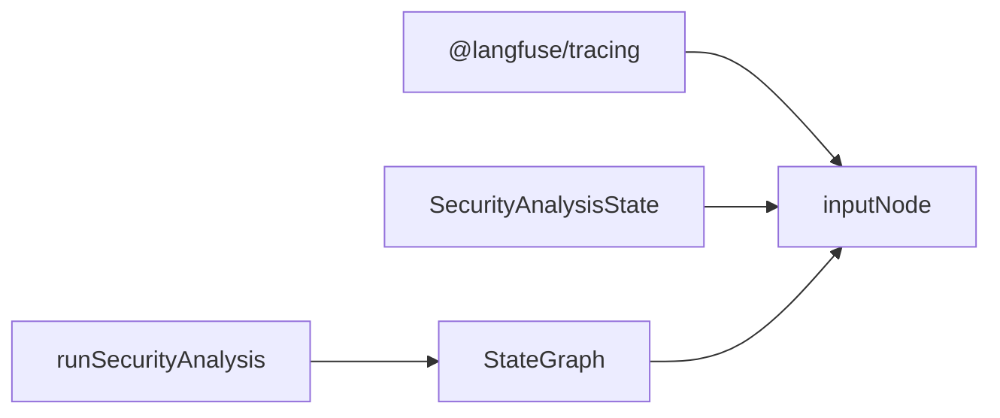

# Input Node Implementation

<cite>
**Referenced Files in This Document**
- [input.ts](file://src/graph/nodes/input.ts)
- [state.ts](file://src/graph/state.ts)
- [index.ts](file://src/graph/index.ts)
- [observability/index.ts](file://src/observability/index.ts)
- [instrumentation.ts](file://src/instrumentation.ts)
</cite>

## Table of Contents
1. [Introduction](#introduction)
2. [Project Structure](#project-structure)
3. [Core Components](#core-components)
4. [Architecture Overview](#architecture-overview)
5. [Detailed Component Analysis](#detailed-component-analysis)
6. [Dependency Analysis](#dependency-analysis)
7. [Performance Considerations](#performance-considerations)
8. [Troubleshooting Guide](#troubleshooting-guide)
9. [Conclusion](#conclusion)

## Introduction
This document explains the inputNode function that initializes the security analysis state at the beginning of the graph execution. It covers how the node captures input parameters, starts the scan timer, transitions the status to running, and records observability data with Langfuse. It also describes the console logging pattern for real-time feedback, how the node maintains state immutability by returning partial updates, and potential failure scenarios in this initialization phase.

## Project Structure
The input node participates in a linear LangGraph pipeline that orchestrates a security analysis workflow:
- START -> input -> enumerate -> analyze -> aggregate -> output -> END

**Diagram sources**
- [index.ts](file://src/graph/index.ts#L18-L48)

**Section sources**
- [index.ts](file://src/graph/index.ts#L18-L48)

## Core Components
- inputNode: Initializes the scan by capturing input state, setting startedAt, transitioning status to running, and emitting observability data.
- SecurityAnalysisState: Defines the shape of the shared state across nodes, including scan identifiers, status, timestamps, and analysis metadata.
- runSecurityAnalysis: Orchestrates the graph, sets trace-level context, and invokes the compiled graph with the initial input.

Key responsibilities of inputNode:
- Capture input parameters (scanId, repoPath, userQuery, scopeFilter) for observability.
- Set startedAt to the current timestamp and status to running.
- Emit console logs for real-time feedback.
- Return a partial state update containing status and startedAt.
- Use startActiveObservation with 'node.input' identifier and 'span' type for observability.

**Section sources**
- [input.ts](file://src/graph/nodes/input.ts#L12-L53)
- [state.ts](file://src/graph/state.ts#L60-L103)
- [index.ts](file://src/graph/index.ts#L56-L145)

## Architecture Overview
The input node is the first step in the security analysis graph. It establishes the baseline state and begins tracing for the entire workflow.

**Diagram sources**
- [index.ts](file://src/graph/index.ts#L56-L145)
- [input.ts](file://src/graph/nodes/input.ts#L12-L53)
- [observability/index.ts](file://src/observability/index.ts#L1-L50)
- [instrumentation.ts](file://src/instrumentation.ts#L1-L92)

## Detailed Component Analysis

### Input Node: Initialization and Observability
The inputNode function performs the following actions:
- Starts an active observation with identifier 'node.input' and type 'span'.
- Updates the observation with input parameters: scanId, repoPath, userQuery, and scopeFilter (null if undefined).
- Sets node metadata indicating nodeType 'input' and phase 'initialization'.
- Captures the startedAt timestamp and sets status to 'running'.
- Emits console logs for real-time feedback.
- Updates the observation with the output result (status and startedAt).
- Returns a partial state update containing status and startedAt.

**Diagram sources**
- [input.ts](file://src/graph/nodes/input.ts#L12-L53)

**Section sources**
- [input.ts](file://src/graph/nodes/input.ts#L12-L53)

### State Initialization and Immutability
The SecurityAnalysisState defines the fields that the graph manages:
- Input fields: repoPath, userQuery, scopeFilter, augmentCredentials.
- Scan metadata: scanId, status, startedAt, completedAt.
- Analysis progress: targets, analyzedCategories, currentCategory.
- Findings: SecurityFinding[].
- Errors and summary outputs.
- The state uses LangGraph’s Annotation pattern with reducers to ensure immutability and deterministic updates.

inputNode returns only the fields it modifies:
- status: 'running'
- startedAt: timestamp

This adheres to the immutability principle by returning a partial state update and letting subsequent nodes populate other fields.

**Section sources**
- [state.ts](file://src/graph/state.ts#L71-L143)
- [state.ts](file://src/graph/state.ts#L148-L173)

### Langfuse Tracing and Observability
- The input node uses startActiveObservation with asType 'span' to create a span-level observation named 'node.input'.
- Input parameters are captured in obs.update({ input }) and output result in obs.update({ output }).
- The broader runSecurityAnalysis function sets trace-level context (trace name, tags, metadata) and uses an agent observation for top-level orchestration.
- The instrumentation module initializes OpenTelemetry and Langfuse processors, ensuring all spans and observations are exported consistently.

**Diagram sources**
- [state.ts](file://src/graph/state.ts#L71-L143)
- [input.ts](file://src/graph/nodes/input.ts#L12-L53)
- [observability/index.ts](file://src/observability/index.ts#L1-L50)
- [instrumentation.ts](file://src/instrumentation.ts#L1-L92)

**Section sources**
- [input.ts](file://src/graph/nodes/input.ts#L12-L53)
- [observability/index.ts](file://src/observability/index.ts#L1-L50)
- [instrumentation.ts](file://src/instrumentation.ts#L1-L92)

### Console Logging Pattern for Real-Time Feedback
The input node emits console logs to provide immediate feedback:
- Logs the scanId, repository path, and user query.
- This pattern helps operators monitor the start of the scan and confirm the input parameters were received.

**Section sources**
- [input.ts](file://src/graph/nodes/input.ts#L35-L37)

### Failure Scenarios and Handling in Initialization
The initialization phase of inputNode is straightforward and primarily involves:
- Capturing input parameters and updating the observation.
- Setting timestamps and status.
- Returning a partial state update.

Potential failure scenarios:
- Missing or invalid input parameters: The node relies on the state provided by the graph runner. If repoPath is missing, downstream nodes may encounter issues, but the input node itself does not validate presence here.
- Environment or tracing configuration issues: If Langfuse or OpenTelemetry is misconfigured, the observation may not export, but the node still returns the partial state.

Handling:
- The node returns a partial state update regardless of environment issues.
- The broader runSecurityAnalysis function sets trace-level context and wraps the graph invocation in an agent observation, which can capture errors if they bubble up from later nodes.

**Section sources**
- [input.ts](file://src/graph/nodes/input.ts#L12-L53)
- [index.ts](file://src/graph/index.ts#L56-L145)

## Dependency Analysis
The input node depends on:
- Langfuse tracing for observability via startActiveObservation.
- The SecurityAnalysisState type for input and output typing.
- The graph runner to pass the initial state and compile the graph.

**Diagram sources**
- [input.ts](file://src/graph/nodes/input.ts#L12-L53)
- [state.ts](file://src/graph/state.ts#L148-L173)
- [index.ts](file://src/graph/index.ts#L56-L145)

**Section sources**
- [input.ts](file://src/graph/nodes/input.ts#L12-L53)
- [state.ts](file://src/graph/state.ts#L148-L173)
- [index.ts](file://src/graph/index.ts#L56-L145)

## Performance Considerations
- The input node performs minimal computation and returns quickly, minimizing overhead.
- Using a span-type observation keeps the overhead low while still capturing input and output.
- Console logging is lightweight and suitable for real-time feedback.

## Troubleshooting Guide
Common issues and checks:
- Missing Langfuse credentials or misconfiguration: Ensure environment variables are set and instrumentation is initialized before other modules.
- No output observed in Langfuse: Verify that the span 'node.input' is emitted and that the trace-level context is set by the runner.
- Incorrect timestamps or status: Confirm that the node sets status to 'running' and startedAt to the current timestamp.
- State not advancing: Ensure the graph compiles and edges are configured correctly.

**Section sources**
- [instrumentation.ts](file://src/instrumentation.ts#L94-L120)
- [index.ts](file://src/graph/index.ts#L56-L145)
- [input.ts](file://src/graph/nodes/input.ts#L32-L47)

## Conclusion
The inputNode function serves as the entry point for the security analysis graph. It initializes the scan by capturing input parameters, starting the timer, marking the status as running, and emitting observability data. Its design ensures immutability by returning only partial state updates and leverages Langfuse tracing for visibility. While the initialization phase is simple, it lays the foundation for the rest of the workflow and benefits from the broader tracing and instrumentation setup.