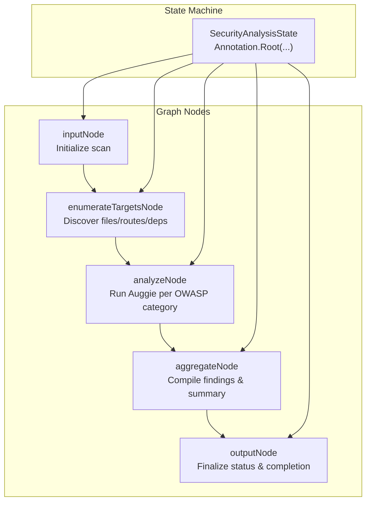
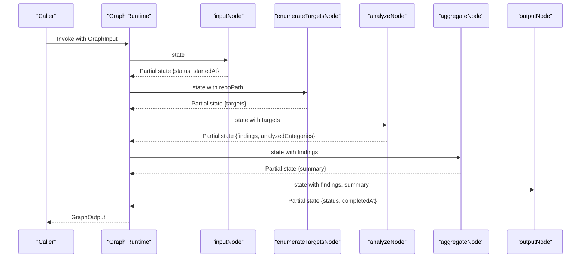
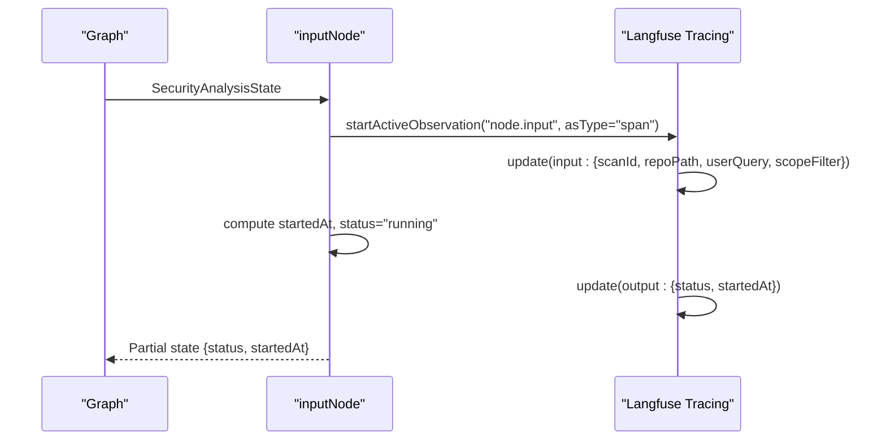
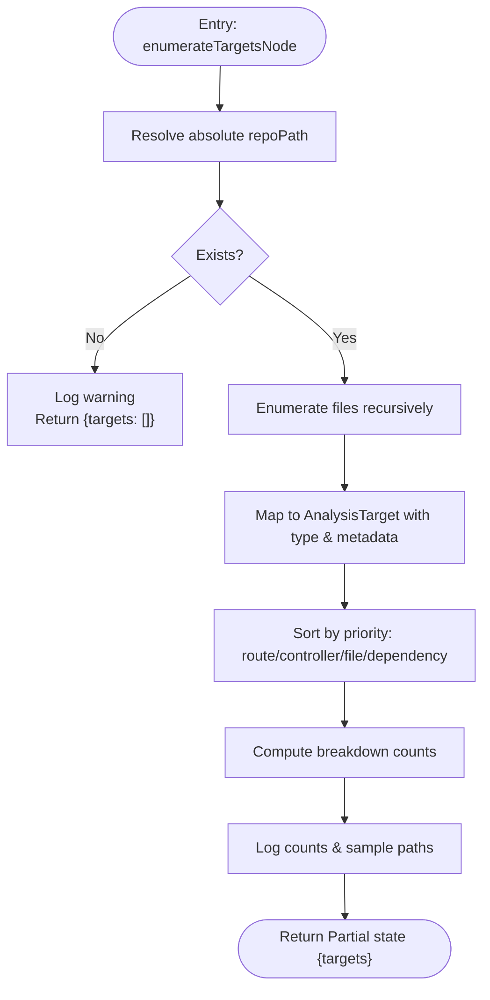
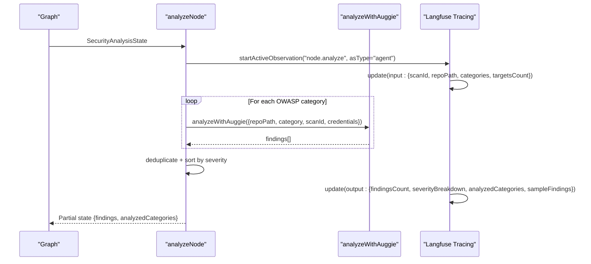
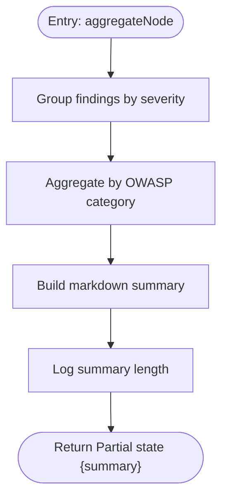
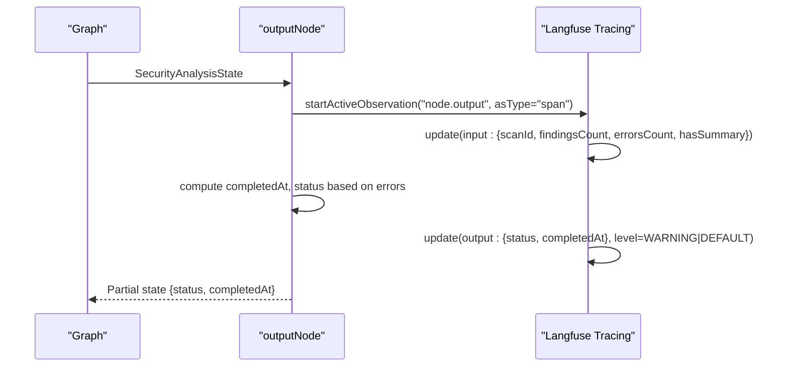
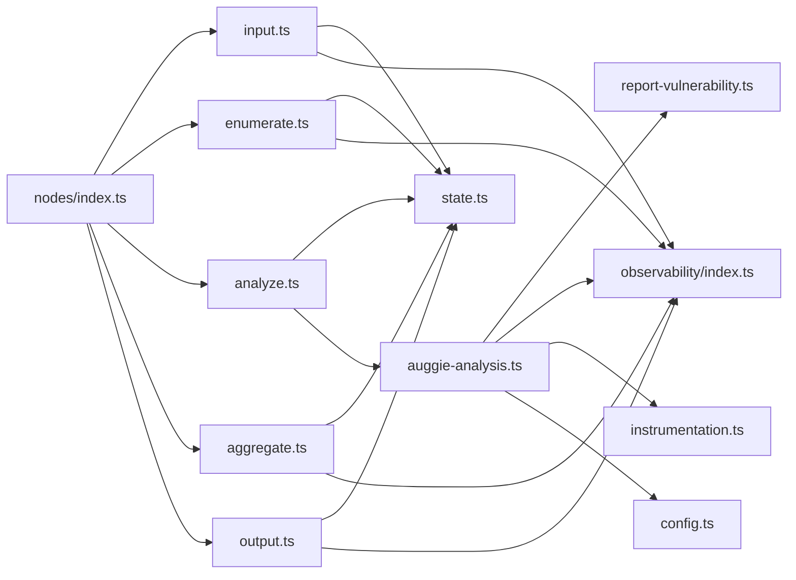

# Node Implementation Details

<cite>
**Referenced Files in This Document**
- [input.ts](file://src/graph/nodes/input.ts)
- [enumerate.ts](file://src/graph/nodes/enumerate.ts)
- [analyze.ts](file://src/graph/nodes/analyze.ts)
- [aggregate.ts](file://src/graph/nodes/aggregate.ts)
- [output.ts](file://src/graph/nodes/output.ts)
- [state.ts](file://src/graph/state.ts)
- [nodes/index.ts](file://src/graph/nodes/index.ts)
- [observability/index.ts](file://src/observability/index.ts)
- [auggie-analysis.ts](file://src/tools/auggie-analysis.ts)
- [report-vulnerability.ts](file://src/tools/report-vulnerability.ts)
- [instrumentation.ts](file://src/instrumentation.ts)
- [config.ts](file://src/config.ts)
</cite>

## Table of Contents
1. [Introduction](#introduction)
2. [Project Structure](#project-structure)
3. [Core Components](#core-components)
4. [Architecture Overview](#architecture-overview)
5. [Detailed Component Analysis](#detailed-component-analysis)
6. [Dependency Analysis](#dependency-analysis)
7. [Performance Considerations](#performance-considerations)
8. [Troubleshooting Guide](#troubleshooting-guide)
9. [Conclusion](#conclusion)

## Introduction
This document provides detailed implementation insights for each node in the security analysis graph. It explains how each node initializes state, discovers targets, performs OWASP-based analysis using the Auggie SDK, aggregates findings, and formats outputs. It also covers observability integration via tracing, data flow between nodes, safe state mutation through reducers, and failure points with recovery strategies.

## Project Structure
The security analysis graph is composed of five nodes orchestrated by a LangGraph state machine. Each node follows a consistent pattern: accept the current state, perform work, and return a partial state update. Observability is integrated via Langfuse tracing wrappers that capture inputs, outputs, metadata, and error states.

**Diagram sources**
- [nodes/index.ts](file://src/graph/nodes/index.ts#L1-L14)
- [state.ts](file://src/graph/state.ts#L71-L143)

**Section sources**
- [nodes/index.ts](file://src/graph/nodes/index.ts#L1-L14)
- [state.ts](file://src/graph/state.ts#L71-L143)

## Core Components
- SecurityAnalysisState: Defines the shared state shape and reducers for accumulating results across nodes.
- Node functions: input, enumerate, analyze, aggregate, output, each returning a partial state update.
- Observability: Rich observation wrappers for agent, tool, retriever, generation, chain, and span types.
- Auggie integration: Orchestrated analysis with prompt fetching, tool execution, and structured findings.

**Section sources**
- [state.ts](file://src/graph/state.ts#L71-L143)
- [input.ts](file://src/graph/nodes/input.ts#L12-L53)
- [enumerate.ts](file://src/graph/nodes/enumerate.ts#L138-L227)
- [analyze.ts](file://src/graph/nodes/analyze.ts#L44-L155)
- [aggregate.ts](file://src/graph/nodes/aggregate.ts#L12-L116)
- [output.ts](file://src/graph/nodes/output.ts#L12-L58)
- [observability/index.ts](file://src/observability/index.ts#L1-L411)
- [auggie-analysis.ts](file://src/tools/auggie-analysis.ts#L1-L310)
- [report-vulnerability.ts](file://src/tools/report-vulnerability.ts#L1-L154)

## Architecture Overview
The graph executes in strict order: input -> enumerate -> analyze -> aggregate -> output. Each node uses Langfuse tracing to capture inputs, outputs, and metadata. The state machine’s reducers ensure safe accumulation of targets, findings, and categories.

**Diagram sources**
- [input.ts](file://src/graph/nodes/input.ts#L12-L53)
- [enumerate.ts](file://src/graph/nodes/enumerate.ts#L138-L227)
- [analyze.ts](file://src/graph/nodes/analyze.ts#L44-L155)
- [aggregate.ts](file://src/graph/nodes/aggregate.ts#L12-L116)
- [output.ts](file://src/graph/nodes/output.ts#L12-L58)
- [state.ts](file://src/graph/state.ts#L71-L143)

## Detailed Component Analysis

### inputNode
- Purpose: Initialize the scan by setting status to running and capturing start time. It also logs repository path, scan ID, and user query.
- Receives: SecurityAnalysisState (includes repoPath, userQuery, scopeFilter, scanId).
- Returns: Partial state with status and startedAt.
- Observability: Uses startActiveObservation with span type to capture input/output and metadata (nodeType, phase).

**Diagram sources**
- [input.ts](file://src/graph/nodes/input.ts#L12-L53)
- [observability/index.ts](file://src/observability/index.ts#L1-L120)

**Section sources**
- [input.ts](file://src/graph/nodes/input.ts#L12-L53)
- [observability/index.ts](file://src/observability/index.ts#L1-L120)

Failure points and recovery:
- None expected at this stage; logs repository path and scan identifiers. Recovery is minimal (no-op).

### enumerateTargetsNode
- Purpose: Discover files, routes, controllers, and dependencies under the repository path. It sorts targets by priority and computes a breakdown.
- Receives: SecurityAnalysisState with repoPath.
- Returns: Partial state with targets array.
- Observability: Uses retriever type to capture filesystem discovery, including sample paths and counts.

**Diagram sources**
- [enumerate.ts](file://src/graph/nodes/enumerate.ts#L138-L227)

**Section sources**
- [enumerate.ts](file://src/graph/nodes/enumerate.ts#L138-L227)
- [state.ts](file://src/graph/state.ts#L51-L60)

Failure points and recovery:
- Non-existent path: logs a warning and returns empty targets. Recovery: caller continues with zero targets; user should fix repoPath.

### analyzeNode
- Purpose: Iterate through OWASP categories and use Auggie SDK to detect vulnerabilities. It deduplicates findings, sorts by severity, and records analyzed categories.
- Receives: SecurityAnalysisState with repoPath, targets, and augmentCredentials.
- Returns: Partial state with findings and analyzedCategories.
- Observability: Uses agent type for orchestration and integrates with Auggie wrappers for tool and generation observations.

**Diagram sources**
- [analyze.ts](file://src/graph/nodes/analyze.ts#L44-L155)
- [auggie-analysis.ts](file://src/tools/auggie-analysis.ts#L119-L309)
- [observability/index.ts](file://src/observability/index.ts#L254-L272)

**Section sources**
- [analyze.ts](file://src/graph/nodes/analyze.ts#L44-L155)
- [auggie-analysis.ts](file://src/tools/auggie-analysis.ts#L119-L309)
- [report-vulnerability.ts](file://src/tools/report-vulnerability.ts#L60-L154)

Failure points and recovery:
- Auggie API errors: categorized and logged; non-transient errors return empty findings for that category. Recovery: continue with remaining categories; consider retries for 5xx errors.
- Parsing failures: malformed responses yield empty findings; caller continues unaffected.

### aggregateNode
- Purpose: Compile findings into a human-readable summary, grouping by severity and category.
- Receives: SecurityAnalysisState with findings.
- Returns: Partial state with summary string.
- Observability: Uses chain type to link findings to summary generation.

**Diagram sources**
- [aggregate.ts](file://src/graph/nodes/aggregate.ts#L12-L116)

**Section sources**
- [aggregate.ts](file://src/graph/nodes/aggregate.ts#L12-L116)

Failure points and recovery:
- None expected; aggregation is deterministic. Recovery: regenerate summary if needed.

### outputNode
- Purpose: Finalize the scan by computing completion time, determining status (failed vs completed), and logging totals.
- Receives: SecurityAnalysisState with findings, errors, and summary.
- Returns: Partial state with status and completedAt.
- Observability: Uses span type to capture finalization metadata and warnings when errors exist.

**Diagram sources**
- [output.ts](file://src/graph/nodes/output.ts#L12-L58)
- [observability/index.ts](file://src/observability/index.ts#L1-L120)

**Section sources**
- [output.ts](file://src/graph/nodes/output.ts#L12-L58)

Failure points and recovery:
- None expected; status derived from error count. Recovery: re-run if needed.

## Dependency Analysis
- Node exports: nodes/index.ts re-exports all five nodes for graph orchestration.
- State reducers: SecurityAnalysisStateAnnotation defines reducers for targets, findings, analyzedCategories, and others.
- Observability wrappers: observability/index.ts provides typed wrappers for agent, tool, retriever, generation, chain, and span.
- Auggie integration: auggie-analysis.ts orchestrates prompt fetching, tool execution, and structured findings parsing.
- Tool reporting: report-vulnerability.ts defines the tool schema and maintains collected findings.
- Instrumentation: instrumentation.ts initializes OpenTelemetry + Langfuse and exports tracer for spans.

**Diagram sources**
- [nodes/index.ts](file://src/graph/nodes/index.ts#L1-L14)
- [state.ts](file://src/graph/state.ts#L71-L143)
- [auggie-analysis.ts](file://src/tools/auggie-analysis.ts#L1-L310)
- [report-vulnerability.ts](file://src/tools/report-vulnerability.ts#L1-L154)
- [observability/index.ts](file://src/observability/index.ts#L1-L411)
- [instrumentation.ts](file://src/instrumentation.ts#L1-L141)
- [config.ts](file://src/config.ts#L1-L153)

**Section sources**
- [nodes/index.ts](file://src/graph/nodes/index.ts#L1-L14)
- [state.ts](file://src/graph/state.ts#L71-L143)
- [auggie-analysis.ts](file://src/tools/auggie-analysis.ts#L1-L310)
- [report-vulnerability.ts](file://src/tools/report-vulnerability.ts#L1-L154)
- [observability/index.ts](file://src/observability/index.ts#L1-L411)
- [instrumentation.ts](file://src/instrumentation.ts#L1-L141)
- [config.ts](file://src/config.ts#L1-L153)

## Performance Considerations
- File enumeration: Recursive filesystem traversal can be expensive for large repositories. Consider limiting depth or skipping large binary files.
- Auggie analysis: Each category triggers a separate tool observation and potentially LLM calls. Batch or cache prompts where feasible.
- Deduplication: Sorting and deduplication by title + file + line range adds overhead proportional to findings count.
- Observability payload size: Avoid logging full lists; keep sample outputs small to reduce trace size.

## Troubleshooting Guide
Common issues and resolutions:
- Missing repository path: enumerateTargetsNode warns and returns empty targets. Ensure repoPath is correct.
- Auggie API errors: analyzeNode catches and logs; non-transient errors return empty findings for that category. Check credentials and network.
- Parsing failures: analyzeNode falls back to empty findings when response is not valid JSON. Verify prompt alignment and response format.
- Instrumentation not initialized: Ensure instrumentation.ts is imported before other modules to capture traces.

**Section sources**
- [enumerate.ts](file://src/graph/nodes/enumerate.ts#L160-L172)
- [auggie-analysis.ts](file://src/tools/auggie-analysis.ts#L253-L291)
- [instrumentation.ts](file://src/instrumentation.ts#L1-L141)

## Conclusion
Each node adheres to a consistent pattern: receive state, perform work, return partial updates, and integrate observability. The state machine’s reducers ensure safe accumulation of results. The Auggie-based analyzeNode orchestrates codebase search, LLM reasoning, and structured findings collection. Observability provides rich tracing across agents, tools, retrievers, generations, chains, and spans, enabling deep diagnostics and cost tracking.