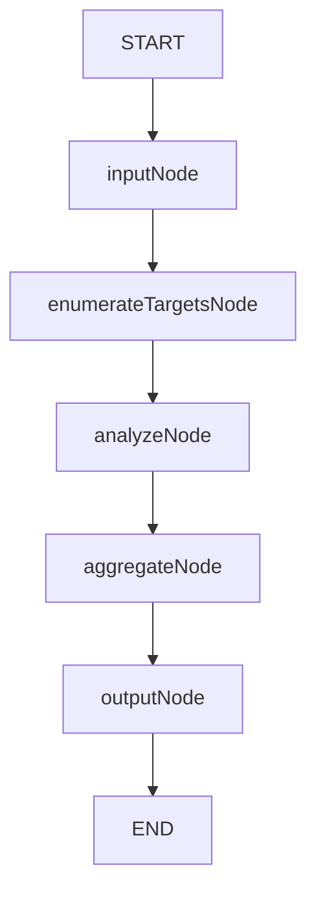
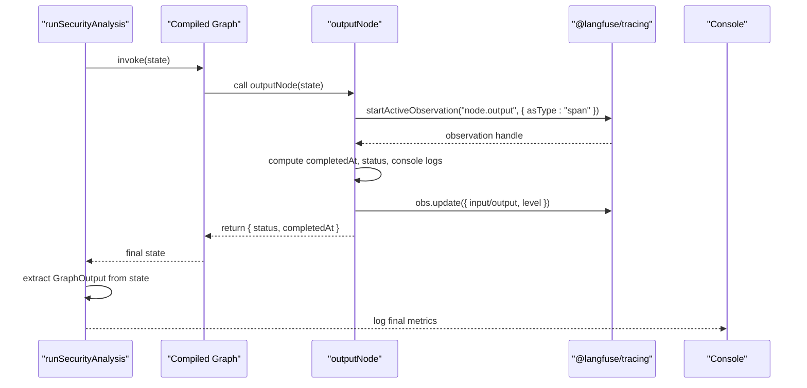
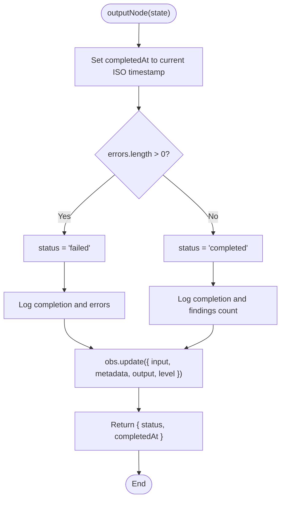
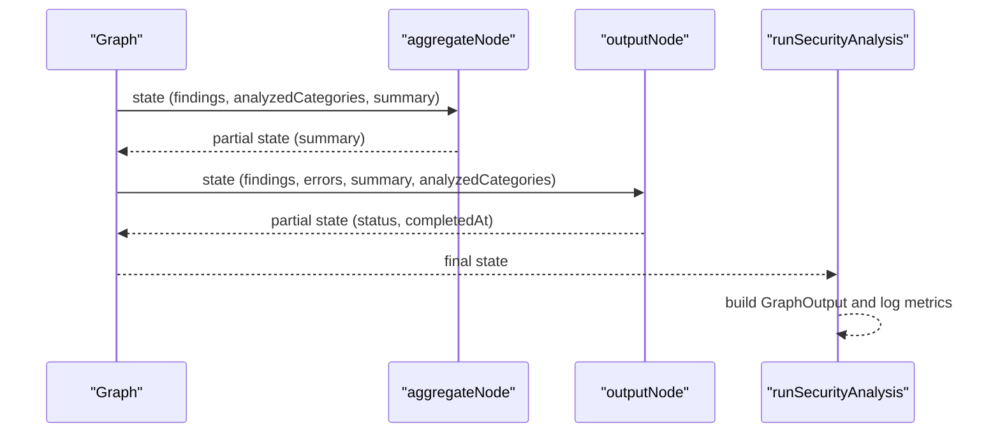
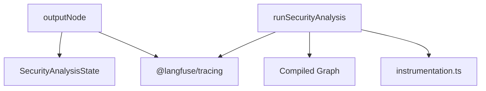

# Output Node Implementation

<cite>
**Referenced Files in This Document**
- [output.ts](file://src/graph/nodes/output.ts)
- [state.ts](file://src/graph/state.ts)
- [index.ts](file://src/graph/index.ts)
- [observability/index.ts](file://src/observability/index.ts)
- [instrumentation.ts](file://src/instrumentation.ts)
- [input.ts](file://src/graph/nodes/input.ts)
- [aggregate.ts](file://src/graph/nodes/aggregate.ts)
- [analyze.ts](file://src/graph/nodes/analyze.ts)
</cite>

## Table of Contents
1. [Introduction](#introduction)
2. [Project Structure](#project-structure)
3. [Core Components](#core-components)
4. [Architecture Overview](#architecture-overview)
5. [Detailed Component Analysis](#detailed-component-analysis)
6. [Dependency Analysis](#dependency-analysis)
7. [Performance Considerations](#performance-considerations)
8. [Troubleshooting Guide](#troubleshooting-guide)
9. [Conclusion](#conclusion)

## Introduction
This document provides a comprehensive guide to the outputNode function, which finalizes the security analysis workflow. It explains how the node sets the completedAt timestamp, determines the final status (completed or failed), captures the final scan outcome for console output and Langfuse tracing, and serves as the natural endpoint of the state machine. It also covers integration considerations for CI/CD pipelines that rely on exit status.

## Project Structure
The outputNode resides in the graph nodes module and participates in a linear state machine orchestrated by LangGraph. The graph flow is:
- START → input → enumerate → analyze → aggregate → output → END

**Diagram sources**
- [index.ts](file://src/graph/index.ts#L18-L48)

**Section sources**
- [index.ts](file://src/graph/index.ts#L18-L48)

## Core Components
- outputNode: Finalizes the scan by setting completedAt, deriving status from errors, logging outcomes, and capturing results for tracing.
- SecurityAnalysisState: Defines the shared state schema, including scanId, status, startedAt, completedAt, findings, errors, summary, and analyzedCategories.
- runSecurityAnalysis: Orchestrates the graph, manages top-level tracing, and extracts GraphOutput from the final state.

Key responsibilities of outputNode:
- Set completedAt to the current ISO timestamp.
- Determine status: failed if errors array is non-empty; otherwise completed.
- Log completion messages to console with scanId, status, findings count, and error details when present.
- Capture input and output for Langfuse tracing, including counts and metadata.
- Use span-type observability with appropriate log levels: WARNING when errors exist; DEFAULT otherwise.

**Section sources**
- [output.ts](file://src/graph/nodes/output.ts#L1-L59)
- [state.ts](file://src/graph/state.ts#L60-L143)
- [index.ts](file://src/graph/index.ts#L56-L145)

## Architecture Overview
The outputNode is the terminal node in the state machine. It receives the accumulated state, computes the final outcome, and returns a partial state update that includes status and completedAt. The runSecurityAnalysis function compiles the graph and returns the final state, which is transformed into GraphOutput for consumers.

**Diagram sources**
- [index.ts](file://src/graph/index.ts#L56-L145)
- [output.ts](file://src/graph/nodes/output.ts#L12-L58)
- [observability/index.ts](file://src/observability/index.ts#L20-L35)

## Detailed Component Analysis

### outputNode: Finalization Logic and Outcome Capture
- Completed timestamp: The node sets completedAt to the current ISO timestamp before computing status.
- Status determination: The status is derived from the length of the errors array. If errors.length > 0, status is failed; otherwise completed.
- Console output: The node logs a clear completion message including scanId and status, total findings count, and error messages when applicable.
- Langfuse tracing: The node captures:
  - Input: scanId, findingsCount, errorsCount, and whether a summary exists.
  - Metadata: nodeType and phase for categorization.
  - Output: status and completedAt.
  - Level: WARNING when errors exist; DEFAULT otherwise.
- Observability type: Uses span type with startActiveObservation and asType: "span".

**Diagram sources**
- [output.ts](file://src/graph/nodes/output.ts#L12-L58)

**Section sources**
- [output.ts](file://src/graph/nodes/output.ts#L12-L58)

### Console Output Formatting
- Completion message: Includes scanId and final status.
- Findings summary: Reports total findings count.
- Error reporting: When errors exist, prints a consolidated list of error messages.

These messages are designed for readability and immediate understanding of the scan outcome.

**Section sources**
- [output.ts](file://src/graph/nodes/output.ts#L36-L41)

### Langfuse Tracing Integration
- Input capture: scanId, findingsCount, errorsCount, and hasSummary.
- Metadata: nodeType: "output", phase: "finalization".
- Output capture: status and completedAt.
- Level: WARNING when errors exist; DEFAULT otherwise.
- Observation type: span.

This ensures the final outcome is recorded consistently with the rest of the workflow.

**Section sources**
- [output.ts](file://src/graph/nodes/output.ts#L15-L57)
- [observability/index.ts](file://src/observability/index.ts#L20-L35)

### Relationship to the State Machine
- Entry point: The graph invokes outputNode after aggregateNode, which prepares summary and analyzedCategories.
- Exit point: outputNode returns a partial state update that includes status and completedAt, marking the workflow as complete.
- Final state extraction: runSecurityAnalysis compiles the graph and transforms the final state into GraphOutput for consumers.

**Diagram sources**
- [aggregate.ts](file://src/graph/nodes/aggregate.ts#L12-L116)
- [output.ts](file://src/graph/nodes/output.ts#L12-L58)
- [index.ts](file://src/graph/index.ts#L92-L135)

**Section sources**
- [aggregate.ts](file://src/graph/nodes/aggregate.ts#L12-L116)
- [index.ts](file://src/graph/index.ts#L92-L135)

### CI/CD Integration Considerations
- Exit status: The runSecurityAnalysis function returns GraphOutput. Consumers should inspect status and completedAt to determine pass/fail conditions. If CI/CD expects a process exit code based on scan outcome, downstream logic should translate status to exit code (e.g., 0 for completed, non-zero for failed).
- Metrics availability: CI/CD can rely on findings count and errors array to drive policy decisions (e.g., fail on any errors or threshold-based gating).
- Idempotency: The outputNode does not mutate state beyond returning status and completedAt; ensure CI/CD logic reads from the final state rather than relying on transient logs alone.

**Section sources**
- [index.ts](file://src/graph/index.ts#L113-L135)
- [state.ts](file://src/graph/state.ts#L160-L173)

## Dependency Analysis
- outputNode depends on:
  - SecurityAnalysisState for input/output shape.
  - @langfuse/tracing for span-based observability.
  - Console for logging.
- runSecurityAnalysis depends on:
  - The compiled graph and orchestrates the entire lifecycle.
  - OpenTelemetry via instrumentation.ts to send spans to Langfuse.

**Diagram sources**
- [output.ts](file://src/graph/nodes/output.ts#L1-L59)
- [state.ts](file://src/graph/state.ts#L60-L143)
- [index.ts](file://src/graph/index.ts#L56-L145)
- [instrumentation.ts](file://src/instrumentation.ts#L1-L141)

**Section sources**
- [output.ts](file://src/graph/nodes/output.ts#L1-L59)
- [state.ts](file://src/graph/state.ts#L60-L143)
- [index.ts](file://src/graph/index.ts#L56-L145)
- [instrumentation.ts](file://src/instrumentation.ts#L1-L141)

## Performance Considerations
- Console logging overhead: The outputNode logs completion metrics and errors. In high-throughput CI environments, consider reducing verbosity or batching logs externally.
- Tracing overhead: Using span observations adds minimal overhead and provides valuable insights; keep as default for production visibility.
- State size: The outputNode returns a minimal partial state (status, completedAt). Avoid attaching large objects to the output to minimize trace payload sizes.

[No sources needed since this section provides general guidance]

## Troubleshooting Guide
- Unexpected status "failed":
  - Verify that errors were populated by earlier nodes. Check analyzeNode and aggregateNode for error propagation.
  - Confirm that errors are non-empty strings; empty arrays produce "completed".
- Missing completedAt:
  - Ensure outputNode executes and returns the partial state update. If the graph short-circuits, completedAt may not be set.
- Inconsistent console output:
  - Confirm that console logs are enabled and not suppressed by CI/CD configurations.
- Tracing anomalies:
  - Ensure instrumentation.ts is imported before other modules to initialize OpenTelemetry and Langfuse processors.
  - Validate environment variables for Langfuse credentials.

**Section sources**
- [output.ts](file://src/graph/nodes/output.ts#L32-L58)
- [instrumentation.ts](file://src/instrumentation.ts#L94-L120)

## Conclusion
The outputNode is the definitive endpoint of the security analysis workflow. It finalizes timestamps, derives status from error presence, logs clear completion metrics, and records outcomes for both console and Langfuse tracing. Its minimal partial state update completes the state machine, enabling consumers to derive GraphOutput and integrate with CI/CD systems that depend on exit status and scan outcomes.