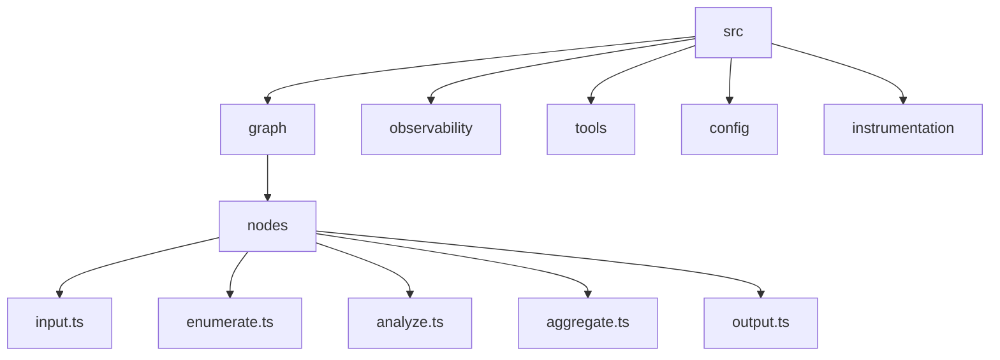
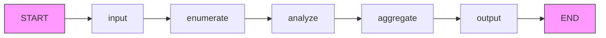
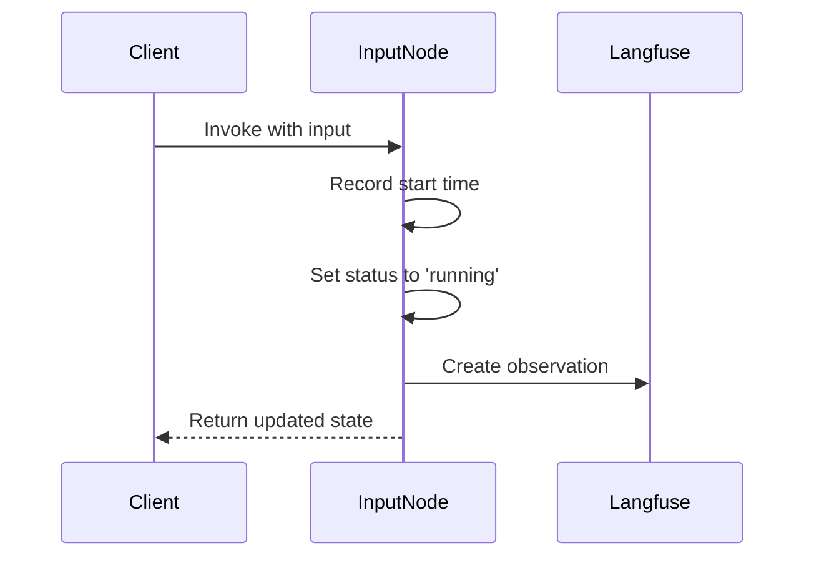
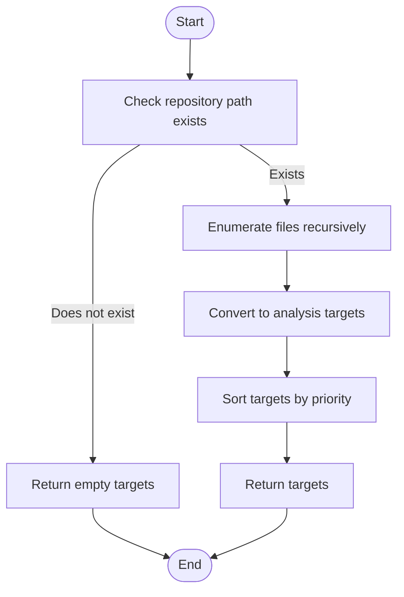
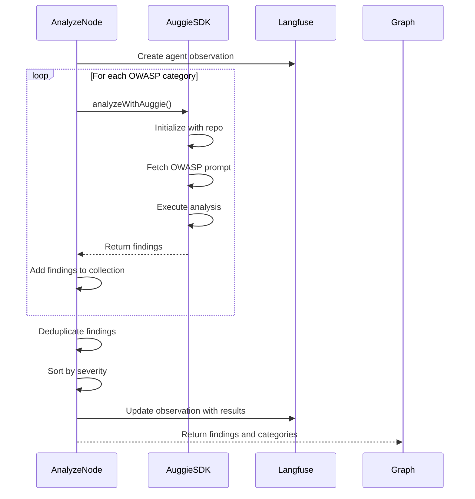
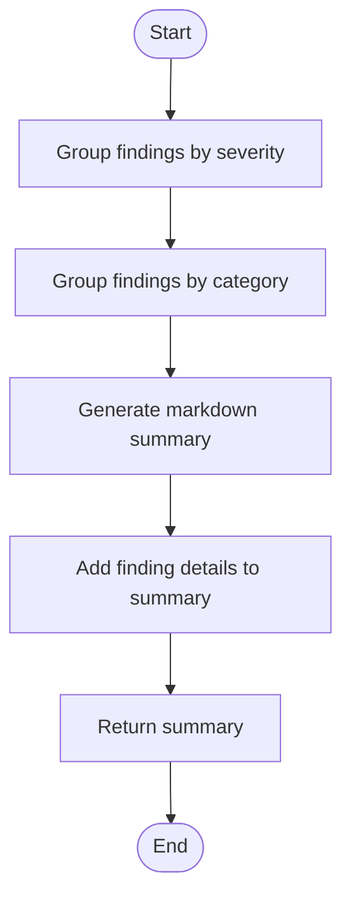
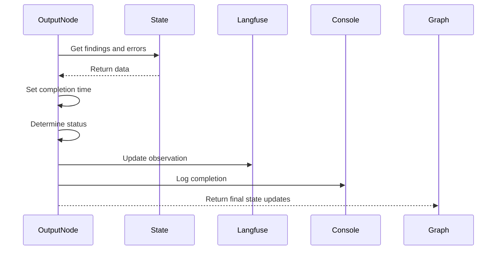
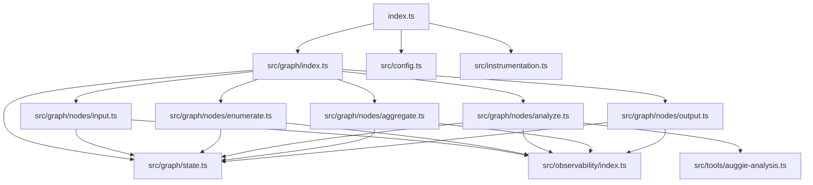

# Security Analysis Workflow

<cite>
**Referenced Files in This Document**   
- [index.ts](file://index.ts)
- [src/graph/index.ts](file://src/graph/index.ts)
- [src/graph/state.ts](file://src/graph/state.ts)
- [src/graph/nodes/input.ts](file://src/graph/nodes/input.ts)
- [src/graph/nodes/enumerate.ts](file://src/graph/nodes/enumerate.ts)
- [src/graph/nodes/analyze.ts](file://src/graph/nodes/analyze.ts)
- [src/graph/nodes/aggregate.ts](file://src/graph/nodes/aggregate.ts)
- [src/graph/nodes/output.ts](file://src/graph/nodes/output.ts)
- [src/observability/index.ts](file://src/observability/index.ts)
- [src/instrumentation.ts](file://src/instrumentation.ts)
- [src/config.ts](file://src/config.ts)
- [src/tools/auggie-analysis.ts](file://src/tools/auggie-analysis.ts)
</cite>

## Table of Contents
1. [Introduction](#introduction)
2. [Project Structure](#project-structure)
3. [Core Components](#core-components)
4. [Architecture Overview](#architecture-overview)
5. [Detailed Component Analysis](#detailed-component-analysis)
6. [Dependency Analysis](#dependency-analysis)
7. [Performance Considerations](#performance-considerations)
8. [Troubleshooting Guide](#troubleshooting-guide)
9. [Conclusion](#conclusion)

## Introduction
This document provides a comprehensive architectural overview of the security analysis workflow orchestrated by LangGraph in the GraphGuard system. The workflow follows a linear execution flow: START → input → enumerate → analyze → aggregate → output → END, as implemented in the `createSecurityAnalysisGraph()` function. The document explains how each node is registered with the StateGraph and how edges define the control flow. It details the role of `runSecurityAnalysis()` as the main entry point, including its use of Langfuse 'agent' observation type for top-level tracing. The document also illustrates how OpenTelemetry spans are created for end-to-end monitoring and how input parameters are passed into the graph. This documentation is designed to be accessible to developers who need to understand or modify the workflow execution.

## Project Structure
The project structure is organized to separate concerns and facilitate maintainability. The core security analysis workflow is located in the `src/graph` directory, with nodes implemented in the `src/graph/nodes` subdirectory. Configuration and instrumentation are handled in separate modules to ensure clean separation of concerns.

**Diagram sources**
- [src/graph/nodes/input.ts](file://src/graph/nodes/input.ts)
- [src/graph/nodes/enumerate.ts](file://src/graph/nodes/enumerate.ts)
- [src/graph/nodes/analyze.ts](file://src/graph/nodes/analyze.ts)
- [src/graph/nodes/aggregate.ts](file://src/graph/nodes/aggregate.ts)
- [src/graph/nodes/output.ts](file://src/graph/nodes/output.ts)

**Section sources**
- [src/graph/nodes/index.ts](file://src/graph/nodes/index.ts)

## Core Components
The security analysis workflow consists of several core components that work together to perform comprehensive security analysis. The main entry point is the `runSecurityAnalysis()` function, which orchestrates the entire workflow. The workflow is implemented as a state graph using LangGraph, with each node representing a specific phase of the analysis process. The state is managed using the `SecurityAnalysisStateAnnotation` which defines the structure of the state object that flows through the graph. Input parameters are passed into the graph and the final results are extracted from the state object after the workflow completes.

**Section sources**
- [src/graph/index.ts](file://src/graph/index.ts)
- [src/graph/state.ts](file://src/graph/state.ts)

## Architecture Overview
The security analysis workflow is implemented as a linear state graph using LangGraph. The graph follows a well-defined execution flow: START → input → enumerate → analyze → aggregate → output → END. Each node in the graph represents a specific phase of the security analysis process and is responsible for updating the state object with relevant information. The graph is created using the `createSecurityAnalysisGraph()` function which registers each node and defines the edges that control the flow of execution. The `runSecurityAnalysis()` function serves as the main entry point and is responsible for invoking the graph with the appropriate input parameters.

**Diagram sources**
- [src/graph/index.ts](file://src/graph/index.ts)

**Section sources**
- [src/graph/index.ts](file://src/graph/index.ts)

## Detailed Component Analysis
The security analysis workflow consists of several nodes that perform specific tasks in the analysis process. Each node receives the current state, performs its task, and returns partial state updates. The nodes are registered with the StateGraph and connected by edges that define the control flow. This section provides a detailed analysis of each node in the workflow.

### Input Node Analysis
The input node is the entry point of the graph and is responsible for initializing the scan and setting up tracking. It records the scan start time, sets the status to 'running', and creates an observation for Langfuse with input/output capture. The node uses the 'span' observation type for tracing.

**Diagram sources**
- [src/graph/nodes/input.ts](file://src/graph/nodes/input.ts)

**Section sources**
- [src/graph/nodes/input.ts](file://src/graph/nodes/input.ts)

### Enumerate Node Analysis
The enumerate node is responsible for identifying files and code locations to analyze. It recursively scans the repository for JavaScript/TypeScript files, identifies routes, controllers, database access code, and user input handling, and tags files based on security-relevant patterns. The node returns a prioritized list of targets for analysis and uses the 'retriever' observation type for tracing.

**Diagram sources**
- [src/graph/nodes/enumerate.ts](file://src/graph/nodes/enumerate.ts)

**Section sources**
- [src/graph/nodes/enumerate.ts](file://src/graph/nodes/enumerate.ts)

### Analyze Node Analysis
The analyze node performs OWASP-based security analysis using the Auggie SDK. It fetches OWASP prompts from Langfuse Prompt Management, uses Auggie SDK to orchestrate analysis (codebase search + LLM reasoning), and collects structured findings using the report_vulnerability tool. The node analyzes each OWASP category in sequence and uses the 'agent' observation type for tracing.

**Diagram sources**
- [src/graph/nodes/analyze.ts](file://src/graph/nodes/analyze.ts)
- [src/tools/auggie-analysis.ts](file://src/tools/auggie-analysis.ts)

**Section sources**
- [src/graph/nodes/analyze.ts](file://src/graph/nodes/analyze.ts)

### Aggregate Node Analysis
The aggregate node combines findings and generates a human-readable summary. It groups findings by severity and category, generates a markdown-formatted summary, and prepares the final output. The node uses the 'chain' observation type for tracing, indicating it's part of a data transformation chain from findings to summary.

**Diagram sources**
- [src/graph/nodes/aggregate.ts](file://src/graph/nodes/aggregate.ts)

**Section sources**
- [src/graph/nodes/aggregate.ts](file://src/graph/nodes/aggregate.ts)

### Output Node Analysis
The output node is the exit point of the graph and is responsible for finalizing the scan and returning results. It records the scan completion time, sets the final status based on whether errors occurred, and logs the completion. The node uses the 'span' observation type for tracing.

**Diagram sources**
- [src/graph/nodes/output.ts](file://src/graph/nodes/output.ts)

**Section sources**
- [src/graph/nodes/output.ts](file://src/graph/nodes/output.ts)

## Dependency Analysis
The security analysis workflow has a well-defined dependency structure. The main entry point `runSecurityAnalysis()` in `src/graph/index.ts` depends on the StateGraph from LangChain and the individual node implementations. The nodes depend on the state definition in `src/graph/state.ts` and the observability utilities in `src/observability/index.ts`. The `analyze` node has a direct dependency on the Auggie SDK through `src/tools/auggie-analysis.ts`. The entire workflow depends on proper configuration from `src/config.ts` and instrumentation from `src/instrumentation.ts`.

**Diagram sources**
- [index.ts](file://index.ts)
- [src/graph/index.ts](file://src/graph/index.ts)
- [src/graph/state.ts](file://src/graph/state.ts)
- [src/graph/nodes/input.ts](file://src/graph/nodes/input.ts)
- [src/graph/nodes/enumerate.ts](file://src/graph/nodes/enumerate.ts)
- [src/graph/nodes/analyze.ts](file://src/graph/nodes/analyze.ts)
- [src/graph/nodes/aggregate.ts](file://src/graph/nodes/aggregate.ts)
- [src/graph/nodes/output.ts](file://src/graph/nodes/output.ts)
- [src/observability/index.ts](file://src/observability/index.ts)
- [src/tools/auggie-analysis.ts](file://src/tools/auggie-analysis.ts)
- [src/config.ts](file://src/config.ts)
- [src/instrumentation.ts](file://src/instrumentation.ts)

**Section sources**
- [index.ts](file://index.ts)
- [src/graph/index.ts](file://src/graph/index.ts)

## Performance Considerations
The security analysis workflow is designed with performance and observability in mind. The use of OpenTelemetry spans and Langfuse observations provides detailed timing information for each phase of the analysis. The workflow is structured to minimize redundant operations, with file enumeration performed once and results passed through the state. The analysis phase is optimized by focusing on specific OWASP categories rather than attempting comprehensive analysis in a single pass. Error handling is integrated within the span context, allowing for proper exception tracking and reporting. The final results are extracted from the state object efficiently without unnecessary data copying.

## Troubleshooting Guide
When troubleshooting issues with the security analysis workflow, developers should first check the Langfuse traces to understand the execution flow and identify where failures occur. Common issues include missing environment variables (particularly Langfuse and Augment credentials), repository path errors, and Auggie SDK connectivity problems. The observability system captures input parameters, output results, and error states for each node, making it easier to diagnose issues. Developers should also verify that the configuration is valid by checking the output from `loadConfig()` in `src/config.ts`. When debugging, it's helpful to examine the state object at each node to ensure data is being passed correctly through the workflow.

**Section sources**
- [src/observability/index.ts](file://src/observability/index.ts)
- [src/config.ts](file://src/config.ts)
- [src/instrumentation.ts](file://src/instrumentation.ts)

## Conclusion
The security analysis workflow implemented in GraphGuard provides a robust and observable system for performing OWASP-based security analysis. The linear execution flow from START to END ensures predictable behavior while the state-based architecture allows for flexible data passing between nodes. The integration of Langfuse for observability provides comprehensive tracing and monitoring capabilities, making it easier to understand and debug the workflow. The modular design with separate nodes for each phase of analysis promotes maintainability and allows for targeted improvements. Developers can extend or modify the workflow by adding new nodes or enhancing existing ones while leveraging the existing observability infrastructure.