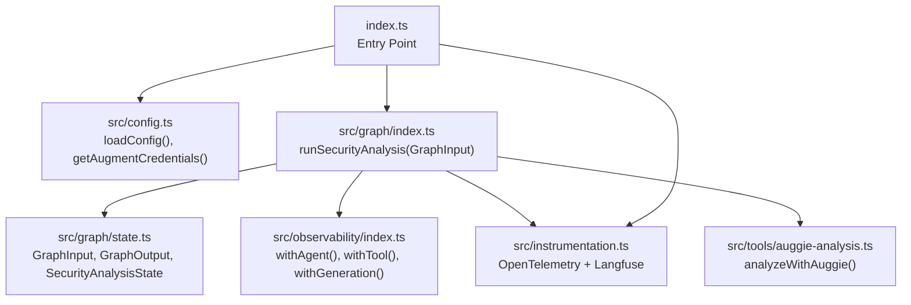
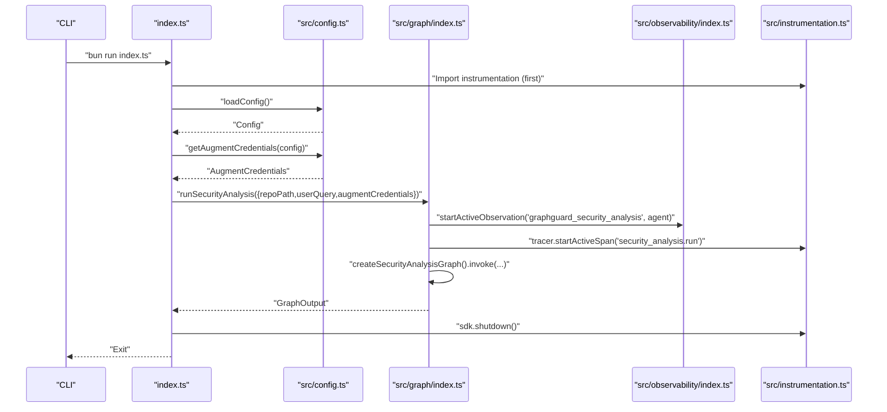
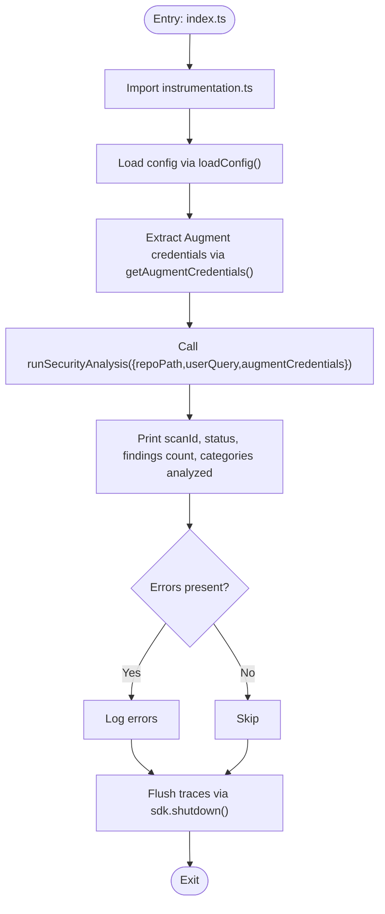
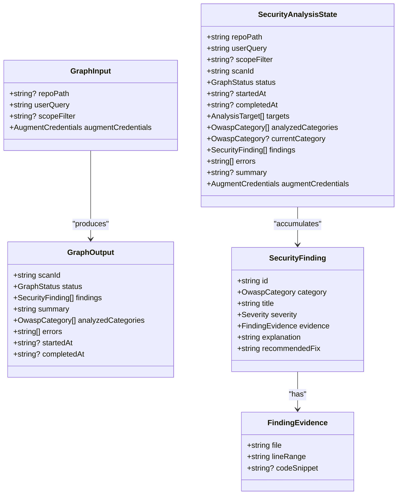
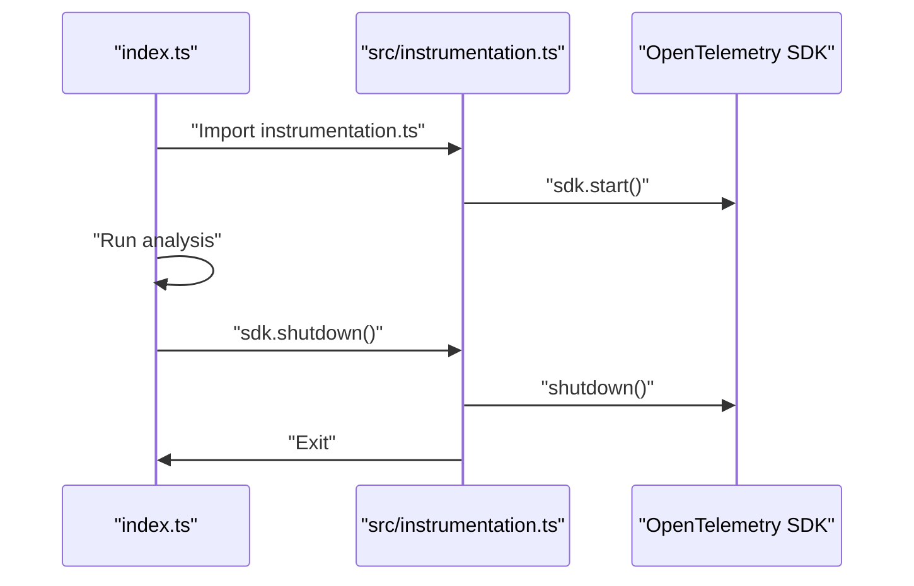
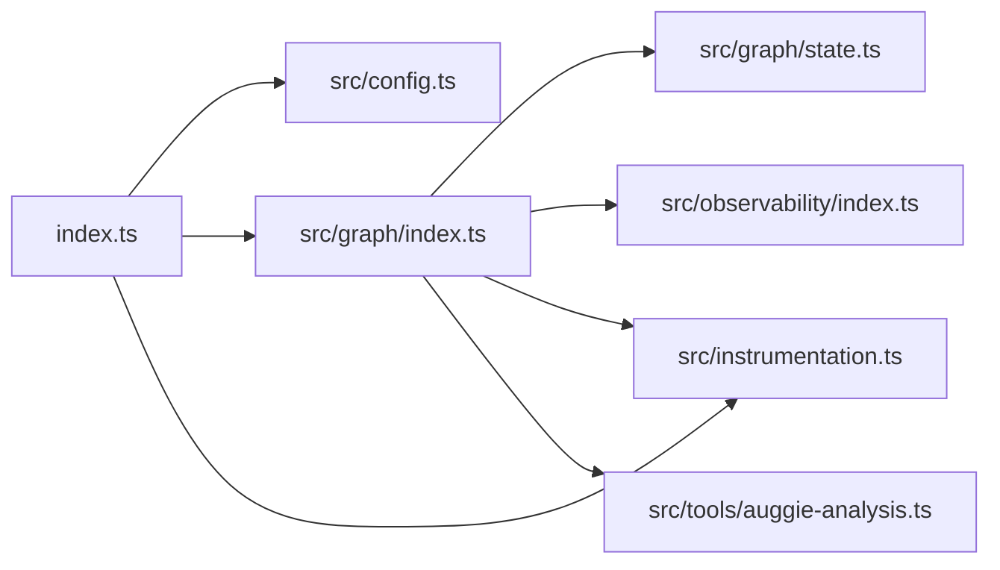

# Command Reference

<cite>
**Referenced Files in This Document**
- [index.ts](file://index.ts)
- [package.json](file://package.json)
- [README.md](file://README.md)
- [src/graph/index.ts](file://src/graph/index.ts)
- [src/graph/state.ts](file://src/graph/state.ts)
- [src/config.ts](file://src/config.ts)
- [src/instrumentation.ts](file://src/instrumentation.ts)
- [src/observability/index.ts](file://src/observability/index.ts)
- [src/tools/auggie-analysis.ts](file://src/tools/auggie-analysis.ts)
- [.bunfig.toml](file://bunfig.toml)
</cite>

## Table of Contents
1. [Introduction](#introduction)
2. [Project Structure](#project-structure)
3. [Core Components](#core-components)
4. [Architecture Overview](#architecture-overview)
5. [Detailed Component Analysis](#detailed-component-analysis)
6. [Dependency Analysis](#dependency-analysis)
7. [Performance Considerations](#performance-considerations)
8. [Troubleshooting Guide](#troubleshooting-guide)
9. [Conclusion](#conclusion)
10. [Appendices](#appendices)

## Introduction
This command reference documents the executable interfaces of OWASP GraphGuard and its programmatic API. It focuses on:
- The primary entry point and its underlying call to run the security analysis pipeline
- Available CLI scripts defined in package.json
- Configuration via environment variables rather than command-line arguments
- The programmatic API surface of runSecurityAnalysis with parameter types and return value structure
- Execution lifecycle concerns including trace flushing and process termination

## Project Structure
The project is organized around a single entry point that initializes observability, loads configuration, and invokes the security analysis graph. Key modules include:
- index.ts: Application entrypoint that orchestrates configuration, analysis, and shutdown
- src/graph/index.ts: Graph orchestration and runSecurityAnalysis function
- src/graph/state.ts: Types for GraphInput, GraphOutput, and SecurityAnalysisState
- src/config.ts: Environment-based configuration loader and credential extraction
- src/instrumentation.ts: OpenTelemetry + Langfuse initialization and graceful shutdown
- src/observability/index.ts: Typed observation wrappers for LLM/tool/retriever/agent/chain
- src/tools/auggie-analysis.ts: Auggie SDK integration for OWASP analysis

**Diagram sources**
- [index.ts](file://index.ts#L1-L52)
- [src/config.ts](file://src/config.ts#L89-L153)
- [src/graph/index.ts](file://src/graph/index.ts#L55-L144)
- [src/graph/state.ts](file://src/graph/state.ts#L150-L173)
- [src/observability/index.ts](file://src/observability/index.ts#L1-L212)
- [src/instrumentation.ts](file://src/instrumentation.ts#L89-L141)
- [src/tools/auggie-analysis.ts](file://src/tools/auggie-analysis.ts#L1-L310)

**Section sources**
- [index.ts](file://index.ts#L1-L52)
- [package.json](file://package.json#L1-L30)

## Core Components
- Primary entry point: bun run index.ts
  - Initializes instrumentation first, validates configuration, extracts Augment credentials, and calls runSecurityAnalysis with repoPath, userQuery, and augmentCredentials.
- CLI scripts:
  - dev: bun run index.ts
  - test: bun test src/
  - test:watch: bun test --watch src/
  - test:coverage: bun test --coverage src/
  - type-check: tsc --noEmit
- Configuration via environment variables:
  - Langfuse keys (public and secret), optional host
  - Augment authentication (sessionAuth JSON or apiToken + apiUrl)
  - LLM provider, model, and API key
  - WORKSPACE_ROOT (default target path)
  - NODE_ENV and LOG_LEVEL

**Section sources**
- [index.ts](file://index.ts#L1-L52)
- [package.json](file://package.json#L1-L30)
- [README.md](file://README.md#L42-L54)
- [src/config.ts](file://src/config.ts#L89-L153)
- [.bunfig.toml](file://.bunfig.toml#L1-L5)

## Architecture Overview
The execution flow starts at the entry point, which delegates to runSecurityAnalysis. The function sets up an agent observation and OpenTelemetry span, compiles the LangGraph, and executes the five-node workflow: input → enumerate → analyze → aggregate → output. Observability is captured via Langfuse generations, tools, retrievers, chains, and agents.

**Diagram sources**
- [index.ts](file://index.ts#L1-L52)
- [src/config.ts](file://src/config.ts#L89-L153)
- [src/graph/index.ts](file://src/graph/index.ts#L55-L144)
- [src/observability/index.ts](file://src/observability/index.ts#L254-L272)
- [src/instrumentation.ts](file://src/instrumentation.ts#L118-L141)

## Detailed Component Analysis

### Primary Entry Point: bun run index.ts
- Purpose: Initialize instrumentation, load configuration, extract Augment credentials, run runSecurityAnalysis, and flush traces before exit.
- Key behaviors:
  - Imports instrumentation first to ensure OpenTelemetry SDK is initialized before any other code.
  - Calls loadConfig() and getAugmentCredentials(config) to validate and derive credentials.
  - Invokes runSecurityAnalysis with repoPath, userQuery, and augmentCredentials.
  - On completion or error, flushes traces via sdk.shutdown() and logs a success message.

**Diagram sources**
- [index.ts](file://index.ts#L1-L52)
- [src/config.ts](file://src/config.ts#L89-L153)
- [src/graph/index.ts](file://src/graph/index.ts#L55-L144)
- [src/instrumentation.ts](file://src/instrumentation.ts#L118-L141)

**Section sources**
- [index.ts](file://index.ts#L1-L52)
- [src/instrumentation.ts](file://src/instrumentation.ts#L89-L141)

### Programmatic API: runSecurityAnalysis
- Signature: runSecurityAnalysis(input: GraphInput): Promise<GraphOutput>
- Parameters (GraphInput):
  - repoPath?: string (defaults to WORKSPACE_ROOT or a default path)
  - userQuery: string
  - scopeFilter?: string
  - augmentCredentials: AugmentCredentials
- Return value (GraphOutput):
  - scanId: string
  - status: GraphStatus ('pending' | 'running' | 'completed' | 'failed')
  - findings: SecurityFinding[]
  - summary: string
  - analyzedCategories: OwaspCategory[]
  - errors: string[]
  - startedAt?: string
  - completedAt?: string

**Diagram sources**
- [src/graph/index.ts](file://src/graph/index.ts#L150-L173)
- [src/graph/state.ts](file://src/graph/state.ts#L37-L49)
- [src/graph/state.ts](file://src/graph/state.ts#L31-L35)
- [src/graph/state.ts](file://src/graph/state.ts#L110-L143)

**Section sources**
- [src/graph/index.ts](file://src/graph/index.ts#L55-L144)
- [src/graph/state.ts](file://src/graph/state.ts#L150-L173)

### Configuration via Environment Variables
- Langfuse:
  - LANGFUSE_PUBLIC_KEY (required)
  - LANGFUSE_SECRET_KEY (required)
  - LANGFUSE_BASE_URL (optional)
- Augment:
  - Either AUGMENT_SESSION_AUTH (full JSON token) or both AUGMENT_API_TOKEN and AUGMENT_API_URL
- LLM:
  - LLM_PROVIDER (anthropic|openai), ANTHROPIC_API_KEY (when anthropic), LLM_MODEL
- Workspace:
  - WORKSPACE_ROOT (default target path)
- Runtime:
  - NODE_ENV (development|production|test)
  - LOG_LEVEL (debug|info|warn|error)

Validation occurs in loadConfig() and exits with code 1 on failure. getAugmentCredentials() derives credentials from validated config.

**Section sources**
- [README.md](file://README.md#L42-L54)
- [src/config.ts](file://src/config.ts#L89-L153)

### CLI Scripts Defined in package.json
- dev: bun run index.ts
- test: bun test src/
- test:watch: bun test --watch src/
- test:coverage: bun test --coverage src/
- type-check: tsc --noEmit

Tests are scoped to the src/ directory via bunfig.toml.

**Section sources**
- [package.json](file://package.json#L1-L30)
- [.bunfig.toml](file://.bunfig.toml#L1-L5)

### Execution Lifecycle and Observability
- Instrumentation initialization:
  - instrumentation.ts imports dotenv and initializes OpenTelemetry with LangfuseSpanProcessor. It validates required environment variables and exports sdk and tracer.
- Shutdown:
  - index.ts calls sdk.shutdown() in a finally block to flush traces before exit.
  - instrumentation.ts registers SIGTERM/SIGINT handlers to gracefully shut down the SDK and exit the process.
- Observability wrappers:
  - withAgent, withTool, withGeneration, withRetriever, withChain are used throughout the codebase to capture rich telemetry and link to Langfuse.

**Diagram sources**
- [index.ts](file://index.ts#L1-L52)
- [src/instrumentation.ts](file://src/instrumentation.ts#L108-L141)

**Section sources**
- [src/instrumentation.ts](file://src/instrumentation.ts#L89-L141)
- [index.ts](file://index.ts#L45-L52)

### Invocation Examples
- Command-line:
  - bun run index.ts
- Programmatic:
  - Import runSecurityAnalysis from src/graph/index.ts and call it with a populated GraphInput object containing repoPath, userQuery, and augmentCredentials derived from loadConfig() and getAugmentCredentials().

Notes:
- The entry point demonstrates a fixed userQuery and repoPath derived from configuration.
- For programmatic usage, construct GraphInput with desired values and pass augmentCredentials extracted from validated configuration.

**Section sources**
- [index.ts](file://index.ts#L15-L30)
- [src/graph/index.ts](file://src/graph/index.ts#L55-L144)
- [src/config.ts](file://src/config.ts#L89-L153)

## Dependency Analysis
- index.ts depends on:
  - src/config.ts for configuration and credentials
  - src/graph/index.ts for runSecurityAnalysis
  - src/instrumentation.ts for tracing initialization and shutdown
- runSecurityAnalysis depends on:
  - src/graph/state.ts for types and state defaults
  - src/observability/index.ts for observation wrappers
  - src/instrumentation.ts for tracer and SDK
  - src/tools/auggie-analysis.ts for Auggie-based analysis (integration point)

**Diagram sources**
- [index.ts](file://index.ts#L1-L52)
- [src/graph/index.ts](file://src/graph/index.ts#L55-L144)
- [src/graph/state.ts](file://src/graph/state.ts#L150-L173)
- [src/observability/index.ts](file://src/observability/index.ts#L1-L212)
- [src/instrumentation.ts](file://src/instrumentation.ts#L89-L141)
- [src/tools/auggie-analysis.ts](file://src/tools/auggie-analysis.ts#L1-L310)

**Section sources**
- [index.ts](file://index.ts#L1-L52)
- [src/graph/index.ts](file://src/graph/index.ts#L55-L144)

## Performance Considerations
- Observability overhead: The dual observability approach (otel + langfuse tracing) adds minimal overhead while providing rich insights. Ensure environment variables are configured to avoid startup delays.
- Auggie SDK usage: The analysis leverages Auggie SDK for orchestration and tool execution. Network latency and model response times impact total runtime.
- Incremental indexing and targeted search: The README highlights DirectContext and targeted search capabilities that can reduce analysis time for repeated scans.

[No sources needed since this section provides general guidance]

## Troubleshooting Guide
- Missing environment variables:
  - instrumentation.ts validates required Langfuse keys and exits if missing.
  - config.ts validates all required keys and exits on failure.
- API errors:
  - src/tools/auggie-analysis.ts catches APIError and BlobTooLargeError, logging appropriate attributes and returning empty findings for transient errors.
- Shutdown issues:
  - Ensure sdk.shutdown() is called to flush traces. index.ts performs this in a finally block.
  - SIGTERM/SIGINT handlers in instrumentation.ts ensure graceful shutdown.

**Section sources**
- [src/instrumentation.ts](file://src/instrumentation.ts#L94-L101)
- [src/instrumentation.ts](file://src/instrumentation.ts#L125-L135)
- [src/config.ts](file://src/config.ts#L111-L118)
- [src/tools/auggie-analysis.ts](file://src/tools/auggie-analysis.ts#L253-L291)

## Conclusion
OWASP GraphGuard exposes a straightforward CLI entry point and a robust programmatic API. Configuration is managed entirely through environment variables, and the execution lifecycle is instrumented with OpenTelemetry and Langfuse for comprehensive observability. The runSecurityAnalysis function provides a clear contract for invoking the security analysis pipeline, returning structured results and metadata suitable for downstream consumption.

[No sources needed since this section summarizes without analyzing specific files]

## Appendices

### Environment Variables Reference
- Required:
  - LANGFUSE_PUBLIC_KEY
  - LANGFUSE_SECRET_KEY
- Optional:
  - LANGFUSE_BASE_URL
  - AUGMENT_SESSION_AUTH (JSON) or AUGMENT_API_TOKEN + AUGMENT_API_URL
  - LLM_PROVIDER, ANTHROPIC_API_KEY, LLM_MODEL
  - WORKSPACE_ROOT
  - NODE_ENV, LOG_LEVEL

**Section sources**
- [README.md](file://README.md#L42-L54)
- [src/config.ts](file://src/config.ts#L89-L153)