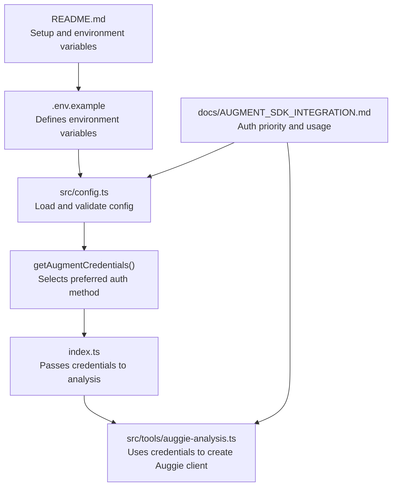
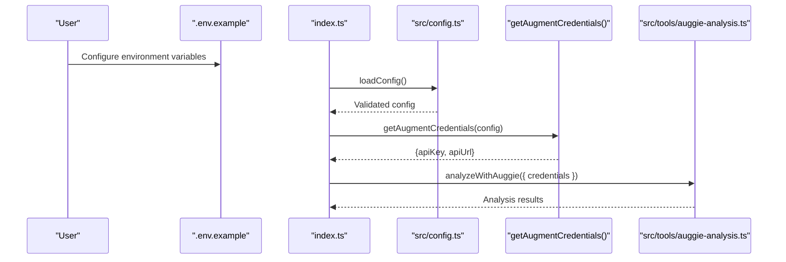
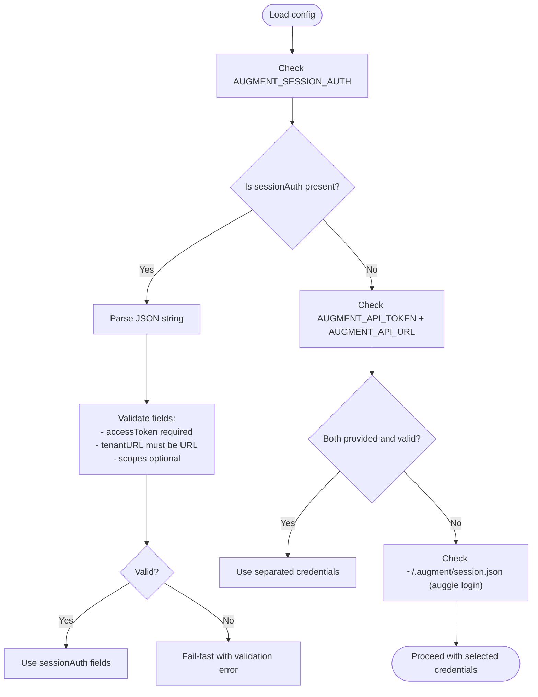
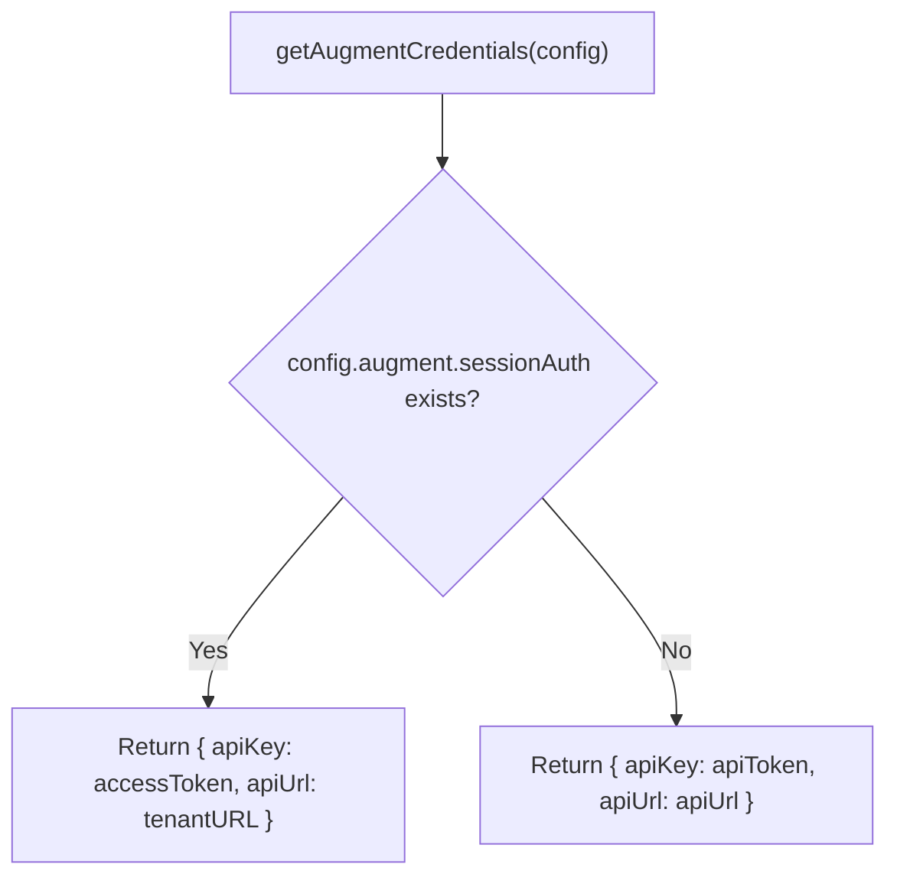
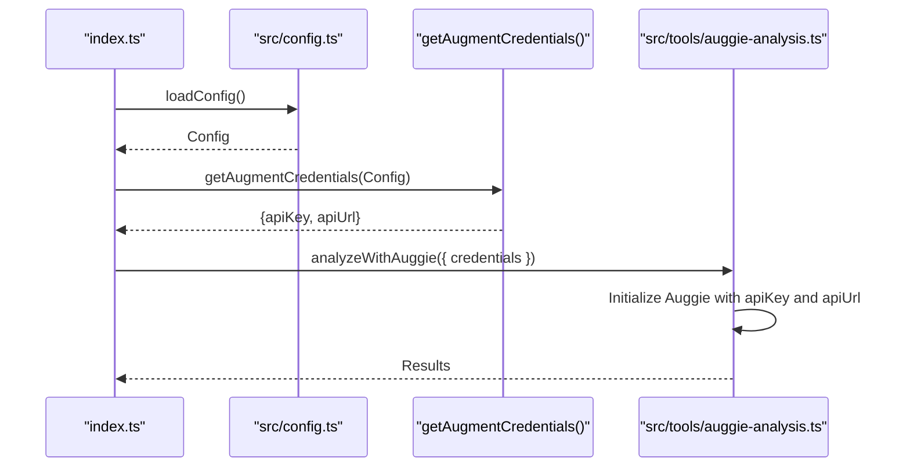
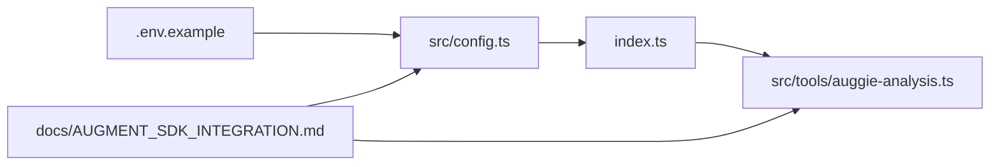

# Authentication Methods

<cite>
**Referenced Files in This Document**
- [.env.example](file://.env.example)
- [src/config.ts](file://src/config.ts)
- [src/instrumentation.ts](file://src/instrumentation.ts)
- [src/tools/auggie-analysis.ts](file://src/tools/auggie-analysis.ts)
- [index.ts](file://index.ts)
- [docs/AUGMENT_SDK_INTEGRATION.md](file://docs/AUGMENT_SDK_INTEGRATION.md)
- [README.md](file://README.md)
</cite>

## Table of Contents
1. [Introduction](#introduction)
2. [Project Structure](#project-structure)
3. [Core Components](#core-components)
4. [Architecture Overview](#architecture-overview)
5. [Detailed Component Analysis](#detailed-component-analysis)
6. [Dependency Analysis](#dependency-analysis)
7. [Performance Considerations](#performance-considerations)
8. [Troubleshooting Guide](#troubleshooting-guide)
9. [Conclusion](#conclusion)

## Introduction
This document explains the dual authentication system for the Augment SDK used by the project. It covers:
- Two primary authentication methods and their priority order
- How the configuration system validates and extracts credentials
- The structure of the session-auth JSON and how it is validated
- Step-by-step instructions for obtaining credentials using the Auggie CLI
- Fallback behavior to a local session file
- Common authentication issues and resolutions
- How credentials are passed to the Auggie SDK

## Project Structure
The authentication logic is centralized in the configuration module and consumed by the entrypoint and analysis tools.

**Diagram sources**
- [.env.example](file://.env.example#L1-L33)
- [src/config.ts](file://src/config.ts#L1-L153)
- [src/tools/auggie-analysis.ts](file://src/tools/auggie-analysis.ts#L1-L310)
- [index.ts](file://index.ts#L1-L52)
- [docs/AUGMENT_SDK_INTEGRATION.md](file://docs/AUGMENT_SDK_INTEGRATION.md#L352-L370)
- [README.md](file://README.md#L42-L70)

**Section sources**
- [src/config.ts](file://src/config.ts#L1-L153)
- [docs/AUGMENT_SDK_INTEGRATION.md](file://docs/AUGMENT_SDK_INTEGRATION.md#L352-L370)
- [.env.example](file://.env.example#L1-L33)
- [README.md](file://README.md#L42-L70)

## Core Components
- Authentication priority order:
  1. AUGMENT_SESSION_AUTH (full JSON token)
  2. AUGMENT_API_TOKEN + AUGMENT_API_URL (separated credentials)
  3. ~/.augment/session.json (automatic fallback from auggie login)
- Validation and extraction:
  - The configuration schema parses and validates environment variables.
  - A dedicated schema enforces the structure of the session-auth JSON.
  - A function selects the preferred credentials and returns apiKey and apiUrl for the Auggie SDK.

Key responsibilities:
- src/config.ts: Defines the schema, validates inputs, and extracts credentials.
- src/tools/auggie-analysis.ts: Receives validated credentials and initializes the Auggie client.
- index.ts: Loads configuration and passes credentials downstream.

**Section sources**
- [src/config.ts](file://src/config.ts#L1-L153)
- [src/tools/auggie-analysis.ts](file://src/tools/auggie-analysis.ts#L120-L193)
- [index.ts](file://index.ts#L1-L52)

## Architecture Overview
The authentication pipeline validates environment variables at startup and prepares credentials for the Auggie SDK.

**Diagram sources**
- [index.ts](file://index.ts#L1-L52)
- [src/config.ts](file://src/config.ts#L89-L153)
- [src/tools/auggie-analysis.ts](file://src/tools/auggie-analysis.ts#L120-L193)

## Detailed Component Analysis

### Authentication Methods and Priority
- Method 1: AUGMENT_SESSION_AUTH (JSON token)
  - Priority: 1
  - Purpose: Full session token containing accessToken, tenantURL, and optional scopes
  - Validation: Enforced by a dedicated schema that requires accessToken and a valid URL for tenantURL
- Method 2: AUGMENT_API_TOKEN + AUGMENT_API_URL (separated credentials)
  - Priority: 2
  - Purpose: Legacy or alternative form of credentials
  - Validation: Both fields are required and apiUrl must be a valid URL
- Fallback: ~/.augment/session.json (automatic from auggie login)
  - Priority: 3
  - Purpose: Local session file created by the Auggie CLI for convenience

Examples in .env.example:
- Recommended: AUGMENT_SESSION_AUTH with a JSON object containing accessToken, tenantURL, and scopes
- Alternative: AUGMENT_API_TOKEN and AUGMENT_API_URL set separately

Priority order and selection:
- The configuration schema enforces that at least one method must be provided.
- The extraction function prefers sessionAuth if present; otherwise it uses the separated apiToken and apiUrl pair.

**Section sources**
- [src/config.ts](file://src/config.ts#L1-L81)
- [src/config.ts](file://src/config.ts#L132-L153)
- [.env.example](file://.env.example#L12-L20)
- [docs/AUGMENT_SDK_INTEGRATION.md](file://docs/AUGMENT_SDK_INTEGRATION.md#L352-L370)

### Session Auth JSON Structure and Validation
The session-auth JSON must include:
- accessToken: Non-empty string
- tenantURL: Valid URL
- scopes: Optional array of strings

Validation occurs at load time using a Zod schema. Invalid or missing fields cause immediate failure with descriptive messages.

**Diagram sources**
- [src/config.ts](file://src/config.ts#L24-L58)
- [src/config.ts](file://src/config.ts#L62-L81)
- [src/config.ts](file://src/config.ts#L132-L153)
- [docs/AUGMENT_SDK_INTEGRATION.md](file://docs/AUGMENT_SDK_INTEGRATION.md#L352-L370)

**Section sources**
- [src/config.ts](file://src/config.ts#L24-L58)
- [src/config.ts](file://src/config.ts#L62-L81)
- [src/config.ts](file://src/config.ts#L132-L153)

### Obtaining Credentials with Auggie CLI
- Print the full JSON token:
  - Use the Auggie CLI to print the session token and copy the JSON output.
  - Set it as the AUGMENT_SESSION_AUTH environment variable.
- Alternatively, authenticate with the Auggie CLI to create a local session file:
  - The project documentation mentions that ~/.augment/session.json is created by auggie login and serves as a fallback.

Step-by-step instructions:
- Install and authenticate the Auggie CLI
- Run the command to print the token and copy the JSON
- Set the environment variable to the copied JSON
- Confirm that the configuration loads without errors

**Section sources**
- [README.md](file://README.md#L56-L64)
- [docs/AUGMENT_SDK_INTEGRATION.md](file://docs/AUGMENT_SDK_INTEGRATION.md#L352-L370)

### Fallback Behavior to ~/.augment/session.json
- The project documentation lists ~/.augment/session.json as a potential third option that is populated by auggie login.
- The configuration module defines the schema and extraction logic; the fallback is documented conceptually in the integration guide.
- If neither sessionAuth nor separated credentials are provided, the system relies on the presence of the local session file as indicated in the documentation.

**Section sources**
- [docs/AUGMENT_SDK_INTEGRATION.md](file://docs/AUGMENT_SDK_INTEGRATION.md#L352-L370)

### How getAugmentCredentials() Selects Between Methods
- If sessionAuth is present, the function returns:
  - apiKey: sessionAuth.accessToken
  - apiUrl: sessionAuth.tenantURL
- Otherwise, it returns:
  - apiKey: apiToken
  - apiUrl: apiUrl
- The configuration schema guarantees that at least one method is valid, so the extraction function safely accesses the non-null fields.

**Diagram sources**
- [src/config.ts](file://src/config.ts#L132-L153)

**Section sources**
- [src/config.ts](file://src/config.ts#L132-L153)

### Passing Credentials to the Auggie SDK
- The entrypoint loads configuration and extracts credentials.
- The analysis tool receives credentials and initializes the Auggie client with apiKey and apiUrl.
- The tool logs the API URL and proceeds with analysis.

**Diagram sources**
- [index.ts](file://index.ts#L1-L52)
- [src/config.ts](file://src/config.ts#L132-L153)
- [src/tools/auggie-analysis.ts](file://src/tools/auggie-analysis.ts#L120-L193)

**Section sources**
- [index.ts](file://index.ts#L1-L52)
- [src/tools/auggie-analysis.ts](file://src/tools/auggie-analysis.ts#L120-L193)

## Dependency Analysis
- index.ts depends on src/config.ts for configuration and credential extraction.
- src/tools/auggie-analysis.ts depends on validated credentials to create the Auggie client.
- src/config.ts depends on environment variables and Zod schemas for validation.
- docs/AUGMENT_SDK_INTEGRATION.md documents the intended priority and usage patterns.

**Diagram sources**
- [.env.example](file://.env.example#L1-L33)
- [src/config.ts](file://src/config.ts#L1-L153)
- [index.ts](file://index.ts#L1-L52)
- [src/tools/auggie-analysis.ts](file://src/tools/auggie-analysis.ts#L1-L310)
- [docs/AUGMENT_SDK_INTEGRATION.md](file://docs/AUGMENT_SDK_INTEGRATION.md#L352-L370)

**Section sources**
- [src/config.ts](file://src/config.ts#L1-L153)
- [src/tools/auggie-analysis.ts](file://src/tools/auggie-analysis.ts#L1-L310)
- [index.ts](file://index.ts#L1-L52)
- [docs/AUGMENT_SDK_INTEGRATION.md](file://docs/AUGMENT_SDK_INTEGRATION.md#L352-L370)

## Performance Considerations
- Authentication validation happens at startup via Zod parsing, enabling fail-fast behavior and avoiding runtime errors during analysis.
- Using sessionAuth avoids the need to separately manage two environment variables and reduces configuration overhead.
- The fallback to a local session file simplifies setup for developers who rely on the Auggie CLI.

[No sources needed since this section provides general guidance]

## Troubleshooting Guide
Common authentication issues and resolutions:
- Missing or invalid credentials:
  - Ensure at least one authentication method is configured.
  - For sessionAuth, confirm the JSON is valid and includes accessToken and a valid tenantURL.
  - For separated credentials, ensure both apiToken and apiUrl are set and apiUrl is a valid URL.
- Token expiration:
  - Regenerate the session token using the Auggie CLI and update the environment variable.
- Incorrect URLs:
  - Verify that tenantURL or apiUrl matches the expected tenant endpoint.
- Permission scopes:
  - The session-auth JSON may include scopes; ensure they grant sufficient permissions for the desired operations.
- Fallback session file:
  - If using ~/.augment/session.json, ensure the Auggie CLI login was successful and the file exists.

**Section sources**
- [src/config.ts](file://src/config.ts#L62-L81)
- [src/config.ts](file://src/config.ts#L132-L153)
- [docs/AUGMENT_SDK_INTEGRATION.md](file://docs/AUGMENT_SDK_INTEGRATION.md#L622-L632)

## Conclusion
The project’s authentication system provides a robust, prioritized approach to configuring the Augment SDK:
- Prefer the full session-auth JSON for simplicity and completeness.
- Fall back to separated credentials or a local session file when needed.
- Centralized validation and extraction ensure credentials are ready for the Auggie SDK at runtime.
- The documentation and examples clarify setup steps and common pitfalls.

[No sources needed since this section summarizes without analyzing specific files]