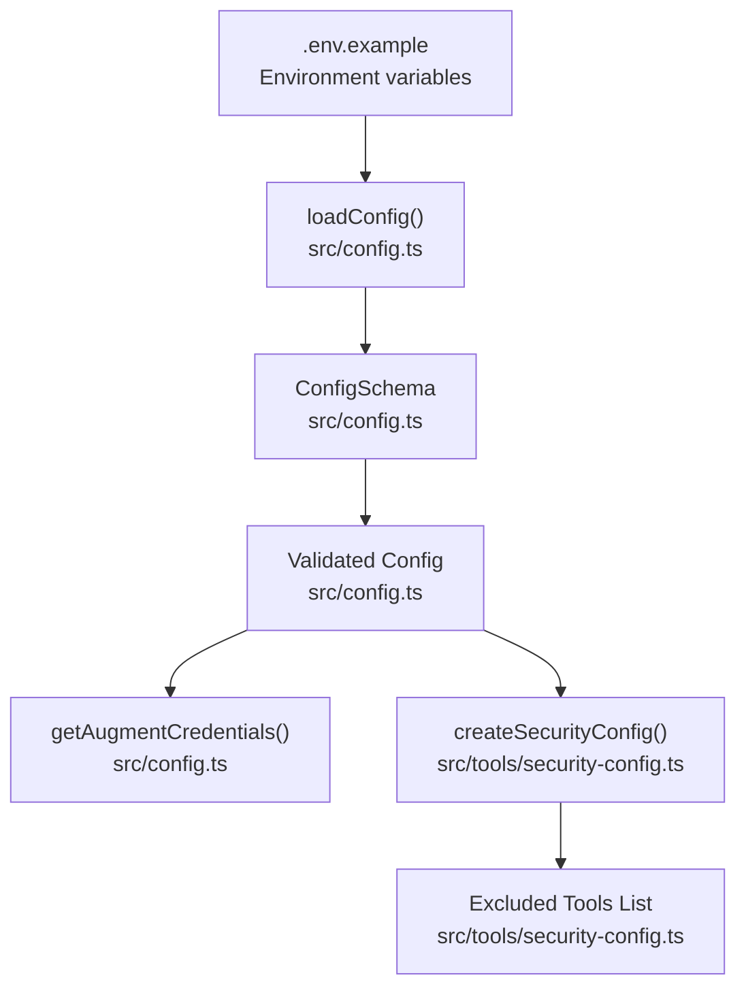
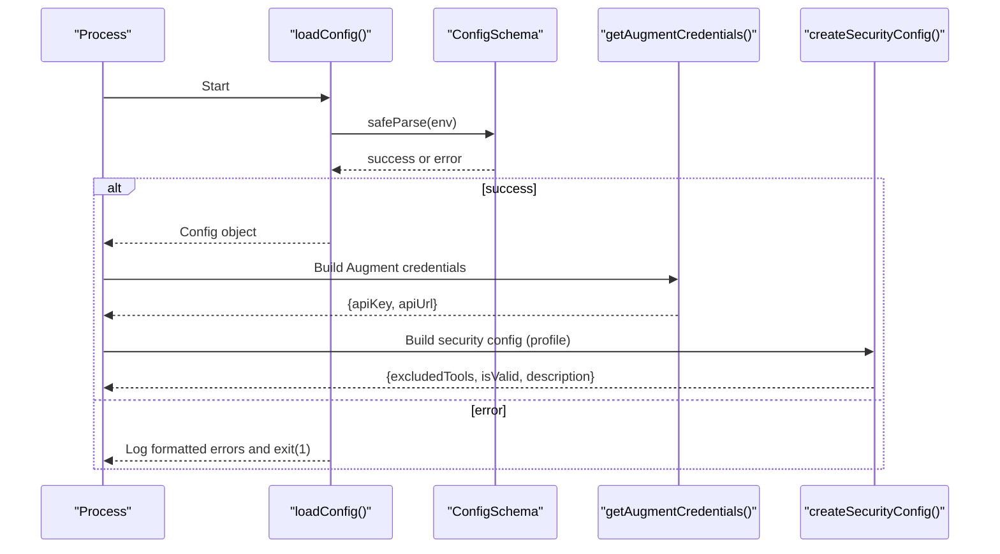
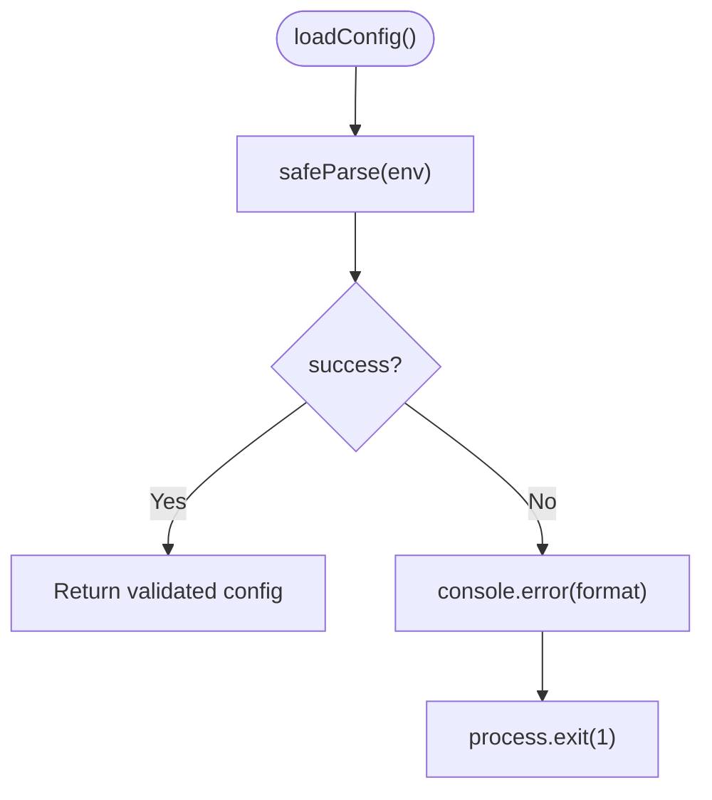
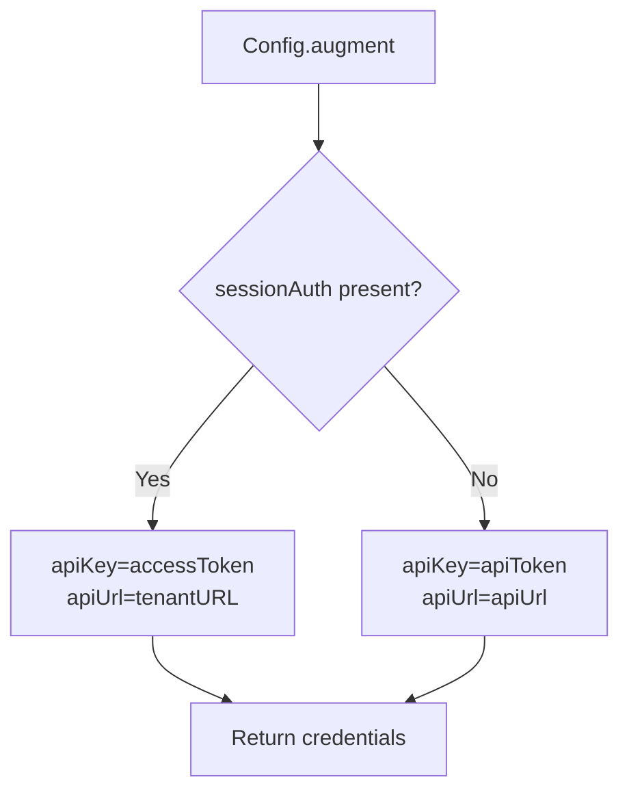
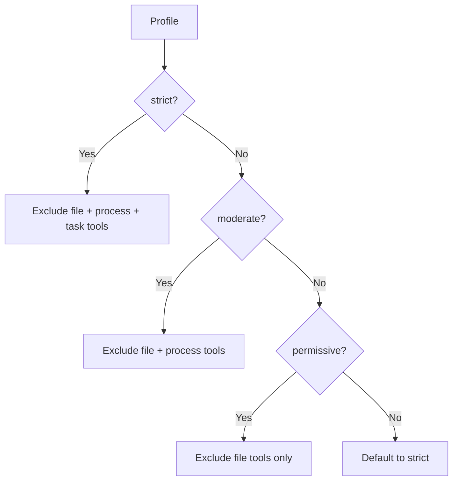
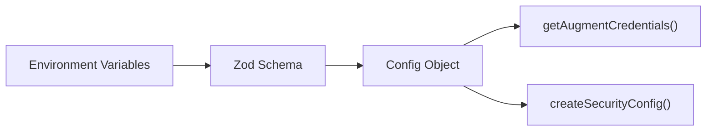

# Configuration Guide

<cite>
**Referenced Files in This Document**
- [.env.example](file://.env.example)
- [README.md](file://README.md)
- [src/config.ts](file://src/config.ts)
- [src/config.test.ts](file://src/config.test.ts)
- [src/tools/security-config.ts](file://src/tools/security-config.ts)
</cite>

## Table of Contents
1. [Introduction](#introduction)
2. [Project Structure](#project-structure)
3. [Core Components](#core-components)
4. [Architecture Overview](#architecture-overview)
5. [Detailed Component Analysis](#detailed-component-analysis)
6. [Dependency Analysis](#dependency-analysis)
7. [Performance Considerations](#performance-considerations)
8. [Troubleshooting Guide](#troubleshooting-guide)
9. [Conclusion](#conclusion)

## Introduction
This guide documents how to configure the application using environment variables and security profiles. It explains all options from the provided example, describes fail-fast validation with Zod, outlines the three security profiles and their impact on analysis, and details how credentials are parsed and validated. It also provides examples of valid and invalid configurations, troubleshooting steps for common issues, and the rationale and security implications of environment-based configuration.

## Project Structure
The configuration system centers around environment variables mapped to a Zod schema that validates inputs at startup. Security configuration is provided separately and controls which tools are disabled during analysis.

**Diagram sources**
- [src/config.ts](file://src/config.ts#L88-L151)
- [src/tools/security-config.ts](file://src/tools/security-config.ts#L167-L178)
- [.env.example](file://.env.example#L1-L33)

**Section sources**
- [.env.example](file://.env.example#L1-L33)
- [README.md](file://README.md#L42-L64)

## Core Components
- Environment variables and defaults:
  - Langfuse keys and base URL
  - Augment credentials (session auth JSON or separated token + URL)
  - LLM provider and API key
  - Workspace root, Node environment, and log level
- Validation and fail-fast exit:
  - Zod schema enforces presence, prefixes, URLs, and mutual exclusivity/refinement
  - On failure, the process exits immediately with a formatted error
- Credential extraction:
  - Prefer session auth JSON; otherwise use separated token + URL
- Security profiles:
  - Strict, moderate, and permissive define which tools are excluded during analysis

**Section sources**
- [src/config.ts](file://src/config.ts#L35-L118)
- [src/config.ts](file://src/config.ts#L138-L151)
- [src/tools/security-config.ts](file://src/tools/security-config.ts#L30-L100)

## Architecture Overview
The configuration pipeline is a single pass that reads environment variables, validates them, and produces a strongly typed configuration object. Security configuration is derived independently and passed to the analysis engine to enforce safe tool usage.

**Diagram sources**
- [src/config.ts](file://src/config.ts#L88-L118)
- [src/config.ts](file://src/config.ts#L138-L151)
- [src/tools/security-config.ts](file://src/tools/security-config.ts#L167-L178)

## Detailed Component Analysis

### Environment Variables and Defaults
- Langfuse:
  - Required keys: public and secret key with specific prefixes
  - Optional base URL with default
- Augment:
  - Either session auth JSON (recommended) or both token and URL
  - Session auth JSON must include access token and tenant URL; optional scopes
- LLM:
  - Provider and API key with default model
- Application:
  - Workspace root, Node environment, and log level with defaults

These options are documented in the example and README, and enforced by the Zod schema.

**Section sources**
- [.env.example](file://.env.example#L6-L33)
- [README.md](file://README.md#L42-L64)
- [src/config.ts](file://src/config.ts#L35-L81)

### Fail-Fast Validation with Zod
- The schema validates:
  - Presence and prefixes for keys
  - URL formats for base URLs
  - Mutual exclusivity/refinement for Augment credentials
  - Enumerations for environment and log level
- On validation failure, the process logs a formatted error and exits with code 1.

**Diagram sources**
- [src/config.ts](file://src/config.ts#L88-L118)

**Section sources**
- [src/config.ts](file://src/config.ts#L88-L118)
- [src/config.test.ts](file://src/config.test.ts#L116-L197)

### Augment Credentials Parsing and Validation
- Two supported methods:
  - Session auth JSON: parsed and validated at load time
  - Separated token + URL: validated as a pair
- getAugmentCredentials prefers session auth; otherwise uses separated credentials

**Diagram sources**
- [src/config.ts](file://src/config.ts#L138-L151)

**Section sources**
- [src/config.ts](file://src/config.ts#L45-L70)
- [src/config.ts](file://src/config.ts#L138-L151)
- [src/config.test.ts](file://src/config.test.ts#L18-L64)

### Security Profiles and Their Impact
- Profiles:
  - Strict: disables file modification, process execution, and task modification tools
  - Moderate: disables file modification and process execution tools
  - Permissive: disables only file modification tools
- Validation and description helpers ensure critical protections are in place and provide a human-readable summary.

**Diagram sources**
- [src/tools/security-config.ts](file://src/tools/security-config.ts#L70-L99)
- [src/tools/security-config.ts](file://src/tools/security-config.ts#L101-L147)

**Section sources**
- [src/tools/security-config.ts](file://src/tools/security-config.ts#L30-L100)
- [src/tools/security-config.ts](file://src/tools/security-config.ts#L148-L181)

### Valid and Invalid Configuration Examples
- Valid examples (from tests):
  - Langfuse keys with session auth JSON
  - Langfuse keys with separated token + URL
  - Defaults applied for unspecified fields
  - Custom LLM model override
- Invalid examples (from tests):
  - Missing Langfuse keys or wrong prefixes
  - Invalid URL formats
  - Missing or incomplete separated credentials
  - Invalid JSON in session auth
  - Missing Anthropic API key
  - Invalid enumerations for environment or log level
  - Invalid LLM provider

See the test suite for concrete scenarios and expected outcomes.

**Section sources**
- [src/config.test.ts](file://src/config.test.ts#L18-L114)
- [src/config.test.ts](file://src/config.test.ts#L116-L484)

## Dependency Analysis
- Configuration depends on environment variables and Zod schema
- Credentials extraction depends on validated configuration
- Security configuration is independent but integrates with analysis

**Diagram sources**
- [src/config.ts](file://src/config.ts#L88-L151)
- [src/tools/security-config.ts](file://src/tools/security-config.ts#L167-L178)

**Section sources**
- [src/config.ts](file://src/config.ts#L88-L151)
- [src/tools/security-config.ts](file://src/tools/security-config.ts#L167-L178)

## Performance Considerations
- Validation occurs once at startup; keep environment variables minimal and correct to avoid repeated restarts
- Using session auth JSON avoids extra parsing overhead compared to separated credentials
- Security profile selection impacts tool availability; choose the least restrictive profile that meets your operational needs

[No sources needed since this section provides general guidance]

## Troubleshooting Guide
Common issues and resolutions:
- Authentication failures:
  - Ensure either session auth JSON is set or both token and URL are provided
  - Verify JSON is valid and includes required fields
  - Confirm tenant URL is a valid URL
- Missing or invalid keys:
  - Langfuse public and secret keys must match expected prefixes
  - Anthropic API key must match expected prefix
- Invalid environment values:
  - NODE_ENV and LOG_LEVEL must be among allowed values
  - LLM provider must be among allowed values
- Base URL issues:
  - LANGFUSE_BASE_URL must be a valid URL
- Workspace root:
  - Ensure the path exists and is readable

Validation failures produce a formatted error and cause immediate exit; review the printed messages and correct the environment accordingly.

**Section sources**
- [src/config.ts](file://src/config.ts#L88-L118)
- [src/config.test.ts](file://src/config.test.ts#L116-L484)

## Conclusion
Environment-based configuration centralizes deployment settings and enables fail-fast validation to prevent misconfiguration from reaching runtime. The Zod schema enforces correctness early, while the security profiles provide tunable safeguards for analysis. Use session auth JSON when possible for simplicity and robustness, and select the appropriate security profile for your risk tolerance.