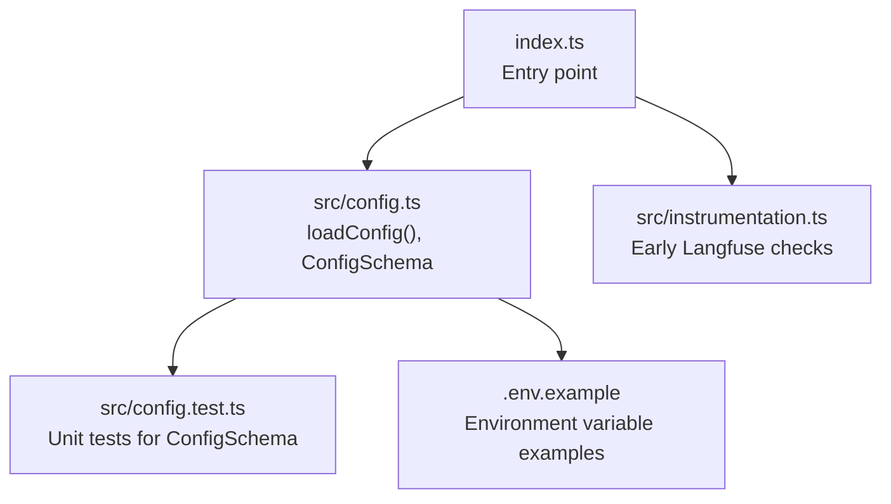
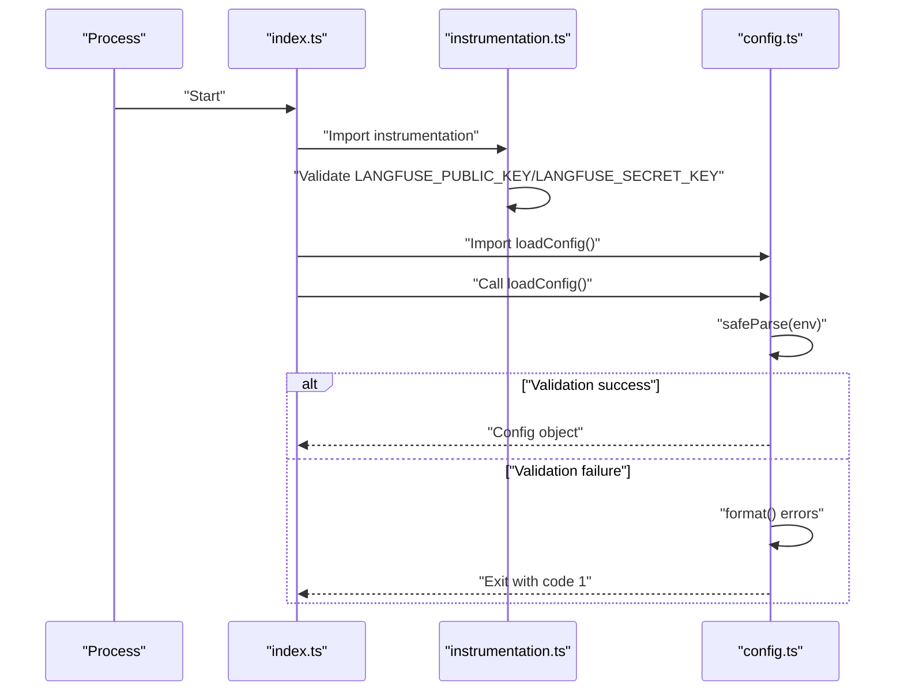
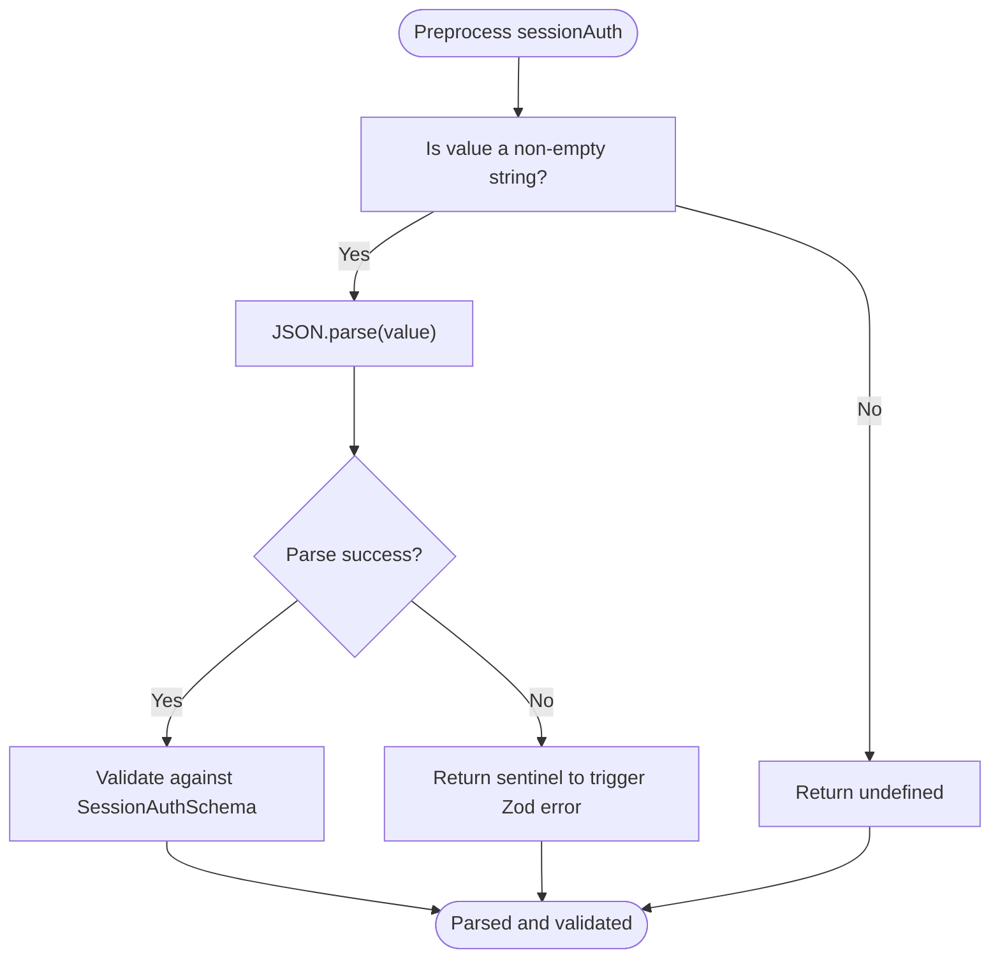
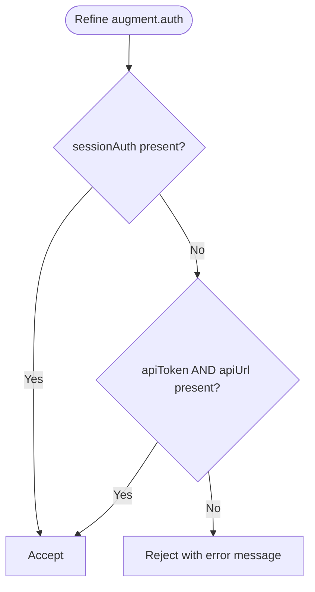
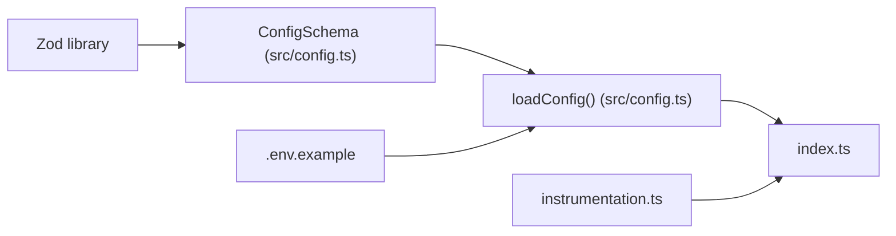

# Configuration Validation

<cite>
**Referenced Files in This Document**
- [index.ts](file://index.ts)
- [src/config.ts](file://src/config.ts)
- [src/config.test.ts](file://src/config.test.ts)
- [.env.example](file://.env.example)
- [src/instrumentation.ts](file://src/instrumentation.ts)
</cite>

## Table of Contents
1. [Introduction](#introduction)
2. [Project Structure](#project-structure)
3. [Core Components](#core-components)
4. [Architecture Overview](#architecture-overview)
5. [Detailed Component Analysis](#detailed-component-analysis)
6. [Dependency Analysis](#dependency-analysis)
7. [Performance Considerations](#performance-considerations)
8. [Troubleshooting Guide](#troubleshooting-guide)
9. [Conclusion](#conclusion)

## Introduction
This document explains the configuration validation system built with Zod in config.ts. It focuses on how the ConfigSchema validates environment variables at startup using fail-fast principles, the structure of nested configuration objects for langfuse, augment, and llm, and the preprocessing and validation logic for AUGMENT_SESSION_AUTH. It also documents the refine() enforcement for authentication requirements (sessionAuth OR apiToken+apiUrl), how validation errors are formatted and reported, and provides examples of invalid configurations and corresponding error messages. Finally, it outlines troubleshooting strategies for validation failures and highlights the safeParse() pattern used in loadConfig() along with process exit behavior.

## Project Structure
The configuration validation lives in a dedicated module and is consumed by the application entrypoint. The instrumentation module performs its own early checks for Langfuse keys, while the main config module validates all environment variables and exits immediately on failure.

**Diagram sources**
- [index.ts](file://index.ts#L1-L10)
- [src/config.ts](file://src/config.ts#L85-L118)
- [src/config.test.ts](file://src/config.test.ts#L1-L40)
- [.env.example](file://.env.example#L1-L33)
- [src/instrumentation.ts](file://src/instrumentation.ts#L94-L101)

**Section sources**
- [index.ts](file://index.ts#L1-L10)
- [src/config.ts](file://src/config.ts#L85-L118)
- [src/config.test.ts](file://src/config.test.ts#L1-L40)
- [.env.example](file://.env.example#L1-L33)
- [src/instrumentation.ts](file://src/instrumentation.ts#L94-L101)

## Core Components
- Zod-based ConfigSchema: Defines the shape and validation rules for all configuration fields, including defaults and error messages.
- SessionAuthSchema: Validates the parsed structure of AUGMENT_SESSION_AUTH JSON.
- loadConfig(): Reads environment variables, applies safeParse(), prints formatted errors, and exits on failure.
- getAugmentCredentials(): Extracts Augment SDK credentials from validated config, preferring sessionAuth over separated apiToken/apiUrl.

Key responsibilities:
- Fail-fast validation at startup to prevent runtime surprises.
- Clear, structured error reporting via Zod’s format() method.
- Support for two authentication modes for Augment SDK with explicit enforcement.

**Section sources**
- [src/config.ts](file://src/config.ts#L24-L84)
- [src/config.ts](file://src/config.ts#L85-L118)
- [src/config.ts](file://src/config.ts#L132-L152)

## Architecture Overview
The configuration system is invoked at process startup. The entrypoint imports instrumentation (which validates Langfuse keys) and then imports config to validate all remaining environment variables. On success, the app proceeds; on failure, it logs formatted errors and exits.

**Diagram sources**
- [index.ts](file://index.ts#L1-L10)
- [src/instrumentation.ts](file://src/instrumentation.ts#L94-L101)
- [src/config.ts](file://src/config.ts#L85-L118)

## Detailed Component Analysis

### Zod Schema Structure and Fail-Fast Validation
The ConfigSchema defines nested objects for langfuse, augment, and llm, with defaults and strict validation rules. It uses safeParse() to validate environment variables at startup and exits immediately on failure.

Highlights:
- langfuse: Requires public and secret keys with specific prefixes, defaults host URL, and enforces URL format.
- augment: Supports two authentication modes:
  - sessionAuth: Full JSON token parsed at load time with SessionAuthSchema validation.
  - apiToken + apiUrl: Alternative mode enforced together by refine().
- llm: Enforces provider enum and API key prefix, with defaults for provider and model.
- Defaults: workspaceRoot, nodeEnv, logLevel.

Fail-fast behavior:
- loadConfig() prints formatted errors and exits with code 1 when validation fails.

**Section sources**
- [src/config.ts](file://src/config.ts#L35-L81)
- [src/config.ts](file://src/config.ts#L85-L118)

### AUGMENT_SESSION_AUTH Preprocessing and Validation
The augment.sessionAuth field uses z.preprocess() to parse the raw environment value as JSON and then validates it against SessionAuthSchema. If JSON parsing fails, the preprocess function returns a sentinel value that allows Zod to report the error. SessionAuthSchema enforces:
- accessToken: required string.
- tenantURL: required URL string.
- scopes: optional array of strings.

This ensures invalid JSON or missing fields are caught early and reported clearly.

**Diagram sources**
- [src/config.ts](file://src/config.ts#L47-L58)
- [src/config.ts](file://src/config.ts#L24-L28)

**Section sources**
- [src/config.ts](file://src/config.ts#L47-L58)
- [src/config.ts](file://src/config.ts#L24-L28)

### Authentication Refinement: sessionAuth OR apiToken+apiUrl
The augment object uses refine() to enforce that at least one of the following is provided:
- sessionAuth (parsed JSON)
- apiToken AND apiUrl (both required together)

If neither condition is met, the refine() callback returns false and Zod reports the configured error message.

**Diagram sources**
- [src/config.ts](file://src/config.ts#L62-L70)

**Section sources**
- [src/config.ts](file://src/config.ts#L62-L70)

### Error Formatting and Reporting
On validation failure, loadConfig() calls result.error.format() to produce a structured error object keyed by field paths. The error is printed to stderr and the process exits with code 1. Tests demonstrate that formatted errors include field-specific messages and arrays of top-level errors.

Examples of formatted error shapes observed in tests:
- Field-level errors under nested objects (e.g., langfuse.publicKey, llm.apiKey).
- Top-level errors under augment when authentication requirements are not met.

**Section sources**
- [src/config.ts](file://src/config.ts#L111-L115)
- [src/config.test.ts](file://src/config.test.ts#L159-L161)
- [src/config.test.ts](file://src/config.test.ts#L213-L215)

### loadConfig() SafeParse Pattern and Process Exit Behavior
The loadConfig() function:
- Collects environment variables into an object matching ConfigSchema.
- Calls safeParse() to validate.
- On failure:
  - Prints "Configuration validation failed:" followed by formatted errors.
  - Exits with code 1.
- On success:
  - Returns the validated Config object.

This pattern ensures immediate failure on invalid configuration and prevents downstream runtime errors.

**Section sources**
- [src/config.ts](file://src/config.ts#L85-L118)

### Example Invalid Configurations and Error Messages
Below are representative invalid scenarios and the resulting validation outcomes. These examples are derived from tests and schema definitions.

- Missing Langfuse public key:
  - Outcome: Validation fails; formatted error includes langfuse.publicKey.
- Missing Langfuse secret key:
  - Outcome: Validation fails; formatted error includes langfuse.secretKey.
- Invalid Langfuse public key prefix:
  - Outcome: Validation fails; formatted error includes langfuse.publicKey.
- Invalid Langfuse secret key prefix:
  - Outcome: Validation fails; formatted error includes langfuse.secretKey.
- Invalid Langfuse host URL:
  - Outcome: Validation fails.
- Missing Augment credentials:
  - Outcome: Validation fails; formatted error includes augment._errors.
- Incomplete separated Augment credentials (token only):
  - Outcome: Validation fails.
- Incomplete separated Augment credentials (URL only):
  - Outcome: Validation fails.
- Invalid Augment API URL:
  - Outcome: Validation fails.
- Invalid JSON in sessionAuth:
  - Outcome: Validation fails; JSON parsing error surfaced by preprocess.
- sessionAuth missing accessToken:
  - Outcome: Validation fails; formatted error includes sessionAuth.accessToken.
- sessionAuth missing tenantURL:
  - Outcome: Validation fails; formatted error includes sessionAuth.tenantURL.
- sessionAuth with invalid tenantURL:
  - Outcome: Validation fails; formatted error includes sessionAuth.tenantURL.
- sessionAuth with empty accessToken:
  - Outcome: Validation fails; formatted error includes sessionAuth.accessToken.
- Missing Anthropic API key:
  - Outcome: Validation fails; formatted error includes llm.apiKey.
- Invalid Anthropic API key prefix:
  - Outcome: Validation fails; formatted error includes llm.apiKey.
- Invalid nodeEnv value:
  - Outcome: Validation fails.
- Invalid logLevel value:
  - Outcome: Validation fails.
- Invalid LLM provider:
  - Outcome: Validation fails.

These examples illustrate the granularity of Zod’s error reporting and the effectiveness of fail-fast validation.

**Section sources**
- [src/config.test.ts](file://src/config.test.ts#L117-L181)
- [src/config.test.ts](file://src/config.test.ts#L183-L197)
- [src/config.test.ts](file://src/config.test.ts#L199-L216)
- [src/config.test.ts](file://src/config.test.ts#L218-L248)
- [src/config.test.ts](file://src/config.test.ts#L250-L264)
- [src/config.test.ts](file://src/config.test.ts#L266-L279)
- [src/config.test.ts](file://src/config.test.ts#L281-L324)
- [src/config.test.ts](file://src/config.test.ts#L326-L339)
- [src/config.test.ts](file://src/config.test.ts#L341-L373)
- [src/config.test.ts](file://src/config.test.ts#L375-L405)
- [src/config.test.ts](file://src/config.test.ts#L407-L423)

### Environment Variable Mapping and Defaults
The schema maps environment variables to configuration fields and applies sensible defaults when values are omitted. The .env.example file provides recommended values and formats for all required variables.

Defaults observed:
- langfuse.host: defaults to a known Langfuse URL.
- llm.provider: defaults to a specific provider.
- llm.model: defaults to a specific model identifier.
- workspaceRoot: defaults to a local path.
- nodeEnv: defaults to a development environment.
- logLevel: defaults to a standard logging level.

**Section sources**
- [src/config.ts](file://src/config.ts#L35-L81)
- [.env.example](file://.env.example#L1-L33)

## Dependency Analysis
The configuration module depends on Zod for schema definition and validation. The entrypoint depends on config.ts to validate environment variables before proceeding. The instrumentation module performs its own early checks for Langfuse keys, complementing the broader config validation.

**Diagram sources**
- [src/config.ts](file://src/config.ts#L1-L20)
- [src/config.ts](file://src/config.ts#L85-L118)
- [index.ts](file://index.ts#L1-L10)
- [src/instrumentation.ts](file://src/instrumentation.ts#L94-L101)
- [.env.example](file://.env.example#L1-L33)

**Section sources**
- [src/config.ts](file://src/config.ts#L1-L20)
- [src/config.ts](file://src/config.ts#L85-L118)
- [index.ts](file://index.ts#L1-L10)
- [src/instrumentation.ts](file://src/instrumentation.ts#L94-L101)
- [.env.example](file://.env.example#L1-L33)

## Performance Considerations
- Validation cost: Zod safeParse() is lightweight and runs once at startup, minimizing overhead.
- Early exit: Fail-fast prevents unnecessary initialization and reduces risk of cascading errors.
- Preprocessing: JSON parsing occurs only when sessionAuth is set, avoiding unnecessary work.

[No sources needed since this section provides general guidance]

## Troubleshooting Guide
Common issues and resolutions:
- Missing or incorrect Langfuse keys:
  - Ensure LANGFUSE_PUBLIC_KEY and LANGFUSE_SECRET_KEY are set with the required prefixes.
  - Verify LANGFUSE_HOST is a valid URL if overridden.
- Missing Augment credentials:
  - Provide either AUGMENT_SESSION_AUTH (full JSON) or both AUGMENT_API_TOKEN and AUGMENT_API_URL.
  - If using sessionAuth, ensure the JSON is valid and contains accessToken and tenantURL.
- Invalid Anthropic API key:
  - Ensure ANTHROPIC_API_KEY starts with the required prefix.
- Invalid nodeEnv or logLevel:
  - Use allowed values from the enums defined in the schema.
- Invalid LLM provider:
  - Use supported providers as defined in the schema.

Where to look:
- loadConfig() prints formatted errors to stderr; review these messages for precise field-level issues.
- Refer to tests for examples of invalid configurations and expected error messages.

**Section sources**
- [src/config.ts](file://src/config.ts#L85-L118)
- [src/config.test.ts](file://src/config.test.ts#L117-L181)
- [src/config.test.ts](file://src/config.test.ts#L183-L197)
- [src/config.test.ts](file://src/config.test.ts#L199-L216)
- [src/config.test.ts](file://src/config.test.ts#L218-L248)
- [src/config.test.ts](file://src/config.test.ts#L250-L264)
- [src/config.test.ts](file://src/config.test.ts#L266-L279)
- [src/config.test.ts](file://src/config.test.ts#L281-L324)
- [src/config.test.ts](file://src/config.test.ts#L326-L339)
- [src/config.test.ts](file://src/config.test.ts#L341-L373)
- [src/config.test.ts](file://src/config.test.ts#L375-L405)
- [src/config.test.ts](file://src/config.test.ts#L407-L423)

## Conclusion
The configuration validation system in config.ts provides robust, fail-fast validation of environment variables using Zod. It supports two authentication modes for Augment SDK, enforces strict field requirements, and reports detailed, structured errors. The loadConfig() function centralizes validation and ensures the application starts only with a valid configuration. By combining this system with the instrumentation module’s early checks, the project achieves reliable startup-time validation and clear feedback for misconfiguration.