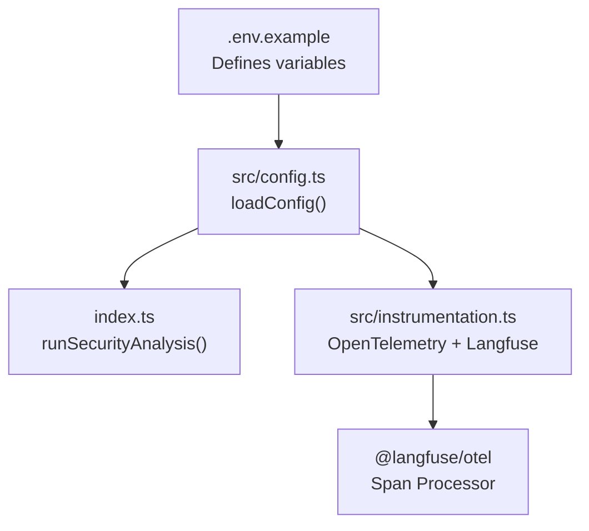
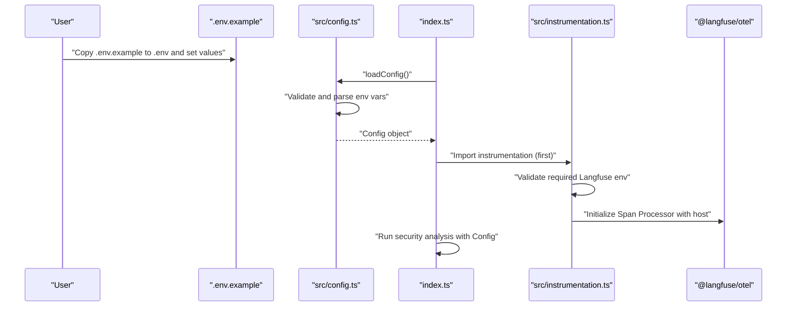
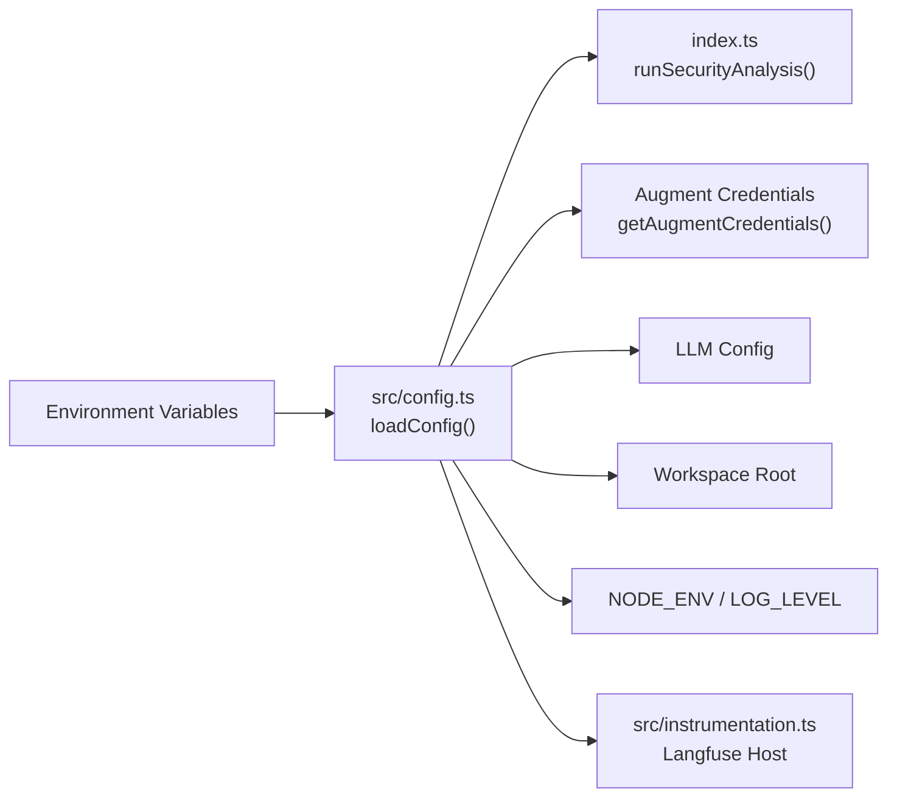

# Environment Variables

<cite>
**Referenced Files in This Document**
- [.env.example](file://.env.example)
- [README.md](file://README.md)
- [src/config.ts](file://src/config.ts)
- [src/instrumentation.ts](file://src/instrumentation.ts)
- [index.ts](file://index.ts)
- [src/config.test.ts](file://src/config.test.ts)
</cite>

## Table of Contents
1. [Introduction](#introduction)
2. [Project Structure](#project-structure)
3. [Core Components](#core-components)
4. [Architecture Overview](#architecture-overview)
5. [Detailed Component Analysis](#detailed-component-analysis)
6. [Dependency Analysis](#dependency-analysis)
7. [Performance Considerations](#performance-considerations)
8. [Troubleshooting Guide](#troubleshooting-guide)
9. [Conclusion](#conclusion)

## Introduction
This document explains the environment variables used to configure OWASP GraphGuard. It covers each variable’s purpose, expected format, defaults, required vs. optional status across operational phases, real-world examples, common mistakes, and where to obtain credentials. It also details how these variables are consumed by the configuration loader and mapped to the Config type.

## Project Structure
The configuration pipeline is driven by environment variables loaded and validated by a dedicated configuration module. The instrumentation module initializes OpenTelemetry and Langfuse tracing using Langfuse credentials. The application entrypoint validates configuration and starts the security analysis workflow.

**Diagram sources**
- [.env.example](file://.env.example#L1-L33)
- [src/config.ts](file://src/config.ts#L85-L118)
- [index.ts](file://index.ts#L1-L52)
- [src/instrumentation.ts](file://src/instrumentation.ts#L89-L141)

**Section sources**
- [.env.example](file://.env.example#L1-L33)
- [src/config.ts](file://src/config.ts#L85-L118)
- [src/instrumentation.ts](file://src/instrumentation.ts#L89-L141)
- [index.ts](file://index.ts#L1-L52)

## Core Components
- Environment variables are defined in the repository example file and documented in the project README.
- The configuration loader validates and parses environment variables into a strongly-typed Config object.
- The instrumentation module initializes OpenTelemetry and Langfuse tracing using Langfuse credentials and host configuration.
- The application entrypoint loads configuration, derives Augment credentials, and runs the analysis.

**Section sources**
- [.env.example](file://.env.example#L1-L33)
- [README.md](file://README.md#L42-L64)
- [src/config.ts](file://src/config.ts#L85-L118)
- [src/instrumentation.ts](file://src/instrumentation.ts#L89-L141)
- [index.ts](file://index.ts#L1-L52)

## Architecture Overview
The configuration flow integrates environment variables with runtime behavior across observability and analysis phases.

**Diagram sources**
- [.env.example](file://.env.example#L1-L33)
- [src/config.ts](file://src/config.ts#L85-L118)
- [index.ts](file://index.ts#L1-L52)
- [src/instrumentation.ts](file://src/instrumentation.ts#L89-L141)

## Detailed Component Analysis

### Environment Variables Reference

- LANGFUSE_PUBLIC_KEY
  - Purpose: Public key for Langfuse observability and prompt management.
  - Expected format: String starting with a specific prefix.
  - Default: Not applicable (required).
  - Required: Yes (Phase 1–3).
  - Obtaining credentials: From your Langfuse account.
  - Notes: Validation enforces a specific prefix.
  - Consumption: Loaded by the configuration loader and used by instrumentation for tracing.

- LANGFUSE_SECRET_KEY
  - Purpose: Secret key for Langfuse observability and prompt management.
  - Expected format: String starting with a specific prefix.
  - Default: Not applicable (required).
  - Required: Yes (Phase 1–3).
  - Obtaining credentials: From your Langfuse account.
  - Notes: Validation enforces a specific prefix.
  - Consumption: Loaded by the configuration loader and used by instrumentation for tracing.

- LANGFUSE_BASE_URL
  - Purpose: Base URL for Langfuse host (supports US region or self-hosted).
  - Expected format: URL string.
  - Default: Not applicable (optional).
  - Required: No.
  - Obtaining credentials: Provided by Langfuse; can be omitted for default cloud endpoint.
  - Notes: The instrumentation module falls back to a default host if neither BASE_URL nor HOST is set.
  - Consumption: Used by instrumentation to initialize the Langfuse span processor.

- AUGMENT_SESSION_AUTH
  - Purpose: Full JSON session token from the Auggie CLI (recommended).
  - Expected format: JSON object containing an access token and tenant URL; optional scopes array.
  - Default: Not applicable (optional).
  - Required: One of two authentication methods must be provided.
  - Obtaining credentials: Use the Auggie CLI to print the full JSON token.
  - Notes: The configuration loader parses and validates this JSON at startup.
  - Consumption: Used to derive Augment credentials for the Auggie SDK.

- AUGMENT_API_TOKEN
  - Purpose: Separate access token for Augment SDK authentication.
  - Expected format: Non-empty string.
  - Default: Not applicable (optional).
  - Required: Only when not using session auth.
  - Obtaining credentials: From your Augment tenant.
  - Notes: Must be paired with AUGMENT_API_URL.
  - Consumption: Used to derive Augment credentials when session auth is not provided.

- AUGMENT_API_URL
  - Purpose: Tenant URL for Augment SDK authentication.
  - Expected format: Valid URL string.
  - Default: Not applicable (optional).
  - Required: Only when not using session auth.
  - Obtaining credentials: From your Augment tenant.
  - Notes: Must be paired with AUGMENT_API_TOKEN.
  - Consumption: Used to derive Augment credentials when session auth is not provided.

- ANTHROPIC_API_KEY
  - Purpose: API key for the LLM provider used in analysis (Anthropic Claude).
  - Expected format: String starting with a specific prefix.
  - Default: Not applicable (required for Phase 4+).
  - Required: Yes for Phase 4+.
  - Obtaining credentials: From your Anthropic account.
  - Notes: Validation enforces a specific prefix.
  - Consumption: Loaded by the configuration loader for LLM-based analysis.

- LLM_MODEL
  - Purpose: Specific model identifier for LLM-based analysis.
  - Expected format: String.
  - Default: A predefined model identifier.
  - Required: No.
  - Obtaining credentials: From your Anthropic account.
  - Notes: Defaults apply if unspecified.
  - Consumption: Loaded by the configuration loader for LLM-based analysis.

- WORKSPACE_ROOT
  - Purpose: Path to the target repository to analyze.
  - Expected format: String representing a directory path.
  - Default: A predefined path.
  - Required: No.
  - Obtaining credentials: Local filesystem path.
  - Notes: Defaults apply if unspecified.
  - Consumption: Used by the application entrypoint to run analysis on the specified path.

- NODE_ENV
  - Purpose: Runtime environment mode.
  - Expected format: Enumerated value.
  - Default: A predefined environment.
  - Required: No.
  - Obtaining credentials: Set locally.
  - Notes: Defaults apply if unspecified.
  - Consumption: Used by instrumentation and application behavior.

- LOG_LEVEL
  - Purpose: Logging verbosity level.
  - Expected format: Enumerated value.
  - Default: A predefined level.
  - Required: No.
  - Obtaining credentials: Set locally.
  - Notes: Defaults apply if unspecified.
  - Consumption: Used by application logging.

**Section sources**
- [.env.example](file://.env.example#L6-L33)
- [README.md](file://README.md#L42-L64)
- [src/config.ts](file://src/config.ts#L35-L81)
- [src/config.ts](file://src/config.ts#L89-L118)
- [src/instrumentation.ts](file://src/instrumentation.ts#L89-L141)
- [index.ts](file://index.ts#L1-L52)

### Variable Mapping to Config Type
The configuration loader maps environment variables to the Config type as follows:
- langfuse.publicKey → LANGFUSE_PUBLIC_KEY
- langfuse.secretKey → LANGFUSE_SECRET_KEY
- langfuse.host → LANGFUSE_BASE_URL (fallback to LANGFUSE_HOST if present)
- augment.sessionAuth → AUGMENT_SESSION_AUTH (JSON-parsed)
- augment.apiToken → AUGMENT_API_TOKEN
- augment.apiUrl → AUGMENT_API_URL
- llm.provider → LLM_PROVIDER (default: anthropic)
- llm.apiKey → ANTHROPIC_API_KEY
- llm.model → LLM_MODEL
- workspaceRoot → WORKSPACE_ROOT
- nodeEnv → NODE_ENV
- logLevel → LOG_LEVEL

Validation ensures required variables are present and formats are correct. Invalid values cause immediate failure with detailed errors.

**Section sources**
- [src/config.ts](file://src/config.ts#L35-L81)
- [src/config.ts](file://src/config.ts#L89-L118)
- [src/config.test.ts](file://src/config.test.ts#L426-L484)

### Required vs. Optional Across Phases
- Phase 1–3: Langfuse credentials are required for observability and prompt management.
- Phase 4+: LLM provider credentials become required for LLM-based analysis.
- Augment authentication: Either session auth (recommended) or separated token and URL must be provided.

**Section sources**
- [src/config.ts](file://src/config.ts#L1-L20)
- [README.md](file://README.md#L42-L64)

### Real-World Examples
- Langfuse credentials: Use keys that match the required prefix format.
- Augment session auth: Provide the full JSON token printed by the Auggie CLI.
- Anthropic API key: Use a key that matches the required prefix format.
- LLM model: Specify a valid model identifier supported by the provider.
- Workspace root: Point to a local repository path.
- NODE_ENV and LOG_LEVEL: Choose appropriate values for development or production.

These examples are validated by the configuration loader and tests.

**Section sources**
- [.env.example](file://.env.example#L6-L33)
- [src/config.test.ts](file://src/config.test.ts#L18-L114)
- [src/config.test.ts](file://src/config.test.ts#L426-L484)

### Common Formatting Mistakes
- Incorrect prefixes for keys (Langfuse and LLM provider keys must start with specific prefixes).
- Invalid URL formats for Langfuse host or Augment API URL.
- Missing paired credentials (both token and URL required when not using session auth).
- Invalid enumeration values for NODE_ENV or LOG_LEVEL.
- Improper JSON for session auth (must be valid JSON with required fields).

The configuration loader reports precise validation errors for these issues.

**Section sources**
- [src/config.ts](file://src/config.ts#L35-L81)
- [src/config.test.ts](file://src/config.test.ts#L353-L424)

### Where to Obtain Credentials
- Langfuse: Retrieve public and secret keys from your Langfuse account.
- Augment: Use the Auggie CLI to print the full JSON session token; alternatively, obtain a separate access token and tenant URL from your Augment tenant.
- Anthropic: Retrieve an API key from your Anthropic account.

**Section sources**
- [.env.example](file://.env.example#L6-L33)
- [README.md](file://README.md#L42-L64)

### Security Best Practices for Handling Secrets
- Never commit secrets to version control; keep them in your local .env file.
- Restrict access to .env files and CI secrets to authorized personnel only.
- Rotate keys regularly and revoke compromised keys promptly.
- Use separate environments for development and production.
- Avoid printing secrets to logs; the configuration loader does not print raw secrets.
- Prefer session-based authentication when available (recommended in the example).

**Section sources**
- [.env.example](file://.env.example#L12-L20)
- [README.md](file://README.md#L56-L64)

## Dependency Analysis
The configuration loader depends on environment variables and Zod validation to produce a Config object. The instrumentation module depends on Langfuse credentials and host configuration. The application entrypoint depends on the validated configuration to run analysis.

**Diagram sources**
- [src/config.ts](file://src/config.ts#L85-L118)
- [index.ts](file://index.ts#L1-L52)
- [src/instrumentation.ts](file://src/instrumentation.ts#L89-L141)

**Section sources**
- [src/config.ts](file://src/config.ts#L85-L118)
- [index.ts](file://index.ts#L1-L52)
- [src/instrumentation.ts](file://src/instrumentation.ts#L89-L141)

## Performance Considerations
- Ensure correct host configuration to minimize latency to Langfuse.
- Use appropriate log levels for production to reduce overhead.
- Keep workspace root pointing to the minimal necessary repository to reduce I/O.

[No sources needed since this section provides general guidance]

## Troubleshooting Guide
- Missing required Langfuse keys: The instrumentation module checks for required keys and exits if missing.
- Invalid Langfuse host: Provide a valid URL or omit to use the default.
- Invalid Augment credentials: Ensure either session auth JSON is valid or both token and URL are provided.
- Invalid LLM provider or model: Ensure the provider is supported and the model identifier is valid.
- Invalid NODE_ENV or LOG_LEVEL: Use allowed values only.

Validation failures are reported with detailed messages indicating which fields failed.

**Section sources**
- [src/instrumentation.ts](file://src/instrumentation.ts#L94-L101)
- [src/config.ts](file://src/config.ts#L89-L118)
- [src/config.test.ts](file://src/config.test.ts#L353-L424)

## Conclusion
Environment variables are central to configuring OWASP GraphGuard. The configuration loader enforces strict validation and defaults, while the instrumentation module initializes observability using Langfuse credentials and host settings. By following the guidance here, you can reliably configure the system across all operational phases and avoid common pitfalls.