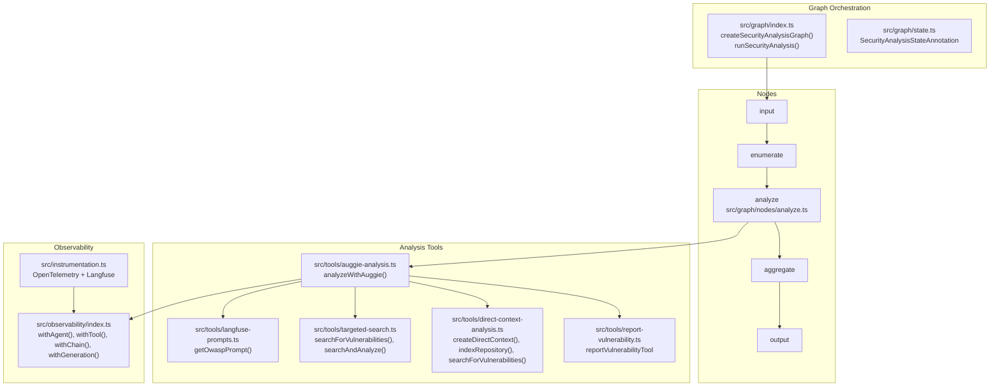
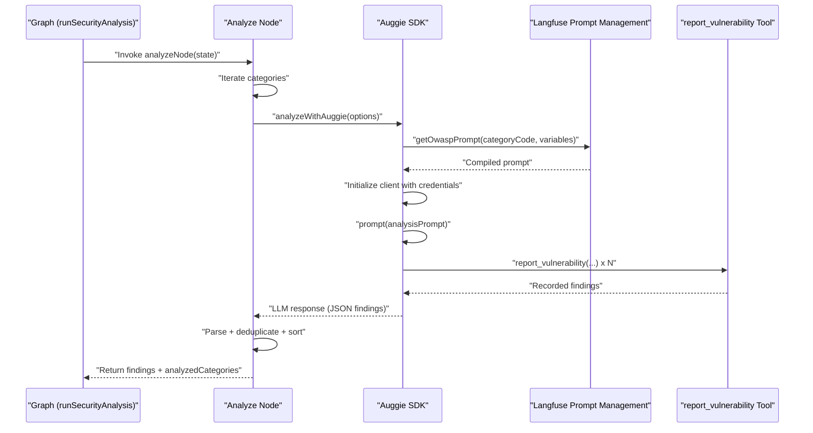
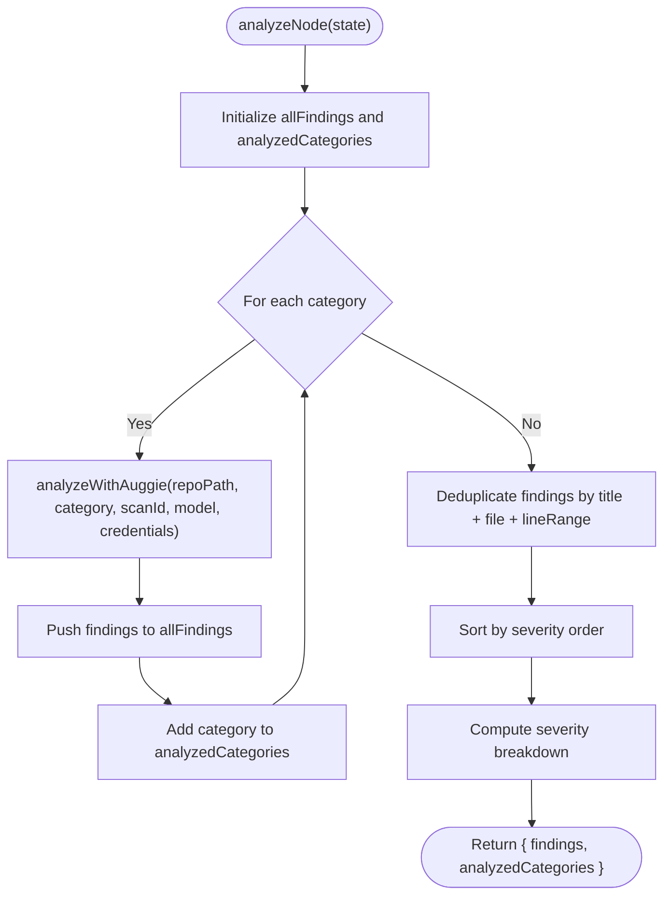
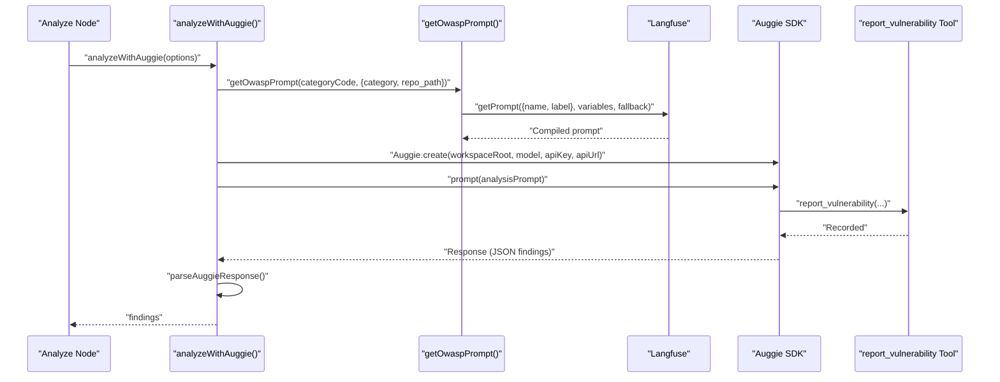
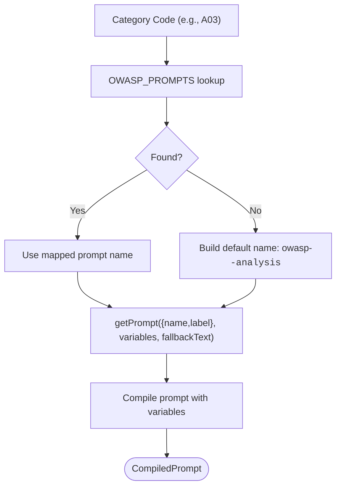
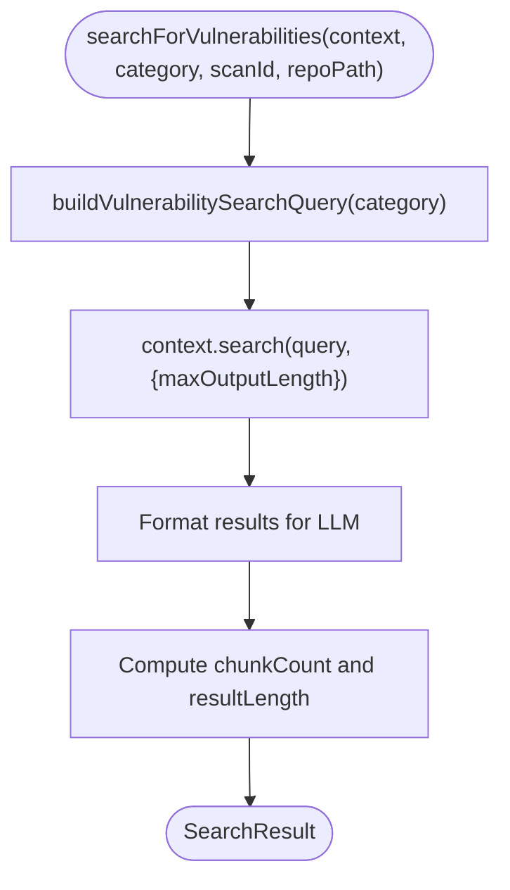
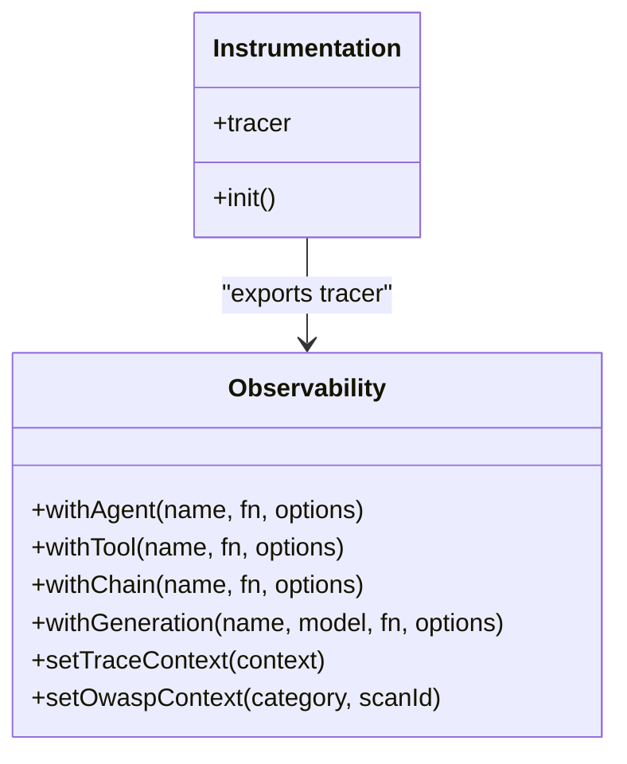
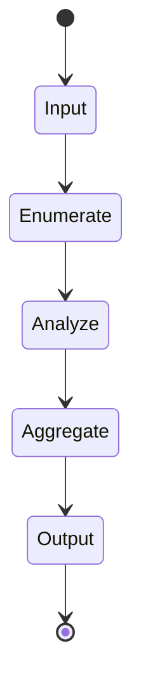
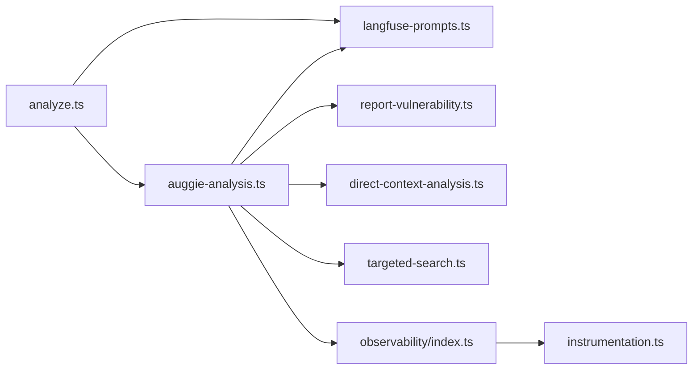

# AI-Powered Analysis Workflow

<cite>
**Referenced Files in This Document**
- [README.md](file://README.md)
- [src/graph/index.ts](file://src/graph/index.ts)
- [src/graph/nodes/analyze.ts](file://src/graph/nodes/analyze.ts)
- [src/graph/state.ts](file://src/graph/state.ts)
- [src/tools/auggie-analysis.ts](file://src/tools/auggie-analysis.ts)
- [src/tools/langfuse-prompts.ts](file://src/tools/langfuse-prompts.ts)
- [src/tools/targeted-search.ts](file://src/tools/targeted-search.ts)
- [src/tools/direct-context-analysis.ts](file://src/tools/direct-context-analysis.ts)
- [src/tools/report-vulnerability.ts](file://src/tools/report-vulnerability.ts)
- [src/observability/index.ts](file://src/observability/index.ts)
- [src/instrumentation.ts](file://src/instrumentation.ts)
- [src/config.ts](file://src/config.ts)
</cite>

## Table of Contents
1. [Introduction](#introduction)
2. [Project Structure](#project-structure)
3. [Core Components](#core-components)
4. [Architecture Overview](#architecture-overview)
5. [Detailed Component Analysis](#detailed-component-analysis)
6. [Dependency Analysis](#dependency-analysis)
7. [Performance Considerations](#performance-considerations)
8. [Troubleshooting Guide](#troubleshooting-guide)
9. [Conclusion](#conclusion)

## Introduction
This document explains the AI-powered analysis workflow centered on the analyze node and its integration with the Auggie SDK. It details how the analyze node processes code against each OWASP category by leveraging Langfuse-managed prompts via the getOwaspPrompt function. It also describes the OWASP_PROMPTS mapping that connects category codes (for example, A03) to specific Langfuse prompt names (for example, owasp-a03-injection). The end-to-end flow covers category selection in the state machine, prompt retrieval, LLM analysis via Auggie SDK, and structured finding generation. Concrete examples show how search queries are built per category and how context is extracted. Observability is emphasized throughout to track each analysis step. Common issues such as prompt timeouts or misclassification are addressed, along with performance considerations for sequential versus parallel category analysis.

## Project Structure
The security analysis workflow is orchestrated by a LangGraph state machine that moves through five nodes: input, enumerate, analyze, aggregate, and output. The analyze node is responsible for iterating over a prioritized set of OWASP categories and invoking Auggie SDK to perform LLM-driven security analysis. Observability is implemented using dual Langfuse integrations: OpenTelemetry spans and rich observation types (generation, tool, retriever, chain, agent).

**Diagram sources**
- [src/graph/index.ts](file://src/graph/index.ts#L1-L153)
- [src/graph/nodes/analyze.ts](file://src/graph/nodes/analyze.ts#L1-L156)
- [src/graph/state.ts](file://src/graph/state.ts#L1-L173)
- [src/tools/auggie-analysis.ts](file://src/tools/auggie-analysis.ts#L1-L310)
- [src/tools/langfuse-prompts.ts](file://src/tools/langfuse-prompts.ts#L1-L211)
- [src/tools/targeted-search.ts](file://src/tools/targeted-search.ts#L1-L293)
- [src/tools/direct-context-analysis.ts](file://src/tools/direct-context-analysis.ts#L1-L414)
- [src/tools/report-vulnerability.ts](file://src/tools/report-vulnerability.ts#L1-L154)
- [src/observability/index.ts](file://src/observability/index.ts#L1-L411)
- [src/instrumentation.ts](file://src/instrumentation.ts#L1-L141)

**Section sources**
- [README.md](file://README.md#L1-L171)
- [src/graph/index.ts](file://src/graph/index.ts#L1-L153)
- [src/graph/state.ts](file://src/graph/state.ts#L1-L173)

## Core Components
- Analyze node: Iterates over a fixed set of OWASP categories and invokes Auggie SDK to produce findings. It deduplicates and sorts findings by severity, then returns them to the state machine.
- Auggie analysis tool: Orchestrates prompt retrieval, Auggie SDK initialization, and structured finding parsing. It integrates with Langfuse for rich observability.
- Langfuse prompts: Provides getOwaspPrompt to fetch and compile category-specific prompts, with fallback support and observability.
- Targeted search and DirectContext: Offer alternative or complementary approaches to codebase search and LLM analysis, including building category-specific queries and exporting/importing context state.
- Observability: Dual integration with OpenTelemetry and Langfuse observation types to track agents, tools, retrievers, chains, and generations.
- Instrumentation: Ensures OpenTelemetry SDK initializes before any other code to capture all traces.

**Section sources**
- [src/graph/nodes/analyze.ts](file://src/graph/nodes/analyze.ts#L1-L156)
- [src/tools/auggie-analysis.ts](file://src/tools/auggie-analysis.ts#L1-L310)
- [src/tools/langfuse-prompts.ts](file://src/tools/langfuse-prompts.ts#L1-L211)
- [src/tools/targeted-search.ts](file://src/tools/targeted-search.ts#L1-L293)
- [src/tools/direct-context-analysis.ts](file://src/tools/direct-context-analysis.ts#L1-L414)
- [src/observability/index.ts](file://src/observability/index.ts#L1-L411)
- [src/instrumentation.ts](file://src/instrumentation.ts#L1-L141)

## Architecture Overview
The analyze node participates in a linear LangGraph pipeline. It selects categories from the state machine, retrieves category-specific prompts from Langfuse, and delegates analysis to Auggie SDK. Auggie orchestrates codebase search and LLM reasoning, collecting structured findings via a dedicated tool. Observability is captured at multiple levels: agent-level for node orchestration, tool-level for SDK/API calls, retriever-level for code search, chain-level for prompt loading, and generation-level for LLM calls.

**Diagram sources**
- [src/graph/index.ts](file://src/graph/index.ts#L56-L145)
- [src/graph/nodes/analyze.ts](file://src/graph/nodes/analyze.ts#L44-L155)
- [src/tools/auggie-analysis.ts](file://src/tools/auggie-analysis.ts#L119-L309)
- [src/tools/langfuse-prompts.ts](file://src/tools/langfuse-prompts.ts#L67-L210)
- [src/tools/report-vulnerability.ts](file://src/tools/report-vulnerability.ts#L82-L154)

## Detailed Component Analysis

### Analyze Node: Category Iteration and Findings Aggregation
- Purpose: Iterate over a prioritized list of OWASP categories, invoke Auggie-based analysis per category, collect findings, deduplicate by title + file + line range, sort by severity, and return aggregated results.
- Key behaviors:
  - Sequential iteration over ANALYSIS_CATEGORIES.
  - Delegates analysis to analyzeWithAuggie with model selection and credentials.
  - Post-processes findings to remove duplicates and sorts by severity.
  - Emits observability metadata including findings count and severity breakdown.

**Diagram sources**
- [src/graph/nodes/analyze.ts](file://src/graph/nodes/analyze.ts#L44-L155)

**Section sources**
- [src/graph/nodes/analyze.ts](file://src/graph/nodes/analyze.ts#L27-L155)

### Auggie-Based Analysis: Prompt Retrieval, SDK Orchestration, and Parsing
- Purpose: Retrieve category-specific prompts from Langfuse, initialize Auggie SDK with validated credentials, orchestrate analysis, and parse structured findings.
- Key behaviors:
  - Extract category code from full category string.
  - Fetch prompt via getOwaspPrompt with variables (category, repo_path).
  - Initialize Auggie client with model and credentials.
  - Build analysis prompt requesting JSON findings.
  - Execute client.prompt and parse JSON findings.
  - Handle SDK-specific errors (APIError, BlobTooLargeError) and return empty array on failure.

**Diagram sources**
- [src/tools/auggie-analysis.ts](file://src/tools/auggie-analysis.ts#L119-L309)
- [src/tools/langfuse-prompts.ts](file://src/tools/langfuse-prompts.ts#L67-L210)
- [src/tools/report-vulnerability.ts](file://src/tools/report-vulnerability.ts#L82-L154)

**Section sources**
- [src/tools/auggie-analysis.ts](file://src/tools/auggie-analysis.ts#L47-L118)
- [src/tools/auggie-analysis.ts](file://src/tools/auggie-analysis.ts#L119-L309)

### Langfuse Prompt Management: Mapping and Retrieval
- Purpose: Provide category-to-prompt-name mapping and robust prompt retrieval with fallback support and observability.
- Key behaviors:
  - OWASP_PROMPTS maps category codes (A01–A10) to Langfuse prompt names.
  - getOwaspPrompt resolves the prompt name, compiles the prompt with variables, and falls back to a default analysis instruction if fetching fails.
  - getPrompt uses retriever-type observations to track prompt retrieval, versioning, and fallback usage.

**Diagram sources**
- [src/tools/langfuse-prompts.ts](file://src/tools/langfuse-prompts.ts#L170-L210)

**Section sources**
- [src/tools/langfuse-prompts.ts](file://src/tools/langfuse-prompts.ts#L170-L210)

### Targeted Search and DirectContext: Alternative Analysis Paths
- Purpose: Provide targeted search and DirectContext-based analysis as alternatives or complements to Auggie SDK orchestration.
- Key behaviors:
  - buildVulnerabilitySearchQuery generates category-specific queries for semantic search.
  - searchForVulnerabilities executes DirectContext.search with configurable maxOutputLength and returns formatted results with chunk counts.
  - searchAndAnalyze combines search and LLM analysis in a single call using DirectContext.searchAndAsk.
  - DirectContext lifecycle includes creation/import, repository indexing, and state export.

**Diagram sources**
- [src/tools/targeted-search.ts](file://src/tools/targeted-search.ts#L98-L173)
- [src/tools/direct-context-analysis.ts](file://src/tools/direct-context-analysis.ts#L284-L341)

**Section sources**
- [src/tools/targeted-search.ts](file://src/tools/targeted-search.ts#L38-L173)
- [src/tools/direct-context-analysis.ts](file://src/tools/direct-context-analysis.ts#L275-L341)

### Observability: Tracing, Agents, Tools, and Generations
- Purpose: Provide comprehensive observability across the analysis workflow using both OpenTelemetry spans and Langfuse observation types.
- Key behaviors:
  - Instrumentation initializes OpenTelemetry SDK with LangfuseSpanProcessor and exports a tracer.
  - withAgent wraps top-level orchestration (analyze node).
  - withTool wraps SDK/API/tool invocations (Auggie, DirectContext, report_vulnerability).
  - withChain wraps prompt loading and compilation.
  - withGeneration wraps LLM calls and captures model, tokens, and costs.
  - setTraceContext and setOwaspContext propagate scan-level metadata to nested observations.

**Diagram sources**
- [src/instrumentation.ts](file://src/instrumentation.ts#L1-L141)
- [src/observability/index.ts](file://src/observability/index.ts#L1-L411)

**Section sources**
- [src/instrumentation.ts](file://src/instrumentation.ts#L1-L141)
- [src/observability/index.ts](file://src/observability/index.ts#L1-L411)

### State Machine Integration and Category Selection
- Purpose: Integrate the analyze node into the LangGraph state machine and manage category selection and progress tracking.
- Key behaviors:
  - SecurityAnalysisStateAnnotation defines the state schema including repoPath, userQuery, scopeFilter, scanId, status, targets, analyzedCategories, currentCategory, findings, errors, summary, and augmentCredentials.
  - The graph transitions from input → enumerate → analyze → aggregate → output.
  - The analyze node reads ANALYSIS_CATEGORIES and writes analyzedCategories and findings into state.

**Diagram sources**
- [src/graph/index.ts](file://src/graph/index.ts#L29-L48)
- [src/graph/state.ts](file://src/graph/state.ts#L71-L143)

**Section sources**
- [src/graph/state.ts](file://src/graph/state.ts#L1-L173)
- [src/graph/index.ts](file://src/graph/index.ts#L1-L153)

## Dependency Analysis
- Analyze node depends on:
  - Auggie analysis tool for orchestration and parsing.
  - Langfuse prompts for category-specific prompt retrieval.
  - Observability wrappers for rich tracing.
- Auggie analysis tool depends on:
  - Langfuse prompts for prompt retrieval.
  - Report vulnerability tool for structured findings collection.
  - DirectContext and targeted search for alternative analysis paths.
- Observability and instrumentation are foundational dependencies for all tracing.

**Diagram sources**
- [src/graph/nodes/analyze.ts](file://src/graph/nodes/analyze.ts#L1-L156)
- [src/tools/auggie-analysis.ts](file://src/tools/auggie-analysis.ts#L1-L310)
- [src/tools/langfuse-prompts.ts](file://src/tools/langfuse-prompts.ts#L1-L211)
- [src/tools/report-vulnerability.ts](file://src/tools/report-vulnerability.ts#L1-L154)
- [src/tools/direct-context-analysis.ts](file://src/tools/direct-context-analysis.ts#L1-L414)
- [src/tools/targeted-search.ts](file://src/tools/targeted-search.ts#L1-L293)
- [src/observability/index.ts](file://src/observability/index.ts#L1-L411)
- [src/instrumentation.ts](file://src/instrumentation.ts#L1-L141)

**Section sources**
- [src/graph/nodes/analyze.ts](file://src/graph/nodes/analyze.ts#L1-L156)
- [src/tools/auggie-analysis.ts](file://src/tools/auggie-analysis.ts#L1-L310)
- [src/tools/langfuse-prompts.ts](file://src/tools/langfuse-prompts.ts#L1-L211)
- [src/observability/index.ts](file://src/observability/index.ts#L1-L411)
- [src/instrumentation.ts](file://src/instrumentation.ts#L1-L141)

## Performance Considerations
- Sequential vs Parallel category analysis:
  - Current implementation iterates categories sequentially in the analyze node. This simplifies observability and reduces concurrent resource contention.
  - Parallelization could reduce total runtime but risks increased memory usage, rate limiting, and reduced observability granularity. If parallelizing, consider batching categories and coordinating observability per batch.
- DirectContext advantages:
  - Persistent indexing and state export/import enable significant speedups for repeated scans compared to Auggie’s indexing overhead.
  - Incremental updates minimize re-indexing workload.
- Prompt caching and fallback:
  - getOwaspPrompt caches compiled prompts and uses fallbacks to maintain resilience against prompt retrieval failures.
- Output limits:
  - searchAndAnalyze and searchForVulnerabilities accept maxOutputLength to control payload sizes and reduce LLM latency and cost.

[No sources needed since this section provides general guidance]

## Troubleshooting Guide
- Prompt timeout or retrieval failure:
  - Symptoms: getOwaspPrompt throws or returns fallback prompt.
  - Actions: Verify Langfuse credentials and host configuration; confirm prompt availability in Langfuse Prompt Management; check network connectivity; review fallback warnings in logs.
  - Related code paths:
    - [src/tools/langfuse-prompts.ts](file://src/tools/langfuse-prompts.ts#L67-L168)
- Misclassification or missing findings:
  - Symptoms: Low-quality or incomplete findings.
  - Actions: Adjust analysis prompt construction in analyzeWithAuggie; ensure category-specific variables are passed; validate report_vulnerability tool inputs; consider targeted search to pre-filter risky areas.
  - Related code paths:
    - [src/tools/auggie-analysis.ts](file://src/tools/auggie-analysis.ts#L195-L240)
    - [src/tools/report-vulnerability.ts](file://src/tools/report-vulnerability.ts#L82-L154)
- SDK errors:
  - APIError: Inspect status and statusText; consider retry logic for transient 5xx errors.
  - BlobTooLargeError: Reduce file sizes or exclude large binaries from indexing.
  - Related code paths:
    - [src/tools/auggie-analysis.ts](file://src/tools/auggie-analysis.ts#L254-L291)
- Observability gaps:
  - Ensure instrumentation.ts is imported before other modules to capture full trace context.
  - Use withTool, withAgent, withChain, and withGeneration consistently to enrich traces.
  - Related code paths:
    - [src/instrumentation.ts](file://src/instrumentation.ts#L1-L141)
    - [src/observability/index.ts](file://src/observability/index.ts#L1-L411)

**Section sources**
- [src/tools/langfuse-prompts.ts](file://src/tools/langfuse-prompts.ts#L67-L168)
- [src/tools/auggie-analysis.ts](file://src/tools/auggie-analysis.ts#L254-L291)
- [src/tools/report-vulnerability.ts](file://src/tools/report-vulnerability.ts#L82-L154)
- [src/instrumentation.ts](file://src/instrumentation.ts#L1-L141)
- [src/observability/index.ts](file://src/observability/index.ts#L1-L411)

## Conclusion
The analyze node orchestrates OWASP-based security analysis by iterating over prioritized categories, retrieving category-specific prompts from Langfuse, and delegating analysis to the Auggie SDK. The workflow emphasizes robust observability through dual Langfuse integrations, structured finding generation via a dedicated tool, and practical alternatives like targeted search and DirectContext. While the current implementation is sequential for simplicity and reliability, future enhancements can explore parallelization with careful observability and resource management. Proper configuration of credentials and prompt management, combined with targeted search strategies, yields accurate and actionable security insights.