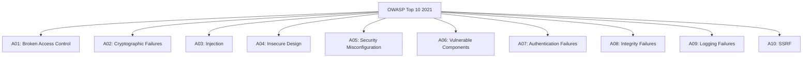
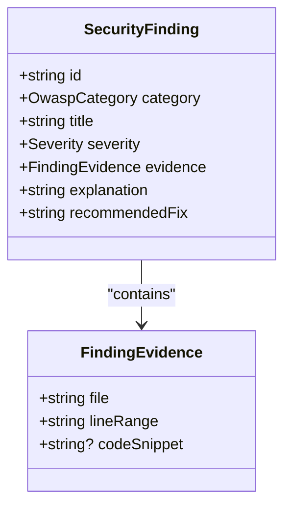
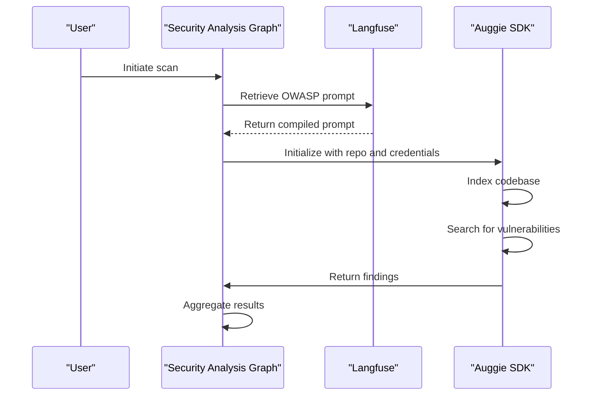
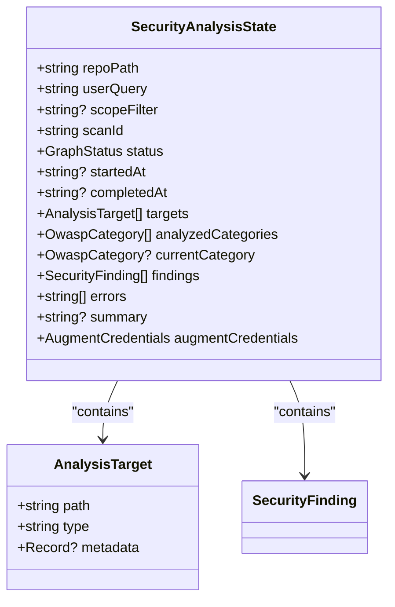
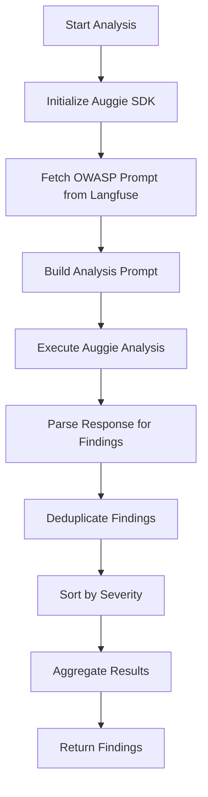
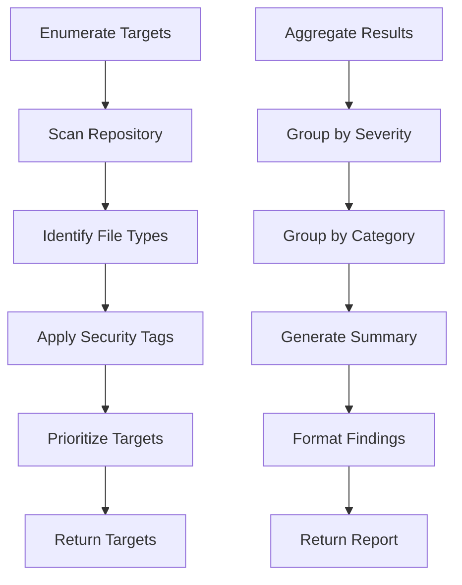
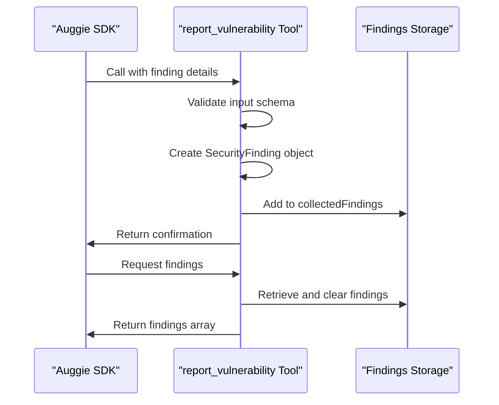

# Core Features

<cite>
**Referenced Files in This Document**   
- [state.ts](file://src/graph/state.ts)
- [analyze.ts](file://src/graph/nodes/analyze.ts)
- [enumerate.ts](file://src/graph/nodes/enumerate.ts)
- [aggregate.ts](file://src/graph/nodes/aggregate.ts)
- [auggie-analysis.ts](file://src/tools/auggie-analysis.ts)
- [langfuse-prompts.ts](file://src/tools/langfuse-prompts.ts)
- [report-vulnerability.ts](file://src/tools/report-vulnerability.ts)
- [security-config.ts](file://src/tools/security-config.ts)
</cite>

## Table of Contents
1. [OWASP Top 10 2021 Coverage](#owasp-top-10-2021-coverage)
2. [Security Finding Structure](#security-finding-structure)
3. [AI-Powered Analysis Workflow](#ai-powered-analysis-workflow)
4. [Security Analysis State Management](#security-analysis-state-management)
5. [Analysis Node Processing](#analysis-node-processing)
6. [Target Enumeration and Results Aggregation](#target-enumeration-and-results-aggregation)
7. [Structured Vulnerability Reporting](#structured-vulnerability-reporting)
8. [User Benefits](#user-benefits)

## OWASP Top 10 2021 Coverage

OWASP GraphGuard provides comprehensive coverage of all OWASP Top 10 2021 categories, systematically analyzing codebases for security vulnerabilities across the following categories:

- A01:2021-Broken Access Control
- A02:2021-Cryptographic Failures
- A03:2021-Injection
- A04:2021-Insecure Design
- A05:2021-Security Misconfiguration
- A06:2021-Vulnerable and Outdated Components
- A07:2021-Identification and Authentication Failures
- A08:2021-Software and Data Integrity Failures
- A09:2021-Security Logging and Monitoring Failures
- A10:2021-Server-Side Request Forgery

The system is designed to analyze these categories using AI-powered reasoning through the Auggie SDK, with specific prompts managed through Langfuse. While all categories are supported, the current implementation prioritizes analysis of Injection (A03), Broken Access Control (A01), Authentication Failures (A07), Cryptographic Failures (A02), and Vulnerable Components (A06) based on their prevalence in Node.js applications.

**Diagram sources**
- [state.ts](file://src/graph/state.ts#L8-L19)

**Section sources**
- [state.ts](file://src/graph/state.ts#L8-L19)

## Security Finding Structure

Security findings in OWASP GraphGuard follow a standardized structure that ensures comprehensive vulnerability reporting. Each finding contains essential information that enables developers to understand, verify, and remediate security issues effectively.

The SecurityFinding interface defines the structure with the following properties:

- **id**: Unique identifier for the finding
- **category**: OWASP Top 10 2021 category classification
- **title**: Brief descriptive title of the vulnerability
- **severity**: Risk level (critical, high, medium, low, info)
- **evidence**: Code location and snippet demonstrating the issue
- **explanation**: Detailed description of why this constitutes a vulnerability
- **recommendedFix**: Specific guidance on how to remediate the issue

The evidence component includes the file path, line range, and optional code snippet, providing precise location information for each finding. This structured approach ensures that findings are actionable and can be easily traced back to their source in the codebase.

**Diagram sources**
- [state.ts](file://src/graph/state.ts#L41-L49)
- [state.ts](file://src/graph/state.ts#L31-L35)

**Section sources**
- [state.ts](file://src/graph/state.ts#L31-L49)

## AI-Powered Analysis Workflow

OWASP GraphGuard employs an AI-powered analysis workflow that leverages the Auggie SDK and Langfuse-managed prompts to identify security vulnerabilities. The workflow follows a systematic process that combines codebase indexing, LLM reasoning, and structured output generation.

The analysis begins with retrieving category-specific prompts from Langfuse Prompt Management. These prompts are specifically designed for each OWASP category and guide the LLM analysis process. The system uses the getOwaspPrompt function to fetch the appropriate prompt based on the OWASP category code, compiling it with relevant variables such as the category name and repository path.

The Auggie SDK serves as the orchestrator for security analysis, handling codebase indexing, LLM calls, and tool execution. It uses the retrieved prompts to analyze the codebase for specific vulnerability patterns, leveraging its built-in codebase search capabilities to identify potential issues. The analysis is performed for each OWASP category sequentially, with results aggregated across all categories.

Langfuse plays a critical role in managing the prompts and providing observability into the analysis process. Each prompt retrieval is tracked as a 'retriever' observation type, capturing metadata about the prompt name, version, label, and compilation variables. This enables version control, A/B testing, and performance monitoring of the prompts over time.

**Diagram sources**
- [langfuse-prompts.ts](file://src/tools/langfuse-prompts.ts#L67-L211)
- [auggie-analysis.ts](file://src/tools/auggie-analysis.ts#L119-L310)
- [README.md](file://README.md#L23-L25)

**Section sources**
- [langfuse-prompts.ts](file://src/tools/langfuse-prompts.ts#L67-L211)
- [auggie-analysis.ts](file://src/tools/auggie-analysis.ts#L119-L310)

## Security Analysis State Management

The SecurityAnalysisState manages the execution state throughout the security analysis process, following the LangGraph state machine pattern. The state flows through a series of nodes: input → enumerate → analyze → aggregate → output, with each node updating specific aspects of the state.

The state is defined using LangGraph's Annotation pattern, which provides proper state management with reducers that handle state updates. The SecurityAnalysisStateAnnotation defines all state properties with their respective reducers and default values.

Key state components include:

- **Input fields**: Repository path, user query, and scope filter
- **Scan metadata**: Scan ID, status, and timestamps
- **Enumeration results**: Target files and code locations to analyze
- **Analysis progress**: Categories analyzed and current category
- **Findings**: Accumulated security findings
- **Error tracking**: Collection of errors encountered during analysis
- **Output**: Final summary and results

The state management system ensures that data flows consistently through the analysis pipeline, with each node receiving the current state and returning partial updates. This approach enables fault tolerance, as the state can be inspected at any point to understand the analysis progress and results.

**Diagram sources**
- [state.ts](file://src/graph/state.ts#L71-L148)

**Section sources**
- [state.ts](file://src/graph/state.ts#L71-L148)

## Analysis Node Processing

The analyze node processes code against OWASP categories using LLM reasoning through the Auggie SDK. This node is responsible for the core security analysis, orchestrating the evaluation of code for specific vulnerability patterns.

The analyzeNode function iterates through a predefined set of OWASP categories, analyzing each one sequentially. For each category, it calls the analyzeWithAuggie function with the repository path, category, scan ID, model specification, and Augment credentials. The analysis is performed using the 'sonnet4.5' model by default.

The analysis process involves several key steps:
1. Fetching the appropriate OWASP prompt from Langfuse
2. Initializing the Auggie SDK with the repository and credentials
3. Building the analysis prompt with specific instructions for structured JSON output
4. Executing the analysis through Auggie's prompt method
5. Parsing the response to extract security findings
6. Handling errors and edge cases

The node implements deduplication logic to ensure that findings are unique based on title, file, and line range. It also sorts findings by severity, with critical vulnerabilities listed first. The results are aggregated across all categories, providing a comprehensive view of the security posture.

**Diagram sources**
- [analyze.ts](file://src/graph/nodes/analyze.ts#L44-L156)
- [auggie-analysis.ts](file://src/tools/auggie-analysis.ts#L119-L310)

**Section sources**
- [analyze.ts](file://src/graph/nodes/analyze.ts#L44-L156)

## Target Enumeration and Results Aggregation

The enumeration and aggregation components of OWASP GraphGuard work together to identify analysis targets and consolidate findings into a comprehensive report.

The enumerateTargetsNode discovers security-relevant files and code locations within the repository. It recursively scans the repository for JavaScript/TypeScript files and specific configuration files like package.json. The enumeration process skips directories such as node_modules, .git, dist, and build to focus on source code.

Files are categorized based on their path and content patterns:
- **Routes**: Files in routes/, router/, api/, or controllers/ directories
- **Controllers**: Files with "controller" or "handler" in the name
- **Dependencies**: package.json and package-lock.json files
- **Files**: Other JavaScript/TypeScript files

Targets are prioritized with routes and controllers analyzed first, followed by other files and dependencies. Metadata is generated for each target based on security-relevant patterns in the file path, tagging files related to authentication, database access, user input, and configuration.

The aggregateNode combines findings from all analysis categories and generates a human-readable summary. It groups findings by severity and OWASP category, providing a breakdown of the security posture. The summary includes:
- Total findings count
- Breakdown by severity level
- Distribution across OWASP categories
- Detailed information for each finding including explanation and remediation guidance

**Diagram sources**
- [enumerate.ts](file://src/graph/nodes/enumerate.ts#L138-L228)
- [aggregate.ts](file://src/graph/nodes/aggregate.ts#L12-L117)

**Section sources**
- [enumerate.ts](file://src/graph/nodes/enumerate.ts#L138-L228)
- [aggregate.ts](file://src/graph/nodes/aggregate.ts#L12-L117)

## Structured Vulnerability Reporting

The report_vulnerability tool provides structured vulnerability reporting, enabling Auggie to communicate security findings in a consistent, machine-readable format. This tool is a critical component of the analysis workflow, serving as the mechanism through which vulnerabilities are reported and collected.

The tool is defined using the ai-sdk tool pattern and includes a comprehensive input schema that validates all required fields. The schema ensures that each finding includes the OWASP category, title, severity, file location, line range, explanation, and recommended fix. This structured approach guarantees that all findings contain the necessary information for remediation.

When Auggie identifies a vulnerability, it calls the report_vulnerability tool with the finding details. The tool executes within a Langfuse 'tool' observation, capturing input and output for observability. The finding is converted to the SecurityFinding interface and added to the collectedFindings array.

The tool implementation includes several key features:
- Input validation using Zod schema
- Finding deduplication prevention
- Langfuse observability integration
- Error handling and logging
- Finding collection and retrieval

After the analysis completes, the getAndClearFindings function retrieves all collected findings and clears the array for subsequent analyses. This ensures that findings are properly aggregated across multiple analysis iterations.

**Diagram sources**
- [report-vulnerability.ts](file://src/tools/report-vulnerability.ts#L89-L154)

**Section sources**
- [report-vulnerability.ts](file://src/tools/report-vulnerability.ts#L89-L154)

## User Benefits

OWASP GraphGuard delivers significant user benefits through its comprehensive security analysis capabilities. The structured vulnerability reporting provides actionable insights that enable developers to quickly understand and remediate security issues. Each finding includes a clear explanation of the vulnerability and specific guidance on how to fix it, reducing the time and expertise required to address security concerns.

The integration with Langfuse provides complete auditability of the analysis process. Every step of the workflow is tracked with detailed observability, including prompt versions, LLM calls, tool executions, and decision-making processes. This enables security teams to verify the analysis results, understand the reasoning behind findings, and ensure compliance with security standards.

The AI-powered analysis workflow offers several advantages over traditional static analysis tools:
- **Context-aware detection**: The LLM reasoning can understand code context and identify vulnerabilities that depend on specific usage patterns
- **Reduced false positives**: The structured reporting and validation process minimizes false positives
- **Comprehensive coverage**: Analysis across all OWASP Top 10 2021 categories ensures broad vulnerability detection
- **Actionable results**: Findings include specific remediation guidance, making it easier for developers to fix issues

The system's modular architecture and use of standardized interfaces make it extensible and maintainable. New OWASP categories can be added by creating corresponding prompts in Langfuse, while the core analysis workflow remains unchanged. This flexibility ensures that the system can evolve with changing security requirements and emerging threats.

**Section sources**
- [README.md](file://README.md#L3-L171)
- [PRD.md](file://docs/PRD.md)