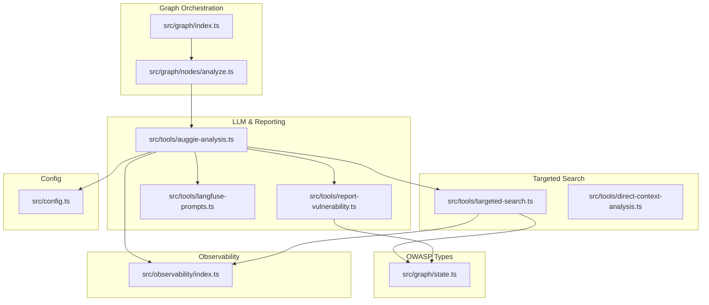
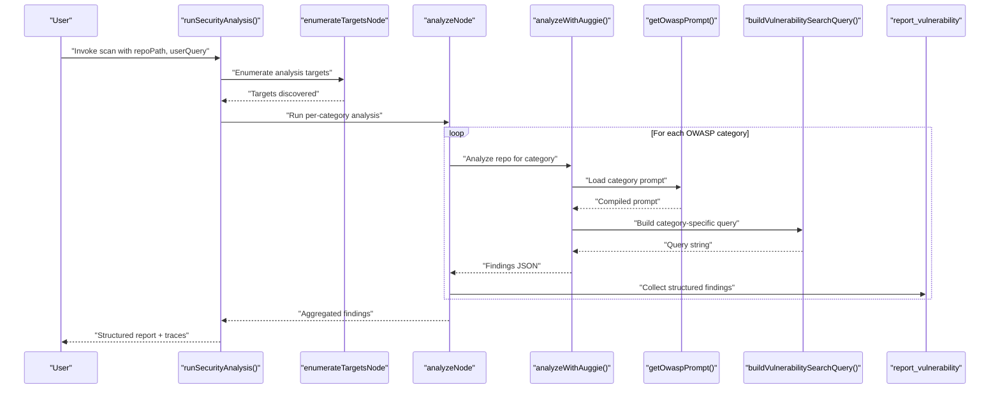
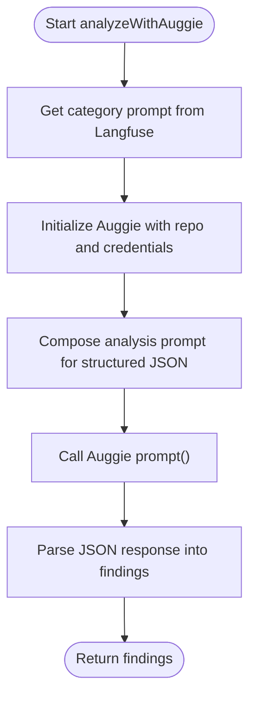
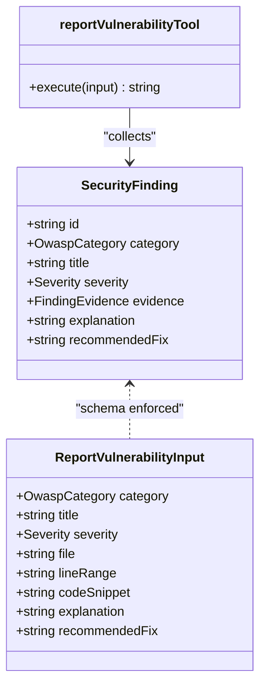
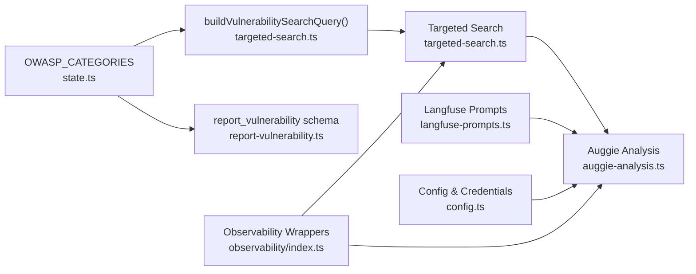

# OWASP Top 10 2021 Coverage

<cite>
**Referenced Files in This Document**
- [targeted-search.ts](file://src/tools/targeted-search.ts)
- [state.ts](file://src/graph/state.ts)
- [report-vulnerability.ts](file://src/tools/report-vulnerability.ts)
- [PRD.md](file://docs/PRD.md)
- [README.md](file://README.md)
- [index.ts](file://src/graph/index.ts)
- [analyze.ts](file://src/graph/nodes/analyze.ts)
- [auggie-analysis.ts](file://src/tools/auggie-analysis.ts)
- [langfuse-prompts.ts](file://src/tools/langfuse-prompts.ts)
- [direct-context-analysis.ts](file://src/tools/direct-context-analysis.ts)
- [config.ts](file://src/config.ts)
- [observability/index.ts](file://src/observability/index.ts)
</cite>

## Table of Contents
1. [Introduction](#introduction)
2. [Project Structure](#project-structure)
3. [Core Components](#core-components)
4. [Architecture Overview](#architecture-overview)
5. [Detailed Component Analysis](#detailed-component-analysis)
6. [Dependency Analysis](#dependency-analysis)
7. [Performance Considerations](#performance-considerations)
8. [Troubleshooting Guide](#troubleshooting-guide)
9. [Conclusion](#conclusion)
10. [Appendices](#appendices)

## Introduction
This document explains how the auggiesec-agent systematically covers all OWASP Top 10 2021 categories using AI-powered detection. It maps each category to targeted search queries, describes how the OWASP_CATEGORIES constant enforces type safety and validation, and demonstrates how the report_vulnerability tool enforces schema compliance with required fields per PRD. It also highlights the benefits of full OWASP coverage for auditability and compliance reporting, and connects these capabilities to user value in comprehensive security assessments.

## Project Structure
The OWASP coverage is implemented across several modules:
- OWASP categories and findings types are defined centrally for type safety.
- Targeted search builds category-specific queries to pre-filter code before LLM analysis.
- Auggie-based analysis orchestrates codebase search, LLM reasoning, and structured reporting.
- Langfuse prompts are loaded dynamically for each category.
- Observability wrappers ensure rich tracing and auditability across all steps.

**Diagram sources**
- [index.ts](file://src/graph/index.ts#L1-L153)
- [analyze.ts](file://src/graph/nodes/analyze.ts#L1-L156)
- [state.ts](file://src/graph/state.ts#L1-L173)
- [targeted-search.ts](file://src/tools/targeted-search.ts#L1-L293)
- [direct-context-analysis.ts](file://src/tools/direct-context-analysis.ts#L343-L361)
- [auggie-analysis.ts](file://src/tools/auggie-analysis.ts#L1-L310)
- [report-vulnerability.ts](file://src/tools/report-vulnerability.ts#L1-L154)
- [langfuse-prompts.ts](file://src/tools/langfuse-prompts.ts#L1-L211)
- [observability/index.ts](file://src/observability/index.ts#L1-L411)
- [config.ts](file://src/config.ts#L1-L153)

**Section sources**
- [README.md](file://README.md#L1-L171)
- [PRD.md](file://docs/PRD.md#L1-L341)

## Core Components
- OWASP_CATEGORIES constant defines the canonical list of 10 categories and exposes OwaspCategory type for strict typing across the system.
- buildVulnerabilitySearchQuery maps each category to a tailored semantic search query string, enabling targeted, category-specific code pattern searches.
- Auggie-based analysis loads category-specific prompts from Langfuse, orchestrates code search and LLM reasoning, and parses structured findings.
- report_vulnerability tool enforces a strict schema for each finding, ensuring required fields per PRD.

**Section sources**
- [state.ts](file://src/graph/state.ts#L1-L173)
- [targeted-search.ts](file://src/tools/targeted-search.ts#L38-L86)
- [auggie-analysis.ts](file://src/tools/auggie-analysis.ts#L119-L309)
- [report-vulnerability.ts](file://src/tools/report-vulnerability.ts#L1-L154)

## Architecture Overview
The system follows a LangGraph workflow that enumerates targets, analyzes each target against OWASP categories, aggregates findings, and produces a structured report. Observability is integrated at every step using Langfuse with semantic observation types.

**Diagram sources**
- [index.ts](file://src/graph/index.ts#L1-L153)
- [analyze.ts](file://src/graph/nodes/analyze.ts#L1-L156)
- [auggie-analysis.ts](file://src/tools/auggie-analysis.ts#L119-L309)
- [langfuse-prompts.ts](file://src/tools/langfuse-prompts.ts#L170-L211)
- [targeted-search.ts](file://src/tools/targeted-search.ts#L38-L86)
- [report-vulnerability.ts](file://src/tools/report-vulnerability.ts#L1-L154)

## Detailed Component Analysis

### OWASP Categories and Type Safety
- OWASP_CATEGORIES is a readonly tuple of all 10 categories, exported as a const array and typed via OwaspCategory. This ensures:
  - Exhaustive switch coverage when iterating categories.
  - Strict enforcement of category values across state, tools, and prompts.
- SecurityAnalysisState maintains analyzedCategories and findings arrays, ensuring only known categories are tracked.

**Section sources**
- [state.ts](file://src/graph/state.ts#L1-L173)

### Targeted Search Queries Mapping
- buildVulnerabilitySearchQuery returns a category-specific query string designed to find:
  - Authorization and permission checks for Broken Access Control.
  - Encryption, hashing, and crypto operations for Cryptographic Failures.
  - SQL queries, user input handling, and command execution for Injection.
  - Security requirements and design patterns for Insecure Design.
  - Configuration files and headers for Security Misconfiguration.
  - Package manifests and imports for Vulnerable and Outdated Components.
  - Authentication and session management for Identification and Authentication Failures.
  - Serialization and integrity checks for Software and Data Integrity Failures.
  - Logging and monitoring for Security Logging and Monitoring Failures.
  - HTTP requests and URL handling for Server-Side Request Forgery.

Examples of targeted queries:
- Broken Access Control: authorization checks, permission validation, role-based access control, access control middleware, authentication guards, user permissions.
- SSRF: HTTP requests, URL handling, fetch, axios, request libraries, external API calls, URL validation, SSRF protection.
- Insecure Design: security requirements, threat modeling, security controls, design patterns, architecture decisions, security boundaries.

These queries are used by both the targeted-search tool and the DirectContext-based analysis to pre-filter relevant code before LLM reasoning.

**Section sources**
- [targeted-search.ts](file://src/tools/targeted-search.ts#L38-L86)
- [direct-context-analysis.ts](file://src/tools/direct-context-analysis.ts#L343-L361)

### Auggie-Based Analysis and Prompt Loading
- analyzeWithAuggie orchestrates:
  - Prompt loading via getOwaspPrompt, mapping category codes to Langfuse prompt names.
  - Auggie SDK initialization with validated credentials.
  - Structured JSON analysis prompting to return findings.
  - Response parsing into SecurityFinding format.
- The analyze node iterates over a prioritized subset of categories and deduplicates findings by title + file + line range, sorting by severity.

**Diagram sources**
- [auggie-analysis.ts](file://src/tools/auggie-analysis.ts#L119-L309)
- [langfuse-prompts.ts](file://src/tools/langfuse-prompts.ts#L170-L211)

**Section sources**
- [auggie-analysis.ts](file://src/tools/auggie-analysis.ts#L119-L309)
- [analyze.ts](file://src/graph/nodes/analyze.ts#L1-L156)
- [langfuse-prompts.ts](file://src/tools/langfuse-prompts.ts#L170-L211)

### Structured Reporting and Schema Compliance
- report_vulnerability tool defines a Zod schema enforcing required fields per PRD:
  - category (enum of OWASP categories)
  - title, severity, file, lineRange, codeSnippet (optional), explanation, recommendedFix
- The tool collects findings into an internal array and exposes getAndClearFindings for post-analysis retrieval.
- This ensures every finding includes category, severity, evidence (file + lineRange), explanation, and remediation guidance.

**Diagram sources**
- [state.ts](file://src/graph/state.ts#L28-L49)
- [report-vulnerability.ts](file://src/tools/report-vulnerability.ts#L1-L154)

**Section sources**
- [report-vulnerability.ts](file://src/tools/report-vulnerability.ts#L1-L154)
- [state.ts](file://src/graph/state.ts#L28-L49)

### Observability and Auditability
- withTool, withAgent, withRetriever, withChain, and withOwaspGeneration wrap operations with semantic observation types and scan-aware metadata.
- All targeted search, Auggie prompts, and tool executions record attributes like scanId, repoPath, and owaspCategory for traceability.
- Langfuse integrates with OpenTelemetry for end-to-end observability.

**Section sources**
- [observability/index.ts](file://src/observability/index.ts#L1-L411)
- [targeted-search.ts](file://src/tools/targeted-search.ts#L108-L173)
- [auggie-analysis.ts](file://src/tools/auggie-analysis.ts#L156-L309)

## Dependency Analysis
The OWASP coverage depends on:
- OWASP_CATEGORIES and SecurityFinding types for type safety.
- buildVulnerabilitySearchQuery for category-specific queries.
- Langfuse prompts mapped by category code.
- Auggie SDK for code search and LLM orchestration.
- report_vulnerability for schema-compliant findings.

**Diagram sources**
- [state.ts](file://src/graph/state.ts#L1-L173)
- [targeted-search.ts](file://src/tools/targeted-search.ts#L38-L86)
- [report-vulnerability.ts](file://src/tools/report-vulnerability.ts#L1-L154)
- [auggie-analysis.ts](file://src/tools/auggie-analysis.ts#L119-L309)
- [langfuse-prompts.ts](file://src/tools/langfuse-prompts.ts#L170-L211)
- [config.ts](file://src/config.ts#L1-L153)
- [observability/index.ts](file://src/observability/index.ts#L1-L411)

**Section sources**
- [state.ts](file://src/graph/state.ts#L1-L173)
- [targeted-search.ts](file://src/tools/targeted-search.ts#L38-L86)
- [report-vulnerability.ts](file://src/tools/report-vulnerability.ts#L1-L154)
- [auggie-analysis.ts](file://src/tools/auggie-analysis.ts#L119-L309)
- [langfuse-prompts.ts](file://src/tools/langfuse-prompts.ts#L170-L211)
- [config.ts](file://src/config.ts#L1-L153)
- [observability/index.ts](file://src/observability/index.ts#L1-L411)

## Performance Considerations
- Targeted search reduces false positives and focuses LLM analysis on high-risk code, improving accuracy and speed.
- DirectContext-based search and SearchAndAsk minimize round-trips by combining retrieval and analysis.
- Deduplication and severity sorting reduce noise and improve triage efficiency.

[No sources needed since this section provides general guidance]

## Troubleshooting Guide
Common issues and resolutions:
- Missing or invalid credentials: Ensure Langfuse and Augment credentials are configured and validated by loadConfig.
- Prompt fetch failures: getPrompt falls back to a default text if Langfuse prompt cannot be retrieved; verify network connectivity and prompt names.
- Large files causing indexing errors: Auggie SDK raises BlobTooLargeError; consider exclusions or incremental indexing.
- Tool execution errors: withTool records exceptions with status messages; inspect trace metadata for scanId and category context.

**Section sources**
- [config.ts](file://src/config.ts#L1-L153)
- [langfuse-prompts.ts](file://src/tools/langfuse-prompts.ts#L90-L168)
- [auggie-analysis.ts](file://src/tools/auggie-analysis.ts#L253-L291)
- [observability/index.ts](file://src/observability/index.ts#L162-L212)

## Conclusion
The auggiesec-agent achieves comprehensive OWASP Top 10 2021 coverage by:
- Enforcing type-safe categories via OWASP_CATEGORIES and OwaspCategory.
- Mapping each category to targeted search queries that pre-filter relevant code.
- Leveraging Auggie SDK and Langfuse prompts for robust, structured analysis.
- Enforcing schema compliance with report_vulnerability to ensure required fields per PRD.
- Providing full observability and auditability across the entire workflow.

These capabilities deliver user value through comprehensive security assessments, clear triage, and compliance-ready reporting.

[No sources needed since this section summarizes without analyzing specific files]

## Appendices

### OWASP Categories Covered
- A01:2021-Broken Access Control
- A02:2021-Cryptographic Failures
- A03:2021-Injection
- A04:2021-Insecure Design
- A05:2021-Security Misconfiguration
- A06:2021-Vulnerable and Outdated Components
- A07:2021-Identification and Authentication Failures
- A08:2021-Software and Data Integrity Failures
- A09:2021-Security Logging and Monitoring Failures
- A10:2021-Server-Side Request Forgery

**Section sources**
- [state.ts](file://src/graph/state.ts#L1-L173)
- [README.md](file://README.md#L166-L171)