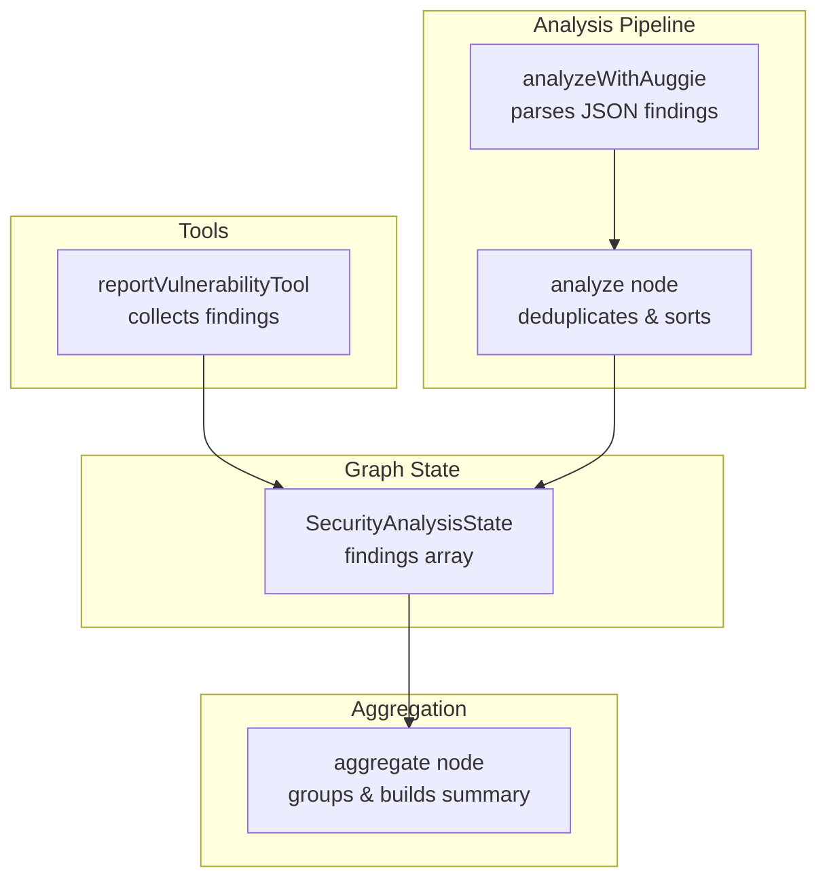
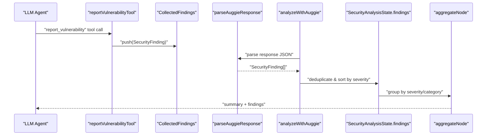
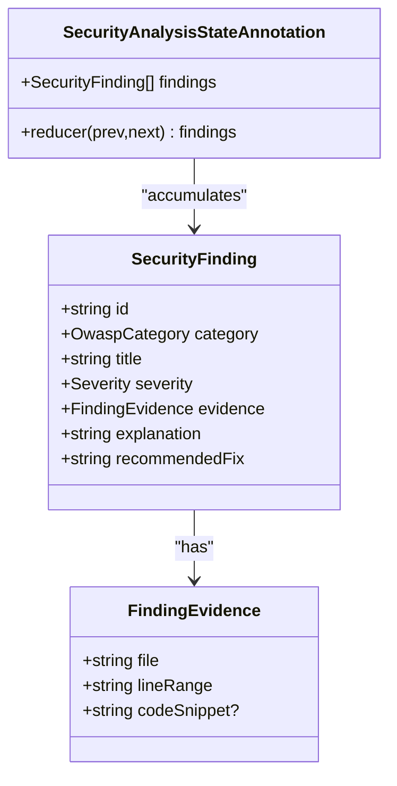
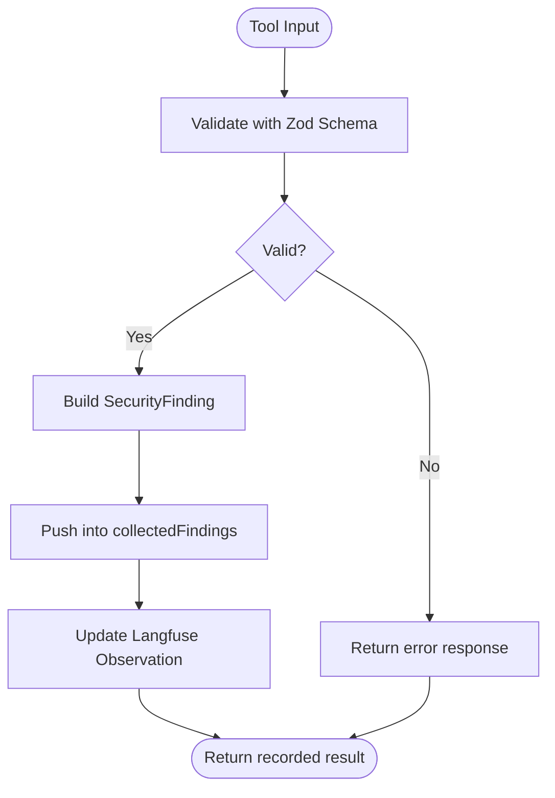
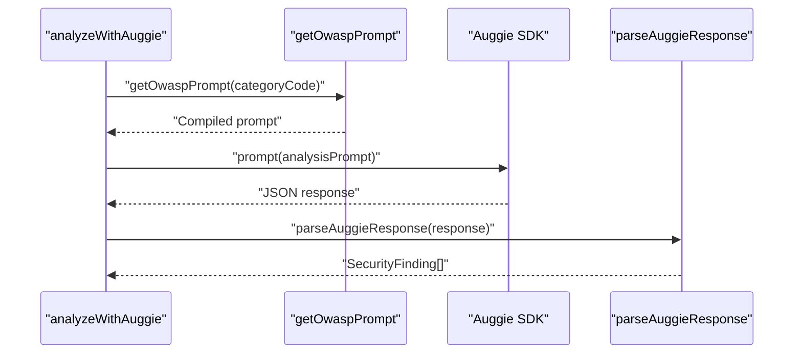
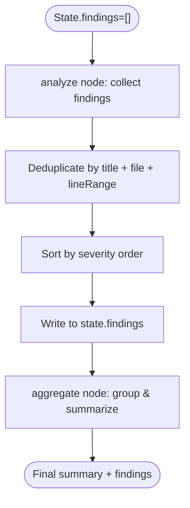
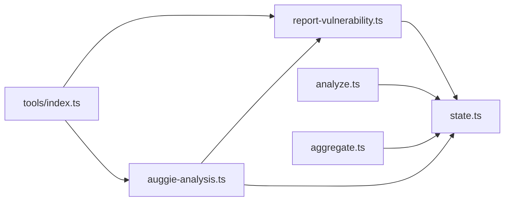

# Security Findings Structure

<cite>
**Referenced Files in This Document**
- [state.ts](file://src/graph/state.ts)
- [report-vulnerability.ts](file://src/tools/report-vulnerability.ts)
- [auggie-analysis.ts](file://src/tools/auggie-analysis.ts)
- [aggregate.ts](file://src/graph/nodes/aggregate.ts)
- [analyze.ts](file://src/graph/nodes/analyze.ts)
- [index.ts](file://src/tools/index.ts)
- [PRD.md](file://docs/PRD.md)
</cite>

## Table of Contents
1. [Introduction](#introduction)
2. [Project Structure](#project-structure)
3. [Core Components](#core-components)
4. [Architecture Overview](#architecture-overview)
5. [Detailed Component Analysis](#detailed-component-analysis)
6. [Dependency Analysis](#dependency-analysis)
7. [Performance Considerations](#performance-considerations)
8. [Troubleshooting Guide](#troubleshooting-guide)
9. [Conclusion](#conclusion)
10. [Appendices](#appendices)

## Introduction
This document provides comprehensive data model documentation for the SecurityFinding interface and the end-to-end findings lifecycle. It explains each field of the SecurityFinding model, how it aligns with the Product Requirements Document (PRD) for actionable remediation guidance, and how findings are accumulated and aggregated in the state machine. It also documents the reportVulnerabilityInputSchema validation and demonstrates how findings flow from tool execution through state updates to final report output.

## Project Structure
The security findings model and lifecycle span several modules:
- Data model and state annotations: src/graph/state.ts
- Tool for recording findings: src/tools/report-vulnerability.ts
- Auggie-based analysis pipeline: src/tools/auggie-analysis.ts
- Graph nodes for analysis and aggregation: src/graph/nodes/analyze.ts, src/graph/nodes/aggregate.ts
- Tool exports: src/tools/index.ts
- PRD alignment: docs/PRD.md

**Diagram sources**
- [state.ts](file://src/graph/state.ts#L120-L143)
- [report-vulnerability.ts](file://src/tools/report-vulnerability.ts#L90-L153)
- [auggie-analysis.ts](file://src/tools/auggie-analysis.ts#L119-L309)
- [analyze.ts](file://src/graph/nodes/analyze.ts#L44-L155)
- [aggregate.ts](file://src/graph/nodes/aggregate.ts#L12-L116)

**Section sources**
- [state.ts](file://src/graph/state.ts#L1-L173)
- [report-vulnerability.ts](file://src/tools/report-vulnerability.ts#L1-L154)
- [auggie-analysis.ts](file://src/tools/auggie-analysis.ts#L1-L310)
- [analyze.ts](file://src/graph/nodes/analyze.ts#L1-L156)
- [aggregate.ts](file://src/graph/nodes/aggregate.ts#L1-L117)
- [index.ts](file://src/tools/index.ts#L1-L32)
- [PRD.md](file://docs/PRD.md#L120-L170)

## Core Components
This section defines the SecurityFinding data model and its fields, and explains how they meet PRD requirements for actionable remediation.

- id: Unique identifier for the finding. Used for deduplication and traceability.
- category: OWASP Top 10 2021 category. Must match one of the predefined categories.
- title: Brief, actionable title describing the vulnerability.
- severity: One of critical, high, medium, low, info. Used for prioritization and sorting.
- evidence: Location and code context where the vulnerability was found.
  - file: Path to the affected file.
  - lineRange: String in format "start-end".
  - codeSnippet: Optional snippet showing the vulnerability.
- explanation: Detailed explanation of why the code is vulnerable and how it violates OWASP guidance.
- recommendedFix: Specific, actionable remediation guidance aligned with OWASP best practices.

These fields directly align with PRD Section 6.2, which mandates a structured object containing category, title, severity, evidence, explanation, and recommended fix, and PRD Section 6.4, which specifies the final output should include these fields and be returned as JSON and human-readable markdown.

**Section sources**
- [state.ts](file://src/graph/state.ts#L21-L49)
- [PRD.md](file://docs/PRD.md#L152-L166)

## Architecture Overview
The findings lifecycle follows a deterministic flow:
- Tool execution records findings into a collector.
- Auggie-based analysis parses structured JSON findings and normalizes them.
- The analyze node deduplicates and sorts findings by severity.
- The aggregate node groups findings by severity and category, and produces a human-readable summary.

**Diagram sources**
- [report-vulnerability.ts](file://src/tools/report-vulnerability.ts#L90-L153)
- [auggie-analysis.ts](file://src/tools/auggie-analysis.ts#L58-L106)
- [analyze.ts](file://src/graph/nodes/analyze.ts#L89-L151)
- [aggregate.ts](file://src/graph/nodes/aggregate.ts#L32-L116)
- [state.ts](file://src/graph/state.ts#L120-L143)

## Detailed Component Analysis

### SecurityFinding Data Model
The SecurityFinding interface is defined with explicit types for category and severity, and a strongly typed evidence object. The state machine’s SecurityAnalysisStateAnnotation maintains a reducer-based findings array that accumulates findings across nodes.

**Diagram sources**
- [state.ts](file://src/graph/state.ts#L21-L49)
- [state.ts](file://src/graph/state.ts#L120-L143)

**Section sources**
- [state.ts](file://src/graph/state.ts#L21-L49)
- [state.ts](file://src/graph/state.ts#L120-L143)

### reportVulnerabilityTool Validation and Recording
The reportVulnerabilityTool enforces strict input validation using a Zod schema. On successful validation, it constructs a SecurityFinding and pushes it into an internal collector. The tool also emits Langfuse observations for traceability.

Key validations:
- category: Enumerated OWASP Top 10 2021 categories.
- severity: Enumerated severity levels.
- file: String path.
- lineRange: String formatted as "start-end".
- codeSnippet: Optional string.
- explanation and recommendedFix: Required strings.

**Diagram sources**
- [report-vulnerability.ts](file://src/tools/report-vulnerability.ts#L20-L53)
- [report-vulnerability.ts](file://src/tools/report-vulnerability.ts#L117-L132)
- [report-vulnerability.ts](file://src/tools/report-vulnerability.ts#L133-L153)

**Section sources**
- [report-vulnerability.ts](file://src/tools/report-vulnerability.ts#L20-L53)
- [report-vulnerability.ts](file://src/tools/report-vulnerability.ts#L117-L132)
- [report-vulnerability.ts](file://src/tools/report-vulnerability.ts#L133-L153)

### Auggie-Based Parsing and Normalization
The analyzeWithAuggie function fetches a category-specific prompt and instructs Auggie to return structured JSON. The parseAuggieResponse function extracts findings from either plain JSON or fenced JSON blocks, normalizes them into SecurityFinding format, and logs parsing outcomes.

Normalization steps:
- Extract JSON from response (including fenced code blocks).
- Map fields to SecurityFinding fields.
- Provide defaults for missing fields while preserving category context.

**Diagram sources**
- [auggie-analysis.ts](file://src/tools/auggie-analysis.ts#L119-L309)
- [auggie-analysis.ts](file://src/tools/auggie-analysis.ts#L58-L106)

**Section sources**
- [auggie-analysis.ts](file://src/tools/auggie-analysis.ts#L58-L106)
- [auggie-analysis.ts](file://src/tools/auggie-analysis.ts#L119-L309)

### State Machine Accumulation Pattern
The SecurityAnalysisStateAnnotation defines a reducer-based findings array. The analyze node aggregates findings from multiple categories, deduplicates them by title + file + lineRange, sorts by severity, and writes them into state. The aggregate node reads the state’s findings to generate summaries and groupings.

**Diagram sources**
- [state.ts](file://src/graph/state.ts#L120-L143)
- [analyze.ts](file://src/graph/nodes/analyze.ts#L89-L151)
- [aggregate.ts](file://src/graph/nodes/aggregate.ts#L32-L116)

**Section sources**
- [state.ts](file://src/graph/state.ts#L120-L143)
- [analyze.ts](file://src/graph/nodes/analyze.ts#L89-L151)
- [aggregate.ts](file://src/graph/nodes/aggregate.ts#L32-L116)

### Real-World Examples of Finding Objects
Below are example outlines of SecurityFinding objects aligned with PRD requirements. Replace placeholders with actual values from your analysis.

- Example: Injection vulnerability
  - category: A03:2021-Injection
  - title: "SQL injection via dynamic query construction"
  - severity: high
  - evidence: file, lineRange, codeSnippet
  - explanation: "User input concatenated directly into SQL query without parameterization."
  - recommendedFix: "Use prepared statements or parameterized queries."

- Example: Broken Access Control
  - category: A01:2021-Broken Access Control
  - title: "Admin route accessible without authentication"
  - severity: critical
  - evidence: file, lineRange, codeSnippet
  - explanation: "Route lacks authentication middleware and authorization checks."
  - recommendedFix: "Add authentication guard and enforce role-based access control."

- Example: Cryptographic Failures
  - category: A02:2021-Cryptographic Failures
  - title: "Weak hashing algorithm in password storage"
  - severity: high
  - evidence: file, lineRange, codeSnippet
  - explanation: "MD5 used for password hashing instead of bcrypt/scrypt."
  - recommendedFix: "Replace with bcrypt or scrypt and configurable cost parameters."

- Example: Security Misconfiguration
  - category: A05:2021-Security Misconfiguration
  - title: "Debug mode enabled in production"
  - severity: medium
  - evidence: file, lineRange, codeSnippet
  - explanation: "Environment variable enabling debug mode is set to true in production config."
  - recommendedFix: "Disable debug mode and remove sensitive configuration in production."

- Example: SSRF
  - category: A10:2021-Server-Side Request Forgery
  - title: "Unvalidated URL in outbound request"
  - severity: high
  - evidence: file, lineRange, codeSnippet
  - explanation: "External URL constructed from untrusted input without validation."
  - recommendedFix: "Validate and whitelist allowed hosts; restrict to internal services."

- Example: Logging Failures
  - category: A09:2021-Security Logging and Monitoring Failures
  - title: "Sensitive data logged to console"
  - severity: medium
  - evidence: file, lineRange, codeSnippet
  - explanation: "User credentials and tokens logged alongside normal logs."
  - recommendedFix: "Sanitize logs and avoid logging sensitive fields."

- Example: Authentication Failures
  - category: A07:2021-Identification and Authentication Failures
  - title: "Missing rate limiting on login attempts"
  - severity: high
  - evidence: file, lineRange, codeSnippet
  - explanation: "No throttling on login endpoint allows brute force attacks."
  - recommendedFix: "Implement rate limiting and account lockout policies."

- Example: Outdated Components
  - category: A06:2021-Vulnerable and Outdated Components
  - title: "Outdated dependency with known CVE"
  - severity: medium
  - evidence: file, lineRange, codeSnippet
  - explanation: "Dependency version contains known vulnerability."
  - recommendedFix: "Upgrade to patched version or replace with secure alternative."

- Example: Insecure Design
  - category: A04:2021-Insecure Design
  - title: "Hard-coded secrets in source code"
  - severity: high
  - evidence: file, lineRange, codeSnippet
  - explanation: "Secrets stored directly in repository instead of environment variables/secrets manager."
  - recommendedFix: "Move secrets to environment variables or secrets management platform."

- Example: Software and Data Integrity Failures
  - category: A08:2021-Software and Data Integrity Failures
  - title: "Missing checksum verification for downloads"
  - severity: medium
  - evidence: file, lineRange, codeSnippet
  - explanation: "Downloaded artifacts not verified against checksums."
  - recommendedFix: "Verify SHA-256 or equivalent checksums before installation."

Best practices for interpreting findings:
- Severity-first triage: prioritize critical and high severity findings.
- Evidence quality: prefer findings with precise file paths and line ranges; code snippets help confirm context.
- Reproducibility: ensure the vulnerability can be reproduced consistently.
- Remediation feasibility: balance risk with effort; document trade-offs.
- Traceability: link findings to PRD-required fields for auditability.

**Section sources**
- [state.ts](file://src/graph/state.ts#L21-L49)
- [PRD.md](file://docs/PRD.md#L152-L166)

## Dependency Analysis
The following diagram shows how modules depend on each other in the findings lifecycle.

**Diagram sources**
- [report-vulnerability.ts](file://src/tools/report-vulnerability.ts#L1-L154)
- [state.ts](file://src/graph/state.ts#L1-L173)
- [auggie-analysis.ts](file://src/tools/auggie-analysis.ts#L1-L310)
- [analyze.ts](file://src/graph/nodes/analyze.ts#L1-L156)
- [aggregate.ts](file://src/graph/nodes/aggregate.ts#L1-L117)
- [index.ts](file://src/tools/index.ts#L1-L32)

**Section sources**
- [index.ts](file://src/tools/index.ts#L1-L32)
- [report-vulnerability.ts](file://src/tools/report-vulnerability.ts#L1-L154)
- [auggie-analysis.ts](file://src/tools/auggie-analysis.ts#L1-L310)
- [state.ts](file://src/graph/state.ts#L1-L173)
- [analyze.ts](file://src/graph/nodes/analyze.ts#L1-L156)
- [aggregate.ts](file://src/graph/nodes/aggregate.ts#L1-L117)

## Performance Considerations
- Deduplication cost: Deduplicating by title + file + lineRange is O(n^2) in the worst case; consider hashing combinations for large datasets.
- Sorting by severity: Sorting is O(n log n); acceptable for typical scan sizes.
- Tool observation overhead: Langfuse observations add minimal overhead but provide valuable diagnostics.
- Prompt fetching: Reusing cached prompts reduces latency; ensure prompt caching is enabled.

[No sources needed since this section provides general guidance]

## Troubleshooting Guide
Common issues and resolutions:
- Invalid tool input: If the reportVulnerabilityTool fails validation, review the Zod schema constraints for category, severity, file, lineRange, explanation, and recommendedFix.
- Missing or malformed JSON from Auggie: parseAuggieResponse expects JSON; ensure the agent returns a JSON array with the required fields.
- Duplicate findings: The analyze node deduplicates by title + file + lineRange; verify uniqueness criteria and adjust if needed.
- Severity ordering: The analyze node sorts by severity; confirm the severity values conform to the enumerated set.
- Observability gaps: Ensure Langfuse is initialized and environment variables are set for tracing.

**Section sources**
- [report-vulnerability.ts](file://src/tools/report-vulnerability.ts#L20-L53)
- [auggie-analysis.ts](file://src/tools/auggie-analysis.ts#L58-L106)
- [analyze.ts](file://src/graph/nodes/analyze.ts#L89-L151)

## Conclusion
The SecurityFinding model and lifecycle are designed to meet PRD requirements for actionable remediation guidance. The reportVulnerabilityTool enforces strict validation, Auggie-based parsing normalizes findings, and the state machine’s reducer-based accumulation pattern ensures reliable aggregation. The aggregate node transforms findings into a human-readable summary grouped by severity and category, enabling efficient triage and remediation.

[No sources needed since this section summarizes without analyzing specific files]

## Appendices

### Appendix A: Field Definitions and Constraints
- id: String; unique per finding; used for deduplication and traceability.
- category: Enumerated OWASP Top 10 2021 category.
- title: String; concise and actionable.
- severity: Enumerated severity levels; used for sorting and prioritization.
- evidence: Object with file path, lineRange, and optional codeSnippet.
- explanation: String; detailed reasoning aligned with OWASP guidance.
- recommendedFix: String; specific remediation steps.

**Section sources**
- [state.ts](file://src/graph/state.ts#L21-L49)
- [report-vulnerability.ts](file://src/tools/report-vulnerability.ts#L20-L53)
- [PRD.md](file://docs/PRD.md#L152-L166)