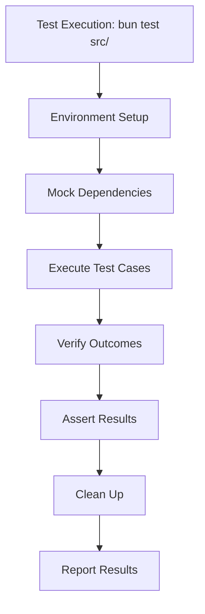
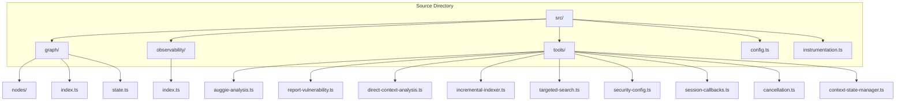

# Development Guide

<cite>
**Referenced Files in This Document**   
- [package.json](file://package.json)
- [README.md](file://README.md)
- [tsconfig.json](file://tsconfig.json)
- [src/graph/index.ts](file://src/graph/index.ts)
- [src/observability/index.ts](file://src/observability/index.ts)
- [src/tools/index.ts](file://src/tools/index.ts)
- [index.ts](file://index.ts)
- [src/graph/graph.test.ts](file://src/graph/graph.test.ts)
- [src/observability/index.test.ts](file://src/observability/index.test.ts)
- [src/tools/cancellation.test.ts](file://src/tools/cancellation.test.ts)
- [src/tools/context-state-manager.test.ts](file://src/tools/context-state-manager.test.ts)
- [src/tools/direct-context-analysis.test.ts](file://src/tools/direct-context-analysis.test.ts)
</cite>

## Table of Contents
1. [Introduction](#introduction)
2. [Testing Strategy](#testing-strategy)
3. [Type Checking](#type-checking)
4. [Contribution Workflow](#contribution-workflow)
5. [Release Process](#release-process)
6. [Code Organization](#code-organization)
7. [Adding New Features](#adding-new-features)
8. [Test Coverage and CI/CD](#test-coverage-and-cicd)

## Introduction
This development guide provides comprehensive information for contributing to and testing the OWASP GraphGuard codebase. The project is an AI-powered security scanner that analyzes codebases for OWASP Top 10 2021 vulnerabilities with full observability via Langfuse. The system uses a LangGraph state machine with a five-node workflow: input → enumerate → analyze → aggregate → output. This guide covers testing strategies, type checking, contribution workflows, release processes, code organization principles, guidelines for adding new features, test coverage expectations, and CI/CD pipeline details to support both new contributors and maintainers.

## Testing Strategy
The OWASP GraphGuard codebase uses bun:test as its primary testing framework, providing a modern and efficient testing experience. Tests are organized by module and can be found throughout the src/ directory with the .test.ts extension. The testing strategy focuses on unit testing individual components and their interactions, with particular emphasis on the observability system, tool functions, and graph workflow. The test suite validates both functionality and error handling, ensuring robustness in security-critical operations.

**Diagram sources**
- [src/graph/graph.test.ts](file://src/graph/graph.test.ts)
- [src/observability/index.test.ts](file://src/observability/index.test.ts)

**Section sources**
- [package.json](file://package.json#L8-L10)
- [README.md](file://README.md#L99-L102)
- [src/graph/graph.test.ts](file://src/graph/graph.test.ts)

## Type Checking
Type checking in the OWASP GraphGuard codebase is performed using TypeScript with the `bun run type-check` command. This command executes `tsc --noEmit` to validate type safety without generating output files. The project uses strict TypeScript configuration with ESNext targeting and module resolution set to "bundler" to support modern JavaScript features and Bun runtime capabilities. Type checking is a critical part of the development workflow, ensuring type safety across the codebase and preventing runtime errors.

**Section sources**
- [package.json](file://package.json#L11)
- [tsconfig.json](file://tsconfig.json)

## Contribution Workflow
The contribution workflow for OWASP GraphGuard follows standard Git practices with specific conventions for branching, commits, and pull requests. Contributors should create feature branches from the main branch, implement their changes with comprehensive tests, and submit pull requests for review. Each commit should be atomic and include a clear, descriptive message. Pull requests require approval from maintainers and must pass all CI/CD checks, including type checking and test coverage requirements, before merging.

**Section sources**
- [README.md](file://README.md)

## Release Process
The release process for OWASP GraphGuard is managed through package.json scripts, though specific release scripts are not defined in the current configuration. The project is marked as private in package.json, indicating it may not be published to a public registry. Version management follows semantic versioning principles, and releases are likely coordinated through Git tags and manual deployment processes. The absence of explicit release scripts suggests that deployment procedures may be handled externally or through manual processes.

**Section sources**
- [package.json](file://package.json#L2-L5)

## Code Organization
The OWASP GraphGuard codebase follows a modular organization with clear separation of concerns. The src/ directory contains the main application components organized into feature-based subdirectories: graph/ for the LangGraph workflow, observability/ for monitoring and tracing, and tools/ for utility functions and SDK integrations. The graph/ directory implements the five-node state machine (input, enumerate, analyze, aggregate, output) using LangChain's StateGraph. The observability/ module provides typed wrappers for Langfuse tracing, while tools/ contains Auggie SDK integrations and security analysis utilities.

**Diagram sources**
- [src/graph/index.ts](file://src/graph/index.ts)
- [src/observability/index.ts](file://src/observability/index.ts)
- [src/tools/index.ts](file://src/tools/index.ts)

**Section sources**
- [src/graph/index.ts](file://src/graph/index.ts)
- [src/observability/index.ts](file://src/observability/index.ts)
- [src/tools/index.ts](file://src/tools/index.ts)

## Adding New Features
When adding new features to OWASP GraphGuard, contributors should maintain the existing architectural patterns and ensure type safety throughout. New functionality should be integrated into the appropriate module (graph, observability, or tools) based on its purpose. Features involving security analysis should leverage the existing Auggie SDK integration and follow the observability patterns established in the codebase. All new code must include comprehensive tests and maintain compatibility with the LangGraph workflow. Special attention should be paid to error handling and security considerations, particularly when dealing with external API calls or sensitive data.

**Section sources**
- [src/graph/index.ts](file://src/graph/index.ts)
- [src/observability/index.ts](file://src/observability/index.ts)
- [src/tools/index.ts](file://src/tools/index.ts)

## Test Coverage and CI/CD
The CI/CD pipeline for OWASP GraphGuard is configured in the .github/workflows/test.yml file, though this file was not accessible in the current context. The local test suite can be executed with `bun test` and test coverage can be analyzed using `bun test --coverage src/`. The project expects comprehensive test coverage for all critical components, particularly those involved in security analysis and observability. The CI/CD pipeline likely includes steps for type checking, test execution, coverage analysis, and potentially security scanning. All pull requests must pass these automated checks before merging to ensure code quality and reliability.

**Section sources**
- [package.json](file://package.json#L8-L10)
- [README.md](file://README.md#L99-L102)