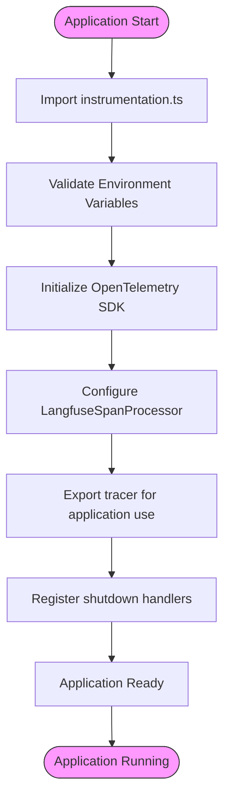
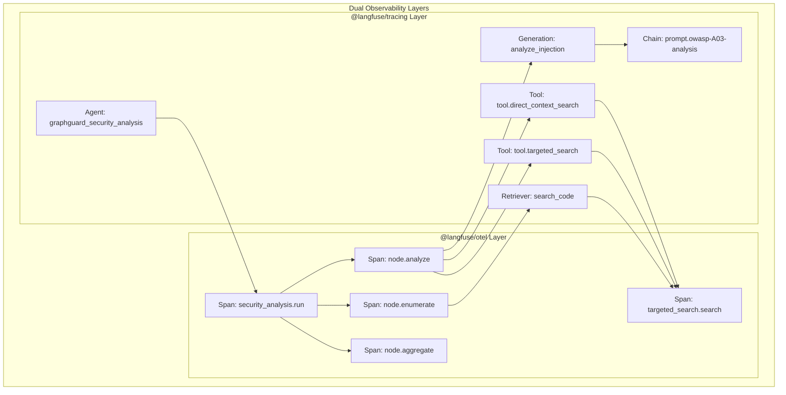
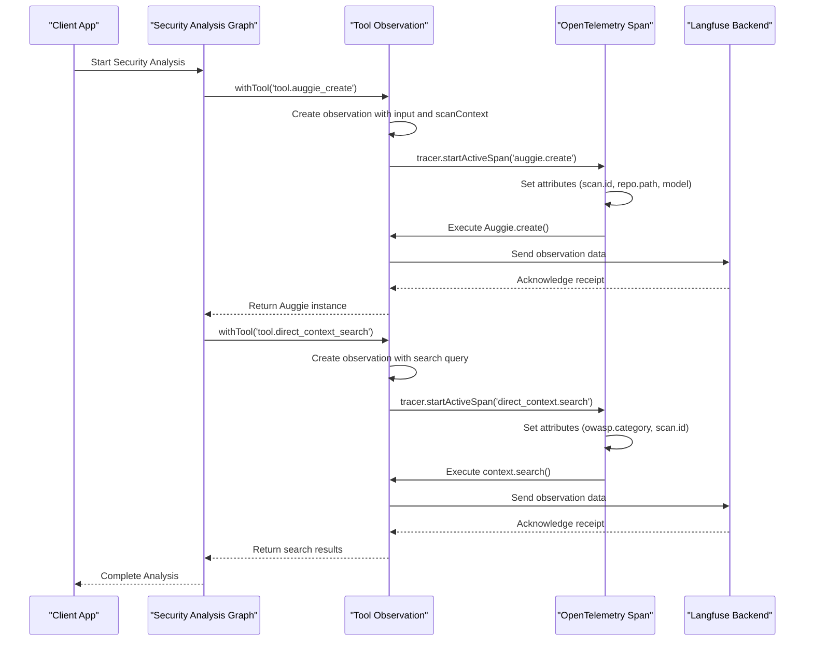
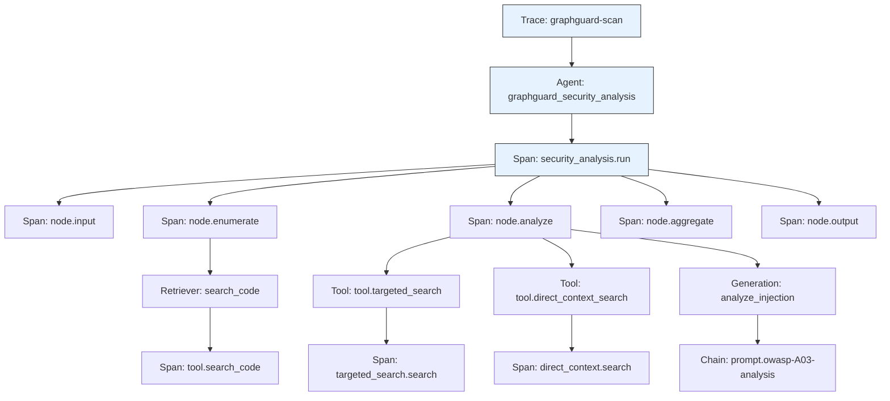

# Observability Integration

<cite>
**Referenced Files in This Document**   
- [src/instrumentation.ts](file://src/instrumentation.ts)
- [src/observability/index.ts](file://src/observability/index.ts)
- [src/graph/index.ts](file://src/graph/index.ts)
- [src/tools/auggie-analysis.ts](file://src/tools/auggie-analysis.ts)
- [src/tools/direct-context-analysis.ts](file://src/tools/direct-context-analysis.ts)
- [src/tools/targeted-search.ts](file://src/tools/targeted-search.ts)
- [src/config.ts](file://src/config.ts)
- [scripts/test-observability.ts](file://scripts/test-observability.ts)
</cite>

## Table of Contents
1. [Introduction](#introduction)
2. [Instrumentation Setup](#instrumentation-setup)
3. [Dual Observability Strategy](#dual-observability-strategy)
4. [Observability Wrappers](#observability-wrappers)
5. [Key Tool Observations](#key-tool-observations)
6. [Trace Hierarchy and Analysis Workflow](#trace-hierarchy-and-analysis-workflow)
7. [Setup Requirements](#setup-requirements)
8. [Interpreting Traces in Langfuse UI](#interpreting-traces-in-langfuse-ui)
9. [Performance Implications](#performance-implications)
10. [Data Privacy Considerations](#data-privacy-considerations)

## Introduction
This document provides comprehensive documentation for the observability integration in the Auggiesec-agent project, focusing on the implementation of Langfuse and OpenTelemetry. The system is designed to provide complete tracing of security analysis workflows with rich semantic observations. The observability architecture uses a dual approach with complementary Langfuse packages to capture both general application traces and LLM-specific metrics. This documentation explains the instrumentation setup, observation patterns, trace hierarchy, and practical guidance for using the observability system effectively.

## Instrumentation Setup
The observability system is initialized through the `instrumentation.ts` file, which must be imported first in the application entrypoint to ensure complete tracing coverage. This file sets up OpenTelemetry with the LangfuseSpanProcessor, capturing all spans from module initialization onwards. The instrumentation process validates required environment variables (`LANGFUSE_PUBLIC_KEY` and `LANGFUSE_SECRET_KEY`) early in the startup process and initializes the OpenTelemetry SDK with the Langfuse span processor. The system also implements graceful shutdown handlers for SIGTERM and SIGINT signals to ensure all traces are properly flushed to Langfuse before the application terminates.



**Diagram sources**
- [src/instrumentation.ts](file://src/instrumentation.ts#L89-L141)

**Section sources**
- [src/instrumentation.ts](file://src/instrumentation.ts#L1-L141)

## Dual Observability Strategy
The Auggiesec-agent implements a dual observability strategy using two complementary Langfuse packages: `@langfuse/otel` and `@langfuse/tracing`. This approach provides comprehensive visibility into both general application behavior and LLM-specific operations. The `@langfuse/otel` package, configured in `instrumentation.ts`, provides automatic span processing for general tracing, timing, and error tracking. All spans created via `tracer.startActiveSpan()` are automatically sent to Langfuse, capturing the execution flow of graph nodes, tool wrappers, and general application code.

The `@langfuse/tracing` package, implemented in `observability/index.ts`, provides rich observation types specifically designed for LLM operations, including generation, tool, retriever, chain, and agent observations. This enables LLM-specific tracking of model usage, token consumption, costs, and prompt linking. Both packages share the same OpenTelemetry context, ensuring that observations nest correctly in the trace hierarchy. This dual approach allows for granular timing data from OpenTelemetry spans while also capturing the semantic meaning of LLM operations through rich observation types.



**Diagram sources**
- [src/instrumentation.ts](file://src/instrumentation.ts#L89-L141)
- [src/observability/index.ts](file://src/observability/index.ts#L20-L411)

**Section sources**
- [src/instrumentation.ts](file://src/instrumentation.ts#L1-L141)
- [src/observability/index.ts](file://src/observability/index.ts#L1-L411)

## Observability Wrappers
The observability system provides a set of typed wrappers in `observability/index.ts` that create semantic observation types for different aspects of the security analysis workflow. These wrappers abstract the complexity of the Langfuse API while ensuring consistent observation patterns across the codebase. The `withTool` wrapper is used for tool invocations such as API calls, SDK operations, and external functions, capturing input parameters, output results, scan context, and error states. The `withAgent` wrapper is used for graph orchestration, providing high-level visibility into the analysis workflow.

Additional wrappers include `withGeneration` for LLM calls (tracking model, tokens, and costs), `withRetriever` for code search and file content retrieval, and `withChain` for prompt loading and data transformation. These wrappers automatically handle input/output capture, error recording with exception details, scan context attributes, duration tracking, and consistent metadata structure. The system also provides utility functions like `setTraceContext` and `setOwaspContext` to add trace-level and observation-level attributes for better organization and filtering in the Langfuse UI.

```mermaid
classDiagram
class withTool {
+name : string
+fn : () => Promise~T~
+options? : ToolObservationOptions
+return : Promise~T~
+Handles input/output capture
+Records errors with details
+Manages scan context
+Tracks duration
+Ensures metadata consistency
}
class withAgent {
+name : string
+fn : () => Promise~T~
+options? : { input? : unknown; metadata? : Record~string, unknown~ }
+return : Promise~T~
+Orchestrates graph nodes
+Provides workflow visibility
+Captures input/output
}
class withGeneration {
+name : string
+model : string
+fn : () => Promise~{ result : T; usage? : UsageDetails; cost? : CostDetails }~
+options? : { input? : unknown; promptName? : string; promptVersion? : number; metadata? : Record~string, unknown~ }
+return : Promise~T~
+Tracks model usage
+Monitors token consumption
+Calculates costs
+Links to prompts
}
class withRetriever {
+name : string
+fn : () => Promise~T~
+options? : { input? : unknown; metadata? : Record~string, unknown~ }
+return : Promise~T~
+Captures search queries
+Tracks retrieval results
+Monitors performance
}
class withChain {
+name : string
+fn : () => Promise~T~
+options? : { input? : unknown; metadata? : Record~string, unknown~ }
+return : Promise~T~
+Manages prompt loading
+Tracks data transformation
+Captures input/output
}
withTool --> "1" withToolObservationOptions : "uses"
withGeneration --> "1" LlmGenerationOptions : "uses"
withGeneration --> "1" LlmGenerationResult : "returns"
class ToolObservationOptions {
+input? : unknown
+scanContext? : { scanId : string; owaspCategory? : OwaspCategory; repoPath? : string }
+metadata? : Record~string, unknown~
}
class LlmGenerationOptions {
+model : string
+input : unknown
+owaspCategory? : OwaspCategory
+promptName? : string
+promptVersion? : number
+metadata? : Record~string, unknown~
}
class LlmGenerationResult~T~ {
+result : T
+usage? : UsageDetails
+cost? : CostDetails
}
class UsageDetails {
+[key : string] : number
}
class CostDetails {
+[key : string] : number
}
```

**Diagram sources**
- [src/observability/index.ts](file://src/observability/index.ts#L162-L272)

**Section sources**
- [src/observability/index.ts](file://src/observability/index.ts#L1-L411)

## Key Tool Observations
The system implements several key tool observations that capture important operations in the security analysis workflow. The `tool.auggie_create` observation tracks the creation of Auggie SDK instances, capturing input parameters such as repository path and model selection, along with scan context including scan ID, OWASP category, and repository path. This observation is critical for understanding the initialization of the Auggie-based analysis process.

The `tool.direct_context_search` observation captures searches performed using the DirectContext API, including the search query, OWASP category, and repository path in the scan context. This observation provides visibility into the code search operations that form the foundation of the security analysis. Other important tool observations include `tool.targeted_search` for vulnerability pattern searches, `tool.direct_context_index` for repository indexing operations, and `tool.direct_context_export` for state export operations. Each of these observations follows a consistent pattern of capturing input parameters, scan context, and execution metadata to enable comprehensive analysis in the Langfuse UI.



**Diagram sources**
- [src/tools/auggie-analysis.ts](file://src/tools/auggie-analysis.ts#L165-L193)
- [src/tools/direct-context-analysis.ts](file://src/tools/direct-context-analysis.ts#L292-L340)

**Section sources**
- [src/tools/auggie-analysis.ts](file://src/tools/auggie-analysis.ts#L1-L310)
- [src/tools/direct-context-analysis.ts](file://src/tools/direct-context-analysis.ts#L1-L414)
- [src/tools/targeted-search.ts](file://src/tools/targeted-search.ts#L107-L172)

## Trace Hierarchy and Analysis Workflow
The observability system provides a hierarchical trace structure that reflects the analysis workflow, offering visibility into the complete security scanning process. At the top level, the trace is named `graphguard-scan` and contains metadata such as repository path, user query, and tags for filtering. The root observation is an agent-type observation named `graphguard_security_analysis` that orchestrates the entire analysis workflow.

Beneath this agent observation, the trace hierarchy follows the graph execution flow: input → enumerate → analyze → aggregate → output. The enumerate phase uses a retriever-type observation to discover security-relevant files, while the analyze phase contains multiple tool-type observations for specific analysis operations. Each tool invocation creates its own span for granular timing data, while the rich observation types provide semantic context. This hierarchical structure enables developers to navigate from high-level workflow understanding to detailed performance analysis of individual operations.



**Diagram sources**
- [src/graph/index.ts](file://src/graph/index.ts#L56-L145)
- [src/graph/nodes/input.ts](file://src/graph/nodes/input.ts#L12-L54)
- [src/graph/nodes/enumerate.ts](file://src/graph/nodes/enumerate.ts#L138-L228)
- [src/graph/nodes/analyze.ts](file://src/graph/nodes/analyze.ts#L44-L156)

**Section sources**
- [src/graph/index.ts](file://src/graph/index.ts#L1-L153)
- [src/graph/nodes/index.ts](file://src/graph/nodes/index.ts#L1-L14)

## Setup Requirements
To use the observability system, a Langfuse account is required with the appropriate environment variables configured. The minimum setup requires the `LANGFUSE_PUBLIC_KEY` and `LANGFUSE_SECRET_KEY` environment variables, which are validated at startup in `instrumentation.ts`. These keys must have the correct prefixes (`pk-lf-` for public key and `sk-lf-` for secret key) as validated in the `config.ts` file. The system will exit with an error if these required variables are missing.

Additional optional environment variables include `LANGFUSE_BASE_URL` or `LANGFUSE_HOST` to specify a custom Langfuse endpoint, which defaults to `https://cloud.langfuse.com`. The configuration system in `config.ts` uses Zod schemas to validate all environment variables, providing clear error messages for invalid configurations. The `loadConfig()` function performs fail-fast validation, ensuring that configuration issues are caught early in the startup process. For testing purposes, the `.env.example` file provides a template for the required environment variables.

**Section sources**
- [src/instrumentation.ts](file://src/instrumentation.ts#L94-L101)
- [src/config.ts](file://src/config.ts#L35-L81)

## Interpreting Traces in Langfuse UI
The Langfuse UI provides a comprehensive view of the security analysis traces, with multiple ways to navigate and interpret the data. The trace list view shows all completed scans with metadata such as repository path, user query, and tags, allowing for easy filtering and searching. Clicking on a trace reveals the hierarchical structure with the agent observation at the top level, followed by spans and other observation types.

Within the trace view, users can examine the input and output of each observation, view timing data, and inspect metadata such as scan context and error information. The UI highlights error states with red indicators, making it easy to identify failed operations. For LLM-related observations, the UI displays token usage, model information, and cost details when available. The search functionality allows users to find specific observations by name, such as `tool.auggie_create` or `tool.direct_context_search`, enabling focused analysis of particular aspects of the workflow.

**Section sources**
- [scripts/test-observability.ts](file://scripts/test-observability.ts#L54-L61)

## Performance Implications
The observability system has several performance implications that should be considered during operation. The initialization of OpenTelemetry and Langfuse instrumentation adds startup overhead, which is why `instrumentation.ts` must be imported first. Each observation and span creation has a small runtime cost, but this is generally negligible compared to the actual analysis operations. The system batches trace data and flushes it periodically to minimize network overhead.

For large repositories, the indexing operations tracked by `tool.direct_context_index` can be resource-intensive, and the observability data reflects this with detailed timing information. Similarly, LLM calls tracked by generation observations incur both time and monetary costs, which are captured in the observability data. The system is designed to be efficient by reusing indexed state between scans, as evidenced by the `tool.direct_context_create` observation which shows whether state was imported from a file or created anew. This state reuse significantly reduces the time and resources required for subsequent scans of the same repository.

**Section sources**
- [src/tools/direct-context-analysis.ts](file://src/tools/direct-context-analysis.ts#L125-L182)
- [src/tools/auggie-analysis.ts](file://src/tools/auggie-analysis.ts#L165-L193)

## Data Privacy Considerations
The observability system handles potentially sensitive data, and several privacy considerations should be noted. The system captures input and output data for observations, which may include code snippets, file paths, and analysis results. While this data is essential for debugging and analysis, it should be protected through proper access controls in the Langfuse environment. The configuration system in `config.ts` validates that API keys have the correct format but does not log their full values, reducing the risk of credential exposure.

The system captures repository paths and file names in trace metadata, which could reveal information about the codebase structure. For sensitive repositories, users should consider whether this level of detail is appropriate for their observability setup. The `withTool` wrapper includes options to control what input data is captured, allowing users to omit sensitive parameters if needed. Additionally, the system should be configured with appropriate retention policies in Langfuse to ensure that observability data is not stored longer than necessary.

**Section sources**
- [src/observability/index.ts](file://src/observability/index.ts#L162-L212)
- [src/config.ts](file://src/config.ts#L1-L153)