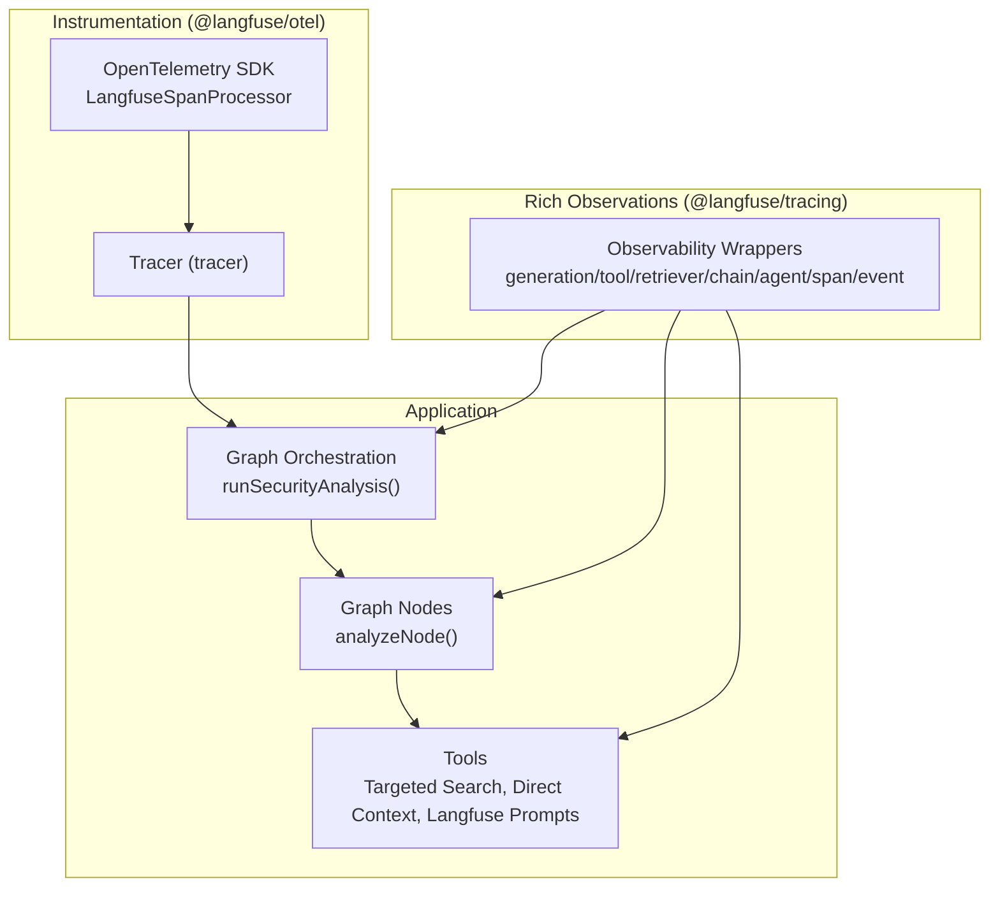
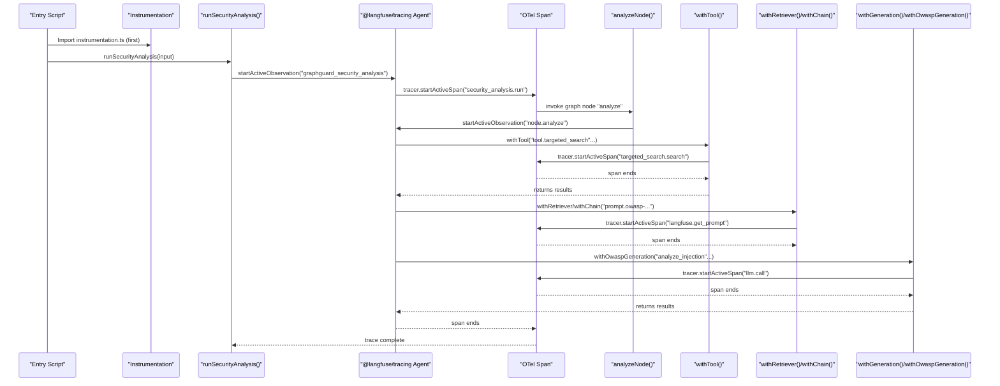
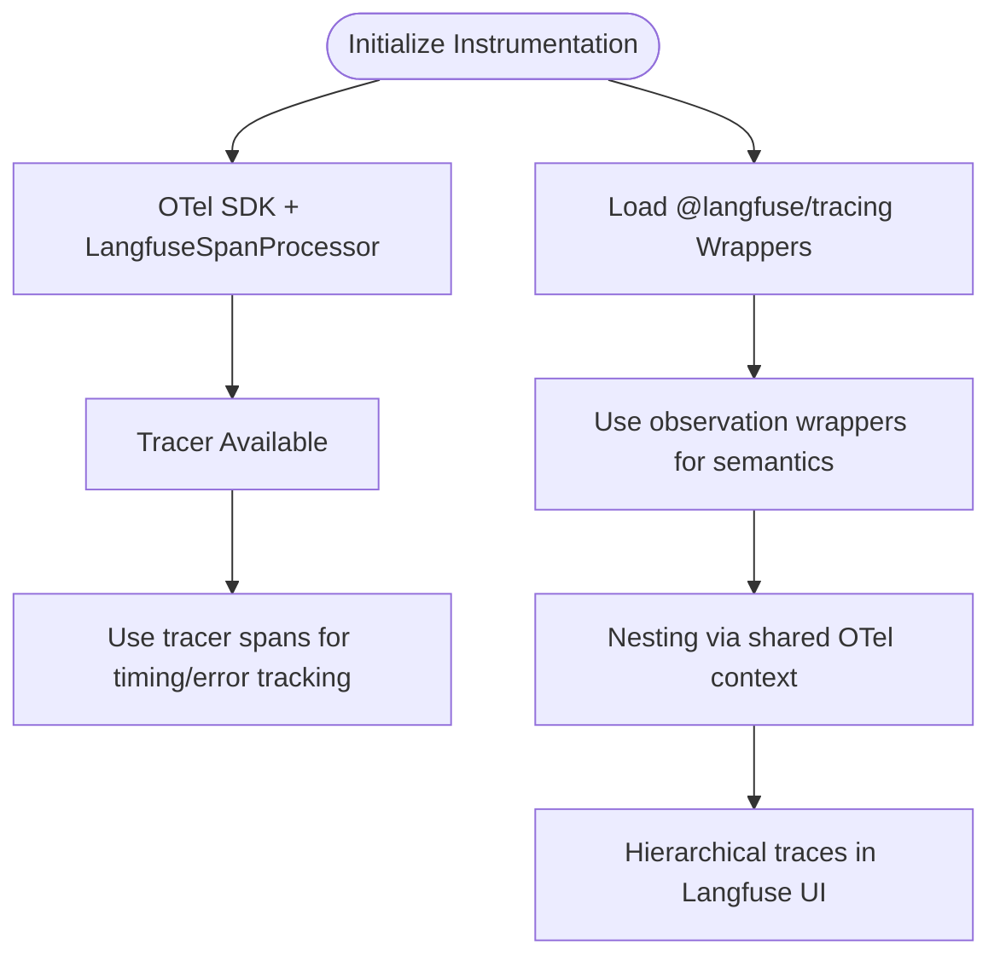
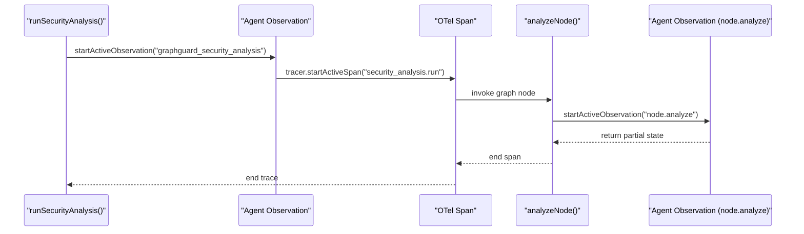
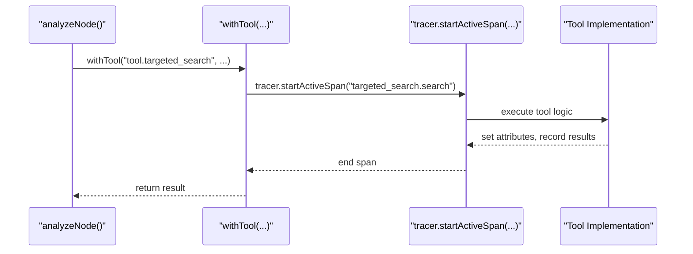
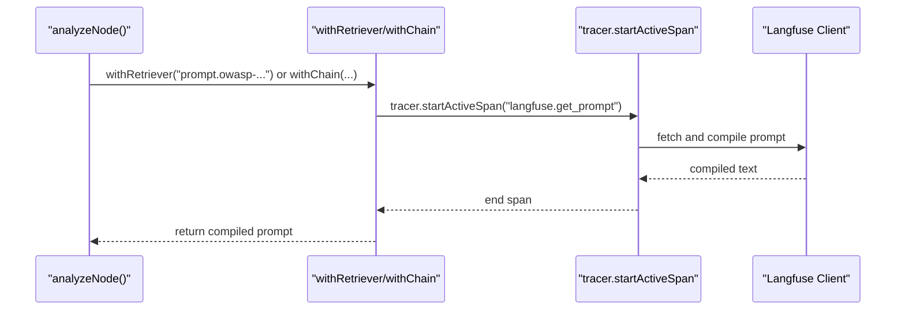
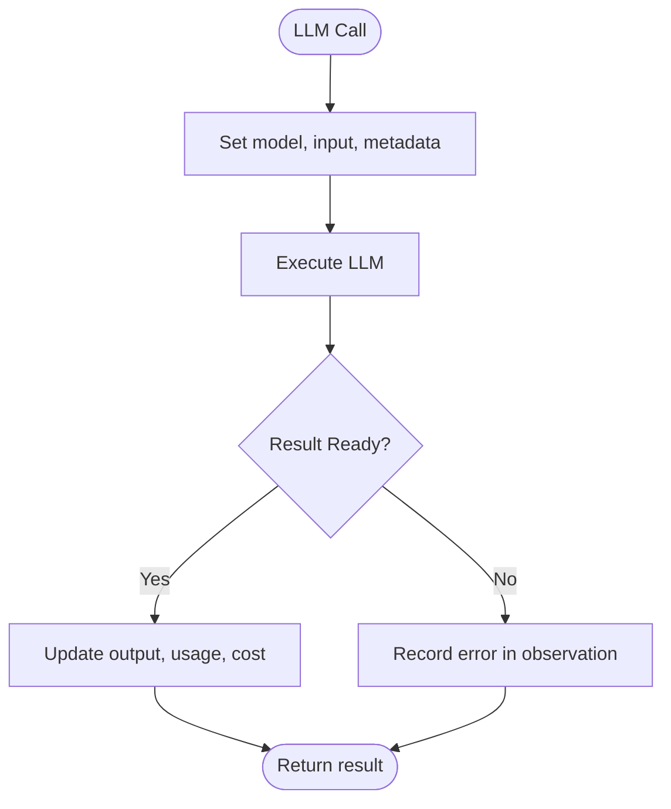
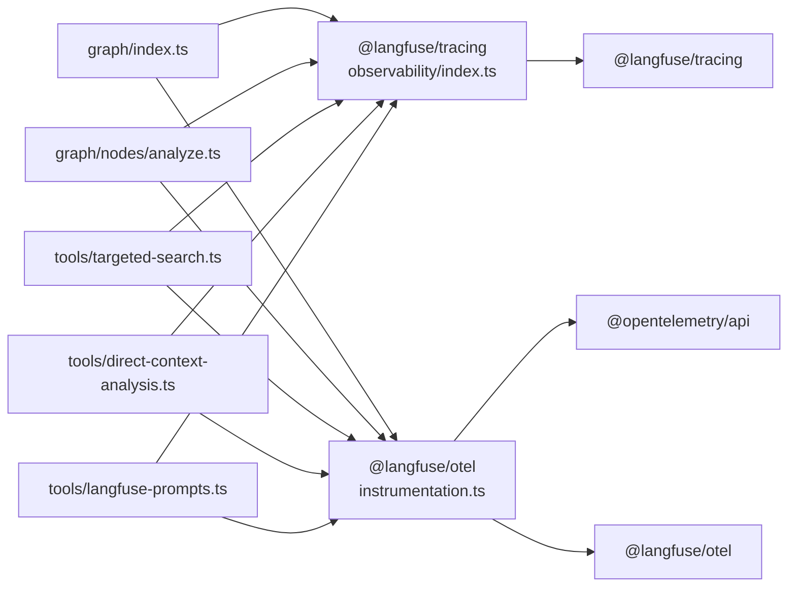

# Observation Types

<cite>
**Referenced Files in This Document**
- [instrumentation.ts](file://src/instrumentation.ts)
- [observability/index.ts](file://src/observability/index.ts)
- [graph/index.ts](file://src/graph/index.ts)
- [graph/nodes/analyze.ts](file://src/graph/nodes/analyze.ts)
- [tools/targeted-search.ts](file://src/tools/targeted-search.ts)
- [tools/direct-context-analysis.ts](file://src/tools/direct-context-analysis.ts)
- [tools/langfuse-prompts.ts](file://src/tools/langfuse-prompts.ts)
- [scripts/test-observability.ts](file://scripts/test-observability.ts)
</cite>

## Table of Contents
1. [Introduction](#introduction)
2. [Project Structure](#project-structure)
3. [Core Components](#core-components)
4. [Architecture Overview](#architecture-overview)
5. [Detailed Component Analysis](#detailed-component-analysis)
6. [Dependency Analysis](#dependency-analysis)
7. [Performance Considerations](#performance-considerations)
8. [Troubleshooting Guide](#troubleshooting-guide)
9. [Conclusion](#conclusion)

## Introduction
This document explains the observation types used in the dual observability strategy for the security analysis workflow. It distinguishes between @langfuse/otel spans and @langfuse/tracing rich observation types, details each observation type (generation, tool, retriever, chain, agent, span), and shows how they form a hierarchical trace that mirrors the execution flow from graph orchestration down to individual tool calls. It also describes how different observation types enable specialized analysis in the Langfuse UI and provides guidance for selecting the right type for new components.

## Project Structure
The observability system is implemented across three layers:
- Instrumentation layer initializes OpenTelemetry and the Langfuse span processor for general span collection.
- Rich observation wrappers provide typed, semantic observation types for LLM calls, tools, retrievers, chains, agents, and events.
- Graph orchestration and tools integrate these wrappers to produce a nested, hierarchical trace.

**Diagram sources**
- [instrumentation.ts](file://src/instrumentation.ts#L89-L141)
- [observability/index.ts](file://src/observability/index.ts#L1-L120)
- [graph/index.ts](file://src/graph/index.ts#L56-L145)
- [graph/nodes/analyze.ts](file://src/graph/nodes/analyze.ts#L44-L156)
- [tools/targeted-search.ts](file://src/tools/targeted-search.ts#L98-L173)
- [tools/direct-context-analysis.ts](file://src/tools/direct-context-analysis.ts#L121-L183)
- [tools/langfuse-prompts.ts](file://src/tools/langfuse-prompts.ts#L67-L168)

**Section sources**
- [instrumentation.ts](file://src/instrumentation.ts#L1-L141)
- [observability/index.ts](file://src/observability/index.ts#L1-L120)

## Core Components
- Dual observability approach:
  - @langfuse/otel: automatic span processing and general timing/error tracking via tracer spans.
  - @langfuse/tracing: rich observation types with semantic meaning for LLMs, tools, retrievers, chains, agents, and events.
- Shared OpenTelemetry context ensures nesting: spans and observations align correctly in the trace tree.

Key observation types:
- generation: LLM calls with model, tokens, costs, and prompt linking.
- tool: Auggie SDK tool invocations and external API calls.
- retriever: Code search and file content retrieval.
- chain: Prompt loading and data transformation.
- agent: Graph node orchestration.
- span: General-purpose timing (default).

**Section sources**
- [instrumentation.ts](file://src/instrumentation.ts#L8-L57)
- [observability/index.ts](file://src/observability/index.ts#L36-L51)

## Architecture Overview
The system creates a hierarchical trace where:
- The top-level agent observation wraps the entire graph run.
- Each graph node is represented as an agent observation.
- Tool calls are wrapped with tool observations and include OTel spans for granular timing.
- Retrieval and prompt loading are captured as retriever and chain observations.
- LLM generations are captured as generation observations with usage and cost details.

**Diagram sources**
- [instrumentation.ts](file://src/instrumentation.ts#L89-L141)
- [graph/index.ts](file://src/graph/index.ts#L56-L145)
- [graph/nodes/analyze.ts](file://src/graph/nodes/analyze.ts#L44-L156)
- [tools/targeted-search.ts](file://src/tools/targeted-search.ts#L98-L173)
- [tools/langfuse-prompts.ts](file://src/tools/langfuse-prompts.ts#L67-L168)
- [observability/index.ts](file://src/observability/index.ts#L83-L119)

## Detailed Component Analysis

### Observation Type Definitions and Semantics
- generation: Tracks model, input, output, usage, and cost; optionally linked to Langfuse prompts.
- tool: Captures input parameters, output results, scan context (scanId, OWASP category, repoPath), and error states.
- retriever: Records retrieval actions (e.g., prompt fetching) with input and output.
- chain: Records prompt loading and transformation steps with input metadata.
- agent: Orchestrates graph nodes; captures input and output state for the node.
- span: General-purpose timing and error tracking via tracer spans.

These types are defined and exported for type safety and consistent usage.

**Section sources**
- [observability/index.ts](file://src/observability/index.ts#L36-L51)
- [observability/index.ts](file://src/observability/index.ts#L83-L119)
- [observability/index.ts](file://src/observability/index.ts#L121-L212)
- [observability/index.ts](file://src/observability/index.ts#L214-L232)
- [observability/index.ts](file://src/observability/index.ts#L234-L252)
- [observability/index.ts](file://src/observability/index.ts#L254-L272)

### Dual Observability Strategy
- @langfuse/otel: Initializes the OpenTelemetry SDK and LangfuseSpanProcessor; all tracer spans are sent to Langfuse automatically.
- @langfuse/tracing: Provides typed wrappers that set observation type and metadata; both share the same OpenTelemetry context so nesting is preserved.

**Diagram sources**
- [instrumentation.ts](file://src/instrumentation.ts#L89-L141)
- [observability/index.ts](file://src/observability/index.ts#L1-L51)

**Section sources**
- [instrumentation.ts](file://src/instrumentation.ts#L8-L57)

### Trace Hierarchy Example from Comments
The instrumentation file documents a concrete trace hierarchy that demonstrates how agent, span, tool, and generation observations nest. This example shows:
- Trace: graphguard-scan
- Agent: graphguard_security_analysis
- Span: security_analysis.run
- Node spans: node.enumerate, node.analyze, node.aggregate
- Retriever: search_code
- Tool: tool.targeted_search, tool.direct_context_search
- Generation: analyze_injection
- Chain: prompt.owasp-A03-analysis

This hierarchy reflects the actual execution flow from graph orchestration down to individual tool calls and LLM generations.

**Section sources**
- [instrumentation.ts](file://src/instrumentation.ts#L28-L43)

### Graph Orchestration and Agent Observations
- The main entry point starts an agent observation for the entire scan and sets trace-level context.
- Each graph node is wrapped as an agent observation to capture input/output and metadata.
- The analyze node orchestrates category-by-category analysis and aggregates findings.

**Diagram sources**
- [graph/index.ts](file://src/graph/index.ts#L56-L145)
- [graph/nodes/analyze.ts](file://src/graph/nodes/analyze.ts#L44-L156)

**Section sources**
- [graph/index.ts](file://src/graph/index.ts#L56-L145)
- [graph/nodes/analyze.ts](file://src/graph/nodes/analyze.ts#L44-L156)

### Tool Observations
- Targeted search tool uses withTool to wrap the operation and tracer spans for granular timing.
- Direct context tooling uses withTool for context creation, indexing, searching, and state export.
- Tool observations capture input parameters, output results, scan context (scanId, OWASP category, repoPath), and error states.

**Diagram sources**
- [tools/targeted-search.ts](file://src/tools/targeted-search.ts#L98-L173)
- [tools/direct-context-analysis.ts](file://src/tools/direct-context-analysis.ts#L121-L183)

**Section sources**
- [tools/targeted-search.ts](file://src/tools/targeted-search.ts#L98-L173)
- [tools/direct-context-analysis.ts](file://src/tools/direct-context-analysis.ts#L121-L183)

### Retriever and Chain Observations
- Prompt retrieval uses retriever observation type to track prompt name, label, version, and variables.
- Prompt loading uses chain observation type to capture prompt compilation and metadata.

**Diagram sources**
- [tools/langfuse-prompts.ts](file://src/tools/langfuse-prompts.ts#L67-L168)

**Section sources**
- [tools/langfuse-prompts.ts](file://src/tools/langfuse-prompts.ts#L67-L168)

### Generation Observations
- Generations capture model, input, output, usage, and cost details.
- OWASP-specific generation wrapper adds prompt linking and OWASP category context.

**Diagram sources**
- [observability/index.ts](file://src/observability/index.ts#L83-L119)
- [observability/index.ts](file://src/observability/index.ts#L376-L410)

**Section sources**
- [observability/index.ts](file://src/observability/index.ts#L83-L119)
- [observability/index.ts](file://src/observability/index.ts#L376-L410)

### Specialized Analysis in the Langfuse UI
- Generations: cost tracking and token usage enable financial analysis and optimization.
- Tools: input/output inspection helps validate tool behavior and troubleshoot failures.
- Agents: node-level orchestration visibility aids debugging and performance tuning.
- Retrievers and Chains: prompt retrieval and compilation insights help manage prompt lifecycle and quality.

**Section sources**
- [observability/index.ts](file://src/observability/index.ts#L83-L119)
- [observability/index.ts](file://src/observability/index.ts#L121-L212)
- [observability/index.ts](file://src/observability/index.ts#L214-L272)
- [tools/langfuse-prompts.ts](file://src/tools/langfuse-prompts.ts#L67-L168)

### Guidance for Selecting Observation Types
- Use agent for graph node orchestration and top-level scan orchestration.
- Use tool for any external API call, SDK invocation, or file operation.
- Use retriever for retrieval actions (e.g., prompt fetching).
- Use chain for prompt loading and data transformation steps.
- Use generation for LLM calls; use withOwaspGeneration for OWASP-specific analysis with prompt linking and usage/cost tracking.
- Use span for general timing and error tracking when rich semantics are not needed.

**Section sources**
- [instrumentation.ts](file://src/instrumentation.ts#L45-L57)
- [observability/index.ts](file://src/observability/index.ts#L36-L51)

## Dependency Analysis
- Instrumentation depends on @langfuse/otel and @opentelemetry/api to initialize the SDK and send spans to Langfuse.
- Observability wrappers depend on @langfuse/tracing for rich observation types and on tracer for OTel spans.
- Graph orchestration and tools depend on both layers to produce a unified, nested trace.

**Diagram sources**
- [instrumentation.ts](file://src/instrumentation.ts#L89-L141)
- [observability/index.ts](file://src/observability/index.ts#L1-L51)
- [graph/index.ts](file://src/graph/index.ts#L56-L145)
- [graph/nodes/analyze.ts](file://src/graph/nodes/analyze.ts#L44-L156)
- [tools/targeted-search.ts](file://src/tools/targeted-search.ts#L98-L173)
- [tools/direct-context-analysis.ts](file://src/tools/direct-context-analysis.ts#L121-L183)
- [tools/langfuse-prompts.ts](file://src/tools/langfuse-prompts.ts#L67-L168)

**Section sources**
- [instrumentation.ts](file://src/instrumentation.ts#L89-L141)
- [observability/index.ts](file://src/observability/index.ts#L1-L51)
- [graph/index.ts](file://src/graph/index.ts#L56-L145)
- [graph/nodes/analyze.ts](file://src/graph/nodes/analyze.ts#L44-L156)
- [tools/targeted-search.ts](file://src/tools/targeted-search.ts#L98-L173)
- [tools/direct-context-analysis.ts](file://src/tools/direct-context-analysis.ts#L121-L183)
- [tools/langfuse-prompts.ts](file://src/tools/langfuse-prompts.ts#L67-L168)

## Performance Considerations
- Prefer tool observations for external calls to capture granular timing and error states.
- Use chain and retriever for prompt-related steps to track prompt lifecycle and reduce retries.
- Use generation and withOwaspGeneration to monitor token usage and costs; optimize prompts and inputs accordingly.
- Keep observation payloads minimal to reduce overhead; avoid logging large outputs unless necessary.

[No sources needed since this section provides general guidance]

## Troubleshooting Guide
- Verify instrumentation is imported first to ensure all spans are captured.
- Confirm environment variables for Langfuse are set before importing instrumentation.
- Use test script to validate traces and confirm expected observation types appear in the UI.
- For tool failures, check error recording in tool observations and corresponding OTel spans.

**Section sources**
- [instrumentation.ts](file://src/instrumentation.ts#L94-L101)
- [scripts/test-observability.ts](file://scripts/test-observability.ts#L1-L73)

## Conclusion
The dual observability strategy combines @langfuse/otel spans and @langfuse/tracing rich observation types to deliver a complete, hierarchical view of the security analysis workflow. By selecting the appropriate observation type for each component—agent for orchestration, tool for external operations, retriever and chain for prompt-related steps, and generation for LLM calls—you gain specialized insights for debugging, performance optimization, and cost tracking in the Langfuse UI.