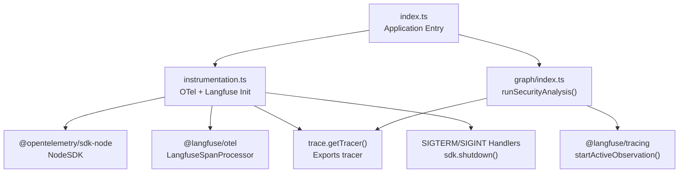
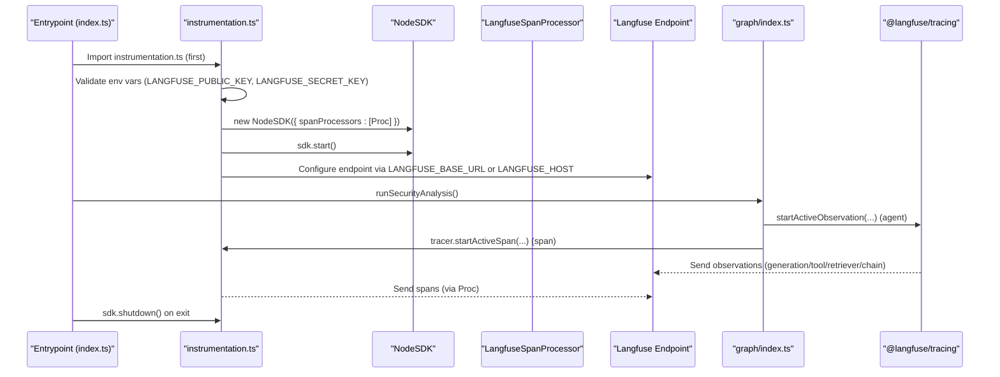
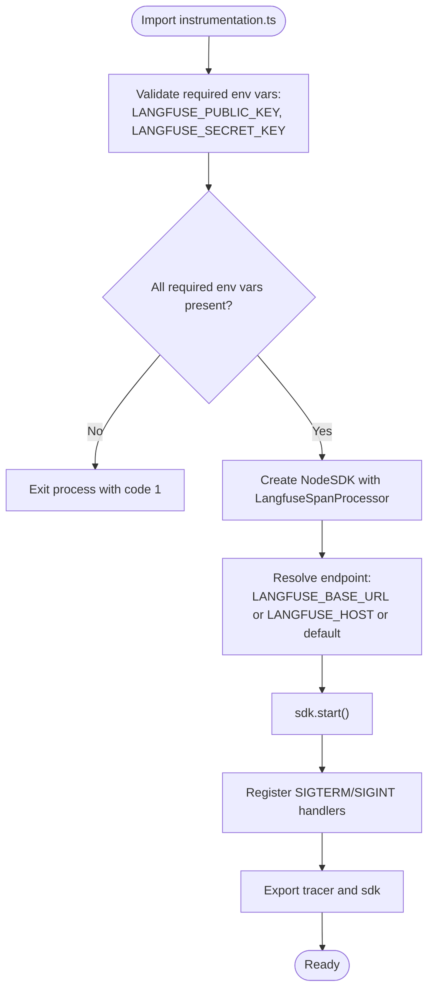
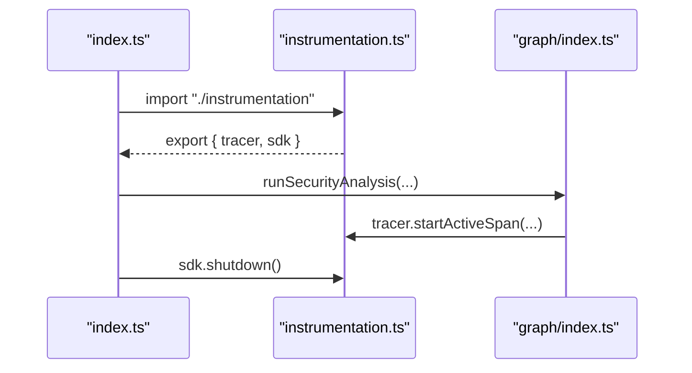
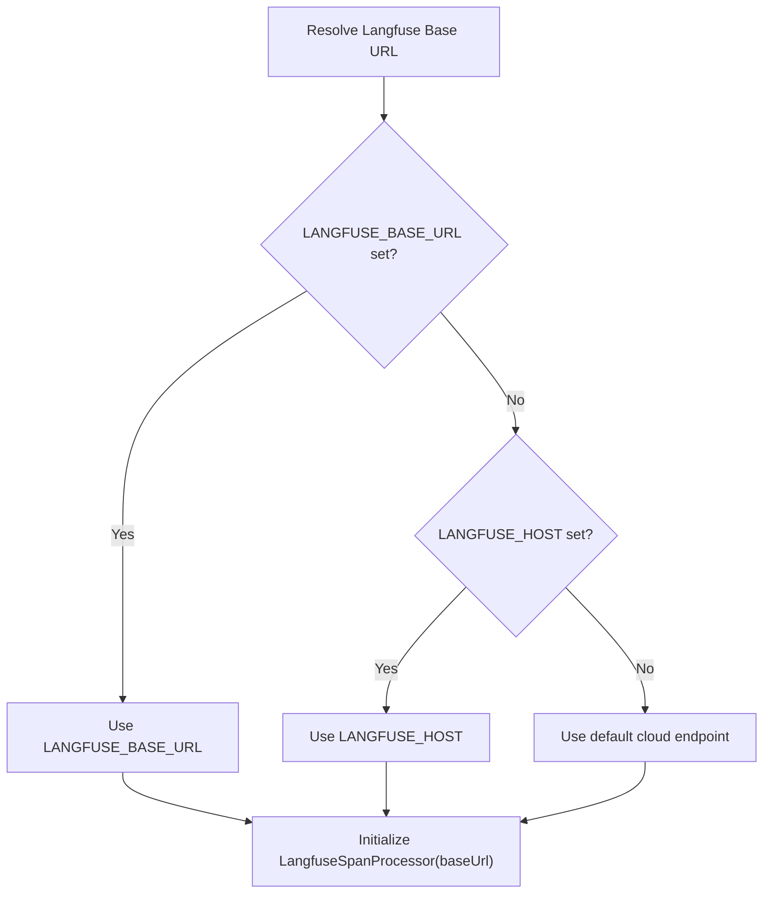
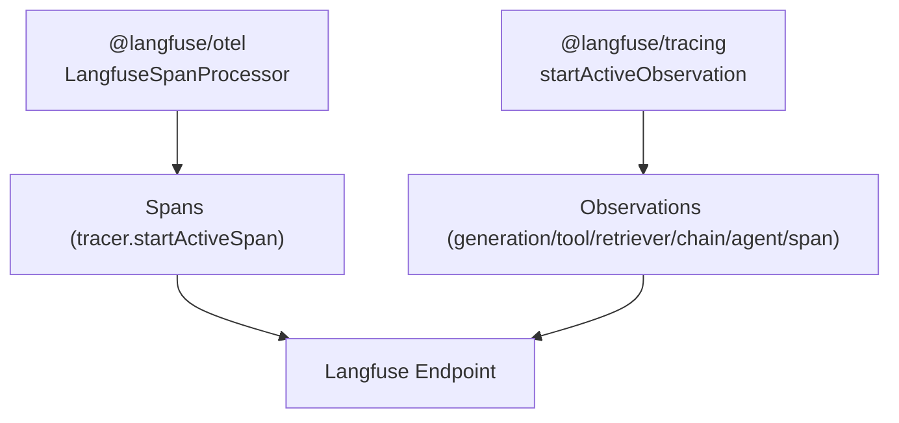
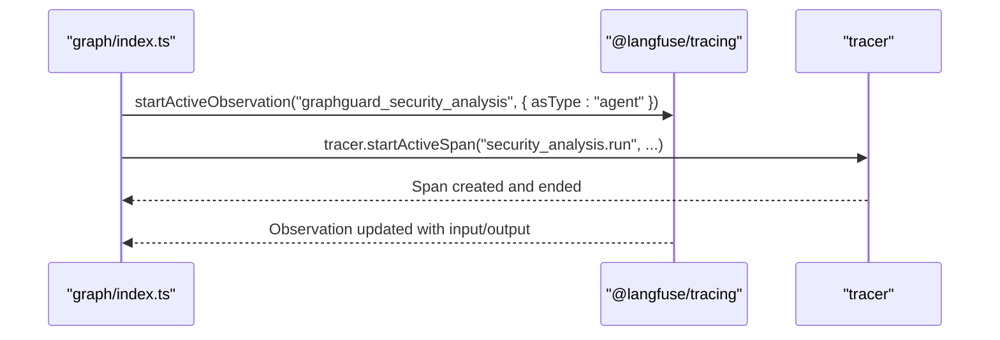
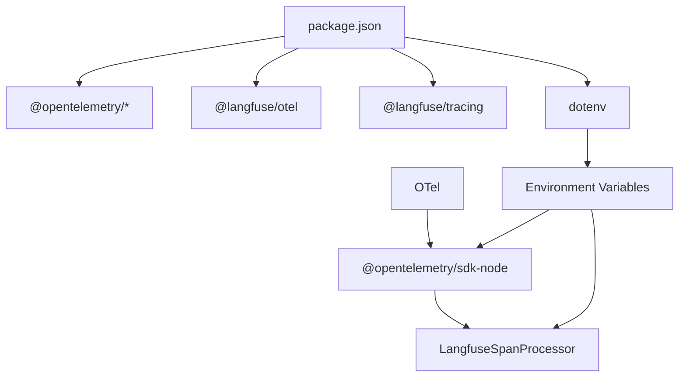

# OpenTelemetry Setup

<cite>
**Referenced Files in This Document**
- [instrumentation.ts](file://src/instrumentation.ts)
- [index.ts](file://index.ts)
- [observability/index.ts](file://src/observability/index.ts)
- [graph/index.ts](file://src/graph/index.ts)
- [config.ts](file://src/config.ts)
- [.env.example](file://.env.example)
- [package.json](file://package.json)
- [instrumentation.test.ts](file://src/instrumentation.test.ts)
</cite>

## Table of Contents
1. [Introduction](#introduction)
2. [Project Structure](#project-structure)
3. [Core Components](#core-components)
4. [Architecture Overview](#architecture-overview)
5. [Detailed Component Analysis](#detailed-component-analysis)
6. [Dependency Analysis](#dependency-analysis)
7. [Performance Considerations](#performance-considerations)
8. [Troubleshooting Guide](#troubleshooting-guide)
9. [Conclusion](#conclusion)

## Introduction
This document explains how OpenTelemetry is configured and initialized in the project, focusing on the initialization process in instrumentation.ts. It details why this file must be imported first in the entrypoint to ensure complete tracing coverage from module initialization, how the NodeSDK is configured with LangfuseSpanProcessor, environment variable validation for Langfuse credentials, the role of LANGFUSE_BASE_URL or LANGFUSE_HOST in directing telemetry data, graceful shutdown via SIGTERM and SIGINT handlers, and how OpenTelemetry integrates with Langfuse for span collection. It also provides usage guidance for tracer export and SDK usage, and offers troubleshooting tips for common setup issues.

## Project Structure
The observability stack is composed of:
- instrumentation.ts: Initializes OpenTelemetry SDK with LangfuseSpanProcessor, validates environment variables, exports tracer and SDK, and registers graceful shutdown handlers.
- index.ts: The application entrypoint that imports instrumentation.ts first, then runs the security analysis workflow and flushes spans on completion.
- observability/index.ts: Provides typed observation wrappers (generation, tool, retriever, chain, agent, span) powered by @langfuse/tracing and sharing the same OpenTelemetry context as @langfuse/otel.
- graph/index.ts: Demonstrates usage of both tracer and @langfuse/tracing in the main workflow, showing how spans and observations nest correctly.
- config.ts: Loads and validates configuration including Langfuse keys and host, and exposes credentials extraction for downstream services.
- .env.example: Example environment variables for Langfuse and other integrations.
- package.json: Declares OpenTelemetry and Langfuse dependencies.

**Diagram sources**
- [index.ts](file://index.ts#L1-L10)
- [instrumentation.ts](file://src/instrumentation.ts#L94-L141)
- [graph/index.ts](file://src/graph/index.ts#L56-L145)
- [observability/index.ts](file://src/observability/index.ts#L1-L40)

**Section sources**
- [index.ts](file://index.ts#L1-L10)
- [instrumentation.ts](file://src/instrumentation.ts#L94-L141)
- [graph/index.ts](file://src/graph/index.ts#L56-L145)
- [observability/index.ts](file://src/observability/index.ts#L1-L40)
- [package.json](file://package.json#L19-L28)

## Core Components
- OpenTelemetry + Langfuse Initialization: instrumentation.ts initializes the NodeSDK with LangfuseSpanProcessor, validates required environment variables, logs the target endpoint, starts the SDK, and registers graceful shutdown handlers for SIGTERM and SIGINT.
- Tracer Export: The tracer is exported from instrumentation.ts for use across the application.
- SDK Export: The NodeSDK instance is exported for testing and controlled shutdown in the entrypoint.
- Dual Observability: Two complementary packages are used:
  - @langfuse/otel: Provides LangfuseSpanProcessor and automatic span export to Langfuse.
  - @langfuse/tracing: Provides typed observation wrappers (generation, tool, retriever, chain, agent, span) that share the same OpenTelemetry context.
- Early Initialization Requirement: instrumentation.ts must be imported first in the entrypoint to capture traces from module initialization.

**Section sources**
- [instrumentation.ts](file://src/instrumentation.ts#L94-L141)
- [observability/index.ts](file://src/observability/index.ts#L1-L40)
- [index.ts](file://index.ts#L1-L10)

## Architecture Overview
The system uses a dual observability approach:
- @langfuse/otel captures general-purpose spans and timing via LangfuseSpanProcessor.
- @langfuse/tracing captures rich LLM-centric observations (generation, tool, retriever, chain, agent) and nests them under the same OpenTelemetry context.

**Diagram sources**
- [index.ts](file://index.ts#L1-L10)
- [instrumentation.ts](file://src/instrumentation.ts#L94-L141)
- [graph/index.ts](file://src/graph/index.ts#L56-L145)
- [observability/index.ts](file://src/observability/index.ts#L1-L40)

## Detailed Component Analysis

### OpenTelemetry + Langfuse Initialization (instrumentation.ts)
- Early Import Requirement:
  - instrumentation.ts must be imported first in the entrypoint to ensure the OpenTelemetry SDK initializes before any other code runs, capturing traces from module initialization.
- Environment Variable Validation:
  - Required variables: LANGFUSE_PUBLIC_KEY and LANGFUSE_SECRET_KEY. The module exits immediately if either is missing.
- NodeSDK Configuration:
  - NodeSDK is created with a single span processor: LangfuseSpanProcessor.
  - LangfuseSpanProcessor reads LANGFUSE_PUBLIC_KEY and LANGFUSE_SECRET_KEY from environment variables.
- Endpoint Selection:
  - The base URL is determined by LANGFUSE_BASE_URL if present; otherwise by LANGFUSE_HOST if present; otherwise defaults to a known cloud endpoint.
- SDK Lifecycle:
  - sdk.start() initializes the SDK.
  - SIGTERM and SIGINT handlers call sdk.shutdown() to flush buffered spans before process exit.
- Tracer and SDK Export:
  - tracer is exported for general-purpose spans.
  - sdk is exported for testing and controlled shutdown in the entrypoint.

**Diagram sources**
- [instrumentation.ts](file://src/instrumentation.ts#L94-L141)

**Section sources**
- [instrumentation.ts](file://src/instrumentation.ts#L94-L141)
- [instrumentation.test.ts](file://src/instrumentation.test.ts#L21-L34)
- [instrumentation.test.ts](file://src/instrumentation.test.ts#L44-L56)
- [instrumentation.test.ts](file://src/instrumentation.test.ts#L70-L75)

### Tracer Export and SDK Usage
- Tracer Export:
  - tracer is exported from instrumentation.ts and used in application code (e.g., graph/index.ts) to create spans for timing and error tracking.
- SDK Usage:
  - The entrypoint imports sdk from instrumentation.ts and calls sdk.shutdown() during cleanup to flush spans before exit.

**Diagram sources**
- [index.ts](file://index.ts#L1-L10)
- [instrumentation.ts](file://src/instrumentation.ts#L136-L141)
- [graph/index.ts](file://src/graph/index.ts#L81-L141)

**Section sources**
- [index.ts](file://index.ts#L1-L10)
- [instrumentation.ts](file://src/instrumentation.ts#L136-L141)
- [graph/index.ts](file://src/graph/index.ts#L81-L141)

### LangfuseSpanProcessor Configuration
- LangfuseSpanProcessor is configured with a baseUrl derived from environment variables:
  - LANGFUSE_BASE_URL takes precedence.
  - LANGFUSE_HOST is used if LANGFUSE_BASE_URL is not set.
  - Defaults to a known cloud endpoint if neither is set.
- The processor automatically sends spans to Langfuse using the validated credentials.

**Diagram sources**
- [instrumentation.ts](file://src/instrumentation.ts#L105-L112)

**Section sources**
- [instrumentation.ts](file://src/instrumentation.ts#L105-L112)

### Dual Observability: @langfuse/otel vs @langfuse/tracing
- @langfuse/otel:
  - Provides LangfuseSpanProcessor for automatic span processing.
  - Spans created via tracer.startActiveSpan() are automatically sent to Langfuse.
  - Best for general tracing, timing, error tracking, and span attributes.
- @langfuse/tracing:
  - Provides rich observation types: generation, tool, retriever, chain, agent, span.
  - Enables LLM-specific tracking: model, tokens, costs, prompt linking.
  - Best for LLM calls, tool invocations, prompt loading, and agent orchestration.
- Shared Context:
  - Both packages share the same OpenTelemetry context, enabling correct nesting of observations and spans.

**Diagram sources**
- [instrumentation.ts](file://src/instrumentation.ts#L1-L52)
- [observability/index.ts](file://src/observability/index.ts#L1-L40)

**Section sources**
- [instrumentation.ts](file://src/instrumentation.ts#L1-L52)
- [observability/index.ts](file://src/observability/index.ts#L1-L40)

### Usage in the Main Workflow (graph/index.ts)
- The main workflow demonstrates both approaches:
  - Agent-level orchestration using @langfuse/tracing with startActiveObservation and updateActiveTrace.
  - General-purpose spans using tracer.startActiveSpan() for timing and error tracking.
- Both nest under the same trace, ensuring coherent observability.

**Diagram sources**
- [graph/index.ts](file://src/graph/index.ts#L56-L145)

**Section sources**
- [graph/index.ts](file://src/graph/index.ts#L56-L145)

## Dependency Analysis
- Dependencies:
  - @opentelemetry/api and @opentelemetry/sdk-node are used for OpenTelemetry core functionality.
  - @langfuse/otel provides LangfuseSpanProcessor for span export.
  - @langfuse/tracing provides typed observation wrappers.
  - dotenv is used to load environment variables.
- Coupling:
  - instrumentation.ts depends on @opentelemetry/api, @opentelemetry/sdk-node, @langfuse/otel, and dotenv.
  - index.ts depends on instrumentation.ts for tracer and sdk.
  - graph/index.ts depends on instrumentation.ts for tracer and on @langfuse/tracing for observations.

**Diagram sources**
- [package.json](file://package.json#L19-L28)
- [instrumentation.ts](file://src/instrumentation.ts#L94-L118)

**Section sources**
- [package.json](file://package.json#L19-L28)
- [instrumentation.ts](file://src/instrumentation.ts#L94-L118)

## Performance Considerations
- Early Initialization: Import instrumentation.ts first to capture traces from module initialization and avoid missing spans.
- Minimal Overhead: Using LangfuseSpanProcessor with default batching and export settings reduces overhead while ensuring timely delivery.
- Controlled Shutdown: Calling sdk.shutdown() in the entrypoint ensures buffered spans are flushed before process exit, preventing data loss in short-lived processes.

[No sources needed since this section provides general guidance]

## Troubleshooting Guide
Common setup issues and resolutions:
- Missing Environment Variables:
  - Symptom: Process exits immediately after importing instrumentation.ts.
  - Cause: Missing LANGFUSE_PUBLIC_KEY or LANGFUSE_SECRET_KEY.
  - Resolution: Set both variables in your environment and re-run.
  - Reference: Environment validation and exit behavior.
- Incorrect Import Order:
  - Symptom: Some spans are missing from module initialization.
  - Cause: instrumentation.ts was not imported first.
  - Resolution: Ensure index.ts imports instrumentation.ts before any other modules.
- Endpoint Misconfiguration:
  - Symptom: Telemetry not reaching the intended Langfuse instance.
  - Cause: Missing or incorrect LANGFUSE_BASE_URL or LANGFUSE_HOST.
  - Resolution: Set LANGFUSE_BASE_URL or LANGFUSE_HOST appropriately; if unset, defaults apply.
- Graceful Shutdown:
  - Symptom: Spans not exported on exit.
  - Cause: Missing sdk.shutdown() call.
  - Resolution: Ensure index.ts calls sdk.shutdown() during cleanup.

**Section sources**
- [instrumentation.ts](file://src/instrumentation.ts#L94-L141)
- [index.ts](file://index.ts#L1-L10)
- [instrumentation.test.ts](file://src/instrumentation.test.ts#L21-L34)
- [instrumentation.test.ts](file://src/instrumentation.test.ts#L44-L56)
- [instrumentation.test.ts](file://src/instrumentation.test.ts#L70-L75)

## Conclusion
The OpenTelemetry setup in this project centers on instrumentation.ts, which initializes the NodeSDK with LangfuseSpanProcessor, validates Langfuse credentials, exports tracer and SDK, and registers graceful shutdown handlers. The dual observability approach using @langfuse/otel and @langfuse/tracing enables comprehensive tracing and rich LLM-centric observations. Early initialization is critical to ensure complete coverage from module initialization. Proper environment configuration and controlled shutdown guarantee reliable telemetry export to Langfuse.