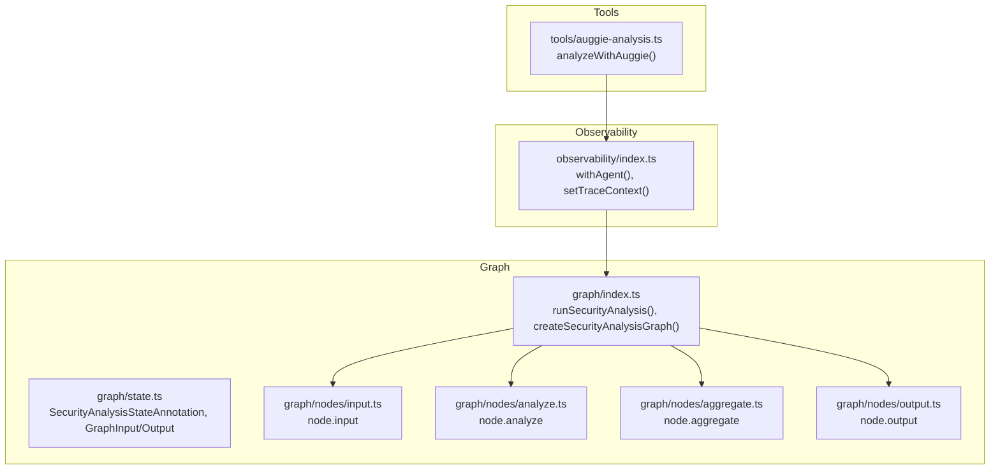
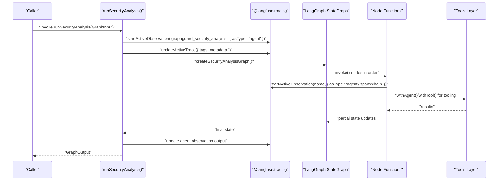
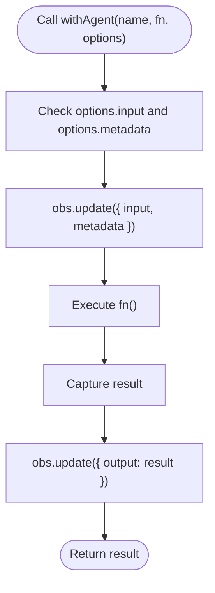
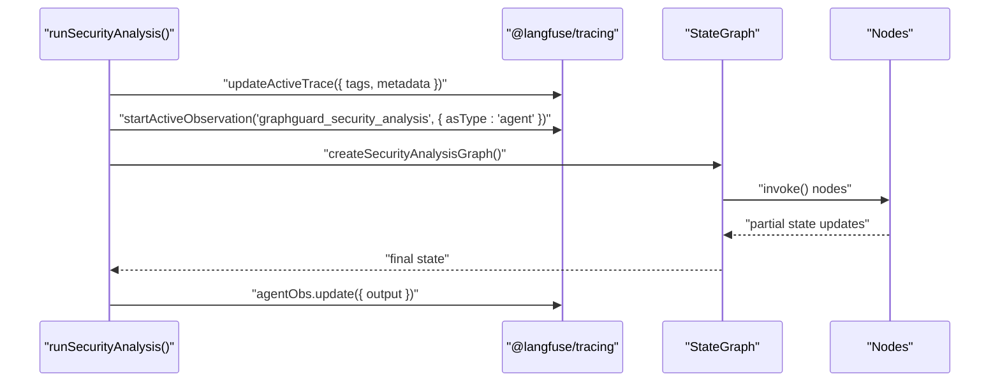
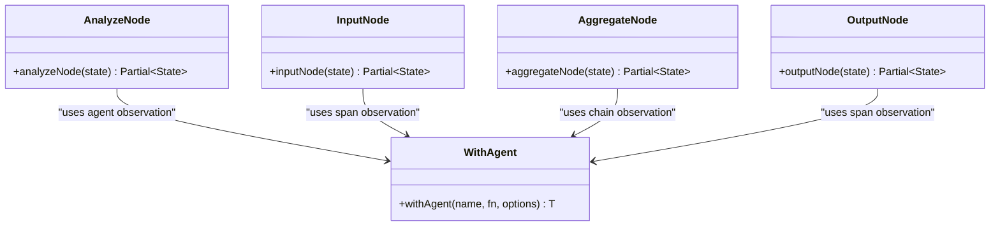
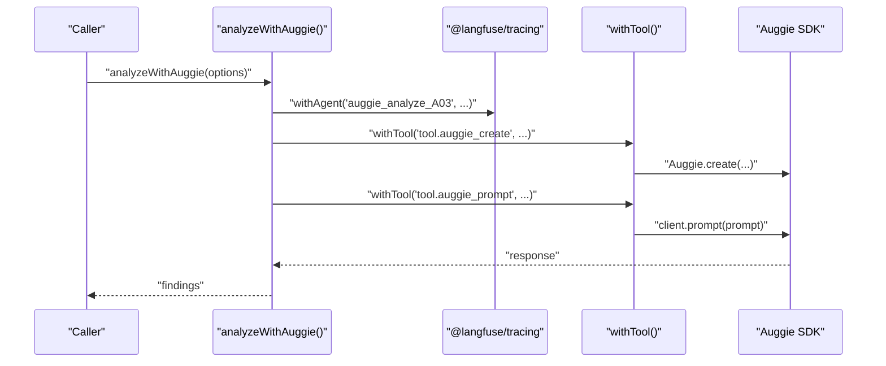
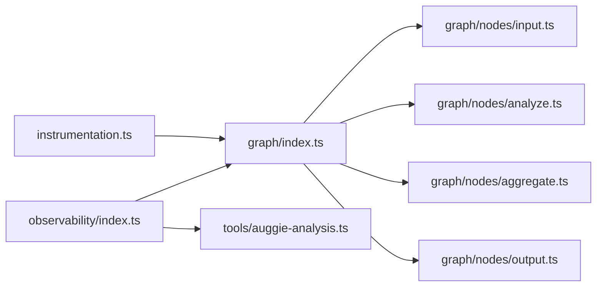

# Agent Wrapper

<cite>
**Referenced Files in This Document**
- [observability/index.ts](file://src/observability/index.ts)
- [graph/index.ts](file://src/graph/index.ts)
- [graph/state.ts](file://src/graph/state.ts)
- [graph/nodes/input.ts](file://src/graph/nodes/input.ts)
- [graph/nodes/analyze.ts](file://src/graph/nodes/analyze.ts)
- [graph/nodes/aggregate.ts](file://src/graph/nodes/aggregate.ts)
- [graph/nodes/output.ts](file://src/graph/nodes/output.ts)
- [tools/auggie-analysis.ts](file://src/tools/auggie-analysis.ts)
- [instrumentation.ts](file://src/instrumentation.ts)
</cite>

## Table of Contents
1. [Introduction](#introduction)
2. [Project Structure](#project-structure)
3. [Core Components](#core-components)
4. [Architecture Overview](#architecture-overview)
5. [Detailed Component Analysis](#detailed-component-analysis)
6. [Dependency Analysis](#dependency-analysis)
7. [Performance Considerations](#performance-considerations)
8. [Troubleshooting Guide](#troubleshooting-guide)
9. [Conclusion](#conclusion)
10. [Appendices](#appendices)

## Introduction
This document explains the role of the withAgent function wrapper in observability/index.ts within the LangGraph workflow. It describes how withAgent captures high-level decision points by wrapping graph nodes and orchestrators, and how it integrates with the state machine in src/graph/index.ts. It also details how agent observations correlate with the trace context set by setTraceContext and how to name agent observations to reflect node responsibilities and workflow progression.

## Project Structure
The observability layer provides typed wrappers for Langfuse observations, including withAgent for graph node orchestration. The graph layer defines the workflow and uses agent observations for top-level orchestration. The tools layer demonstrates how higher-level orchestrators (e.g., Auggie) wrap their internal operations with agent and tool observations.

**Diagram sources**
- [observability/index.ts](file://src/observability/index.ts#L254-L272)
- [graph/index.ts](file://src/graph/index.ts#L1-L153)
- [graph/state.ts](file://src/graph/state.ts#L66-L143)
- [graph/nodes/input.ts](file://src/graph/nodes/input.ts#L1-L54)
- [graph/nodes/analyze.ts](file://src/graph/nodes/analyze.ts#L1-L156)
- [graph/nodes/aggregate.ts](file://src/graph/nodes/aggregate.ts#L1-L117)
- [graph/nodes/output.ts](file://src/graph/nodes/output.ts#L1-L59)
- [tools/auggie-analysis.ts](file://src/tools/auggie-analysis.ts#L120-L309)

**Section sources**
- [observability/index.ts](file://src/observability/index.ts#L254-L272)
- [graph/index.ts](file://src/graph/index.ts#L1-L153)
- [graph/state.ts](file://src/graph/state.ts#L66-L143)

## Core Components
- withAgent: A lightweight wrapper that records input and output for agent-type observations. It accepts a name, a function to execute, and optional input/metadata. It uses startActiveObservation with asType set to 'agent'.
- setTraceContext: Updates the active trace with scan-level attributes (scanId, repoPath, userId, sessionId, tags) so all nested observations inherit these attributes.
- runSecurityAnalysis: The main entry point that creates the graph, sets trace context, and wraps the entire orchestration in an agent observation. It also updates the agent observation with input and output.
- Node-level agent observations: Nodes like analyzeNode use agent observations to capture decision points and outputs.

Key responsibilities:
- Capture high-level decision points in the workflow.
- Record input at entry and output at completion for visibility.
- Enable correlation with trace context for end-to-end visibility.

**Section sources**
- [observability/index.ts](file://src/observability/index.ts#L254-L272)
- [observability/index.ts](file://src/observability/index.ts#L274-L295)
- [graph/index.ts](file://src/graph/index.ts#L56-L145)
- [graph/nodes/analyze.ts](file://src/graph/nodes/analyze.ts#L147-L155)

## Architecture Overview
The observability layer uses @langfuse/tracing to create typed observations. The graph layer uses LangGraph’s StateGraph and OpenTelemetry tracers. The dual approach ensures both general timing and rich observation types (generation, tool, retriever, chain, agent).

**Diagram sources**
- [graph/index.ts](file://src/graph/index.ts#L56-L145)
- [observability/index.ts](file://src/observability/index.ts#L254-L272)
- [instrumentation.ts](file://src/instrumentation.ts#L1-L141)
- [tools/auggie-analysis.ts](file://src/tools/auggie-analysis.ts#L120-L309)

## Detailed Component Analysis

### withAgent Function
Purpose:
- Wrap graph nodes and orchestrators to record input and output for agent-type observations.
- Provide a consistent pattern for capturing decision points across the workflow.

Behavior:
- Accepts name, fn, and options with optional input and metadata.
- Calls startActiveObservation with asType set to 'agent'.
- Updates the observation with input and metadata if provided.
- Executes fn and updates the observation with output.
- Returns the result of fn.

Integration points:
- Used by runSecurityAnalysis to wrap the entire graph orchestration.
- Used by analyzeWithAuggie to wrap the Auggie orchestrator for a specific OWASP category.

**Diagram sources**
- [observability/index.ts](file://src/observability/index.ts#L254-L272)

**Section sources**
- [observability/index.ts](file://src/observability/index.ts#L254-L272)

### runSecurityAnalysis Orchestration
Role:
- Sets trace-level context for all nested observations.
- Wraps the entire graph execution in an agent observation.
- Records input at the start and output upon completion.

Key steps:
- updateActiveTrace sets scan-level attributes and tags.
- startActiveObservation('graphguard_security_analysis', { asType: 'agent' }) wraps the whole run.
- agent observation input includes repoPath, userQuery, scopeFilter.
- After graph.invoke completes, agent observation output includes scanId, status, findingsCount, analyzedCategories.

**Diagram sources**
- [graph/index.ts](file://src/graph/index.ts#L56-L145)

**Section sources**
- [graph/index.ts](file://src/graph/index.ts#L56-L145)

### Node-Level Agent Observations
- inputNode: Records initialization input and output; uses span observation type for node-level timing.
- analyzeNode: Records category analysis input and output; uses agent observation type for the decision point.
- aggregateNode: Records aggregation input and output; uses chain observation type for linking findings to summary.
- outputNode: Records finalization input and output; uses span observation type for node-level timing.

**Diagram sources**
- [graph/nodes/input.ts](file://src/graph/nodes/input.ts#L1-L54)
- [graph/nodes/analyze.ts](file://src/graph/nodes/analyze.ts#L147-L155)
- [graph/nodes/aggregate.ts](file://src/graph/nodes/aggregate.ts#L113-L116)
- [graph/nodes/output.ts](file://src/graph/nodes/output.ts#L56-L59)
- [observability/index.ts](file://src/observability/index.ts#L254-L272)

**Section sources**
- [graph/nodes/input.ts](file://src/graph/nodes/input.ts#L1-L54)
- [graph/nodes/analyze.ts](file://src/graph/nodes/analyze.ts#L147-L155)
- [graph/nodes/aggregate.ts](file://src/graph/nodes/aggregate.ts#L113-L116)
- [graph/nodes/output.ts](file://src/graph/nodes/output.ts#L56-L59)

### Tools Layer Integration Example
- analyzeWithAuggie wraps the Auggie orchestrator with withAgent to capture the decision point for category analysis.
- It also uses withTool for SDK initialization and prompt execution, demonstrating how agent and tool observations compose.

**Diagram sources**
- [tools/auggie-analysis.ts](file://src/tools/auggie-analysis.ts#L120-L309)
- [observability/index.ts](file://src/observability/index.ts#L254-L272)

**Section sources**
- [tools/auggie-analysis.ts](file://src/tools/auggie-analysis.ts#L120-L309)

## Dependency Analysis
- observability/index.ts exports withAgent and setTraceContext, which are consumed by graph/index.ts and tools/auggie-analysis.ts.
- graph/index.ts depends on observability/index.ts for agent observations and instrumentation.ts for OpenTelemetry tracer.
- graph/nodes/* depend on observability/index.ts for node-level observations.
- tools/auggie-analysis.ts depends on observability/index.ts for withAgent and withTool.

**Diagram sources**
- [observability/index.ts](file://src/observability/index.ts#L254-L272)
- [graph/index.ts](file://src/graph/index.ts#L1-L153)
- [graph/nodes/input.ts](file://src/graph/nodes/input.ts#L1-L54)
- [graph/nodes/analyze.ts](file://src/graph/nodes/analyze.ts#L1-L156)
- [graph/nodes/aggregate.ts](file://src/graph/nodes/aggregate.ts#L1-L117)
- [graph/nodes/output.ts](file://src/graph/nodes/output.ts#L1-L59)
- [instrumentation.ts](file://src/instrumentation.ts#L1-L141)

**Section sources**
- [observability/index.ts](file://src/observability/index.ts#L254-L272)
- [graph/index.ts](file://src/graph/index.ts#L1-L153)
- [instrumentation.ts](file://src/instrumentation.ts#L1-L141)

## Performance Considerations
- Agent observations add minimal overhead by capturing input and output; keep input payloads small to reduce storage and network overhead.
- Prefer sampling or truncation for large outputs in production environments.
- Use setTraceContext to attach scan-level metadata once per trace to avoid repeated computation.

## Troubleshooting Guide
Common issues and resolutions:
- Missing trace context: Ensure setTraceContext is called before invoking nodes or orchestrators so nested observations inherit metadata.
- Incorrect observation type: Verify that nodes use the appropriate observation type (agent for decision points, span for timing, chain for transformations).
- Error propagation: withAgent preserves thrown errors; confirm that exceptions are handled upstream if needed.
- Metadata conflicts: Avoid overriding critical metadata unintentionally; pass scanId and owaspCategory consistently.

**Section sources**
- [observability/index.ts](file://src/observability/index.ts#L274-L295)
- [graph/index.ts](file://src/graph/index.ts#L56-L145)

## Conclusion
The withAgent wrapper centralizes agent observation logic for LangGraph workflows. It enables high-level visibility into node orchestration and decision points by capturing input at entry and output at completion. Combined with setTraceContext and node-level observations, it provides a cohesive observability story spanning top-level orchestration, individual nodes, and tool integrations.

## Appendices

### Naming Conventions for Agent Observations
Guidelines to reflect node responsibilities and workflow progression:
- Top-level orchestration: Use a descriptive name indicating the overall run (e.g., "graphguard_security_analysis").
- Node-level decisions: Use names that indicate the node and action (e.g., "node.analyze", "node.aggregate").
- Tool-level orchestrators: Use names that reflect the tool and category (e.g., "auggie_analyze_A03").

These conventions help correlate agent observations with trace context and improve readability in Langfuse.

**Section sources**
- [graph/index.ts](file://src/graph/index.ts#L56-L145)
- [graph/nodes/analyze.ts](file://src/graph/nodes/analyze.ts#L147-L155)
- [tools/auggie-analysis.ts](file://src/tools/auggie-analysis.ts#L120-L309)