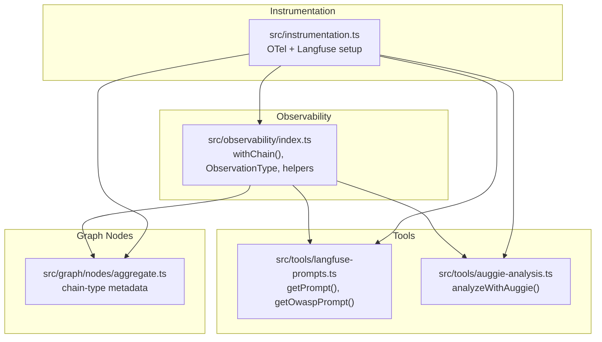
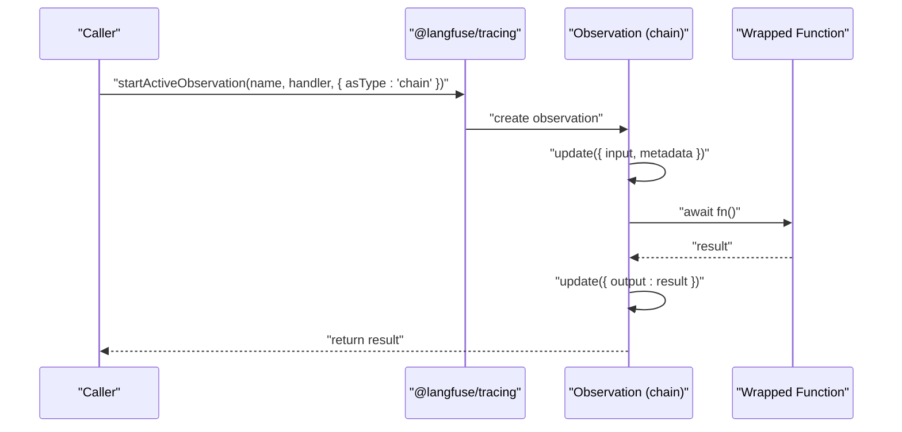
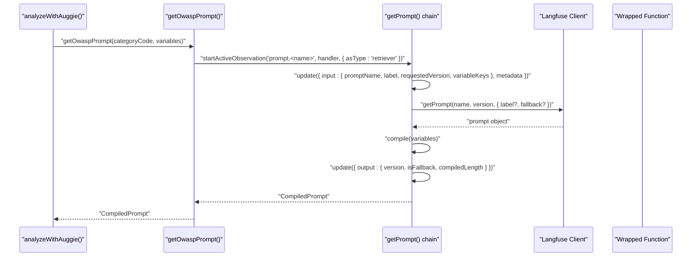
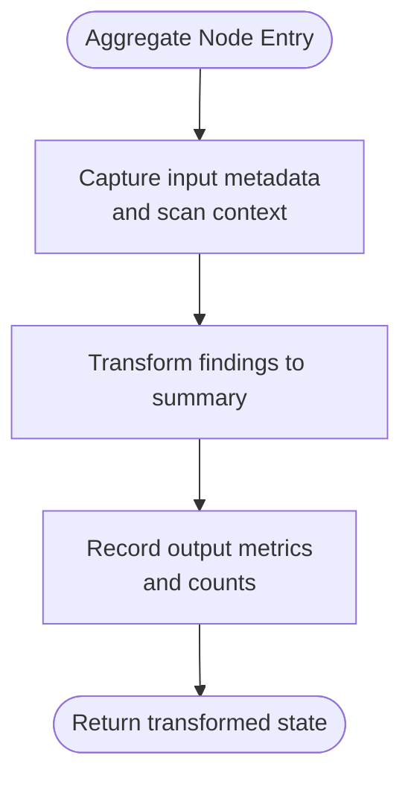
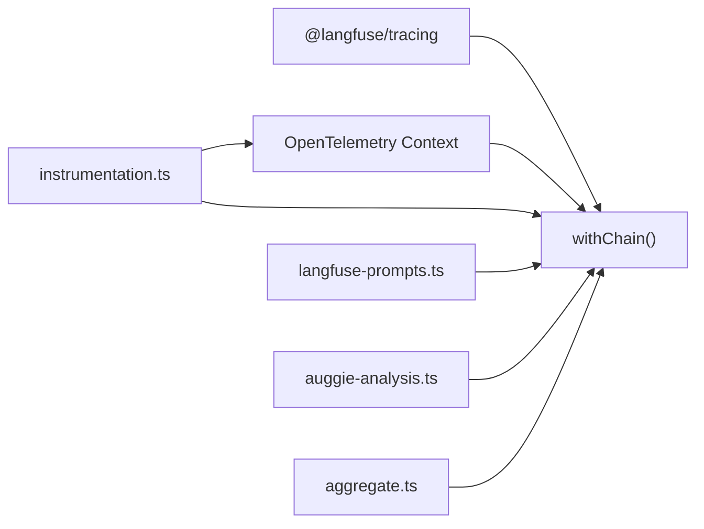

# Chain Wrapper

<cite>
**Referenced Files in This Document**
- [observability/index.ts](file://src/observability/index.ts)
- [langfuse-prompts.ts](file://src/tools/langfuse-prompts.ts)
- [instrumentation.ts](file://src/instrumentation.ts)
- [auggie-analysis.ts](file://src/tools/auggie-analysis.ts)
- [aggregate.ts](file://src/graph/nodes/aggregate.ts)
- [README.md](file://README.md)
</cite>

## Table of Contents
1. [Introduction](#introduction)
2. [Project Structure](#project-structure)
3. [Core Components](#core-components)
4. [Architecture Overview](#architecture-overview)
5. [Detailed Component Analysis](#detailed-component-analysis)
6. [Dependency Analysis](#dependency-analysis)
7. [Performance Considerations](#performance-considerations)
8. [Troubleshooting Guide](#troubleshooting-guide)
9. [Conclusion](#conclusion)
10. [Appendices](#appendices)

## Introduction
This document explains the withChain function wrapper used for tracking prompt loading, compilation, and data transformation steps in the analysis pipeline. It describes how withChain captures input and metadata at the start of execution and records output upon completion, and how it integrates with Langfuse to group related operations under a “chain” observation type. We also cover how chain observations help debug prompt evolution over time, and provide best practices for naming chains and structuring metadata to reflect prompt lineage and versioning.

## Project Structure
The chain wrapper lives in the observability module and is used across prompt loading utilities and graph nodes. The instrumentation module wires OpenTelemetry and Langfuse together so that all observations nest correctly.

**Diagram sources**
- [observability/index.ts](file://src/observability/index.ts#L234-L252)
- [langfuse-prompts.ts](file://src/tools/langfuse-prompts.ts#L56-L168)
- [auggie-analysis.ts](file://src/tools/auggie-analysis.ts#L119-L309)
- [aggregate.ts](file://src/graph/nodes/aggregate.ts#L1-L116)
- [instrumentation.ts](file://src/instrumentation.ts#L1-L141)

**Section sources**
- [observability/index.ts](file://src/observability/index.ts#L234-L252)
- [instrumentation.ts](file://src/instrumentation.ts#L1-L141)

## Core Components
- withChain: A lightweight wrapper that starts an active observation of type chain, captures input/metadata at the start, executes the provided function, and records output on completion.
- getPrompt/getOwaspPrompt: Prompt loading utilities that wrap their internal logic in a chain observation to capture prompt retrieval, compilation, and fallback behavior.
- Instrumentation: Ensures all observations share the same OpenTelemetry context so nested chain spans appear correctly in the Langfuse UI.

Key responsibilities:
- Input capture: At the start of execution, input and metadata are recorded into the observation.
- Execution: The wrapped function runs inside the observation context.
- Output capture: On completion, the result is recorded as output.
- Observation type: The wrapper sets the observation type to chain, enabling grouping and filtering in Langfuse.

**Section sources**
- [observability/index.ts](file://src/observability/index.ts#L234-L252)
- [langfuse-prompts.ts](file://src/tools/langfuse-prompts.ts#L56-L168)
- [instrumentation.ts](file://src/instrumentation.ts#L1-L141)

## Architecture Overview
The chain wrapper participates in a layered observability architecture:
- Low-level spans are created via OpenTelemetry tracers.
- Rich observation types (generation, tool, retriever, chain, agent) are created via @langfuse/tracing.
- Instrumentation bridges both systems and shares the same OpenTelemetry context.

**Diagram sources**
- [observability/index.ts](file://src/observability/index.ts#L234-L252)

## Detailed Component Analysis

### withChain Function
Purpose:
- Wrap synchronous or asynchronous operations that represent prompt loading, compilation, or data transformations.
- Ensure input, metadata, and output are captured consistently.

Behavior:
- Starts an active observation with type chain.
- Updates the observation with input and metadata if provided.
- Executes the provided function and records the result as output.
- Returns the result unchanged.

Best practices:
- Always pass meaningful input and metadata to aid debugging and lineage.
- Keep the wrapped function small and focused to preserve clarity in the chain view.

Integration points:
- Used by prompt loading utilities to capture prompt retrieval and compilation.
- Used by graph nodes to capture data transformation steps.

**Section sources**
- [observability/index.ts](file://src/observability/index.ts#L234-L252)

### Prompt Loading and Compilation with Chain
The prompt loading utilities demonstrate how chain observations are used to track prompt retrieval and compilation:

- getPrompt/getOwaspPrompt:
  - Wraps the prompt fetch and compile logic in a chain observation.
  - Captures input including prompt name, label, requested version, and variable keys.
  - Captures output including version, fallback flag, and compiled length.
  - Also maintains a traditional OTel span for backward compatibility.

Notes:
- The prompt loading itself is annotated as retriever in the code, but the internal chain observation demonstrates how chain observations can be used for prompt loading and compilation.
- The chain observation captures the essential prompt lineage and compilation metrics.

**Diagram sources**
- [langfuse-prompts.ts](file://src/tools/langfuse-prompts.ts#L56-L168)
- [auggie-analysis.ts](file://src/tools/auggie-analysis.ts#L145-L154)

**Section sources**
- [langfuse-prompts.ts](file://src/tools/langfuse-prompts.ts#L56-L168)
- [auggie-analysis.ts](file://src/tools/auggie-analysis.ts#L145-L154)

### Data Transformation Chains in Graph Nodes
Graph nodes often perform data transformations that benefit from chain observations:
- aggregateNode uses chain observation type and includes metadata indicating the transformation direction (findings to summary).

**Section sources**
- [aggregate.ts](file://src/graph/nodes/aggregate.ts#L1-L116)

### Integration with Langfuse and Debugging Prompt Evolution
- Observation type “chain” groups related operations in the Langfuse UI, making it easy to see the end-to-end flow from prompt retrieval to final output.
- Chain observations enable debugging prompt evolution by:
  - Recording prompt name, label, and version.
  - Recording whether a fallback was used.
  - Recording compiled prompt length and variable keys.
- This allows correlating prompt changes with downstream results and performance.

**Section sources**
- [README.md](file://README.md#L131-L140)
- [langfuse-prompts.ts](file://src/tools/langfuse-prompts.ts#L56-L168)

## Dependency Analysis
The chain wrapper depends on:
- @langfuse/tracing for observation lifecycle and type selection.
- OpenTelemetry context shared by instrumentation to ensure nesting.

**Diagram sources**
- [observability/index.ts](file://src/observability/index.ts#L234-L252)
- [instrumentation.ts](file://src/instrumentation.ts#L1-L141)
- [langfuse-prompts.ts](file://src/tools/langfuse-prompts.ts#L56-L168)
- [auggie-analysis.ts](file://src/tools/auggie-analysis.ts#L119-L309)
- [aggregate.ts](file://src/graph/nodes/aggregate.ts#L1-L116)

**Section sources**
- [observability/index.ts](file://src/observability/index.ts#L234-L252)
- [instrumentation.ts](file://src/instrumentation.ts#L1-L141)

## Performance Considerations
- Keep wrapped functions small and deterministic to minimize overhead.
- Avoid logging large inputs or outputs; prefer sampling or summaries.
- Use metadata to tag versions and labels for efficient filtering in Langfuse dashboards.

[No sources needed since this section provides general guidance]

## Troubleshooting Guide
Common issues and remedies:
- Missing input/metadata: Ensure you pass input and metadata to withChain to capture the full context.
- Incorrect observation type: Verify that the observation type is chain for prompt loading/compilation steps.
- Instrumentation order: Import instrumentation.ts before any other modules to ensure proper context sharing.

**Section sources**
- [observability/index.ts](file://src/observability/index.ts#L234-L252)
- [instrumentation.ts](file://src/instrumentation.ts#L1-L141)

## Conclusion
The withChain wrapper provides a consistent way to observe prompt loading, compilation, and data transformation steps. By capturing input, metadata, and output, it enables robust debugging and performance tracking. Combined with Langfuse’s chain observation type, it helps teams trace prompt evolution over time and maintain clear lineage for all analysis operations.

[No sources needed since this section summarizes without analyzing specific files]

## Appendices

### Best Practices for Naming Chains and Metadata
- Naming:
  - Use dot-separated hierarchical names: prompt.<promptName> for prompt loading.
  - Use descriptive prefixes like data.transform.<step> for data transformation.
- Metadata:
  - Include promptName, label, and promptVersion for prompt lineage.
  - Include variable keys and compiled length for compilation insights.
  - Include fallback indicators and error details for resilience tracking.
- Graph nodes:
  - Use chain observation type for transformation steps.
  - Include nodeType, phase, and chainType metadata to clarify the role in the pipeline.

**Section sources**
- [langfuse-prompts.ts](file://src/tools/langfuse-prompts.ts#L56-L168)
- [aggregate.ts](file://src/graph/nodes/aggregate.ts#L1-L116)