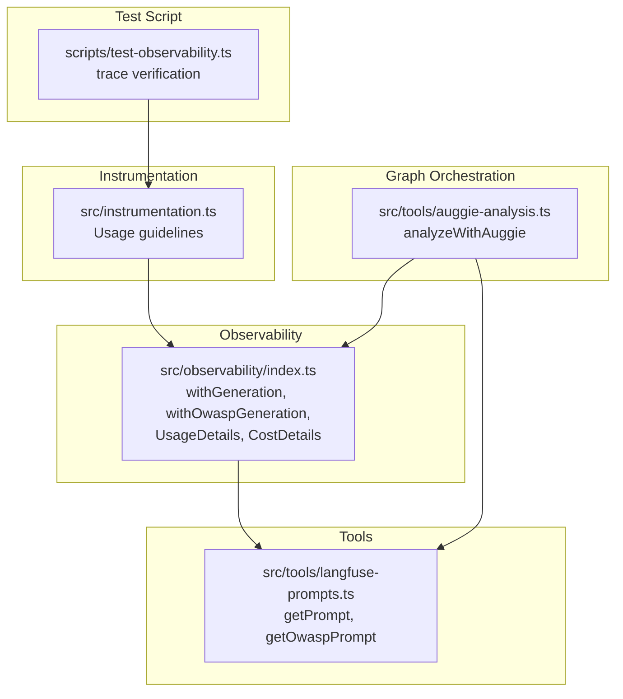
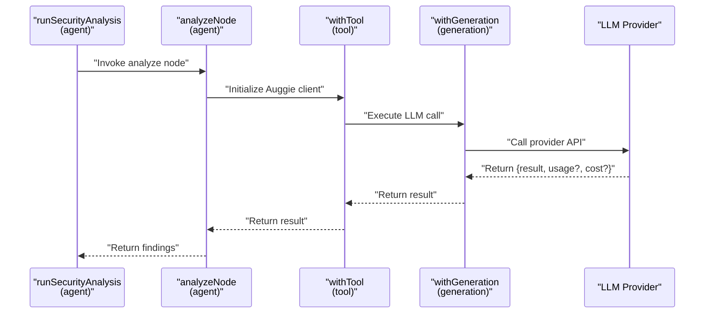
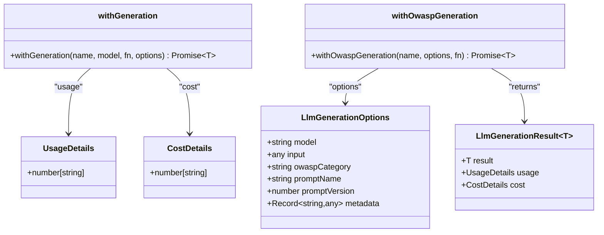
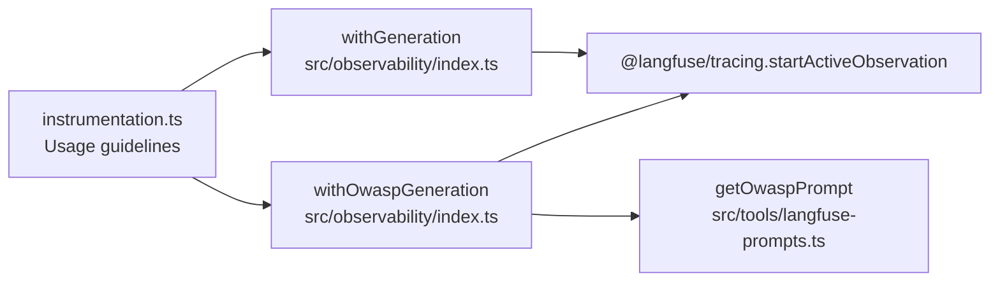

# Generation Wrapper

<cite>
**Referenced Files in This Document**
- [observability/index.ts](file://src/observability/index.ts)
- [instrumentation.ts](file://src/instrumentation.ts)
- [langfuse-prompts.ts](file://src/tools/langfuse-prompts.ts)
- [auggie-analysis.ts](file://src/tools/auggie-analysis.ts)
- [test-observability.ts](file://scripts/test-observability.ts)
</cite>

## Table of Contents
1. [Introduction](#introduction)
2. [Project Structure](#project-structure)
3. [Core Components](#core-components)
4. [Architecture Overview](#architecture-overview)
5. [Detailed Component Analysis](#detailed-component-analysis)
6. [Dependency Analysis](#dependency-analysis)
7. [Performance Considerations](#performance-considerations)
8. [Troubleshooting Guide](#troubleshooting-guide)
9. [Conclusion](#conclusion)

## Introduction
This document explains the withGeneration function wrapper in src/observability/index.ts. It focuses on how the wrapper tracks LLM calls with model, token usage, costs, and prompt linking. It also documents the internal use of startActiveObservation with the 'generation' type, the structure of the async execution callback, metadata enrichment, and integration points with Langfuse prompts. Best practices for passing accurate usage metrics and error handling are covered, along with performance considerations when enabling detailed tracking.

## Project Structure
The observability module centralizes tracing helpers for Langfuse and OpenTelemetry. The withGeneration wrapper is part of this module and integrates with:
- Langfuse tracing primitives (startActiveObservation, updateActiveObservation, updateActiveTrace)
- Langfuse prompt retrieval utilities (getPrompt, getOwaspPrompt)
- Auggie SDK orchestration for OWASP-based analysis

**Diagram sources**
- [observability/index.ts](file://src/observability/index.ts#L1-L120)
- [langfuse-prompts.ts](file://src/tools/langfuse-prompts.ts#L1-L120)
- [auggie-analysis.ts](file://src/tools/auggie-analysis.ts#L1-L120)
- [instrumentation.ts](file://src/instrumentation.ts#L31-L52)
- [test-observability.ts](file://scripts/test-observability.ts#L1-L73)

**Section sources**
- [observability/index.ts](file://src/observability/index.ts#L1-L120)
- [instrumentation.ts](file://src/instrumentation.ts#L31-L52)

## Core Components
- withGeneration: A lightweight wrapper for LLM generation observations that records model, input, output, usage, cost, and prompt linking metadata.
- withOwaspGeneration: An OWASP-focused variant that enriches metadata with promptName, promptVersion, and optional OWASP category context.
- UsageDetails and CostDetails: Typed structures for token usage and cost details aligned with Langfuse SDK expectations.
- startActiveObservation: The underlying tracing primitive used to create and manage observations with a specific type ('generation' in this case).

Key responsibilities:
- Capture and propagate OpenTelemetry context
- Enrich observations with model, input, and prompt metadata
- Record output and optional usage/cost details
- Preserve error propagation semantics

**Section sources**
- [observability/index.ts](file://src/observability/index.ts#L63-L119)
- [observability/index.ts](file://src/observability/index.ts#L310-L410)

## Architecture Overview
The withGeneration wrapper participates in a layered observability architecture:
- Top-level orchestration sets trace-level context and tags.
- Node-level agents and tools wrap operations with appropriate observation types.
- LLM generation observations are tagged as 'generation' and enriched with model, input, prompt metadata, and usage/cost details.

**Diagram sources**
- [observability/index.ts](file://src/observability/index.ts#L83-L119)
- [observability/index.ts](file://src/observability/index.ts#L376-L410)
- [auggie-analysis.ts](file://src/tools/auggie-analysis.ts#L156-L240)

## Detailed Component Analysis

### withGeneration Function
Purpose:
- Wrap LLM generation calls to automatically record model, input, output, usage, cost, and prompt metadata.

Behavior:
- Uses startActiveObservation with asType 'generation'.
- Updates observation with model, input, and metadata (including promptName and promptVersion).
- Executes the provided async callback and expects a result plus optional usage and cost details.
- Updates observation with output and usage/cost details.
- Returns the unwrapped result.

Metadata enrichment:
- Merges caller-provided metadata with promptName and promptVersion when present.
- Ensures promptName and promptVersion are surfaced as observation metadata for linking to Langfuse prompts.

Error handling:
- The wrapper does not intercept exceptions thrown by the callback. Errors propagate out of the wrapper, preserving stack traces and error semantics.

Integration points:
- Works with any LLM provider that returns a result plus optional usage and cost details.
- Integrates seamlessly with Langfuse prompt utilities via promptName/promptVersion metadata.

Best practices for usage:
- Always pass accurate usage and cost details when available to maximize observability value.
- Use promptName and promptVersion to link generations to specific Langfuse prompts for traceability.
- Keep input minimal to avoid bloating observation payloads.

**Section sources**
- [observability/index.ts](file://src/observability/index.ts#L83-L119)

### withOwaspGeneration Function
Purpose:
- Specialized wrapper for OWASP-based LLM generation with enriched metadata and usage/cost support.

Behavior:
- Similar to withGeneration but preloads OWASP category and prompt metadata.
- Accepts LlmGenerationOptions including model, input, optional OWASP category, promptName, promptVersion, and metadata.
- Executes the provided async callback returning LlmGenerationResult with result, usage, and cost.

Metadata enrichment:
- Adds promptName, promptVersion, and optional owaspCategory to observation metadata.
- Supports scanning context via metadata for correlation.

Error handling:
- Same propagation semantics as withGeneration; exceptions bubble up.

**Section sources**
- [observability/index.ts](file://src/observability/index.ts#L310-L410)

### UsageDetails and CostDetails Interfaces
- UsageDetails: A flexible numeric map for token usage fields (e.g., input, output, total).
- CostDetails: A flexible numeric map for cost fields (e.g., input, output, total).

These types align with Langfuse SDK expectations and enable consistent reporting across providers.

**Section sources**
- [observability/index.ts](file://src/observability/index.ts#L63-L77)

### Internal Execution Callback Structure
The async execution callback follows a consistent pattern:
- Accepts a function that returns a promise resolving to an object containing result, usage, and cost.
- The wrapper awaits the callback, then updates the observation with output and usage/cost details.
- The callback is responsible for capturing provider-specific usage and cost fields.

This design allows providers to supply usage/cost details without changing the wrapper’s behavior.

**Section sources**
- [observability/index.ts](file://src/observability/index.ts#L83-L119)
- [observability/index.ts](file://src/observability/index.ts#L376-L410)

### Prompt Linking via Langfuse Prompts
- Prompt linking is achieved by setting promptName and promptVersion in observation metadata.
- Langfuse prompt utilities (getPrompt, getOwaspPrompt) fetch and compile prompts while recording retriever observations.
- The withGeneration wrapper surfaces promptName/promptVersion in metadata, enabling trace linkage in the Langfuse UI.

**Section sources**
- [observability/index.ts](file://src/observability/index.ts#L83-L119)
- [langfuse-prompts.ts](file://src/tools/langfuse-prompts.ts#L56-L120)

### Integration with LLM Providers
- The wrapper is provider-agnostic. It expects the callback to return usage and cost details compatible with UsageDetails and CostDetails.
- Example patterns in the codebase show how to populate usage and cost fields from provider responses (e.g., input, output, total tokens).

Recommendations:
- Map provider-specific fields to UsageDetails and CostDetails consistently.
- Include total usage when available to simplify downstream analytics.
- Avoid logging sensitive data in input/output; keep payloads minimal.

**Section sources**
- [observability/index.ts](file://src/observability/index.ts#L83-L119)
- [observability/index.ts](file://src/observability/index.ts#L376-L410)

### Error Handling Within the Wrapper
- The wrapper does not catch exceptions thrown by the callback. Errors propagate out unchanged.
- This preserves error semantics and ensures stack traces remain intact.
- For robust error handling, wrap withGeneration calls in try/catch blocks at higher levels if needed.

**Section sources**
- [observability/index.ts](file://src/observability/index.ts#L83-L119)

### Class Diagram: Generation Wrapper Interfaces

**Diagram sources**
- [observability/index.ts](file://src/observability/index.ts#L63-L119)
- [observability/index.ts](file://src/observability/index.ts#L310-L410)

## Dependency Analysis
- withGeneration depends on:
  - startActiveObservation from @langfuse/tracing to create and manage observations
  - Langfuse SDK types for usageDetails and costDetails
- withOwaspGeneration depends on:
  - LlmGenerationOptions and LlmGenerationResult for typed inputs and outputs
  - getOwaspPrompt/getPrompt for prompt retrieval and linking
- Instrumentation.ts provides usage guidelines and confirms withGeneration is intended for LLM calls.

**Diagram sources**
- [observability/index.ts](file://src/observability/index.ts#L83-L119)
- [observability/index.ts](file://src/observability/index.ts#L376-L410)
- [langfuse-prompts.ts](file://src/tools/langfuse-prompts.ts#L170-L211)
- [instrumentation.ts](file://src/instrumentation.ts#L31-L52)

**Section sources**
- [observability/index.ts](file://src/observability/index.ts#L83-L119)
- [observability/index.ts](file://src/observability/index.ts#L376-L410)
- [instrumentation.ts](file://src/instrumentation.ts#L31-L52)

## Performance Considerations
- Payload size: Keep input/output minimal to reduce trace payload sizes and improve dashboard responsiveness.
- Metadata volume: Avoid embedding large strings in metadata; prefer identifiers and summaries.
- Usage/cost granularity: Include only necessary fields to minimize overhead.
- Provider latency: Measure and record duration via tracing; avoid redundant timing logic inside callbacks.
- Batch operations: Prefer grouping related observations to reduce overhead.

[No sources needed since this section provides general guidance]

## Troubleshooting Guide
Common issues and resolutions:
- Missing usage/cost details:
  - Ensure the callback returns usage and cost fields compatible with UsageDetails and CostDetails.
  - Verify provider SDK usage fields are mapped correctly.
- Prompt linking not visible:
  - Confirm promptName and promptVersion are included in options/metadata.
  - Check that Langfuse prompt retrieval is successful and metadata is recorded.
- Errors not captured:
  - Exceptions thrown by the callback propagate out unchanged; wrap with try/catch at the call site if needed.
- Trace context missing:
  - Ensure setTraceContext is called early in the trace lifecycle to propagate metadata to nested observations.

**Section sources**
- [observability/index.ts](file://src/observability/index.ts#L83-L119)
- [observability/index.ts](file://src/observability/index.ts#L376-L410)
- [langfuse-prompts.ts](file://src/tools/langfuse-prompts.ts#L56-L120)

## Conclusion
The withGeneration wrapper provides a concise, typed way to instrument LLM calls with model, input, output, usage, cost, and prompt linking. By leveraging startActiveObservation with the 'generation' type and enriching metadata with promptName/promptVersion, it integrates seamlessly with Langfuse dashboards. The withOwaspGeneration variant adds OWASP-specific context and usage/cost support. Following best practices for accurate usage metrics and minimal payloads ensures reliable, actionable observability.