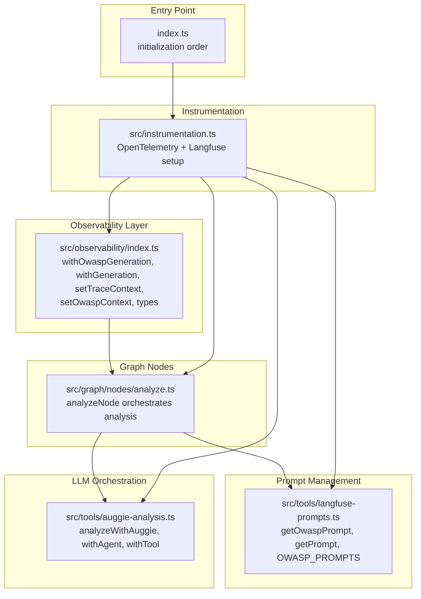
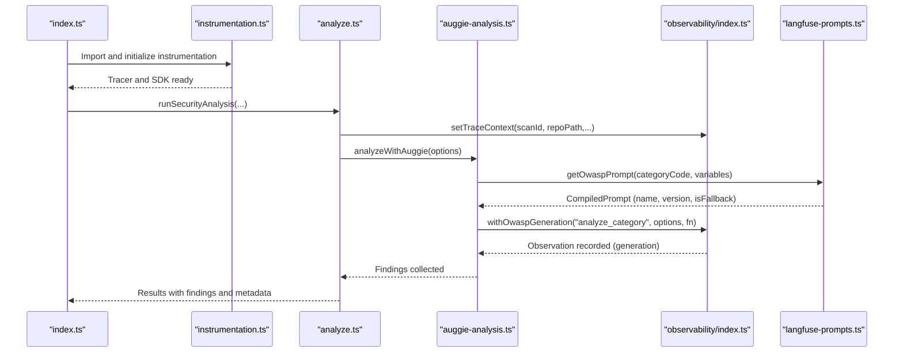
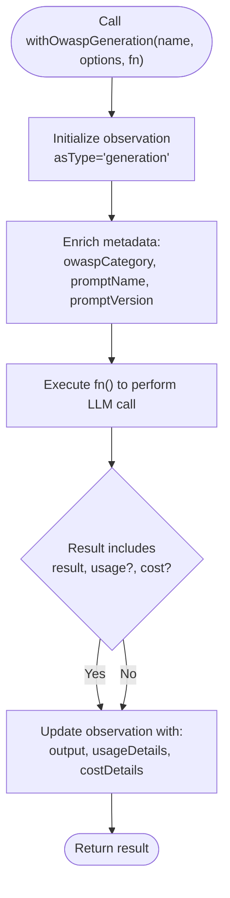
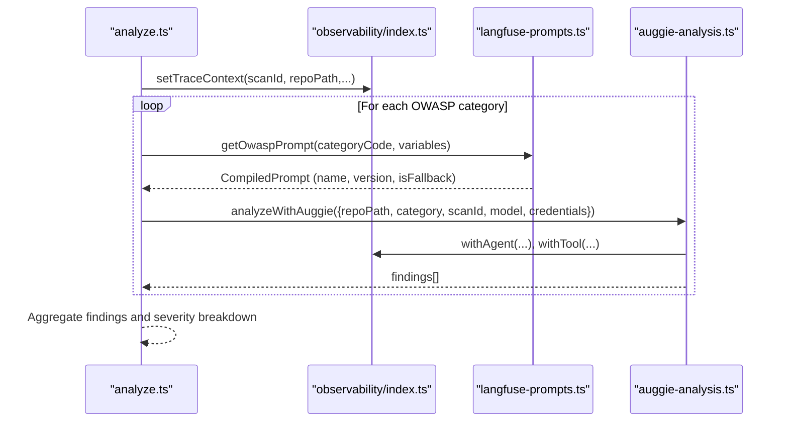
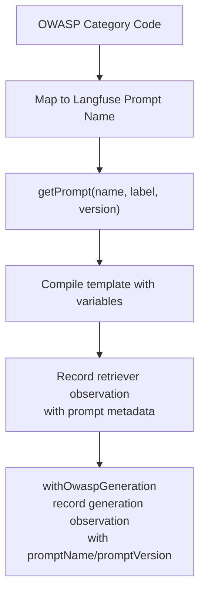
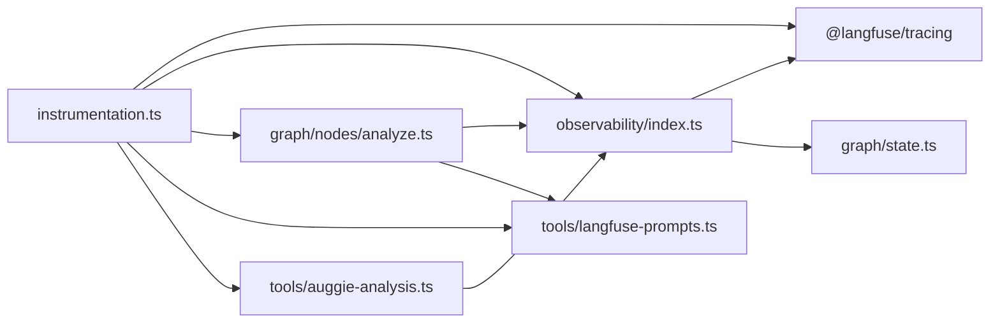

# OWASP Generation Wrapper

<cite>
**Referenced Files in This Document**
- [observability/index.ts](file://src/observability/index.ts)
- [graph/nodes/analyze.ts](file://src/graph/nodes/analyze.ts)
- [tools/langfuse-prompts.ts](file://src/tools/langfuse-prompts.ts)
- [tools/auggie-analysis.ts](file://src/tools/auggie-analysis.ts)
- [graph/state.ts](file://src/graph/state.ts)
- [instrumentation.ts](file://src/instrumentation.ts)
- [index.ts](file://index.ts)
</cite>

## Table of Contents
1. [Introduction](#introduction)
2. [Project Structure](#project-structure)
3. [Core Components](#core-components)
4. [Architecture Overview](#architecture-overview)
5. [Detailed Component Analysis](#detailed-component-analysis)
6. [Dependency Analysis](#dependency-analysis)
7. [Performance Considerations](#performance-considerations)
8. [Troubleshooting Guide](#troubleshooting-guide)
9. [Conclusion](#conclusion)
10. [Appendices](#appendices)

## Introduction
This document explains the specialized purpose of the withOwaspGeneration function wrapper in src/observability/index.ts. It focuses on how this wrapper enhances LLM call observability with OWASP-specific context, including automatic injection of owaspCategory, linking to versioned prompts, and tracking model-specific usage and cost metrics. It also documents the LlmGenerationOptions and LlmGenerationResult interfaces and how they enforce structured data collection. The internal use of startActiveObservation with the 'generation' type and metadata enrichment with security context is covered, along with integration with analyze.ts for vulnerability detection and how this wrapper enables audit trails for AI-generated findings. Finally, best practices for prompt management, cost tracking, and ensuring compliance with security analysis standards are provided.

## Project Structure
The observability layer integrates with the broader GraphGuard security analysis pipeline. The withOwaspGeneration wrapper participates in a dual observability approach combining OpenTelemetry spans and Langfuse tracing types. It is used within higher-level orchestration nodes such as analyze.ts, which coordinates OWASP-based analysis using Auggie SDK and Langfuse prompts.

**Diagram sources**
- [observability/index.ts](file://src/observability/index.ts#L1-L120)
- [graph/nodes/analyze.ts](file://src/graph/nodes/analyze.ts#L1-L156)
- [tools/langfuse-prompts.ts](file://src/tools/langfuse-prompts.ts#L1-L211)
- [tools/auggie-analysis.ts](file://src/tools/auggie-analysis.ts#L1-L310)
- [instrumentation.ts](file://src/instrumentation.ts#L1-L141)
- [index.ts](file://index.ts#L1-L52)

**Section sources**
- [observability/index.ts](file://src/observability/index.ts#L1-L120)
- [instrumentation.ts](file://src/instrumentation.ts#L1-L141)
- [index.ts](file://index.ts#L1-L10)

## Core Components
- withOwaspGeneration: Specialized wrapper for LLM generation observations in OWASP security contexts. It enforces structured data collection via LlmGenerationOptions and LlmGenerationResult, sets the observation type to 'generation', and enriches metadata with OWASP category, prompt name, and prompt version.
- LlmGenerationOptions: Defines the contract for LLM generation calls, including model, input, optional OWASP category, prompt linkage, and additional metadata.
- LlmGenerationResult: Defines the shape of the LLM call result, including the actual result, optional usage details, and optional cost details.
- setTraceContext and setOwaspContext: Functions to propagate scan-level and category-level context to the current trace and observation, respectively.
- Integration with analyze.ts: The analyze node orchestrates OWASP analysis and uses the observability wrappers to record detailed traces for each step.

**Section sources**
- [observability/index.ts](file://src/observability/index.ts#L310-L410)
- [graph/nodes/analyze.ts](file://src/graph/nodes/analyze.ts#L1-L156)

## Architecture Overview
The withOwaspGeneration wrapper participates in a layered observability architecture:
- Instrumentation initializes OpenTelemetry and Langfuse processors.
- Higher-level orchestration nodes (e.g., analyze.ts) coordinate tasks and wrap operations with observability wrappers.
- Prompt management retrieves versioned prompts and records retrieval as retriever-type observations.
- LLM generation is wrapped with withOwaspGeneration to capture model, tokens, costs, and prompt linkage.

**Diagram sources**
- [index.ts](file://index.ts#L1-L10)
- [instrumentation.ts](file://src/instrumentation.ts#L1-L141)
- [graph/nodes/analyze.ts](file://src/graph/nodes/analyze.ts#L1-L156)
- [tools/auggie-analysis.ts](file://src/tools/auggie-analysis.ts#L119-L309)
- [tools/langfuse-prompts.ts](file://src/tools/langfuse-prompts.ts#L67-L210)
- [observability/index.ts](file://src/observability/index.ts#L340-L410)

## Detailed Component Analysis

### withOwaspGeneration: Purpose and Behavior
Purpose:
- Provide a strongly-typed, standardized way to observe LLM generation calls within OWASP security analysis.
- Automatically inject security context (owaspCategory) and prompt linkage (promptName, promptVersion) into the observation metadata.
- Track model-specific usage and cost metrics for auditability and cost control.

Key behaviors:
- Uses startActiveObservation with asType set to 'generation'.
- Updates observation with model, input, and enriched metadata (owaspCategory, promptName, promptVersion).
- Executes the provided function and updates observation with output and optional usage/cost details.
- Returns the LLM result while preserving type safety.

**Diagram sources**
- [observability/index.ts](file://src/observability/index.ts#L376-L410)

**Section sources**
- [observability/index.ts](file://src/observability/index.ts#L340-L410)

### LlmGenerationOptions and LlmGenerationResult Interfaces
- LlmGenerationOptions:
  - model: identifies the LLM model used.
  - input: the LLM input payload (messages or prompt text).
  - owaspCategory: optional OWASP category for context.
  - promptName: optional Langfuse prompt name for linkage.
  - promptVersion: optional Langfuse prompt version for linkage.
  - metadata: additional key-value pairs for custom attributes.
- LlmGenerationResult<T>:
  - result: the actual LLM output.
  - usage?: token usage details (supports index signature).
  - cost?: cost details (supports index signature).

These interfaces enforce structured data collection and ensure consistent metadata across LLM calls.

**Section sources**
- [observability/index.ts](file://src/observability/index.ts#L310-L387)

### Internal Metadata Enrichment and Observation Type
- Observation type: 'generation' ensures LLM-specific attributes (model, usageDetails, costDetails) are captured.
- Metadata enrichment:
  - owaspCategory is added when provided.
  - promptName and promptVersion are added when provided.
  - Additional metadata is preserved and merged.
- setTraceContext and setOwaspContext:
  - setTraceContext propagates scan-level attributes to the trace (scanId, repoPath, tags).
  - setOwaspContext adds category-level attributes to the current observation.

**Section sources**
- [observability/index.ts](file://src/observability/index.ts#L274-L308)
- [observability/index.ts](file://src/observability/index.ts#L340-L410)

### Integration with analyze.ts and Vulnerability Detection
- The analyze node orchestrates OWASP-based analysis across prioritized categories.
- It uses withAgent and withTool wrappers for orchestration and tool invocations.
- It retrieves OWASP prompts via getOwaspPrompt and records prompt retrieval as retriever-type observations.
- The analyze node aggregates findings and maintains severity breakdowns, enabling audit trails for AI-generated findings.

**Diagram sources**
- [graph/nodes/analyze.ts](file://src/graph/nodes/analyze.ts#L1-L156)
- [tools/langfuse-prompts.ts](file://src/tools/langfuse-prompts.ts#L67-L210)
- [tools/auggie-analysis.ts](file://src/tools/auggie-analysis.ts#L119-L309)
- [observability/index.ts](file://src/observability/index.ts#L274-L308)

**Section sources**
- [graph/nodes/analyze.ts](file://src/graph/nodes/analyze.ts#L1-L156)
- [tools/auggie-analysis.ts](file://src/tools/auggie-analysis.ts#L119-L309)
- [tools/langfuse-prompts.ts](file://src/tools/langfuse-prompts.ts#L67-L210)

### Linking to Versioned Prompts
- Prompt retrieval is handled by getOwaspPrompt, which maps category codes to Langfuse prompt names and compiles templates with variables.
- getPrompt records prompt retrieval as retriever-type observations, capturing prompt name, label, requested version, and actual version fetched.
- withOwaspGeneration optionally captures promptName and promptVersion in observation metadata, enabling trace linkage between LLM generations and prompts.

**Diagram sources**
- [tools/langfuse-prompts.ts](file://src/tools/langfuse-prompts.ts#L170-L210)
- [tools/langfuse-prompts.ts](file://src/tools/langfuse-prompts.ts#L67-L168)
- [observability/index.ts](file://src/observability/index.ts#L376-L410)

**Section sources**
- [tools/langfuse-prompts.ts](file://src/tools/langfuse-prompts.ts#L67-L210)
- [observability/index.ts](file://src/observability/index.ts#L376-L410)

### Audit Trails for AI-Generated Findings
- Observability wrappers capture input, output, metadata, and error states for each step.
- setTraceContext and setOwaspContext ensure each observation carries scanId and category context.
- The analyze node aggregates findings and severity breakdowns, enabling downstream reporting and auditability.

**Section sources**
- [observability/index.ts](file://src/observability/index.ts#L274-L308)
- [graph/nodes/analyze.ts](file://src/graph/nodes/analyze.ts#L120-L156)

## Dependency Analysis
- withOwaspGeneration depends on:
  - startActiveObservation from @langfuse/tracing to create and manage observations.
  - LlmGenerationOptions and LlmGenerationResult for type enforcement.
  - OWASP category typing from graph/state for context.
- Integration points:
  - analyze.ts orchestrates the workflow and uses withOwaspGeneration indirectly via lower-level wrappers.
  - langfuse-prompts.ts provides prompt retrieval and versioning.
  - instrumentation.ts initializes OpenTelemetry and Langfuse processors, enabling trace propagation.

**Diagram sources**
- [observability/index.ts](file://src/observability/index.ts#L1-L120)
- [graph/nodes/analyze.ts](file://src/graph/nodes/analyze.ts#L1-L156)
- [tools/langfuse-prompts.ts](file://src/tools/langfuse-prompts.ts#L1-L211)
- [tools/auggie-analysis.ts](file://src/tools/auggie-analysis.ts#L1-L310)
- [instrumentation.ts](file://src/instrumentation.ts#L1-L141)

**Section sources**
- [observability/index.ts](file://src/observability/index.ts#L1-L120)
- [graph/nodes/analyze.ts](file://src/graph/nodes/analyze.ts#L1-L156)
- [tools/langfuse-prompts.ts](file://src/tools/langfuse-prompts.ts#L1-L211)
- [tools/auggie-analysis.ts](file://src/tools/auggie-analysis.ts#L1-L310)
- [instrumentation.ts](file://src/instrumentation.ts#L1-L141)

## Performance Considerations
- Prefer versioned prompts to minimize rework and ensure consistent behavior across runs.
- Use usageDetails and costDetails to monitor token consumption and expenses per category.
- Keep metadata minimal to reduce trace payload size; only include necessary attributes.
- Batch or deduplicate findings in higher-level nodes to reduce downstream processing overhead.

[No sources needed since this section provides general guidance]

## Troubleshooting Guide
Common issues and resolutions:
- Missing Langfuse credentials: Ensure LANGFUSE_PUBLIC_KEY and LANGFUSE_SECRET_KEY are configured; instrumentation validates these early and exits if missing.
- Prompt retrieval failures: getPrompt supports fallback text and records warnings; verify prompt availability and labels in Langfuse.
- Incorrect observation type: Ensure asType is 'generation' for LLM calls to capture model, usage, and cost metrics.
- Missing scan context: Use setTraceContext and setOwaspContext to propagate scanId and category context consistently.

**Section sources**
- [instrumentation.ts](file://src/instrumentation.ts#L94-L120)
- [tools/langfuse-prompts.ts](file://src/tools/langfuse-prompts.ts#L67-L168)
- [observability/index.ts](file://src/observability/index.ts#L274-L308)
- [observability/index.ts](file://src/observability/index.ts#L340-L410)

## Conclusion
The withOwaspGeneration wrapper centralizes OWASP-specific LLM observability by enforcing structured data collection, injecting security context, linking to versioned prompts, and tracking usage and cost metrics. Combined with analyze.ts orchestration and Langfuse prompt management, it enables robust audit trails for AI-generated findings and supports compliance with security analysis standards.

[No sources needed since this section summarizes without analyzing specific files]

## Appendices

### Best Practices for Prompt Management
- Use getOwaspPrompt to fetch versioned prompts and leverage fallback text for resilience.
- Maintain consistent prompt names and labels across categories.
- Include category and repoPath variables to personalize prompts for each analysis.

**Section sources**
- [tools/langfuse-prompts.ts](file://src/tools/langfuse-prompts.ts#L170-L210)

### Best Practices for Cost Tracking
- Always populate usageDetails and costDetails in LlmGenerationResult when available.
- Monitor token usage per category to identify high-cost areas.
- Use costDetails to allocate expenses by category or scan.

**Section sources**
- [observability/index.ts](file://src/observability/index.ts#L310-L387)
- [observability/index.ts](file://src/observability/index.ts#L340-L410)

### Ensuring Compliance with Security Analysis Standards
- Use strict security profiles to disable file modification and process execution tools during scans.
- Validate security configuration and ensure critical tools are excluded.
- Maintain audit trails by enriching observations with scanId, owaspCategory, and prompt metadata.

**Section sources**
- [tools/security-config.ts](file://src/tools/security-config.ts#L1-L181)
- [observability/index.ts](file://src/observability/index.ts#L274-L308)
- [observability/index.ts](file://src/observability/index.ts#L340-L410)