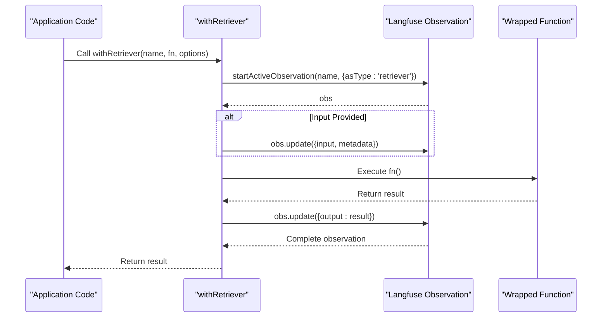
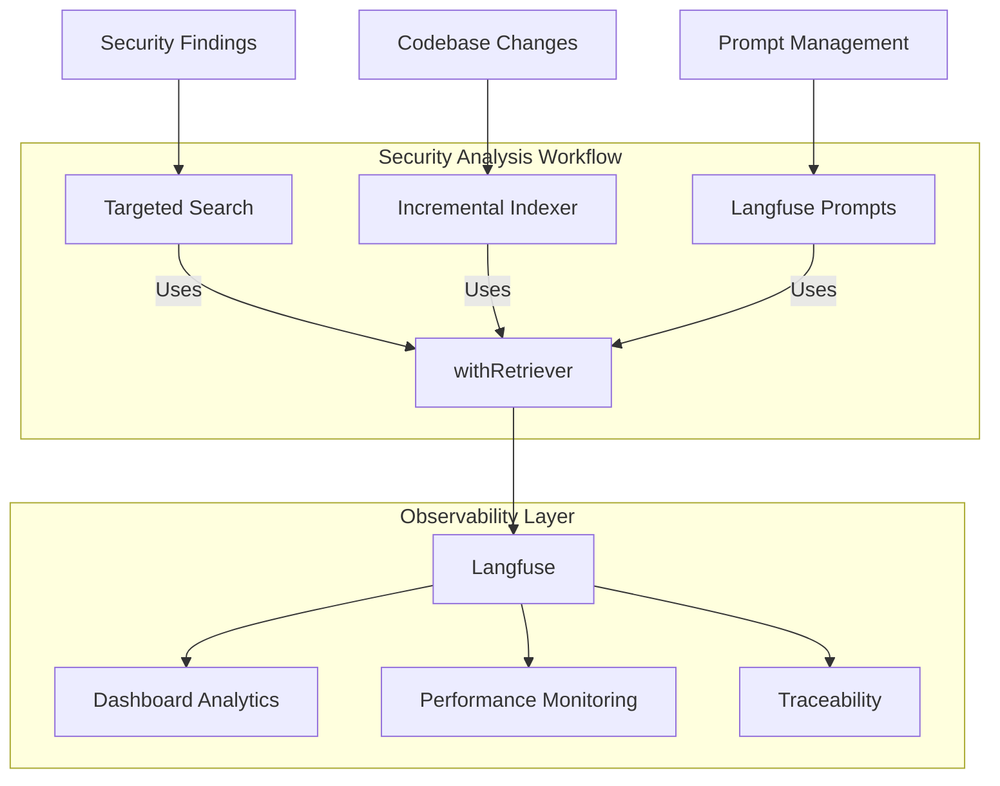
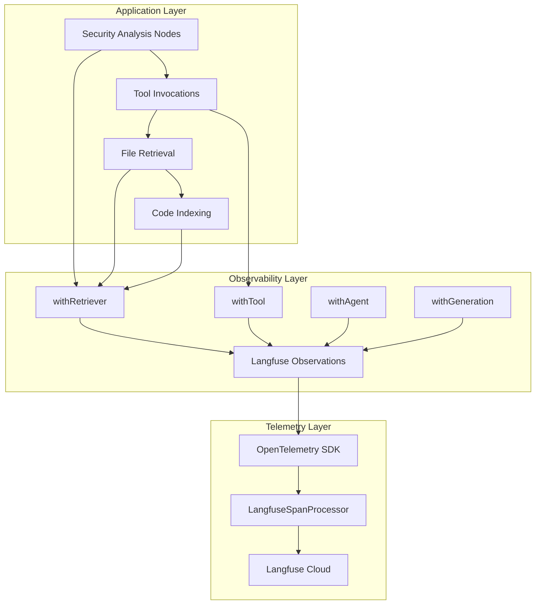

# Retriever Wrapper

<cite>
**Referenced Files in This Document**   
- [index.ts](file://src/observability/index.ts#L217-L232)
- [langfuse-prompts.ts](file://src/tools/langfuse-prompts.ts#L67-L168)
- [incremental-indexer.ts](file://src/tools/incremental-indexer.ts#L63-L140)
- [targeted-search.ts](file://src/tools/targeted-search.ts#L107-L173)
- [instrumentation.ts](file://src/instrumentation.ts#L89-L141)
</cite>

## Table of Contents
1. [Introduction](#introduction)
2. [Core Functionality](#core-functionality)
3. [Integration with Security Analysis Workflow](#integration-with-security-analysis-workflow)
4. [Performance Considerations](#performance-considerations)
5. [Best Practices for Metadata Tagging](#best-practices-for-metadata-tagging)
6. [Architecture Overview](#architecture-overview)
7. [Conclusion](#conclusion)

## Introduction
The `withRetriever` function wrapper in `observability/index.ts` serves as a specialized observability mechanism for monitoring code search and file retrieval operations within the security analysis workflow. It leverages Langfuse's retriever observation standard to provide comprehensive tracking of retrieval activities, enabling detailed insights into the codebase analysis process. This wrapper plays a critical role in enhancing the transparency and traceability of security scanning operations, particularly in the context of OWASP Top 10 vulnerability detection.

**Section sources**
- [index.ts](file://src/observability/index.ts#L1-L232)

## Core Functionality

The `withRetriever` function is designed to wrap file reading and code indexing operations, capturing both input queries and output results for comprehensive observability. It utilizes the `startActiveObservation` function with the 'retriever' type to create observations that align with Langfuse's retriever observation standard. The wrapper accepts three parameters: a name for the observation, the function to be wrapped, and optional input and metadata parameters.

When invoked, `withRetriever` creates an observation that captures the input parameters (if provided) and associates them with the specified metadata. After executing the wrapped function, it updates the observation with the output result, creating a complete record of the retrieval operation. This approach enables detailed tracking of code search patterns, file access operations, and indexing activities throughout the security analysis workflow.

The implementation is minimal yet effective, focusing on the essential aspects of retrieval monitoring without introducing unnecessary complexity. By using the 'retriever' observation type, it ensures compatibility with Langfuse's analytics and visualization capabilities, allowing teams to analyze retrieval patterns, identify performance bottlenecks, and optimize the security scanning process.

**Diagram sources **
- [index.ts](file://src/observability/index.ts#L217-L232)

**Section sources**
- [index.ts](file://src/observability/index.ts#L217-L232)

## Integration with Security Analysis Workflow

The `withRetriever` wrapper integrates seamlessly with key components of the security analysis workflow, particularly the targeted-search and incremental-indexer tools. In the targeted-search module, it could be used to monitor search operations that identify vulnerability patterns across the codebase. When searching for specific OWASP categories, the wrapper captures the search query, execution context, and resulting code chunks, providing valuable insights into the effectiveness of different search strategies.

For the incremental-indexer tool, `withRetriever` plays a crucial role in monitoring the file indexing process. It can wrap operations that collect file metadata, analyze changes between scans, and apply incremental updates to the DirectContext. This enables detailed tracking of which files are being re-indexed, the frequency of changes, and the overall efficiency of the incremental update process. By capturing metadata about file modification times and sizes, it provides a comprehensive view of codebase evolution over time.

The integration extends to prompt management through the langfuse-prompts module, where `withRetriever` could monitor the retrieval of OWASP analysis prompts from Langfuse. This ensures that prompt loading operations are observable, allowing teams to track prompt version usage, identify fallback scenarios, and analyze the impact of different prompt variations on security analysis outcomes.

**Diagram sources **
- [targeted-search.ts](file://src/tools/targeted-search.ts#L107-L173)
- [incremental-indexer.ts](file://src/tools/incremental-indexer.ts#L63-L140)
- [langfuse-prompts.ts](file://src/tools/langfuse-prompts.ts#L67-L168)

**Section sources**
- [targeted-search.ts](file://src/tools/targeted-search.ts#L107-L173)
- [incremental-indexer.ts](file://src/tools/incremental-indexer.ts#L63-L140)
- [langfuse-prompts.ts](file://src/tools/langfuse-prompts.ts#L67-L168)

## Performance Considerations

When retrieving large files or processing extensive codebases, several performance considerations must be addressed. The `withRetriever` wrapper itself introduces minimal overhead, but the operations it monitors can significantly impact overall performance. For large file retrieval, the wrapper should be used judiciously to avoid excessive logging of large data payloads.

The incremental-indexer tool demonstrates an effective approach to managing performance by only re-indexing modified files. This strategy reduces processing time and resource consumption, particularly for large codebases with minimal changes between scans. The use of file modification time (mtime) and size for change detection provides a reliable mechanism for identifying files that require re-indexing.

For code search operations, performance can be optimized by implementing appropriate limits on search results. The targeted-search module includes a `maxOutputLength` parameter (default: 40,000 characters) to prevent excessive data retrieval. This limit ensures that search operations remain efficient while still providing sufficient context for security analysis.

Additionally, the integration with Langfuse's observability platform should consider the volume of data being transmitted. Large retrieval operations may generate substantial observation data, potentially impacting network performance and storage requirements. Implementing sampling strategies or data size limits for observation payloads can help mitigate these concerns.

**Section sources**
- [incremental-indexer.ts](file://src/tools/incremental-indexer.ts#L59-L140)
- [targeted-search.ts](file://src/tools/targeted-search.ts#L98-L173)

## Best Practices for Metadata Tagging

Effective metadata tagging is essential for enhancing traceability in observability platforms. When using `withRetriever`, several best practices should be followed to maximize the value of collected data. First, include contextual information such as scan ID, repository path, and OWASP category in the metadata. This enables correlation of retrieval operations with specific security scans and vulnerability categories.

For code search operations, include details about the search query, target patterns, and expected outcomes in the metadata. This provides valuable context for analyzing search effectiveness and identifying areas for improvement. When retrieving prompts from Langfuse, include the prompt name, version, and label in the metadata to track prompt usage and evolution over time.

The metadata should also capture performance-related information, such as expected and actual result sizes, processing time estimates, and resource utilization. This data enables comprehensive performance analysis and helps identify optimization opportunities. Additionally, include error handling information in the metadata to facilitate troubleshooting and root cause analysis.

Consistent naming conventions for observation names and metadata keys are crucial for effective data analysis. Using standardized formats and following established patterns ensures that data can be easily queried and visualized in the observability platform.

**Section sources**
- [index.ts](file://src/observability/index.ts#L217-L232)
- [langfuse-prompts.ts](file://src/tools/langfuse-prompts.ts#L67-L168)

## Architecture Overview

The `withRetriever` wrapper operates within a comprehensive observability architecture that combines OpenTelemetry and Langfuse for rich monitoring capabilities. The architecture follows a dual approach: OpenTelemetry handles general tracing and span processing, while Langfuse provides specialized observation types for LLM calls, tool invocations, and retrieval operations.

The wrapper integrates with the LangfuseSpanProcessor initialized in instrumentation.ts, ensuring that all observations share the same OpenTelemetry context. This enables proper nesting of observations and spans, creating a coherent trace that spans multiple components and operations. The architecture supports both automatic span processing through OpenTelemetry and manual observation creation through the `withRetriever` wrapper.

The observability architecture is designed to capture data at multiple levels of granularity, from high-level agent orchestrations to detailed tool invocations and retrieval operations. This multi-layered approach provides comprehensive visibility into the security analysis workflow, enabling teams to analyze performance, identify issues, and optimize the scanning process.

**Diagram sources **
- [instrumentation.ts](file://src/instrumentation.ts#L89-L141)
- [index.ts](file://src/observability/index.ts#L217-L232)

**Section sources**
- [instrumentation.ts](file://src/instrumentation.ts#L89-L141)

## Conclusion
The `withRetriever` function wrapper provides a powerful mechanism for monitoring code search and file retrieval operations within the security analysis workflow. By leveraging Langfuse's retriever observation standard, it enables comprehensive tracking of retrieval activities, enhancing transparency and traceability. The wrapper integrates effectively with key components such as targeted-search and incremental-indexer, providing valuable insights into the security scanning process. When combined with appropriate performance considerations and metadata tagging practices, `withRetriever` becomes an essential tool for optimizing security analysis and ensuring reliable vulnerability detection.