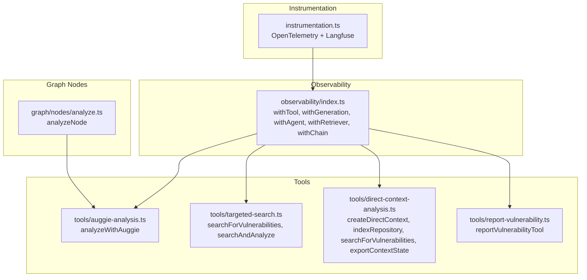
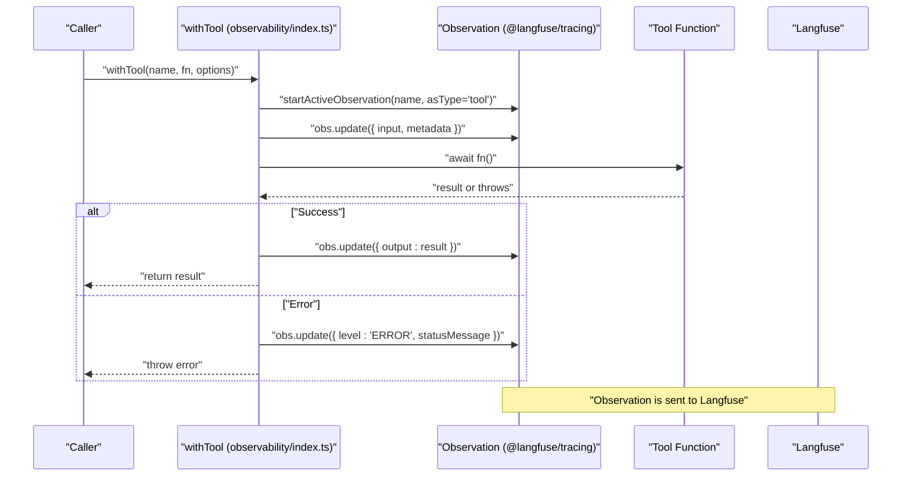
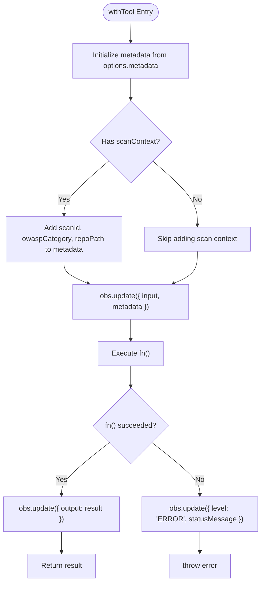
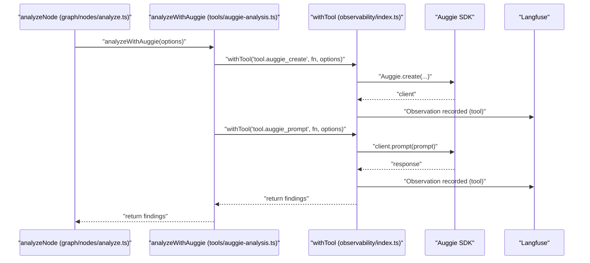
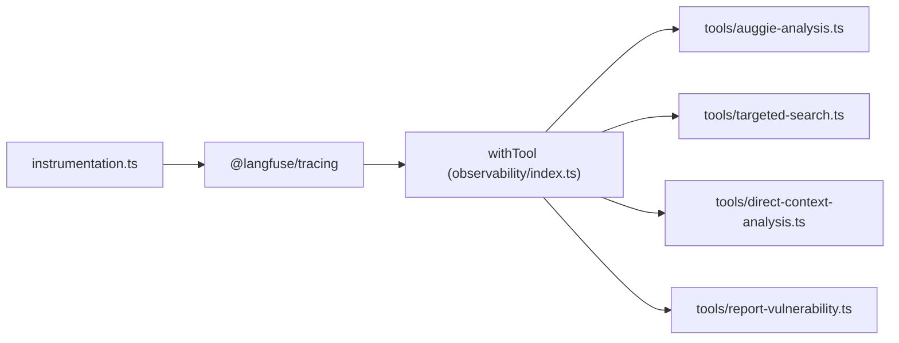

# Tool Wrapper

<cite>
**Referenced Files in This Document**
- [observability/index.ts](file://src/observability/index.ts)
- [observability/index.test.ts](file://src/observability/index.test.ts)
- [tools/auggie-analysis.ts](file://src/tools/auggie-analysis.ts)
- [tools/targeted-search.ts](file://src/tools/targeted-search.ts)
- [tools/direct-context-analysis.ts](file://src/tools/direct-context-analysis.ts)
- [tools/report-vulnerability.ts](file://src/tools/report-vulnerability.ts)
- [graph/nodes/analyze.ts](file://src/graph/nodes/analyze.ts)
- [instrumentation.ts](file://src/instrumentation.ts)
</cite>

## Table of Contents
1. [Introduction](#introduction)
2. [Project Structure](#project-structure)
3. [Core Components](#core-components)
4. [Architecture Overview](#architecture-overview)
5. [Detailed Component Analysis](#detailed-component-analysis)
6. [Dependency Analysis](#dependency-analysis)
7. [Performance Considerations](#performance-considerations)
8. [Troubleshooting Guide](#troubleshooting-guide)
9. [Conclusion](#conclusion)
10. [Appendices](#appendices)

## Introduction
This document explains the withTool function wrapper in src/observability/index.ts and how it enables full observability for Auggie SDK and external API calls. It covers the ToolObservationOptions interface, automatic capture of inputs, outputs, errors, and scan context (scanId, owaspCategory, repoPath), the try-catch logic that records errors while preserving propagation, and internal usage of updateActiveObservation. It also describes integration with security analysis nodes, performance characteristics of wrapping synchronous versus asynchronous tool calls, and guidance for choosing tool names and structuring input/output data for clarity in Langfuse dashboards.

## Project Structure
The observability module provides typed wrappers around @langfuse/tracing to instrument tool invocations, LLM generations, retrievers, chains, agents, and spans. The tools module integrates with Auggie SDK and other security tools, and the graph nodes orchestrate security analysis using these wrappers.

**Diagram sources**
- [observability/index.ts](file://src/observability/index.ts#L1-L212)
- [tools/auggie-analysis.ts](file://src/tools/auggie-analysis.ts#L1-L310)
- [tools/targeted-search.ts](file://src/tools/targeted-search.ts#L1-L293)
- [tools/direct-context-analysis.ts](file://src/tools/direct-context-analysis.ts#L1-L414)
- [tools/report-vulnerability.ts](file://src/tools/report-vulnerability.ts#L1-L154)
- [graph/nodes/analyze.ts](file://src/graph/nodes/analyze.ts#L1-L156)
- [instrumentation.ts](file://src/instrumentation.ts#L1-L141)

**Section sources**
- [observability/index.ts](file://src/observability/index.ts#L1-L212)
- [instrumentation.ts](file://src/instrumentation.ts#L1-L141)

## Core Components
- withTool: Asynchronous wrapper that creates a tool-type observation, captures inputs and outputs, merges scan context into metadata, records errors with level and statusMessage, and rethrows to preserve error propagation.
- ToolObservationOptions: Defines input, scanContext, and metadata fields used by withTool.
- Integration points: Auggie SDK calls, DirectContext operations, targeted search, and report vulnerability tool execution.

**Section sources**
- [observability/index.ts](file://src/observability/index.ts#L121-L212)
- [tools/auggie-analysis.ts](file://src/tools/auggie-analysis.ts#L120-L309)
- [tools/targeted-search.ts](file://src/tools/targeted-search.ts#L98-L173)
- [tools/direct-context-analysis.ts](file://src/tools/direct-context-analysis.ts#L121-L183)

## Architecture Overview
The observability wrappers integrate with @langfuse/tracing and OpenTelemetry. The dual approach uses @langfuse/otel for general spans and @langfuse/tracing for rich observation types. withTool wraps tool invocations and ensures consistent metadata, input/output capture, and error recording.

**Diagram sources**
- [observability/index.ts](file://src/observability/index.ts#L162-L212)
- [instrumentation.ts](file://src/instrumentation.ts#L1-L141)

## Detailed Component Analysis

### withTool Function
- Purpose: Wrap tool invocations (Auggie SDK calls, external API calls) with full observability.
- Inputs:
  - name: Observation name (e.g., "tool.auggie_create", "tool.targeted_search").
  - fn: Async function that performs the tool operation.
  - options: ToolObservationOptions including input, scanContext, and metadata.
- Behavior:
  - Sets initial metadata from options.metadata.
  - Merges scanContext into metadata (scanId, optional owaspCategory, optional repoPath).
  - Updates observation with input and metadata.
  - Executes fn and updates observation with output on success.
  - On error, sets level to ERROR and statusMessage, then rethrows to preserve propagation.
- Output: Returns the result of fn; on error, throws the original error.

**Diagram sources**
- [observability/index.ts](file://src/observability/index.ts#L162-L212)

**Section sources**
- [observability/index.ts](file://src/observability/index.ts#L121-L212)
- [observability/index.test.ts](file://src/observability/index.test.ts#L1-L148)

### ToolObservationOptions Interface
- Fields:
  - input: Unknown payload representing parameters passed to the tool.
  - scanContext: Optional object containing scanId, optional owaspCategory, and optional repoPath.
  - metadata: Optional record of additional attributes to merge into observation metadata.
- Merging behavior:
  - options.metadata is spread into metadata.
  - If scanContext is provided, scanId is always copied; owaspCategory and repoPath are conditionally copied if present.

**Section sources**
- [observability/index.ts](file://src/observability/index.ts#L121-L161)

### Error Recording and Propagation
- try-catch ensures errors are captured:
  - Sets observation level to ERROR and statusMessage to the error’s message (or stringified error).
  - Re-throws the error to maintain error propagation semantics.
- This guarantees visibility in Langfuse while preserving caller-side error handling.

**Section sources**
- [observability/index.ts](file://src/observability/index.ts#L192-L212)

### Integration with Security Analysis Nodes
- Auggie-based analysis:
  - analyzeWithAuggie uses withTool to wrap Auggie.create and client.prompt calls, passing scanContext and metadata for traceability.
- Targeted search:
  - searchForVulnerabilities and searchAndAnalyze wrap DirectContext operations with withTool and scanContext.
- DirectContext operations:
  - createDirectContext, indexRepository, searchForVulnerabilities, exportContextState use withTool to instrument persistence and search operations.
- Report vulnerability tool:
  - reportVulnerabilityTool executes within a tool-type observation and collects findings for later aggregation.

**Diagram sources**
- [graph/nodes/analyze.ts](file://src/graph/nodes/analyze.ts#L44-L155)
- [tools/auggie-analysis.ts](file://src/tools/auggie-analysis.ts#L120-L309)
- [observability/index.ts](file://src/observability/index.ts#L162-L212)

**Section sources**
- [tools/auggie-analysis.ts](file://src/tools/auggie-analysis.ts#L120-L309)
- [tools/targeted-search.ts](file://src/tools/targeted-search.ts#L98-L173)
- [tools/direct-context-analysis.ts](file://src/tools/direct-context-analysis.ts#L121-L183)
- [tools/report-vulnerability.ts](file://src/tools/report-vulnerability.ts#L82-L154)
- [graph/nodes/analyze.ts](file://src/graph/nodes/analyze.ts#L44-L155)

### updateActiveObservation Usage
- The observability module exports updateActiveObservation, enabling dynamic updates to the currently active observation (e.g., setting OWASP category context).
- While withTool does not directly call updateActiveObservation, other parts of the codebase (e.g., setOwaspContext) demonstrate how to update active observation metadata.

**Section sources**
- [observability/index.ts](file://src/observability/index.ts#L297-L308)

## Dependency Analysis
- withTool depends on @langfuse/tracing for observation lifecycle and metadata updates.
- Tools depend on withTool to ensure consistent observability across Auggie SDK, DirectContext, and report-vulnerability operations.
- Instrumentation initializes OpenTelemetry and Langfuse processors, enabling seamless correlation between @langfuse/otel spans and @langfuse/tracing observations.

**Diagram sources**
- [instrumentation.ts](file://src/instrumentation.ts#L1-L141)
- [observability/index.ts](file://src/observability/index.ts#L1-L212)
- [tools/auggie-analysis.ts](file://src/tools/auggie-analysis.ts#L1-L310)
- [tools/targeted-search.ts](file://src/tools/targeted-search.ts#L1-L293)
- [tools/direct-context-analysis.ts](file://src/tools/direct-context-analysis.ts#L1-L414)
- [tools/report-vulnerability.ts](file://src/tools/report-vulnerability.ts#L1-L154)

**Section sources**
- [instrumentation.ts](file://src/instrumentation.ts#L1-L141)
- [observability/index.ts](file://src/observability/index.ts#L1-L212)

## Performance Considerations
- Synchronous vs asynchronous tool calls:
  - withTool is designed for async operations (Promise-returning fn). Wrapping synchronous functions is possible but not idiomatic and can mask latency; prefer async wrappers for accurate timing and error handling.
- Overhead:
  - Observation creation, metadata updates, and error recording add minimal overhead compared to network/API calls and LLM inference.
- Recommendations:
  - Keep input and output payloads concise; avoid large objects in input/output to reduce dashboard clutter and storage costs.
  - Use scanContext to attach trace-level attributes consistently across tool calls for grouping and filtering in Langfuse.

[No sources needed since this section provides general guidance]

## Troubleshooting Guide
- Symptom: Tool errors are not visible in Langfuse.
  - Ensure withTool is used around the tool call and that the error is thrown after obs.update is called.
  - Verify that instrumentation.ts is imported before other modules to capture traces.
- Symptom: Missing scan context attributes in the dashboard.
  - Confirm scanContext is provided to withTool and includes scanId; optional owaspCategory and repoPath will be included if provided.
- Symptom: Tool name not meaningful in dashboards.
  - Choose descriptive tool names prefixed with "tool." and include a concise operation identifier (e.g., "tool.targeted_search").

**Section sources**
- [observability/index.ts](file://src/observability/index.ts#L162-L212)
- [instrumentation.ts](file://src/instrumentation.ts#L1-L141)

## Conclusion
The withTool wrapper centralizes observability for tool invocations across the security analysis pipeline. It standardizes input/output capture, merges scan context into metadata, records errors with appropriate levels, and preserves error propagation. Combined with the broader observability ecosystem, it delivers rich, actionable insights for debugging and performance monitoring in Langfuse.

[No sources needed since this section summarizes without analyzing specific files]

## Appendices

### Concrete Usage Examples from the Codebase
- Auggie SDK creation and prompting:
  - [tools/auggie-analysis.ts](file://src/tools/auggie-analysis.ts#L164-L193)
  - [tools/auggie-analysis.ts](file://src/tools/auggie-analysis.ts#L220-L240)
- Targeted search:
  - [tools/targeted-search.ts](file://src/tools/targeted-search.ts#L98-L173)
  - [tools/targeted-search.ts](file://src/tools/targeted-search.ts#L199-L253)
- DirectContext operations:
  - [tools/direct-context-analysis.ts](file://src/tools/direct-context-analysis.ts#L121-L183)
  - [tools/direct-context-analysis.ts](file://src/tools/direct-context-analysis.ts#L193-L273)
  - [tools/direct-context-analysis.ts](file://src/tools/direct-context-analysis.ts#L275-L341)
  - [tools/direct-context-analysis.ts](file://src/tools/direct-context-analysis.ts#L363-L414)
- Report vulnerability tool:
  - [tools/report-vulnerability.ts](file://src/tools/report-vulnerability.ts#L82-L154)

### Guidance on Tool Names and Structuring Inputs/Outputs
- Tool naming:
  - Use the "tool.<provider>_<operation>" convention to clearly identify providers and operations.
- Input structure:
  - Include only essential parameters; avoid large payloads. Consider preview fields (e.g., promptPreview) to keep input concise.
- Output structure:
  - Return a plain result; avoid embedding large objects. If needed, include a small sample or summary in outputs for dashboards.
- Metadata:
  - Add descriptive fields like toolName and operation to improve dashboard readability and filtering.

**Section sources**
- [tools/auggie-analysis.ts](file://src/tools/auggie-analysis.ts#L164-L193)
- [tools/targeted-search.ts](file://src/tools/targeted-search.ts#L98-L173)
- [tools/direct-context-analysis.ts](file://src/tools/direct-context-analysis.ts#L121-L183)
- [tools/report-vulnerability.ts](file://src/tools/report-vulnerability.ts#L82-L154)