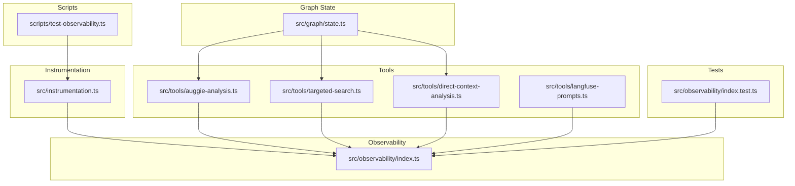
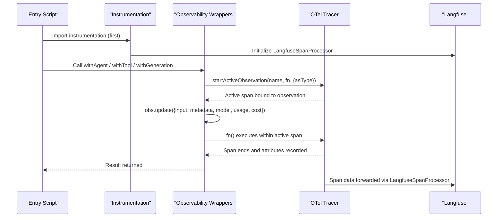
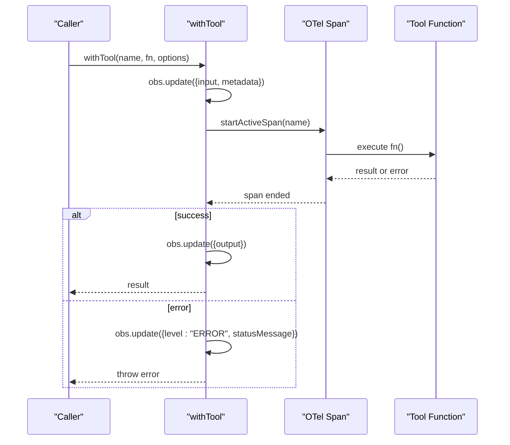
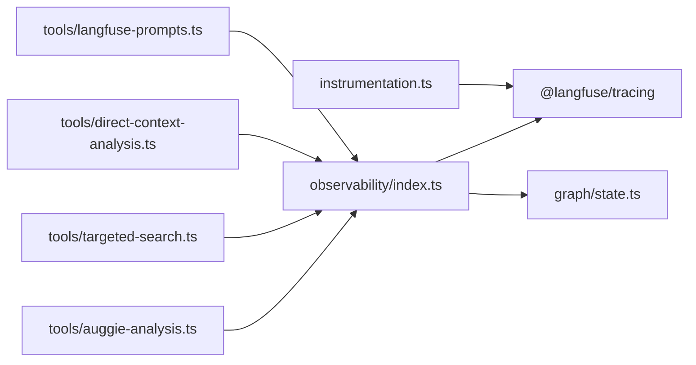

# Tracing Wrappers

<cite>
**Referenced Files in This Document**
- [index.ts](file://src/observability/index.ts)
- [instrumentation.ts](file://src/instrumentation.ts)
- [auggie-analysis.ts](file://src/tools/auggie-analysis.ts)
- [targeted-search.ts](file://src/tools/targeted-search.ts)
- [direct-context-analysis.ts](file://src/tools/direct-context-analysis.ts)
- [langfuse-prompts.ts](file://src/tools/langfuse-prompts.ts)
- [state.ts](file://src/graph/state.ts)
- [index.test.ts](file://src/observability/index.test.ts)
- [test-observability.ts](file://scripts/test-observability.ts)
</cite>

## Table of Contents
1. [Introduction](#introduction)
2. [Project Structure](#project-structure)
3. [Core Components](#core-components)
4. [Architecture Overview](#architecture-overview)
5. [Detailed Component Analysis](#detailed-component-analysis)
6. [Dependency Analysis](#dependency-analysis)
7. [Performance Considerations](#performance-considerations)
8. [Troubleshooting Guide](#troubleshooting-guide)
9. [Conclusion](#conclusion)
10. [Appendices](#appendices)

## Introduction
This document explains the tracing wrappers implemented in the observability module and how they integrate with the broader system to provide rich, structured telemetry for security analysis workflows. It focuses on:
- Purpose and observation types for each wrapper: withGeneration, withTool, withRetriever, withChain, withAgent
- Concrete usage examples from the codebase, including how withTool wraps Auggie SDK calls and how withGeneration handles LLM invocations with model, token, and cost tracking
- Automatic error capture and metadata enrichment features of withTool, including scan context propagation
- How withOwaspGeneration enhances LLM call observability with OWASP-specific context and prompt linking
- Interface definitions such as ToolObservationOptions and LlmGenerationResult
- Underlying use of startActiveObservation and how observations are updated during execution
- Performance implications and best practices for parameter selection

## Project Structure
The observability wrappers live in a dedicated module and are used across tools and graph orchestration. The instrumentation module initializes OpenTelemetry and Langfuse processors, enabling seamless correlation between OTel spans and Langfuse observations.

**Diagram sources**
- [index.ts](file://src/observability/index.ts#L1-L411)
- [instrumentation.ts](file://src/instrumentation.ts#L1-L141)
- [auggie-analysis.ts](file://src/tools/auggie-analysis.ts#L1-L310)
- [targeted-search.ts](file://src/tools/targeted-search.ts#L1-L293)
- [direct-context-analysis.ts](file://src/tools/direct-context-analysis.ts#L1-L414)
- [langfuse-prompts.ts](file://src/tools/langfuse-prompts.ts#L1-L211)
- [state.ts](file://src/graph/state.ts#L1-L173)
- [index.test.ts](file://src/observability/index.test.ts#L1-L150)
- [test-observability.ts](file://scripts/test-observability.ts#L1-L73)

**Section sources**
- [index.ts](file://src/observability/index.ts#L1-L411)
- [instrumentation.ts](file://src/instrumentation.ts#L1-L141)

## Core Components
This section summarizes the purpose and observation types for each wrapper and highlights their roles in the system.

- withGeneration: LLM generation wrapper that records model, input, output, usage, and cost details. It also supports linking to Langfuse prompts via promptName and promptVersion.
- withTool: Generic tool wrapper for SDK/API calls and external operations. It captures input/output, error recording, scan context propagation, and consistent metadata structure.
- withRetriever: Retrieval-oriented operations (e.g., code search, file reads) with input/output capture.
- withChain: Prompt loading and data transformation steps with input/output capture.
- withAgent: Agent-level orchestration (graph node orchestration) with input/output capture.
- setTraceContext: Sets trace-level attributes for the current scan (scanId, repoPath, userId, sessionId, tags).
- setOwaspContext: Adds OWASP category context to the current observation.
- withOwaspGeneration: Specialized LLM generation wrapper for security analysis with model, tokens, costs, prompt linking, and OWASP category context.

These wrappers rely on startActiveObservation to create and manage observations with explicit types, ensuring they render correctly in the Langfuse dashboard and correlate with OTel spans.

**Section sources**
- [index.ts](file://src/observability/index.ts#L36-L119)
- [index.ts](file://src/observability/index.ts#L121-L272)
- [index.ts](file://src/observability/index.ts#L274-L308)
- [index.ts](file://src/observability/index.ts#L310-L410)

## Architecture Overview
The observability stack integrates two complementary packages:
- @langfuse/otel: automatic OpenTelemetry span processing and forwarding to Langfuse
- @langfuse/tracing: rich observation types (generation, tool, retriever, chain, agent) with LLM-specific tracking

Both share the same OpenTelemetry context, enabling nested spans and observations to align correctly.

**Diagram sources**
- [instrumentation.ts](file://src/instrumentation.ts#L1-L141)
- [index.ts](file://src/observability/index.ts#L1-L411)

## Detailed Component Analysis

### withGeneration: LLM Invocation Tracking
Purpose:
- Wrap LLM calls to record model, input, output, usage, and cost details.
- Optionally link to Langfuse prompts via promptName and promptVersion.

Key behaviors:
- Uses startActiveObservation with asType "generation".
- Updates observation with model, input, and metadata (including promptName/promptVersion).
- Executes the provided function and updates observation with output and usage/cost details.

Usage example path:
- See the example in the wrapper’s JSDoc for typical usage patterns.

Interface definitions:
- LlmGenerationResult<T> includes result, usage, and cost fields.
- LlmGenerationOptions defines model, input, optional owaspCategory, promptName, promptVersion, and metadata.

Performance and best practices:
- Prefer passing minimal input to reduce payload size.
- Provide usage and cost details when available to enable accurate cost attribution.
- Use promptName and promptVersion to enable prompt linking and version tracking.

**Section sources**
- [index.ts](file://src/observability/index.ts#L80-L119)
- [index.ts](file://src/observability/index.ts#L327-L338)
- [index.ts](file://src/observability/index.ts#L310-L326)

### withTool: Auggie SDK and External Calls
Purpose:
- Standardize observability for tool-like operations (SDK/API calls, file operations, external functions).
- Automatically capture input/output, propagate errors, enrich metadata, and attach scan context.

Key behaviors:
- Uses startActiveObservation with asType "tool".
- Sets initial attributes: input and metadata (including scanContext).
- Executes the provided function; on success, updates observation with output.
- On error, records level "ERROR" and statusMessage, then re-throws to preserve error propagation.

Scan context propagation:
- If scanContext is provided, metadata receives scanId, optional owaspCategory, and optional repoPath.

Usage example paths:
- Auggie SDK creation wrapped with withTool inside analyzeWithAuggie.
- Auggie prompt call wrapped with withTool inside analyzeWithAuggie.
- DirectContext operations wrapped with withTool across multiple functions.

Integration with OpenTelemetry:
- Many tool implementations also create OTel spans via tracer.startActiveSpan for granular timing and error tracking.

Performance and best practices:
- Limit input size; pass only necessary parameters.
- Avoid logging sensitive data in input/metadata.
- Use scanContext consistently for trace-level correlation.
- Keep tool functions small and focused for clearer telemetry.

**Diagram sources**
- [index.ts](file://src/observability/index.ts#L137-L212)
- [auggie-analysis.ts](file://src/tools/auggie-analysis.ts#L160-L193)
- [auggie-analysis.ts](file://src/tools/auggie-analysis.ts#L219-L240)
- [targeted-search.ts](file://src/tools/targeted-search.ts#L107-L173)
- [direct-context-analysis.ts](file://src/tools/direct-context-analysis.ts#L121-L183)

**Section sources**
- [index.ts](file://src/observability/index.ts#L137-L212)
- [auggie-analysis.ts](file://src/tools/auggie-analysis.ts#L160-L193)
- [auggie-analysis.ts](file://src/tools/auggie-analysis.ts#L219-L240)
- [targeted-search.ts](file://src/tools/targeted-search.ts#L107-L173)
- [direct-context-analysis.ts](file://src/tools/direct-context-analysis.ts#L121-L183)

### withRetriever: Retrieval Operations
Purpose:
- Track code search and file content retrieval operations with input/output capture.

Behavior:
- Uses startActiveObservation with asType "retriever".
- Updates observation with input and metadata if provided, then captures output upon completion.

Best practices:
- Keep input concise; avoid large payloads.
- Use metadata to annotate retrieval strategy or filters.

**Section sources**
- [index.ts](file://src/observability/index.ts#L214-L232)

### withChain: Prompt Loading and Transformations
Purpose:
- Track prompt loading and data transformation steps with input/output capture.

Behavior:
- Uses startActiveObservation with asType "chain".
- Updates observation with input and metadata if provided, then captures output upon completion.

Best practices:
- Use this for prompt retrieval and compilation steps to gain visibility into prompt lifecycle.

**Section sources**
- [index.ts](file://src/observability/index.ts#L234-L252)
- [langfuse-prompts.ts](file://src/tools/langfuse-prompts.ts#L67-L168)

### withAgent: Agent-Level Orchestration
Purpose:
- Track agent-level orchestration (graph node orchestration) with input/output capture.

Behavior:
- Uses startActiveObservation with asType "agent".
- Updates observation with input and metadata if provided, then captures output upon completion.

Best practices:
- Use this at higher-level orchestration boundaries to understand end-to-end flow.

**Section sources**
- [index.ts](file://src/observability/index.ts#L254-L272)

### setTraceContext and setOwaspContext
Purpose:
- setTraceContext: Sets trace-level attributes for the current scan (scanId, repoPath, userId, sessionId, tags).
- setOwaspContext: Adds OWASP category context to the current observation.

Usage:
- Call setTraceContext early in the trace to ensure all observations inherit these attributes.
- Use setOwaspContext to annotate observations with OWASP category and scanId.

**Section sources**
- [index.ts](file://src/observability/index.ts#L274-L308)

### withOwaspGeneration: OWASP-Specific LLM Tracking
Purpose:
- Specialized wrapper for LLM calls in security analysis.
- Tracks model, input/output, token usage, cost, prompt linking, and OWASP category context.

Key behaviors:
- Uses startActiveObservation with asType "generation".
- Updates observation with model, input, and metadata (owaspCategory, promptName, promptVersion).
- Executes the provided function and updates observation with output and usage/cost details.

Usage example path:
- See the example in the wrapper’s JSDoc for typical usage patterns.

Best practices:
- Always set owaspCategory and promptName/promptVersion when available.
- Provide usage and cost details for accurate cost attribution.
- Use setOwaspContext to ensure consistent OWASP context across the trace.

**Section sources**
- [index.ts](file://src/observability/index.ts#L340-L410)

### Interface Definitions
- ToolObservationOptions: Defines input, scanContext, and metadata for tool observations.
- LlmGenerationOptions: Defines model, input, optional owaspCategory, promptName, promptVersion, and metadata for LLM generations.
- LlmGenerationResult<T>: Defines result, optional usage, and optional cost for LLM generation results.

**Section sources**
- [index.ts](file://src/observability/index.ts#L121-L136)
- [index.ts](file://src/observability/index.ts#L310-L338)

## Dependency Analysis
The observability wrappers depend on:
- Langfuse tracing primitives (startActiveObservation, updateActiveObservation, updateActiveTrace)
- OpenTelemetry tracer for granular spans within tool implementations
- OWASP category types from graph state
- Langfuse prompt utilities for prompt retrieval and linking

**Diagram sources**
- [index.ts](file://src/observability/index.ts#L1-L411)
- [instrumentation.ts](file://src/instrumentation.ts#L1-L141)
- [auggie-analysis.ts](file://src/tools/auggie-analysis.ts#L1-L310)
- [targeted-search.ts](file://src/tools/targeted-search.ts#L1-L293)
- [direct-context-analysis.ts](file://src/tools/direct-context-analysis.ts#L1-L414)
- [langfuse-prompts.ts](file://src/tools/langfuse-prompts.ts#L1-L211)
- [state.ts](file://src/graph/state.ts#L1-L173)

**Section sources**
- [index.ts](file://src/observability/index.ts#L1-L411)
- [instrumentation.ts](file://src/instrumentation.ts#L1-L141)
- [state.ts](file://src/graph/state.ts#L1-L173)

## Performance Considerations
- Overhead of startActiveObservation and updateActiveObservation is minimal compared to network calls and LLM invocations.
- Prefer passing only necessary input to reduce payload sizes and dashboard clutter.
- Avoid logging sensitive data in input/metadata.
- Use scanContext and setTraceContext to reduce downstream filtering work in dashboards.
- For frequent tool calls, batch operations where possible to minimize overhead.
- Provide usage and cost details for withGeneration and withOwaspGeneration to enable accurate cost attribution and budgeting.

[No sources needed since this section provides general guidance]

## Troubleshooting Guide
Common issues and resolutions:
- Missing environment variables for Langfuse: Instrumentation validates required keys and exits if missing. Ensure LANGFUSE_PUBLIC_KEY and LANGFUSE_SECRET_KEY are configured.
- Tool function throws an error: withTool records error details and re-throws, preserving stack traces. Verify error handling in tool implementations.
- Observations not appearing in Langfuse: Ensure instrumentation is imported first and that the SDK is running. Use the test script to validate end-to-end traces.
- Prompt retrieval failures: Langfuse prompt utilities support fallbacks; confirm fallbackText is provided when needed.

**Section sources**
- [instrumentation.ts](file://src/instrumentation.ts#L94-L120)
- [index.ts](file://src/observability/index.ts#L137-L212)
- [langfuse-prompts.ts](file://src/tools/langfuse-prompts.ts#L67-L168)
- [test-observability.ts](file://scripts/test-observability.ts#L1-L73)

## Conclusion
The observability wrappers provide a consistent, typed approach to capturing security analysis telemetry. They integrate seamlessly with OpenTelemetry and Langfuse, enabling rich LLM tracking, tool observability, and OWASP-specific context. By following the usage patterns and best practices outlined here, teams can achieve clear, actionable insights while maintaining performance and security.

[No sources needed since this section summarizes without analyzing specific files]

## Appendices

### Concrete Usage Examples from the Codebase
- Auggie SDK creation wrapped with withTool inside analyzeWithAuggie:
  - [auggie-analysis.ts](file://src/tools/auggie-analysis.ts#L160-L193)
- Auggie prompt call wrapped with withTool inside analyzeWithAuggie:
  - [auggie-analysis.ts](file://src/tools/auggie-analysis.ts#L219-L240)
- Targeted search wrapped with withTool:
  - [targeted-search.ts](file://src/tools/targeted-search.ts#L107-L173)
- DirectContext operations wrapped with withTool:
  - [direct-context-analysis.ts](file://src/tools/direct-context-analysis.ts#L121-L183)
  - [direct-context-analysis.ts](file://src/tools/direct-context-analysis.ts#L193-L273)
  - [direct-context-analysis.ts](file://src/tools/direct-context-analysis.ts#L284-L341)
  - [direct-context-analysis.ts](file://src/tools/direct-context-analysis.ts#L370-L414)
- LLM generation with prompt linking:
  - [langfuse-prompts.ts](file://src/tools/langfuse-prompts.ts#L67-L168)
  - [auggie-analysis.ts](file://src/tools/auggie-analysis.ts#L144-L154)

### Tests Demonstrating withTool Behavior
- Execution, input/metadata, scan context, error propagation, async operations, complex return types, and partial scan context:
  - [index.test.ts](file://src/observability/index.test.ts#L1-L150)

**Section sources**
- [auggie-analysis.ts](file://src/tools/auggie-analysis.ts#L144-L154)
- [targeted-search.ts](file://src/tools/targeted-search.ts#L107-L173)
- [direct-context-analysis.ts](file://src/tools/direct-context-analysis.ts#L121-L183)
- [langfuse-prompts.ts](file://src/tools/langfuse-prompts.ts#L67-L168)
- [index.test.ts](file://src/observability/index.test.ts#L1-L150)