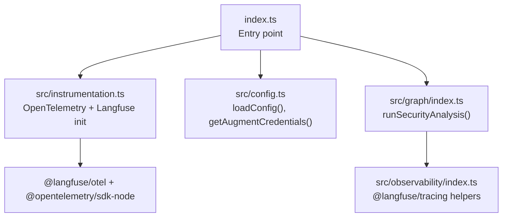
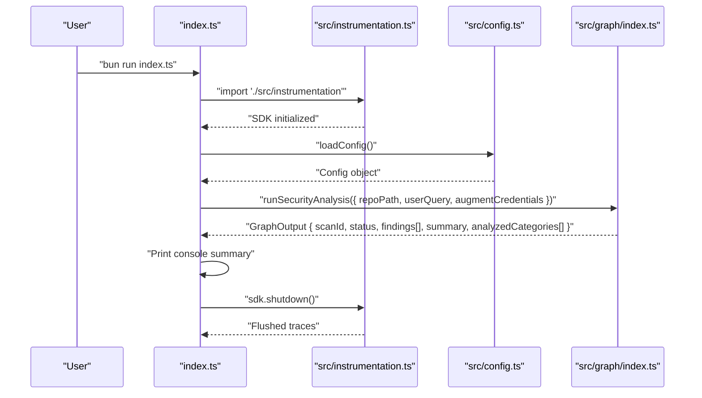
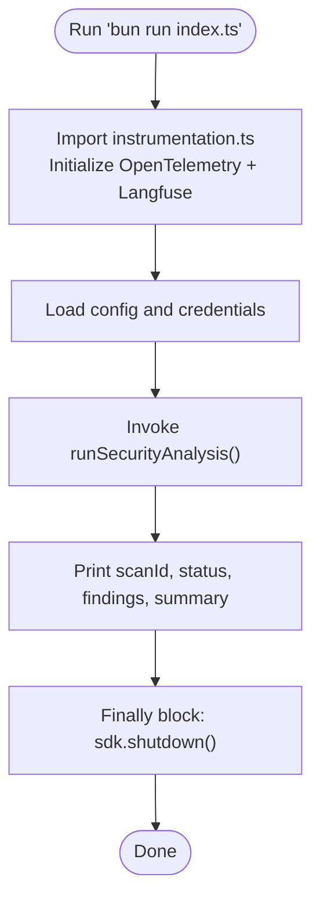
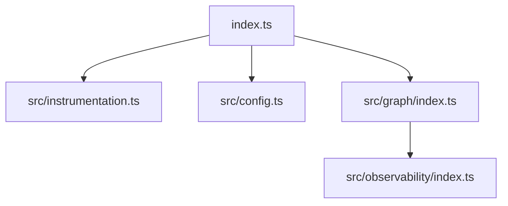

# Quick Start Guide

<cite>
**Referenced Files in This Document**
- [index.ts](file://index.ts)
- [README.md](file://README.md)
- [package.json](file://package.json)
- [src/instrumentation.ts](file://src/instrumentation.ts)
- [src/config.ts](file://src/config.ts)
- [src/graph/index.ts](file://src/graph/index.ts)
- [.env.example](file://.env.example)
</cite>

## Table of Contents
1. [Introduction](#introduction)
2. [Project Structure](#project-structure)
3. [Core Components](#core-components)
4. [Architecture Overview](#architecture-overview)
5. [Detailed Component Analysis](#detailed-component-analysis)
6. [Dependency Analysis](#dependency-analysis)
7. [Performance Considerations](#performance-considerations)
8. [Troubleshooting Guide](#troubleshooting-guide)
9. [Conclusion](#conclusion)

## Introduction
This quick start guide helps you run your first security scan using the OWASP GraphGuard agent. After installing dependencies and setting up environment variables, you will execute a minimal command to trigger a scan, observe the console output, and verify results in the Langfuse dashboard. You will learn how the execution flow works, why the instrumentation import must be first, how to customize the repository path, and how to interpret the scan results.

## Project Structure
At a high level, the entrypoint initializes observability, loads configuration, runs the security analysis graph, prints results, and ensures telemetry is flushed on exit.

**Diagram sources**
- [index.ts](file://index.ts#L1-L52)
- [src/instrumentation.ts](file://src/instrumentation.ts#L1-L141)
- [src/config.ts](file://src/config.ts#L1-L153)
- [src/graph/index.ts](file://src/graph/index.ts#L1-L153)
- [src/observability/index.ts](file://src/observability/index.ts#L1-L411)

**Section sources**
- [index.ts](file://index.ts#L1-L52)
- [README.md](file://README.md#L34-L70)

## Core Components
- Entry point and execution flow:
  - The entrypoint imports instrumentation first, validates configuration, starts the analysis, prints results, and shuts down the SDK in a finally block.
- Instrumentation:
  - Initializes OpenTelemetry and Langfuse, validates required environment variables, exports the SDK for shutdown, and registers graceful shutdown signals.
- Configuration:
  - Loads and validates environment variables for Langfuse, Augment/Auggie, LLM provider, workspace root, and logging level.
- Graph runner:
  - Orchestrates the five-node LangGraph workflow, sets trace-level metadata, and returns structured results.

**Section sources**
- [index.ts](file://index.ts#L1-L52)
- [src/instrumentation.ts](file://src/instrumentation.ts#L1-L141)
- [src/config.ts](file://src/config.ts#L1-L153)
- [src/graph/index.ts](file://src/graph/index.ts#L50-L145)

## Architecture Overview
The scan follows a deterministic flow: instrumentation initializes observability, configuration is loaded, the graph executes the analysis, and results are printed. Telemetry is flushed on exit.

**Diagram sources**
- [index.ts](file://index.ts#L1-L52)
- [src/instrumentation.ts](file://src/instrumentation.ts#L103-L141)
- [src/config.ts](file://src/config.ts#L89-L118)
- [src/graph/index.ts](file://src/graph/index.ts#L56-L145)

## Detailed Component Analysis

### Running Your First Scan
Follow these steps to execute a scan and interpret the output:

1. Install dependencies and prepare environment:
   - Install dependencies and copy the example environment file.
   - Set required environment variables for Langfuse and Augment/Auggie.
   - Optionally set WORKSPACE_ROOT to target a different repository.

2. Execute the scan:
   - Run the entrypoint script to start the analysis.

3. Interpret the console output:
   - The entrypoint prints scan metadata and top findings, then prints a summary.

4. Verify in Langfuse:
   - Confirm traces appear in the Langfuse dashboard with the scan ID and agent spans.

**Section sources**
- [README.md](file://README.md#L34-L70)
- [README.md](file://README.md#L71-L96)
- [README.md](file://README.md#L131-L144)
- [index.ts](file://index.ts#L11-L51)

### Execution Flow: What Happens When You Run the Scan
- Instrumentation import must be first:
  - The entrypoint imports instrumentation before any other modules to ensure OpenTelemetry and Langfuse are initialized before any code runs.
- Configuration loading:
  - The entrypoint loads configuration and extracts Augment credentials for the Auggie SDK.
- Graph execution:
  - The entrypoint invokes the graph runner with the configured repository path and a default user query.
- Console output:
  - The entrypoint prints scan ID, status, total findings, analyzed categories, top findings, and a summary.
- Shutdown:
  - The entrypoint flushes telemetry and shuts down the SDK in a finally block.

**Diagram sources**
- [index.ts](file://index.ts#L1-L52)
- [src/instrumentation.ts](file://src/instrumentation.ts#L103-L141)
- [src/config.ts](file://src/config.ts#L89-L118)
- [src/graph/index.ts](file://src/graph/index.ts#L56-L145)

**Section sources**
- [index.ts](file://index.ts#L1-L52)

### Understanding the Console Output
After the scan completes, the entrypoint prints a structured summary. Here’s what each part means:

- Scan ID:
  - A unique identifier for the scan used to correlate traces in Langfuse.
- Status:
  - Indicates whether the scan completed successfully.
- Total Findings:
  - The number of detected vulnerabilities across all analyzed categories.
- Categories Analyzed:
  - The OWASP categories that were evaluated.
- Top Findings:
  - Lists the highest-severity issues discovered, including severity, title, category, and file location.
- Errors:
  - Any errors encountered during the scan.
- Summary:
  - A generated report with counts by severity and category, plus detailed findings.

These fields come from the graph output and are printed by the entrypoint.

**Section sources**
- [index.ts](file://index.ts#L23-L45)
- [src/graph/index.ts](file://src/graph/index.ts#L113-L135)

### Customizing the Repository Path
To analyze a different repository:

- Set the WORKSPACE_ROOT environment variable to the desired path.
- The entrypoint passes this path to the graph runner.

This allows you to scan any local repository without changing code.

**Section sources**
- [README.md](file://README.md#L42-L54)
- [index.ts](file://index.ts#L17-L21)
- [src/config.ts](file://src/config.ts#L78-L78)

### Why Instrumentation Must Be Imported First
- The instrumentation file initializes OpenTelemetry and Langfuse and registers graceful shutdown handlers.
- Importing it first ensures all subsequent modules and spans are captured by the telemetry pipeline.
- The entrypoint explicitly imports instrumentation before any other modules.

**Section sources**
- [src/instrumentation.ts](file://src/instrumentation.ts#L1-L20)
- [index.ts](file://index.ts#L1-L3)

### SDK Shutdown in the Finally Block
- The entrypoint flushes telemetry and shuts down the SDK in a finally block to guarantee cleanup on both success and failure.
- This ensures traces are sent to Langfuse even for short-lived processes.

**Section sources**
- [index.ts](file://index.ts#L45-L51)
- [src/instrumentation.ts](file://src/instrumentation.ts#L121-L135)

### Verifying Successful Execution
- Console verification:
  - Look for the “Analysis complete” message and the printed scan summary.
- Langfuse verification:
  - Navigate to the Langfuse dashboard and search for the scan ID.
  - Confirm the presence of the agent trace and nested spans for the analysis workflow.

**Section sources**
- [README.md](file://README.md#L71-L96)
- [README.md](file://README.md#L131-L144)
- [src/graph/index.ts](file://src/graph/index.ts#L56-L145)

## Dependency Analysis
The entrypoint depends on instrumentation for observability, config for credentials and paths, and the graph runner for orchestration. The graph uses Langfuse tracing helpers for rich observation types.

**Diagram sources**
- [index.ts](file://index.ts#L1-L52)
- [src/instrumentation.ts](file://src/instrumentation.ts#L1-L141)
- [src/config.ts](file://src/config.ts#L1-L153)
- [src/graph/index.ts](file://src/graph/index.ts#L1-L153)
- [src/observability/index.ts](file://src/observability/index.ts#L1-L411)

**Section sources**
- [index.ts](file://index.ts#L1-L52)
- [src/graph/index.ts](file://src/graph/index.ts#L1-L153)

## Performance Considerations
- Keep the entrypoint minimal to reduce startup overhead.
- Ensure WORKSPACE_ROOT points to a focused repository to limit analysis scope.
- Use the finally block to flush telemetry promptly for short-lived scans.

[No sources needed since this section provides general guidance]

## Troubleshooting Guide
- Missing environment variables:
  - The instrumentation file validates required Langfuse keys and exits early if missing.
- Configuration validation failures:
  - The config loader validates all inputs and exits with formatted errors if invalid.
- No traces in Langfuse:
  - Confirm the entrypoint reaches the finally block to flush telemetry.
  - Verify the scan ID appears in the dashboard and that the agent trace exists.

**Section sources**
- [src/instrumentation.ts](file://src/instrumentation.ts#L94-L101)
- [src/config.ts](file://src/config.ts#L111-L118)
- [index.ts](file://index.ts#L45-L51)

## Conclusion
You now have a minimal working example to run your first security scan. The entrypoint initializes observability, loads configuration, runs the graph, prints results, and flushes telemetry. Customize the repository path via WORKSPACE_ROOT, verify results in the console and Langfuse, and rely on the finally block to ensure clean shutdown.

[No sources needed since this section summarizes without analyzing specific files]