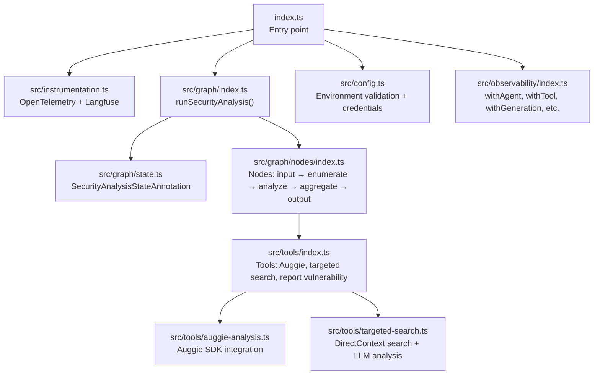
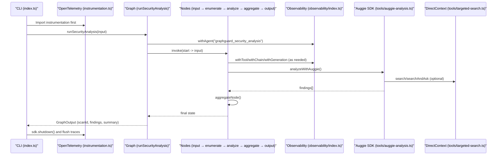
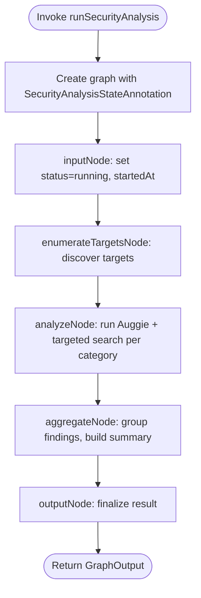
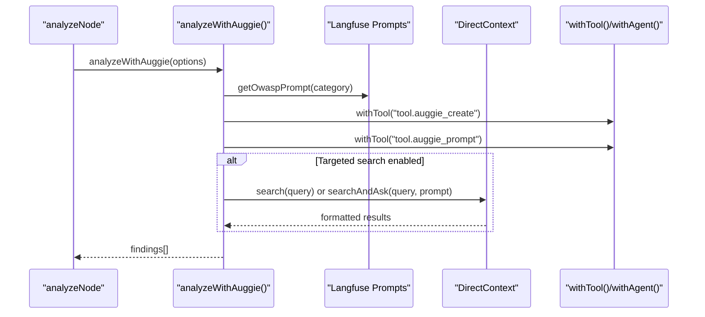
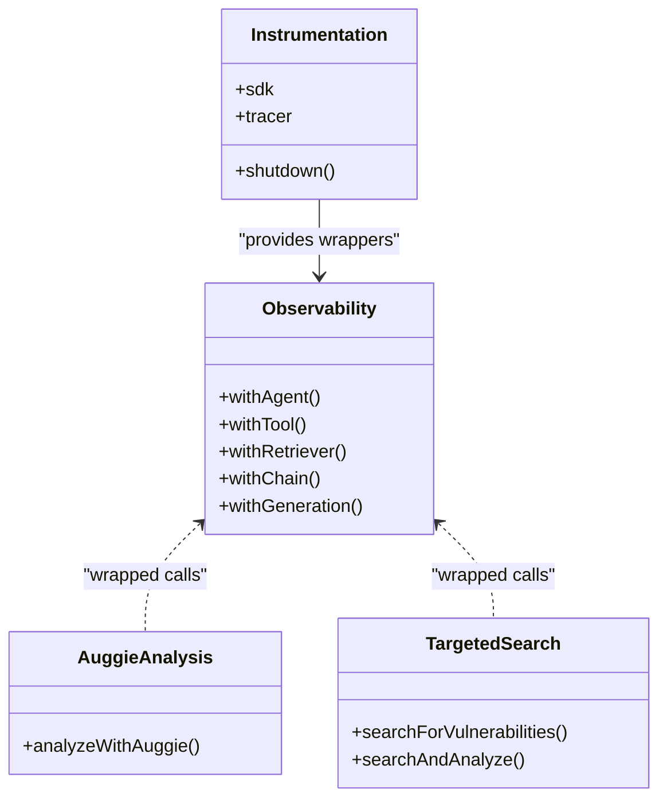
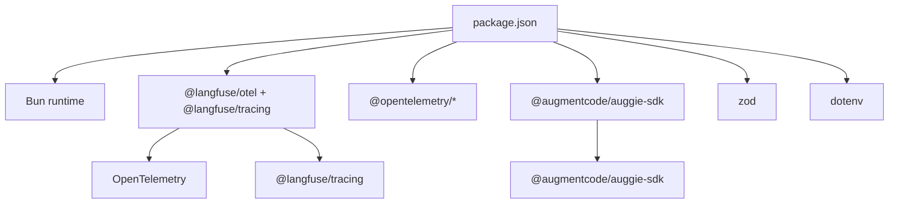

# Tool Overview & Core Value

<cite>
**Referenced Files in This Document**
- [README.md](file://README.md)
- [index.ts](file://index.ts)
- [package.json](file://package.json)
- [src/instrumentation.ts](file://src/instrumentation.ts)
- [src/config.ts](file://src/config.ts)
- [src/graph/index.ts](file://src/graph/index.ts)
- [src/graph/state.ts](file://src/graph/state.ts)
- [src/graph/nodes/index.ts](file://src/graph/nodes/index.ts)
- [src/graph/nodes/input.ts](file://src/graph/nodes/input.ts)
- [src/graph/nodes/aggregate.ts](file://src/graph/nodes/aggregate.ts)
- [src/tools/index.ts](file://src/tools/index.ts)
- [src/tools/auggie-analysis.ts](file://src/tools/auggie-analysis.ts)
- [src/tools/targeted-search.ts](file://src/tools/targeted-search.ts)
- [src/observability/index.ts](file://src/observability/index.ts)
</cite>

## Table of Contents
1. [Introduction](#introduction)
2. [Project Structure](#project-structure)
3. [Core Components](#core-components)
4. [Architecture Overview](#architecture-overview)
5. [Detailed Component Analysis](#detailed-component-analysis)
6. [Dependency Analysis](#dependency-analysis)
7. [Performance Considerations](#performance-considerations)
8. [Troubleshooting Guide](#troubleshooting-guide)
9. [Conclusion](#conclusion)

## Introduction
OWASP GraphGuard is an AI-powered CLI tool that automates detection of OWASP Top 10 2021 vulnerabilities in codebases. It combines the Auggie SDK for intelligent code analysis and LangGraph orchestration to deliver a structured, explainable, and observable security scanning pipeline. The tool emphasizes:
- Automated scanning with minimal manual intervention
- Explainable findings with structured metadata (category, severity, evidence, explanation, remediation)
- Observable traces and spans integrated with Langfuse for full visibility into the analysis workflow

High-level workflow:
- Input → Enumerate → Analyze → Aggregate → Output
- Integrated with Langfuse for observability, including agent-level traces, tool-level observations, and LLM generation tracking

Practical examples from the README demonstrate sample output and use cases, including top findings and structured summaries.

Benefits for application security engineers and developers:
- Reduces manual triage effort by surfacing prioritized, actionable findings
- Provides clear remediation guidance for each vulnerability
- Offers end-to-end observability to validate and debug analysis decisions

Scope clarification:
- v1 does not include auto-remediation; findings are reported for review and action.

**Section sources**
- [README.md](file://README.md#L1-L171)

## Project Structure
The project is organized around a LangGraph state machine, TypeScript modules, and observability integrations:
- Entry point initializes instrumentation and runs the security analysis
- Graph orchestrates nodes for input, enumeration, analysis, aggregation, and output
- Tools integrate with Auggie SDK and Langfuse prompts for targeted vulnerability analysis
- Observability wrappers provide rich tracing for agents, tools, retrievers, chains, and generations
- Configuration enforces secure, validated credentials and environment settings

**Diagram sources**
- [index.ts](file://index.ts#L1-L52)
- [src/instrumentation.ts](file://src/instrumentation.ts#L1-L141)
- [src/graph/index.ts](file://src/graph/index.ts#L1-L153)
- [src/graph/state.ts](file://src/graph/state.ts#L1-L173)
- [src/graph/nodes/index.ts](file://src/graph/nodes/index.ts#L1-L14)
- [src/tools/index.ts](file://src/tools/index.ts#L1-L32)
- [src/tools/auggie-analysis.ts](file://src/tools/auggie-analysis.ts#L1-L310)
- [src/tools/targeted-search.ts](file://src/tools/targeted-search.ts#L1-L293)
- [src/config.ts](file://src/config.ts#L1-L153)
- [src/observability/index.ts](file://src/observability/index.ts#L1-L411)

**Section sources**
- [index.ts](file://index.ts#L1-L52)
- [package.json](file://package.json#L1-L30)

## Core Components
- Entry point and lifecycle
  - Initializes instrumentation first, validates configuration, runs the security analysis, prints results, and flushes traces
- LangGraph orchestration
  - Defines a five-node linear workflow: input → enumerate → analyze → aggregate → output
  - Uses OpenTelemetry tracing and Langfuse agent observations for end-to-end visibility
- State management
  - Strongly typed state with fields for repo path, user query, scan metadata, targets, findings, errors, and summary
- Tools and SDK integration
  - Auggie SDK integration for structured vulnerability analysis
  - Targeted search leveraging DirectContext to pre-filter code before LLM analysis
  - Report vulnerability tool for structured findings
- Observability
  - Rich observation types: agent, tool, retriever, chain, generation
  - Tool-level observations for all SDK/API calls, enabling deep drill-down into analysis steps

**Section sources**
- [index.ts](file://index.ts#L1-L52)
- [src/graph/index.ts](file://src/graph/index.ts#L1-L153)
- [src/graph/state.ts](file://src/graph/state.ts#L1-L173)
- [src/tools/index.ts](file://src/tools/index.ts#L1-L32)
- [src/observability/index.ts](file://src/observability/index.ts#L1-L411)

## Architecture Overview
The system architecture centers on a LangGraph state machine orchestrated by OpenTelemetry and enriched with Langfuse observations. The workflow is:
- Input node initializes scan metadata and logs start
- Enumerate node discovers analysis targets
- Analyze node performs vulnerability analysis using Auggie SDK and targeted search
- Aggregate node consolidates findings and generates a human-readable summary
- Output node finalizes the result with scan ID, status, findings, and analyzed categories

**Diagram sources**
- [index.ts](file://index.ts#L1-L52)
- [src/instrumentation.ts](file://src/instrumentation.ts#L1-L141)
- [src/graph/index.ts](file://src/graph/index.ts#L56-L145)
- [src/observability/index.ts](file://src/observability/index.ts#L1-L411)
- [src/tools/auggie-analysis.ts](file://src/tools/auggie-analysis.ts#L119-L310)
- [src/tools/targeted-search.ts](file://src/tools/targeted-search.ts#L98-L293)

## Detailed Component Analysis

### LangGraph Orchestration and State
- Workflow definition
  - Linear graph with START → input → enumerate → analyze → aggregate → output → END
  - Each node receives the current state and returns partial updates
- Agent-level tracing
  - Top-level agent observation captures scan metadata and outputs
  - Spans record attributes such as repo path, user query, and findings count
- State schema
  - Comprehensive state fields for inputs, scan metadata, targets, findings, errors, and summary
  - Strong typing for OWASP categories and severity levels

**Diagram sources**
- [src/graph/index.ts](file://src/graph/index.ts#L1-L153)
- [src/graph/state.ts](file://src/graph/state.ts#L60-L173)
- [src/graph/nodes/input.ts](file://src/graph/nodes/input.ts#L1-L54)
- [src/graph/nodes/aggregate.ts](file://src/graph/nodes/aggregate.ts#L1-L117)

**Section sources**
- [src/graph/index.ts](file://src/graph/index.ts#L1-L153)
- [src/graph/state.ts](file://src/graph/state.ts#L1-L173)
- [src/graph/nodes/index.ts](file://src/graph/nodes/index.ts#L1-L14)
- [src/graph/nodes/input.ts](file://src/graph/nodes/input.ts#L1-L54)
- [src/graph/nodes/aggregate.ts](file://src/graph/nodes/aggregate.ts#L1-L117)

### Auggie SDK Integration and Targeted Search
- Auggie-based analysis
  - Fetches OWASP prompts from Langfuse, initializes Auggie client, and orchestrates analysis
  - Parses structured JSON findings and attaches severity, category, evidence, explanation, and remediation
  - Wraps SDK calls with tool observations for observability
- Targeted search
  - Builds category-specific queries to pre-filter code using DirectContext
  - Supports combined search-and-analyze for efficiency
  - Emits retriever observations for code search operations

**Diagram sources**
- [src/tools/auggie-analysis.ts](file://src/tools/auggie-analysis.ts#L119-L310)
- [src/tools/targeted-search.ts](file://src/tools/targeted-search.ts#L98-L293)
- [src/observability/index.ts](file://src/observability/index.ts#L121-L212)

**Section sources**
- [src/tools/auggie-analysis.ts](file://src/tools/auggie-analysis.ts#L1-L310)
- [src/tools/targeted-search.ts](file://src/tools/targeted-search.ts#L1-L293)
- [src/observability/index.ts](file://src/observability/index.ts#L1-L411)

### Observability and Tracing
- Dual observability approach
  - @langfuse/otel for general tracing and span attributes
  - @langfuse/tracing for rich observation types (generation, tool, retriever, chain, agent)
- Tool-level observations
  - All tool-like operations are wrapped with consistent input/output capture, error recording, and scan context
- Agent-level observations
  - Graph-level orchestration captured as agent observations with metadata and outputs
- LLM generation tracking
  - Specialized wrappers track model, tokens, costs, and prompt linking

**Diagram sources**
- [src/instrumentation.ts](file://src/instrumentation.ts#L1-L141)
- [src/observability/index.ts](file://src/observability/index.ts#L1-L411)
- [src/tools/auggie-analysis.ts](file://src/tools/auggie-analysis.ts#L119-L310)
- [src/tools/targeted-search.ts](file://src/tools/targeted-search.ts#L98-L293)

**Section sources**
- [src/instrumentation.ts](file://src/instrumentation.ts#L1-L141)
- [src/observability/index.ts](file://src/observability/index.ts#L1-L411)

### Configuration and Security Credentials
- Environment validation
  - Zod-based schema enforces required keys and formats
  - Supports multiple authentication methods for Augment SDK (session auth or token + URL)
- Credential extraction
  - Derives SDK credentials from validated configuration for secure usage

**Section sources**
- [src/config.ts](file://src/config.ts#L1-L153)

## Dependency Analysis
External dependencies and integrations:
- Bun runtime for fast startup and execution
- Langfuse for observability (OpenTelemetry span processor + tracing)
- Auggie SDK for code analysis and context engine
- OpenTelemetry for distributed tracing
- Zod for configuration validation

**Diagram sources**
- [package.json](file://package.json#L1-L30)

**Section sources**
- [package.json](file://package.json#L1-L30)

## Performance Considerations
- Incremental indexing and targeted search reduce false positives and LLM workload
- DirectContext searchAndAsk minimizes round-trips by combining retrieval and analysis
- Tool-level observations enable profiling of bottlenecks in SDK calls and file operations
- Short-lived processes should flush traces before exit to avoid data loss

[No sources needed since this section provides general guidance]

## Troubleshooting Guide
Common issues and resolutions:
- Missing or invalid environment variables
  - Ensure Langfuse keys and at least one Augment authentication method are configured
- Auggie SDK errors
  - Inspect error attributes recorded in spans (status, type) and handle retries for transient failures
- Large files or repositories
  - Consider incremental indexing and targeted search to limit analysis scope
- Observability gaps
  - Verify instrumentation is imported first and spans are flushed on exit

**Section sources**
- [src/instrumentation.ts](file://src/instrumentation.ts#L94-L141)
- [src/tools/auggie-analysis.ts](file://src/tools/auggie-analysis.ts#L253-L294)
- [README.md](file://README.md#L1-L171)

## Conclusion
OWASP GraphGuard delivers automated, explainable, and observable security scanning powered by LangGraph and the Auggie SDK. Its structured findings and remediation guidance significantly reduce manual triage effort, while full observability through Langfuse enables deep insights into the analysis workflow. Scope clarity: v1 focuses on detection and reporting without auto-remediation, aligning with explainability and control.

[No sources needed since this section summarizes without analyzing specific files]