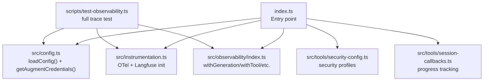
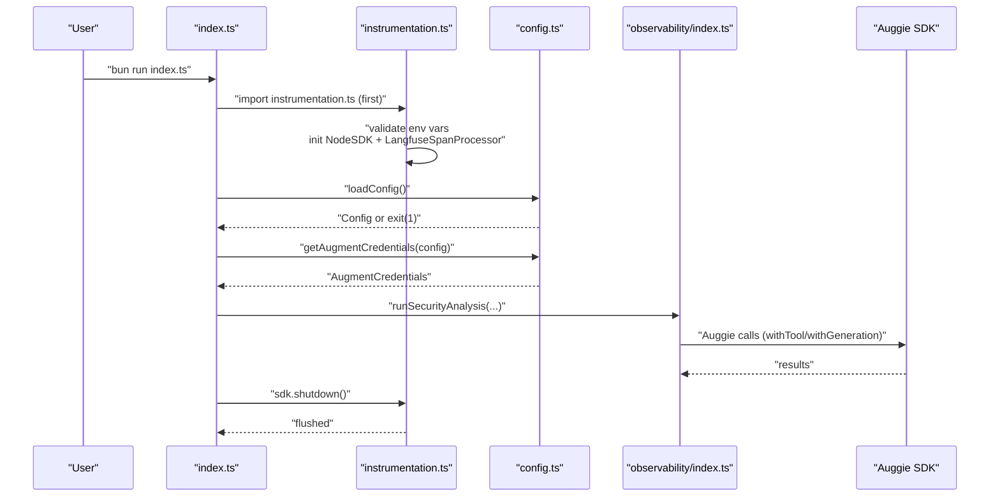
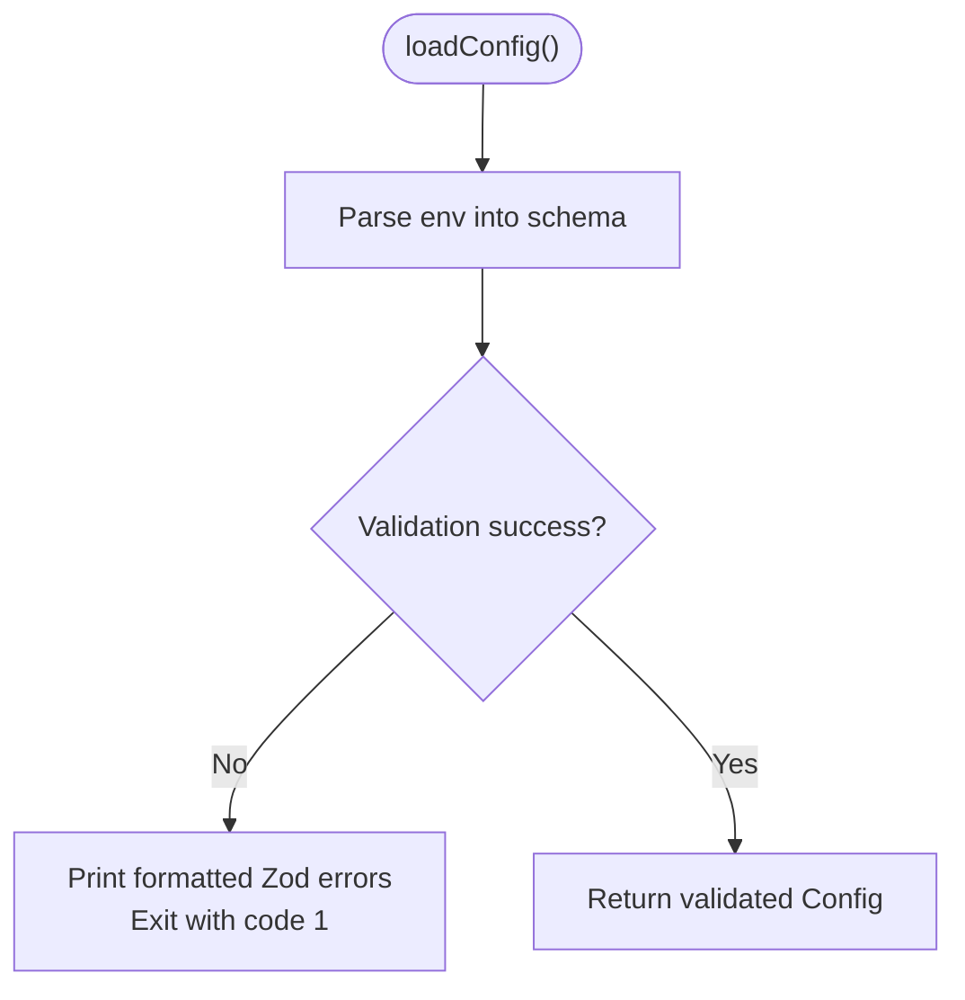
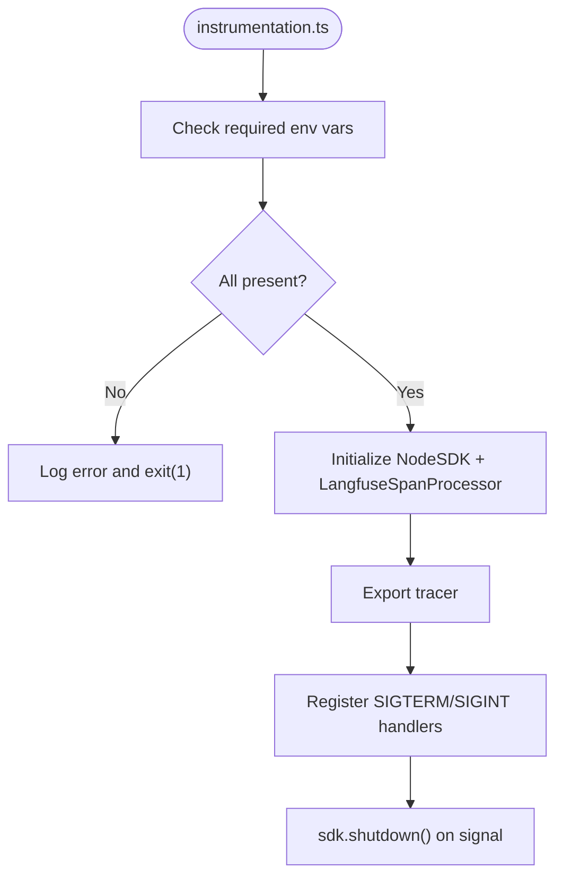
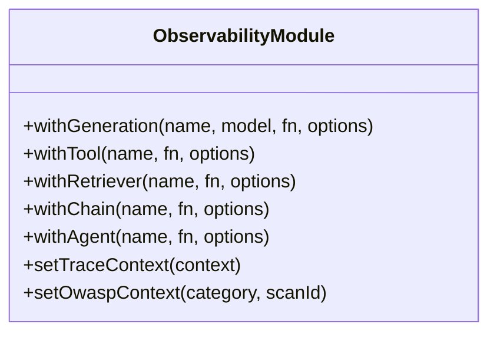
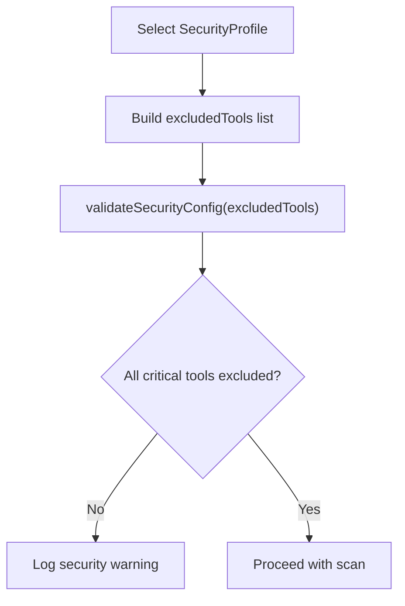
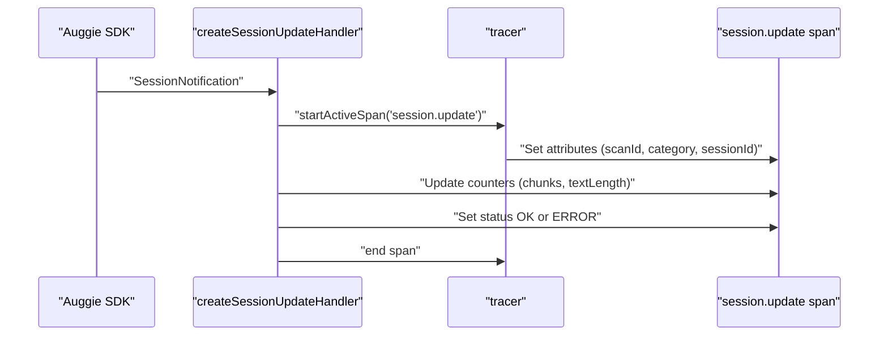
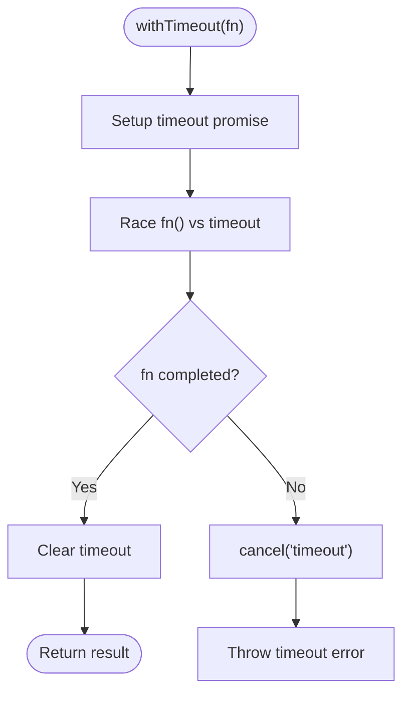
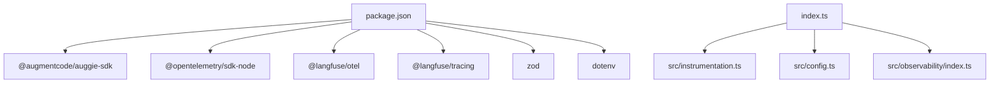

# Troubleshooting

<cite>
**Referenced Files in This Document**
- [README.md](file://README.md)
- [.env.example](file://.env.example)
- [package.json](file://package.json)
- [index.ts](file://index.ts)
- [scripts/test-observability.ts](file://scripts/test-observability.ts)
- [src/config.ts](file://src/config.ts)
- [src/config.test.ts](file://src/config.test.ts)
- [src/instrumentation.ts](file://src/instrumentation.ts)
- [src/instrumentation.test.ts](file://src/instrumentation.test.ts)
- [src/observability/index.ts](file://src/observability/index.ts)
- [src/tools/security-config.ts](file://src/tools/security-config.ts)
- [src/tools/session-callbacks.ts](file://src/tools/session-callbacks.ts)
- [src/tools/cancellation.ts](file://src/tools/cancellation.ts)
</cite>

## Table of Contents
1. [Introduction](#introduction)
2. [Project Structure](#project-structure)
3. [Core Components](#core-components)
4. [Architecture Overview](#architecture-overview)
5. [Detailed Component Analysis](#detailed-component-analysis)
6. [Dependency Analysis](#dependency-analysis)
7. [Performance Considerations](#performance-considerations)
8. [Troubleshooting Guide](#troubleshooting-guide)
9. [Conclusion](#conclusion)

## Introduction
This troubleshooting guide focuses on diagnosing and resolving common issues encountered when running the OWASP GraphGuard agent. It covers configuration problems (missing environment variables, invalid credentials, Zod validation errors), observability issues (missing traces in Langfuse, SDK initialization failures, improper shutdown), authentication failures with Augment services and Auggie CLI, debugging strategies (enabling verbose logging, checking Bun runtime compatibility), common error codes and their meanings, and step-by-step diagnosis procedures for connectivity, timeouts, and permissions.

## Project Structure
The project is organized around a small set of core modules:
- Configuration and environment validation
- Instrumentation and OpenTelemetry/Langfuse setup
- Observability wrappers for LLM/tool/retriever/agent spans
- Security configuration and session callbacks
- Entry point and test harness for observability verification

**Diagram sources**
- [index.ts](file://index.ts#L1-L52)
- [src/config.ts](file://src/config.ts#L89-L153)
- [src/instrumentation.ts](file://src/instrumentation.ts#L94-L141)
- [src/observability/index.ts](file://src/observability/index.ts#L80-L212)
- [src/tools/security-config.ts](file://src/tools/security-config.ts#L1-L181)
- [src/tools/session-callbacks.ts](file://src/tools/session-callbacks.ts#L1-L171)
- [scripts/test-observability.ts](file://scripts/test-observability.ts#L1-L73)

**Section sources**
- [README.md](file://README.md#L1-L171)
- [package.json](file://package.json#L1-L30)

## Core Components
- Configuration loader validates environment variables and exits on validation failure, surfacing precise Zod error messages.
- Instrumentation initializes OpenTelemetry and Langfuse, enforces required environment variables, and registers graceful shutdown handlers.
- Observability wrappers provide typed spans for LLM generations, tools, retrievers, chains, agents, and events.
- Security configuration enforces read-only scans and disables dangerous tools.
- Session callbacks provide progress tracking and structured logging for Auggie SDK session updates.
- Entry point and test harness demonstrate correct import order and shutdown behavior.

**Section sources**
- [src/config.ts](file://src/config.ts#L89-L153)
- [src/instrumentation.ts](file://src/instrumentation.ts#L94-L141)
- [src/observability/index.ts](file://src/observability/index.ts#L80-L212)
- [src/tools/security-config.ts](file://src/tools/security-config.ts#L1-L181)
- [src/tools/session-callbacks.ts](file://src/tools/session-callbacks.ts#L1-L171)
- [index.ts](file://index.ts#L1-L52)
- [scripts/test-observability.ts](file://scripts/test-observability.ts#L1-L73)

## Architecture Overview
The runtime relies on a strict initialization order: instrumentation must be imported first to capture all spans from module initialization. Configuration is loaded next to validate environment variables and derive Augment credentials. The main workflow then proceeds with security analysis, emitting rich observability data to Langfuse.

**Diagram sources**
- [index.ts](file://index.ts#L1-L52)
- [src/instrumentation.ts](file://src/instrumentation.ts#L94-L141)
- [src/config.ts](file://src/config.ts#L89-L153)
- [src/observability/index.ts](file://src/observability/index.ts#L80-L212)

## Detailed Component Analysis

### Configuration Validation (Zod)
Common configuration issues originate from invalid or missing environment variables. The configuration schema enforces:
- Langfuse keys must start with specific prefixes and host must be a valid URL.
- At least one of the supported Augment authentication methods must be present.
- Anthropic API key must start with a specific prefix.
- Node environment and log level must be valid enumerations.
- Defaults are applied for optional fields.

Symptoms of misconfiguration include immediate exit with validation errors and printed Zod error messages.

**Diagram sources**
- [src/config.ts](file://src/config.ts#L89-L118)

**Section sources**
- [src/config.ts](file://src/config.ts#L89-L153)
- [src/config.test.ts](file://src/config.test.ts#L116-L424)

### Instrumentation and Shutdown
Instrumentation enforces required environment variables and initializes OpenTelemetry with Langfuse. It exports a tracer and registers SIGTERM/SIGINT handlers to shut down the SDK gracefully. Improper shutdown can lead to missing traces.

**Diagram sources**
- [src/instrumentation.ts](file://src/instrumentation.ts#L94-L141)

**Section sources**
- [src/instrumentation.ts](file://src/instrumentation.ts#L94-L141)
- [src/instrumentation.test.ts](file://src/instrumentation.test.ts#L21-L56)

### Observability Wrappers
The observability module provides typed wrappers for LLM generations, tools, retrievers, chains, agents, and events. These wrappers capture inputs, outputs, usage, costs, and scan context, and propagate exceptions while updating observations.

**Diagram sources**
- [src/observability/index.ts](file://src/observability/index.ts#L80-L410)

**Section sources**
- [src/observability/index.ts](file://src/observability/index.ts#L80-L410)

### Security Configuration
Security configuration enforces read-only scans by excluding dangerous tools and validates that critical tools are disabled according to the selected profile.

**Diagram sources**
- [src/tools/security-config.ts](file://src/tools/security-config.ts#L1-L181)

**Section sources**
- [src/tools/security-config.ts](file://src/tools/security-config.ts#L1-L181)

### Session Callbacks and Progress Tracking
Session callbacks process Auggie SDK session updates, track progress, and log periodic updates. Errors are recorded on spans and logged.

**Diagram sources**
- [src/tools/session-callbacks.ts](file://src/tools/session-callbacks.ts#L51-L119)

**Section sources**
- [src/tools/session-callbacks.ts](file://src/tools/session-callbacks.ts#L1-L171)

### Request Cancellation and Timeouts
Cancellation controller provides timeout protection and manual cancellation for long-running operations, with observability spans and cleanup.

**Diagram sources**
- [src/tools/cancellation.ts](file://src/tools/cancellation.ts#L61-L100)

**Section sources**
- [src/tools/cancellation.ts](file://src/tools/cancellation.ts#L48-L196)

## Dependency Analysis
Runtime dependencies include the Augment SDK, Langfuse OpenTelemetry and tracing packages, OpenTelemetry Node SDK, dotenv, and Zod. The entry point imports instrumentation first, then loads configuration and runs analysis.

**Diagram sources**
- [package.json](file://package.json#L1-L30)
- [index.ts](file://index.ts#L1-L52)

**Section sources**
- [package.json](file://package.json#L1-L30)
- [index.ts](file://index.ts#L1-L52)

## Performance Considerations
- Ensure instrumentation is imported first to capture all module initialization spans.
- Use appropriate log levels for diagnostics; increase verbosity during troubleshooting.
- Leverage the provided test script to validate observability end-to-end.

[No sources needed since this section provides general guidance]

## Troubleshooting Guide

### Configuration-Related Problems
- Missing environment variables
  - Symptoms: Immediate exit with validation errors and printed Zod error messages.
  - Causes: Missing Langfuse keys, missing Augment credentials, missing Anthropic key, invalid nodeEnv/logLevel.
  - Solutions:
    - Populate all required environment variables from the example file.
    - Ensure keys start with the required prefixes enforced by the schema.
    - Provide either sessionAuth JSON or both apiToken and apiUrl.
    - Confirm host URLs are valid.
  - Verification:
    - Compare your .env against the example file.
    - Run the configuration tests to validate parsing.

- Zod validation errors
  - Specific error messages from the configuration schema include:
    - Langfuse public key must start with a specific prefix.
    - Langfuse secret key must start with a specific prefix.
    - Langfuse host must be a valid URL.
    - Either sessionAuth JSON or both apiToken and apiUrl must be provided.
    - Anthropic API key must start with a specific prefix.
    - nodeEnv and logLevel must be valid enumerations.
  - Steps:
    - Review printed Zod error messages and fix the offending environment variables.
    - Re-run the application to confirm validation passes.

- Bun runtime compatibility
  - Ensure Bun is installed and used to run the project.
  - Use the provided scripts and verify the Bun version compatibility indicated by dependencies.

**Section sources**
- [src/config.ts](file://src/config.ts#L89-L153)
- [src/config.test.ts](file://src/config.test.ts#L116-L424)
- [README.md](file://README.md#L27-L41)
- [.env.example](file://.env.example#L1-L33)

### Observability Issues (Langfuse)
- Missing traces in Langfuse
  - Causes:
    - Instrumentation not imported first, resulting in missed spans from module initialization.
    - Missing required environment variables for Langfuse initialization.
    - Improper shutdown preventing trace flush.
  - Solutions:
    - Ensure instrumentation is imported before any other modules in the entry point.
    - Verify LANGFUSE_PUBLIC_KEY and LANGFUSE_SECRET_KEY are set.
    - Use the provided test harness to run a full analysis and flush traces.
  - Verification:
    - Use the test script to generate a full trace and check Langfuse dashboard for expected observations.

- Failed SDK initialization
  - Causes: Missing required environment variables or invalid configuration before instrumentation starts.
  - Solutions: Fix environment variables and re-run with instrumentation imported first.

- Improper shutdown
  - Causes: Not calling shutdown or importing instrumentation incorrectly.
  - Solutions: Ensure the entry point calls sdk.shutdown() before exiting.

**Section sources**
- [index.ts](file://index.ts#L1-L52)
- [scripts/test-observability.ts](file://scripts/test-observability.ts#L1-L73)
- [src/instrumentation.ts](file://src/instrumentation.ts#L94-L141)
- [src/instrumentation.test.ts](file://src/instrumentation.test.ts#L44-L56)

### Authentication Failures (Augment and Auggie CLI)
- Missing or invalid Augment credentials
  - Symptoms: Configuration validation fails requiring sessionAuth or apiToken/apiUrl.
  - Causes: Missing AUGMENT_SESSION_AUTH JSON or missing apiToken/apiUrl pair.
  - Solutions:
    - Use the recommended sessionAuth JSON from the Auggie CLI token.
    - Alternatively, provide both AUGMENT_API_TOKEN and AUGMENT_API_URL.
  - Verification:
    - Confirm the token printed by Auggie CLI and paste it into AUGMENT_SESSION_AUTH.
    - Validate configuration parsing with tests.

- Auggie CLI authentication
  - Ensure Auggie CLI is installed and authenticated.
  - Use the token printed by the CLI to populate AUGMENT_SESSION_AUTH.

**Section sources**
- [src/config.ts](file://src/config.ts#L35-L70)
- [README.md](file://README.md#L42-L64)
- [.env.example](file://.env.example#L12-L20)

### Debugging Strategies
- Enable verbose logging
  - Set LOG_LEVEL to a more verbose value (e.g., debug) to capture detailed logs.
  - Increase verbosity during troubleshooting to inspect configuration and session updates.

- Check Bun runtime compatibility
  - Use Bun to run the project as indicated by the scripts and dependencies.
  - Verify Bun installation and version compatibility.

- Inspect session progress
  - Use session callbacks to observe progress updates and detect stalled operations.

**Section sources**
- [.env.example](file://.env.example#L30-L33)
- [README.md](file://README.md#L27-L41)
- [src/tools/session-callbacks.ts](file://src/tools/session-callbacks.ts#L1-L171)

### Connectivity, Timeouts, and Permissions
- Connectivity issues
  - Validate network access to Langfuse endpoints and Augment APIs.
  - Confirm base URL/host settings align with your region or self-hosted deployment.

- Timeout errors
  - Long-running operations can be protected with the cancellation controller.
  - Default timeout is configured; adjust as needed for your environment.
  - Manual cancellation is supported and recorded in spans.

- Permission problems
  - Security configuration enforces read-only scans by excluding dangerous tools.
  - Validate that critical tools are excluded according to your chosen profile.

**Section sources**
- [src/tools/cancellation.ts](file://src/tools/cancellation.ts#L48-L196)
- [src/tools/security-config.ts](file://src/tools/security-config.ts#L1-L181)

### Step-by-Step Diagnosis Procedures
- Connectivity
  1. Verify network access to Langfuse and Augment endpoints.
  2. Confirm LANGFUSE_BASE_URL/LANGFUSE_HOST and AUGMENT API URL settings.
  3. Re-run the test harness to validate end-to-end observability.

- Timeout
  1. Check cancellation controller timeout settings.
  2. Monitor session callbacks for progress; investigate stalled operations.
  3. Adjust timeout or cancel manually if needed.

- Permission
  1. Review security profile and excluded tools.
  2. Validate that critical tools are excluded for read-only scans.

**Section sources**
- [scripts/test-observability.ts](file://scripts/test-observability.ts#L1-L73)
- [src/tools/cancellation.ts](file://src/tools/cancellation.ts#L48-L196)
- [src/tools/security-config.ts](file://src/tools/security-config.ts#L1-L181)

### Common Error Codes and Meanings
- Configuration validation failures
  - Cause: Zod schema violations for environment variables.
  - Action: Fix the offending environment variables based on printed error messages.

- Missing required environment variables
  - Cause: Absence of LANGFUSE_PUBLIC_KEY, LANGFUSE_SECRET_KEY, or Augment credentials.
  - Action: Populate required variables and re-run.

- Initialization failures
  - Cause: Instrumentation not imported first or invalid configuration.
  - Action: Ensure correct import order and fix configuration.

- Shutdown issues
  - Cause: Missing or duplicate shutdown calls.
  - Action: Ensure sdk.shutdown() is called once at the end of execution.

**Section sources**
- [src/config.ts](file://src/config.ts#L89-L153)
- [src/instrumentation.ts](file://src/instrumentation.ts#L94-L141)
- [index.ts](file://index.ts#L45-L51)

### Verifying Component Health and Setup
- Configuration health
  - Run configuration tests to validate parsing and defaults.
  - Confirm derived Augment credentials extraction works.

- Observability health
  - Use the test harness to run a full scan and verify traces appear in Langfuse.
  - Check for expected observation types (agent, tool, generation, retriever, chain).

- Security health
  - Validate that critical tools are excluded according to the chosen security profile.

**Section sources**
- [src/config.test.ts](file://src/config.test.ts#L1-L485)
- [scripts/test-observability.ts](file://scripts/test-observability.ts#L1-L73)
- [src/tools/security-config.ts](file://src/tools/security-config.ts#L1-L181)

## Conclusion
This guide consolidates actionable steps to diagnose and resolve configuration, observability, authentication, connectivity, timeout, and permission issues. By following the outlined procedures—ensuring correct import order, validating environment variables, leveraging verbose logging, and using the provided test harness—you can quickly identify root causes and apply targeted fixes to restore reliable operation.